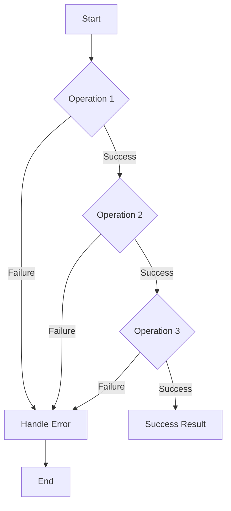

## 2.7. Error Handling the Elixir Way

In the world of Elixir, error handling is not just about catching exceptions. It's about designing systems that are robust, fault-tolerant, and capable of gracefully handling unexpected situations. In this section, we will explore the Elixir way of handling errors, focusing on the use of tagged tuples, the `with` construct, and the principles of fault tolerance in concurrent environments.

### Using Tagged Tuples

Tagged tuples are a fundamental concept in Elixir for handling errors. They provide a clear and consistent way to represent success and failure in function results.

#### The `{:ok, result}` and `{:error, reason}` Convention

In Elixir, functions often return results in the form of tagged tuples. This convention allows developers to easily distinguish between successful and unsuccessful outcomes.

```elixir
def divide(a, b) do
  if b == 0 do
    {:error, "Cannot divide by zero"}
  else
    {:ok, a / b}
  end
end
```

In this example, the `divide` function returns `{:ok, result}` when the division is successful and `{:error, reason}` when an error occurs.

#### Pattern Matching on Return Values

Pattern matching is a powerful feature in Elixir that allows you to handle different outcomes based on the structure of the data.

```elixir
case divide(10, 2) do
  {:ok, result} -> IO.puts("Result: #{result}")
  {:error, reason} -> IO.puts("Error: #{reason}")
end
```

Here, we use a `case` statement to match the result of the `divide` function and handle each scenario appropriately.

### The `with` Construct

The `with` construct in Elixir is a syntactic sugar that simplifies complex nested `case` statements, making your code more readable and maintainable.

#### Simplifying Complex Nested `case` Statements

Consider a scenario where you have multiple operations that depend on each other. Using `case` statements can quickly become cumbersome.

```elixir
case operation1() do
  {:ok, result1} ->
    case operation2(result1) do
      {:ok, result2} ->
        case operation3(result2) do
          {:ok, result3} -> {:ok, result3}
          {:error, reason} -> {:error, reason}
        end
      {:error, reason} -> {:error, reason}
    end
  {:error, reason} -> {:error, reason}
end
```

The `with` construct linearizes this sequence of operations, making it easier to read and manage.

```elixir
with {:ok, result1} <- operation1(),
     {:ok, result2} <- operation2(result1),
     {:ok, result3} <- operation3(result2) do
  {:ok, result3}
else
  {:error, reason} -> {:error, reason}
end
```

#### Linearizing Error-Prone Sequences of Operations

The `with` construct not only simplifies the code but also makes it clear which operations are dependent on each other. If any operation fails, the `else` block is executed, allowing you to handle errors in a centralized manner.

### Exceptions and Fault Tolerance

In Elixir, exceptions are used sparingly. Instead, the focus is on designing systems that can handle errors gracefully.

#### When to Raise Exceptions Versus Returning Error Tuples

Exceptions in Elixir are typically reserved for truly exceptional situations that cannot be handled through normal control flow.

```elixir
def fetch_user!(id) do
  case Repo.get(User, id) do
    nil -> raise "User not found"
    user -> user
  end
end
```

In this example, an exception is raised if the user is not found. This approach is suitable when the absence of a user is an unexpected condition that should halt execution.

#### Designing for Robustness in Concurrent Environments

Elixir's concurrency model, based on the Actor model, encourages designing systems that are resilient to failures. Processes in Elixir are isolated and communicate through message passing, which naturally supports fault tolerance.

- **Supervision Trees**: Use supervisors to monitor processes and restart them in case of failure.
- **Let It Crash Philosophy**: Embrace the idea that processes can fail and should be restarted by supervisors.

```elixir
defmodule MyApp.Supervisor do
  use Supervisor

  def start_link(_) do
    Supervisor.start_link(__MODULE__, :ok, name: __MODULE__)
  end

  def init(:ok) do
    children = [
      {MyApp.Worker, []}
    ]

    Supervisor.init(children, strategy: :one_for_one)
  end
end
```

In this example, a supervisor is set up to monitor a worker process. If the worker crashes, the supervisor will automatically restart it, ensuring the system remains operational.

### Visualizing Error Handling in Elixir

To better understand the flow of error handling in Elixir, let's visualize the process using a flowchart.



This flowchart illustrates a sequence of operations where each step depends on the success of the previous one. If any operation fails, the error is handled, and the process ends.

### Key Takeaways

- **Tagged Tuples**: Use `{:ok, result}` and `{:error, reason}` to represent success and failure.
- **Pattern Matching**: Leverage pattern matching to handle different outcomes effectively.
- **`with` Construct**: Simplify complex sequences of operations and centralize error handling.
- **Exceptions**: Reserve exceptions for truly exceptional situations.
- **Fault Tolerance**: Design systems that are resilient to failures using supervisors and the "let it crash" philosophy.

### Try It Yourself

Experiment with the code examples provided. Try modifying the `divide` function to handle other types of errors, such as invalid input types. Use the `with` construct to simplify a sequence of operations in your own code.

### References and Links

- [Elixir Documentation on Error Handling](https://hexdocs.pm/elixir/Kernel.html#error_handling)
- [Elixir School: Error Handling](https://elixirschool.com/en/lessons/advanced/error_handling/)
- [Learn You Some Erlang: Error Handling](http://learnyousomeerlang.com/errors-and-exceptions)

### Embrace the Journey

Remember, mastering error handling in Elixir is a journey. As you continue to explore and experiment, you'll gain a deeper understanding of how to build robust, fault-tolerant systems. Keep experimenting, stay curious, and enjoy the journey!

## Quiz: Error Handling the Elixir Way



### What is the primary purpose of using tagged tuples in Elixir?

- [x] To represent success and failure in function results
- [ ] To optimize performance
- [ ] To simplify syntax
- [ ] To handle concurrency

> **Explanation:** Tagged tuples like `{:ok, result}` and `{:error, reason}` are used to clearly indicate success and failure in Elixir functions.

### How does the `with` construct help in error handling?

- [x] It simplifies complex nested `case` statements
- [ ] It improves performance
- [ ] It handles exceptions automatically
- [ ] It replaces pattern matching

> **Explanation:** The `with` construct linearizes sequences of operations, making error handling more straightforward and readable.

### When should exceptions be used in Elixir?

- [x] For truly exceptional situations
- [ ] For all errors
- [ ] For performance optimization
- [ ] For handling concurrency

> **Explanation:** Exceptions in Elixir are reserved for unexpected conditions that cannot be handled through normal control flow.

### What is the "let it crash" philosophy?

- [x] Allowing processes to fail and be restarted by supervisors
- [ ] Preventing all crashes at any cost
- [ ] Using exceptions for all errors
- [ ] Avoiding the use of supervisors

> **Explanation:** The "let it crash" philosophy embraces process failures and relies on supervisors to restart them, ensuring system resilience.

### What is the role of a supervisor in Elixir?

- [x] To monitor and restart processes in case of failure
- [ ] To handle all exceptions
- [ ] To optimize performance
- [ ] To manage memory

> **Explanation:** Supervisors in Elixir are responsible for monitoring processes and restarting them if they fail, contributing to fault tolerance.

### How can pattern matching be used in error handling?

- [x] By matching on tagged tuples to handle different outcomes
- [ ] By optimizing performance
- [ ] By simplifying syntax
- [ ] By handling concurrency

> **Explanation:** Pattern matching allows developers to handle different outcomes based on the structure of tagged tuples returned by functions.

### What is the benefit of using the `with` construct over nested `case` statements?

- [x] It makes the code more readable and maintainable
- [ ] It improves performance
- [ ] It handles exceptions automatically
- [ ] It replaces pattern matching

> **Explanation:** The `with` construct simplifies the code by linearizing sequences of operations, making it easier to read and manage.

### What is the purpose of using tagged tuples like `{:ok, result}`?

- [x] To represent success and failure in function results
- [ ] To optimize performance
- [ ] To simplify syntax
- [ ] To handle concurrency

> **Explanation:** Tagged tuples are used to clearly indicate success and failure in Elixir functions, allowing for consistent error handling.

### How does the "let it crash" philosophy contribute to fault tolerance?

- [x] By allowing processes to fail and be restarted by supervisors
- [ ] By preventing all crashes at any cost
- [ ] By using exceptions for all errors
- [ ] By avoiding the use of supervisors

> **Explanation:** The "let it crash" philosophy embraces process failures and relies on supervisors to restart them, ensuring system resilience.

### True or False: In Elixir, exceptions should be used for all errors.

- [ ] True
- [x] False

> **Explanation:** Exceptions in Elixir are reserved for truly exceptional situations, while normal errors are handled using tagged tuples.


