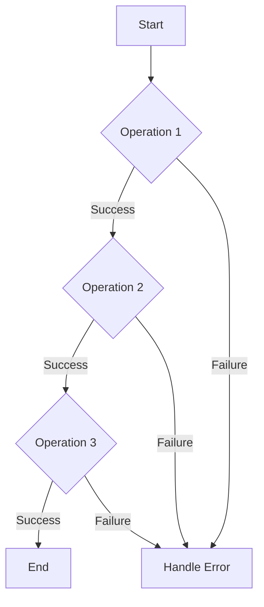

## 2.7. Error Handling the Elixir Way

Error handling is a crucial aspect of software development, and in Elixir, it is approached with a unique philosophy that embraces the functional programming paradigm. In this section, we will delve into the key techniques and constructs that make error handling in Elixir both powerful and elegant. We will explore the use of tagged tuples, the `with` construct, and discuss when to use exceptions in a language that promotes fault tolerance.

### Using Tagged Tuples

In Elixir, the most common way to handle errors is through the use of tagged tuples. This approach provides a clear and consistent method for representing the outcome of an operation, whether it is successful or has failed.

#### The `{:ok, result}` and `{:error, reason}` Convention

The convention of returning `{:ok, result}` or `{:error, reason}` is a hallmark of Elixir's approach to error handling. This pattern allows functions to communicate success or failure in a straightforward manner, leveraging Elixir's powerful pattern matching capabilities.

```elixir
defmodule FileReader do
  def read_file(path) do
    case File.read(path) do
      {:ok, content} ->
        {:ok, content}
      {:error, reason} ->
        {:error, reason}
    end
  end
end

# Usage example
case FileReader.read_file("example.txt") do
  {:ok, content} ->
    IO.puts("File content: #{content}")
  {:error, reason} ->
    IO.puts("Failed to read file: #{reason}")
end
```

In this example, the `File.read/1` function returns a tagged tuple, which is then pattern matched to handle both the successful and error cases. This pattern is prevalent in Elixir libraries and applications, promoting a consistent error handling strategy.

#### Pattern Matching on Return Values

Pattern matching is a powerful feature in Elixir that simplifies error handling by allowing you to destructure tagged tuples directly in function heads or `case` statements.

```elixir
defmodule Calculator do
  def divide(_numerator, 0), do: {:error, :division_by_zero}
  def divide(numerator, denominator), do: {:ok, numerator / denominator}
end

# Usage example
case Calculator.divide(10, 2) do
  {:ok, result} ->
    IO.puts("Division result: #{result}")
  {:error, :division_by_zero} ->
    IO.puts("Cannot divide by zero")
end
```

In this example, the `divide/2` function uses pattern matching to handle the special case of division by zero, returning an error tuple. This approach makes it easy to handle specific error conditions in a clear and concise manner.

### The `with` Construct

The `with` construct in Elixir is a powerful tool for simplifying complex nested `case` statements, especially when dealing with sequences of operations that may fail.

#### Simplifying Complex Nested `case` Statements

When you have multiple operations that depend on each other, using nested `case` statements can become cumbersome. The `with` construct provides a way to linearize these operations, making the code more readable and maintainable.

```elixir
defmodule UserManager do
  def create_user(params) do
    with {:ok, user} <- validate_params(params),
         {:ok, saved_user} <- save_to_database(user),
         {:ok, _} <- send_welcome_email(saved_user) do
      {:ok, saved_user}
    else
      {:error, reason} -> {:error, reason}
    end
  end

  defp validate_params(params) do
    # Validation logic here
  end

  defp save_to_database(user) do
    # Database saving logic here
  end

  defp send_welcome_email(user) do
    # Email sending logic here
  end
end
```

In this example, the `with` construct is used to chain multiple operations that each return a tagged tuple. If any operation fails, the `else` block is executed, allowing for a clean and concise error handling flow.

#### Linearizing Error-Prone Sequences of Operations

The `with` construct not only simplifies the code but also makes it more expressive by clearly showing the sequence of operations and their dependencies.

```elixir
defmodule PaymentProcessor do
  def process_payment(order_id) do
    with {:ok, order} <- fetch_order(order_id),
         {:ok, payment} <- initiate_payment(order),
         {:ok, _} <- update_order_status(order, :paid) do
      {:ok, payment}
    else
      {:error, reason} -> {:error, reason}
    end
  end

  defp fetch_order(order_id) do
    # Fetch order logic here
  end

  defp initiate_payment(order) do
    # Payment initiation logic here
  end

  defp update_order_status(order, status) do
    # Order status update logic here
  end
end
```

This pattern is particularly useful in scenarios where multiple operations must succeed for the overall process to be considered successful. The `with` construct elegantly handles the propagation of errors, allowing you to focus on the happy path.

### Exceptions and Fault Tolerance

While tagged tuples and the `with` construct are the preferred methods for handling errors in Elixir, there are situations where raising exceptions is appropriate. Understanding when to use exceptions and how to design for fault tolerance is key to building robust Elixir applications.

#### When to Raise Exceptions Versus Returning Error Tuples

In Elixir, exceptions are typically reserved for truly exceptional circumstances—situations that are unexpected and cannot be handled gracefully by the calling code. For example, if a function encounters a programming error or an invalid state, raising an exception may be appropriate.

```elixir
defmodule Math do
  def factorial(n) when n < 0 do
    raise ArgumentError, "factorial is not defined for negative numbers"
  end

  def factorial(0), do: 1
  def factorial(n), do: n * factorial(n - 1)
end

# Usage example
try do
  Math.factorial(-1)
rescue
  e in ArgumentError -> IO.puts("Error: #{e.message}")
end
```

In this example, an exception is raised for an invalid argument, and the calling code can handle it using a `try/rescue` block.

#### Designing for Robustness in Concurrent Environments

Elixir's concurrency model, based on the Actor model, encourages designing systems that are resilient to failures. The "let it crash" philosophy is central to this approach, where processes are allowed to fail and restart under the supervision of a supervisor.

```elixir
defmodule Worker do
  use GenServer

  def start_link(initial_state) do
    GenServer.start_link(__MODULE__, initial_state, name: __MODULE__)
  end

  def init(initial_state) do
    {:ok, initial_state}
  end

  def handle_call(:fail, _from, state) do
    {:stop, :normal, :ok, state}
  end
end

defmodule SupervisorExample do
  use Supervisor

  def start_link(_) do
    Supervisor.start_link(__MODULE__, :ok, name: __MODULE__)
  end

  def init(:ok) do
    children = [
      {Worker, :ok}
    ]

    Supervisor.init(children, strategy: :one_for_one)
  end
end

# Usage example
{:ok, _sup} = SupervisorExample.start_link(:ok)
GenServer.call(Worker, :fail)
```

In this example, a worker process is supervised, and if it fails, the supervisor restarts it. This design pattern ensures that the system remains operational even in the face of errors, enhancing fault tolerance.

### Visualizing Error Handling in Elixir

To better understand the flow of error handling in Elixir, let's visualize the process using a flowchart.


```mermaid
flowchart TD
    A[Start] --> B{Operation 1}
    B -- Success --> C{Operation 2}
    B -- Failure --> D[Handle Error]
    C -- Success --> E{Operation 3}
    C -- Failure --> D
    E -- Success --> F[End]
    E -- Failure --> D
```

**Description:** This flowchart illustrates a sequence of operations using the `with` construct. Each operation can either succeed and proceed to the next, or fail and handle the error.

### References and Further Reading

- [Elixir Official Documentation - Error Handling](https://elixir-lang.org/getting-started/errors-and-exceptions.html)
- [Elixir School - Error Handling](https://elixirschool.com/en/lessons/advanced/error_handling/)
- [Learn You Some Erlang for Great Good! - Error Handling](https://learnyousomeerlang.com/errors-and-exceptions)

### Knowledge Check

- How do tagged tuples help in error handling in Elixir?
- What is the purpose of the `with` construct in Elixir?
- When should exceptions be used in Elixir?
- How does the "let it crash" philosophy contribute to fault tolerance?

### Embrace the Journey

Remember, mastering error handling in Elixir is a journey. As you continue to explore and experiment with these concepts, you'll gain a deeper understanding of how to build robust and resilient applications. Keep experimenting, stay curious, and enjoy the journey!

## Quiz Time!



### What is the primary purpose of tagged tuples in Elixir?

- [x] To provide a consistent way to represent success and failure in function returns.
- [ ] To handle exceptions in a concurrent environment.
- [ ] To replace the need for the `with` construct.
- [ ] To simplify pattern matching.

> **Explanation:** Tagged tuples, such as `{:ok, result}` and `{:error, reason}`, are used to consistently represent the success or failure of a function.

### How does the `with` construct help in error handling?

- [x] It simplifies complex nested `case` statements by linearizing sequences of operations.
- [ ] It replaces the need for tagged tuples.
- [ ] It is used to handle exceptions in Elixir.
- [ ] It is primarily used for pattern matching.

> **Explanation:** The `with` construct linearizes sequences of operations, making code more readable and maintainable, especially when handling multiple operations that may fail.

### When should exceptions be used in Elixir?

- [x] For truly exceptional circumstances that cannot be handled gracefully by the calling code.
- [ ] For every error encountered in the application.
- [ ] To replace the use of tagged tuples.
- [ ] To handle all types of errors in a concurrent environment.

> **Explanation:** Exceptions in Elixir are reserved for truly exceptional circumstances, such as programming errors or invalid states.

### What is the "let it crash" philosophy?

- [x] Allowing processes to fail and restart under supervision to ensure system resilience.
- [ ] Preventing any process from crashing at all costs.
- [ ] Using exceptions to handle all errors.
- [ ] Avoiding the use of tagged tuples.

> **Explanation:** The "let it crash" philosophy involves allowing processes to fail and restart under supervision, enhancing system resilience and fault tolerance.

### What is the role of a supervisor in Elixir?

- [x] To monitor and restart child processes that fail.
- [ ] To handle all exceptions in the application.
- [ ] To replace the need for the `with` construct.
- [ ] To manage tagged tuples in error handling.

> **Explanation:** Supervisors monitor child processes and restart them if they fail, ensuring the system remains operational.

### How does pattern matching aid in error handling?

- [x] By allowing destructuring of tagged tuples directly in function heads or `case` statements.
- [ ] By replacing the need for the `with` construct.
- [ ] By handling exceptions automatically.
- [ ] By simplifying the use of supervisors.

> **Explanation:** Pattern matching allows for the direct destructuring of tagged tuples, making error handling clear and concise.

### What is a common use case for the `with` construct?

- [x] Chaining multiple operations that each return a tagged tuple.
- [ ] Handling exceptions in a concurrent environment.
- [ ] Replacing the need for pattern matching.
- [ ] Managing supervisors and child processes.

> **Explanation:** The `with` construct is commonly used to chain multiple operations that return tagged tuples, simplifying error handling.

### How can the "let it crash" philosophy be implemented?

- [x] By designing systems where processes are allowed to fail and restart under supervision.
- [ ] By ensuring no process ever crashes.
- [ ] By using exceptions for all error handling.
- [ ] By avoiding the use of tagged tuples.

> **Explanation:** Implementing the "let it crash" philosophy involves designing systems where processes can fail and restart under supervision, ensuring resilience.

### What is the benefit of using tagged tuples over exceptions?

- [x] They provide a consistent and clear way to handle success and failure without disrupting the flow of the program.
- [ ] They eliminate the need for the `with` construct.
- [ ] They handle exceptions automatically.
- [ ] They simplify the use of supervisors.

> **Explanation:** Tagged tuples offer a consistent method for handling success and failure, allowing for clear error handling without disrupting program flow.

### True or False: The `with` construct can only be used for error handling.

- [ ] True
- [x] False

> **Explanation:** The `with` construct is versatile and can be used for more than just error handling, such as simplifying complex logic flows.


