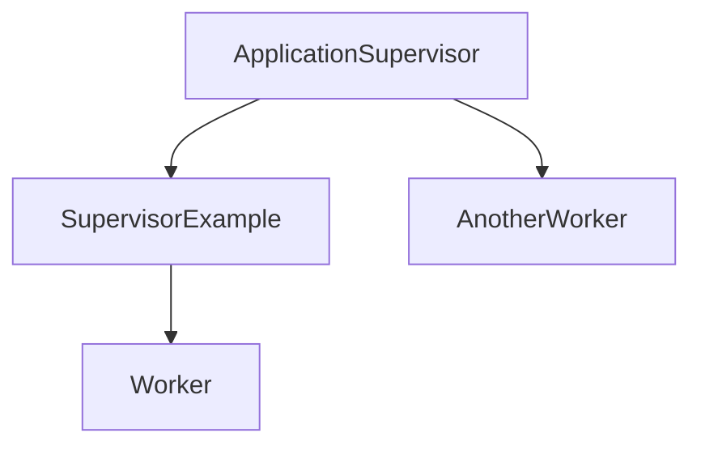
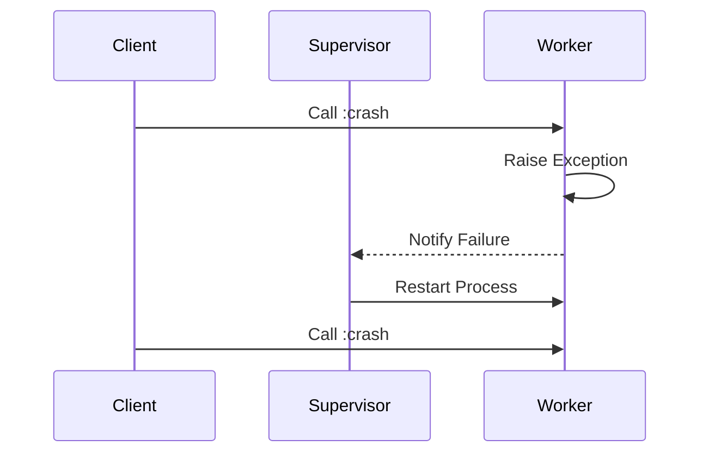

## 2.8. The "Let It Crash" Philosophy

In the world of software development, especially in the realm of functional programming with Elixir, the "Let It Crash" philosophy stands as a beacon of resilience and simplicity. This approach, deeply rooted in the Erlang ecosystem, encourages developers to embrace failure as a natural part of system operation. By allowing processes to fail and restart cleanly, Elixir applications can achieve remarkable fault tolerance and reliability. In this section, we will delve into the core principles of the "Let It Crash" philosophy, explore how it contributes to designing fault-tolerant systems, and examine the benefits it brings to modern software architecture.

### Embracing Failure for Resilience

The "Let It Crash" philosophy is predicated on the idea that failures are inevitable in complex systems. Instead of trying to prevent every possible error, Elixir encourages developers to design systems that can gracefully recover from failures. This approach is particularly effective in distributed and concurrent environments where the complexity of interactions can lead to unforeseen issues.

#### Allowing Processes to Fail and Restart Cleanly

In Elixir, processes are lightweight and isolated, making them ideal for implementing the "Let It Crash" philosophy. When a process encounters an error, it is often more efficient to let it crash and rely on a supervisor to restart it rather than attempting to handle the error within the process itself. This approach simplifies error-handling logic and ensures that the process restarts in a clean state.

```elixir
defmodule Worker do
  use GenServer

  def start_link(initial_state) do
    GenServer.start_link(__MODULE__, initial_state, name: __MODULE__)
  end

  def init(initial_state) do
    {:ok, initial_state}
  end

  def handle_call(:crash, _from, state) do
    # Simulate a crash
    raise "Something went wrong!"
  end
end

defmodule SupervisorExample do
  use Supervisor

  def start_link(_) do
    Supervisor.start_link(__MODULE__, :ok, name: __MODULE__)
  end

  def init(:ok) do
    children = [
      {Worker, :initial_state}
    ]

    Supervisor.init(children, strategy: :one_for_one)
  end
end

# Start the supervisor
{:ok, _pid} = SupervisorExample.start_link(:ok)

# Call the worker to crash
GenServer.call(Worker, :crash)
```

In this example, the `Worker` process is designed to crash when it receives the `:crash` message. The `SupervisorExample` module ensures that the `Worker` process is restarted whenever it crashes, maintaining system stability.

#### Relying on Supervisors to Manage Process Lifecycles

Supervisors play a crucial role in the "Let It Crash" philosophy. They are responsible for managing the lifecycle of processes, ensuring that they are restarted when they fail. Supervisors can be configured with different strategies to handle process failures, such as `:one_for_one`, `:one_for_all`, `:rest_for_one`, and `:simple_one_for_one`.

- **One for One**: Restarts only the failed process.
- **One for All**: Restarts all child processes if one fails.
- **Rest for One**: Restarts the failed process and any subsequent processes.
- **Simple One for One**: Used for dynamically adding and removing child processes.

### Designing Fault-Tolerant Systems

To design fault-tolerant systems, it is essential to structure applications in a way that isolates failures and minimizes their impact on the overall system. This involves understanding and implementing supervision trees, which are hierarchical structures of supervisors and workers.

#### Structuring Applications to Isolate Failures

By isolating failures to individual processes, Elixir applications can prevent errors from propagating throughout the system. This isolation is achieved through the use of processes and supervision trees, which compartmentalize functionality and ensure that failures are contained.

```elixir
defmodule ApplicationSupervisor do
  use Supervisor

  def start_link(_) do
    Supervisor.start_link(__MODULE__, :ok, name: __MODULE__)
  end

  def init(:ok) do
    children = [
      {SupervisorExample, :ok},
      {AnotherWorker, :ok}
    ]

    Supervisor.init(children, strategy: :one_for_one)
  end
end
```

In this example, the `ApplicationSupervisor` manages multiple child supervisors and workers, creating a hierarchy that isolates failures and enhances system resilience.

#### Understanding and Implementing Supervision Trees

Supervision trees are a fundamental concept in Elixir's fault-tolerant architecture. They allow developers to define how processes are supervised and restarted in the event of a failure. By organizing processes into a tree structure, developers can create robust systems that can recover from failures with minimal disruption.



This diagram illustrates a simple supervision tree with an `ApplicationSupervisor` overseeing a `SupervisorExample` and an `AnotherWorker`. The `SupervisorExample` further manages a `Worker` process.

### Benefits of the "Let It Crash" Philosophy

The "Let It Crash" philosophy offers several benefits that contribute to the overall reliability and maintainability of Elixir applications.

#### Increasing System Uptime and Reliability

By allowing processes to crash and restart, systems can maintain high uptime and reliability. This approach reduces the risk of cascading failures and ensures that processes are always in a known good state.

#### Simplifying Error-Handling Logic Within Processes

The "Let It Crash" philosophy simplifies error-handling logic by delegating the responsibility of recovery to supervisors. This allows developers to focus on the core functionality of processes without being burdened by complex error-handling code.

### Try It Yourself

To fully grasp the "Let It Crash" philosophy, try modifying the code examples provided. Experiment with different supervisor strategies and observe how they affect the behavior of the system. Consider adding additional processes and supervisors to create more complex supervision trees.

### Visualizing the "Let It Crash" Philosophy

To further illustrate the "Let It Crash" philosophy, let's visualize the process lifecycle and supervision strategy using a sequence diagram.



This sequence diagram shows how a client interacts with a worker process that crashes and is subsequently restarted by the supervisor.

### References and Further Reading

For more information on the "Let It Crash" philosophy and fault-tolerant design in Elixir, consider exploring the following resources:

- [Elixir's Official Documentation](https://elixir-lang.org/docs.html)
- [Learn You Some Erlang for Great Good!](http://learnyousomeerlang.com/)
- [Designing for Scalability with Erlang/OTP](https://www.oreilly.com/library/view/designing-for-scalability/9781449361556/)

### Knowledge Check

Before moving on, let's review some key takeaways:

- The "Let It Crash" philosophy embraces failure as a natural part of system operation.
- Processes in Elixir are lightweight and isolated, making them ideal for this approach.
- Supervisors manage process lifecycles and ensure system stability.
- Supervision trees help isolate failures and enhance fault tolerance.

### Embrace the Journey

Remember, the "Let It Crash" philosophy is just one aspect of building resilient systems with Elixir. As you continue your journey, you'll discover more patterns and techniques that contribute to robust and reliable software. Keep experimenting, stay curious, and enjoy the process of learning and growing as a developer.

## Quiz: The "Let It Crash" Philosophy



### What is the primary goal of the "Let It Crash" philosophy in Elixir?

- [x] To embrace failure and ensure system resilience through process isolation and supervision.
- [ ] To prevent all possible errors from occurring in the system.
- [ ] To handle errors within each process without relying on supervisors.
- [ ] To minimize the number of processes in an application.

> **Explanation:** The "Let It Crash" philosophy focuses on embracing failure and ensuring system resilience by allowing processes to crash and restart cleanly, managed by supervisors.

### How does the "Let It Crash" philosophy simplify error handling?

- [x] By delegating recovery responsibility to supervisors, allowing processes to focus on core functionality.
- [ ] By requiring each process to handle its own errors internally.
- [ ] By eliminating the need for error handling altogether.
- [ ] By using complex error-handling logic within each process.

> **Explanation:** The philosophy simplifies error handling by delegating recovery to supervisors, freeing processes from complex error-handling code.

### What role do supervisors play in the "Let It Crash" philosophy?

- [x] They manage process lifecycles and ensure system stability by restarting failed processes.
- [ ] They prevent processes from crashing in the first place.
- [ ] They handle all business logic within the application.
- [ ] They are responsible for logging errors but not for restarting processes.

> **Explanation:** Supervisors manage process lifecycles and ensure system stability by restarting failed processes, a key aspect of the "Let It Crash" philosophy.

### Which supervision strategy restarts only the failed process?

- [x] One for One
- [ ] One for All
- [ ] Rest for One
- [ ] Simple One for One

> **Explanation:** The "One for One" strategy restarts only the failed process, leaving other processes unaffected.

### What is a supervision tree?

- [x] A hierarchical structure of supervisors and workers that isolates failures and enhances system resilience.
- [ ] A list of all processes in an application.
- [ ] A diagram showing the flow of data between processes.
- [ ] A method for logging errors in an application.

> **Explanation:** A supervision tree is a hierarchical structure of supervisors and workers that isolates failures and enhances system resilience.

### How can you visualize the "Let It Crash" philosophy?

- [x] Using sequence diagrams to show process interactions and restarts.
- [ ] By listing all possible errors in an application.
- [ ] By creating a flowchart of business logic.
- [ ] By drawing a network diagram of all connected systems.

> **Explanation:** Sequence diagrams can effectively visualize process interactions and restarts, illustrating the "Let It Crash" philosophy.

### What is the benefit of allowing processes to crash and restart?

- [x] It increases system uptime and reliability by ensuring processes are always in a known good state.
- [ ] It reduces the number of processes needed in an application.
- [ ] It eliminates the need for error handling altogether.
- [ ] It prevents any errors from occurring in the system.

> **Explanation:** Allowing processes to crash and restart increases system uptime and reliability by ensuring processes are always in a known good state.

### Which supervision strategy restarts all child processes if one fails?

- [x] One for All
- [ ] One for One
- [ ] Rest for One
- [ ] Simple One for One

> **Explanation:** The "One for All" strategy restarts all child processes if one fails, ensuring consistency among related processes.

### What is the primary advantage of using lightweight and isolated processes in Elixir?

- [x] They allow for efficient implementation of the "Let It Crash" philosophy.
- [ ] They reduce the overall complexity of the application.
- [ ] They eliminate the need for supervisors.
- [ ] They prevent any errors from occurring.

> **Explanation:** Lightweight and isolated processes allow for efficient implementation of the "Let It Crash" philosophy, as they can be restarted without affecting other processes.

### True or False: The "Let It Crash" philosophy eliminates the need for error handling in Elixir applications.

- [ ] True
- [x] False

> **Explanation:** False. The "Let It Crash" philosophy does not eliminate the need for error handling; instead, it delegates recovery to supervisors, simplifying error-handling logic within processes.


