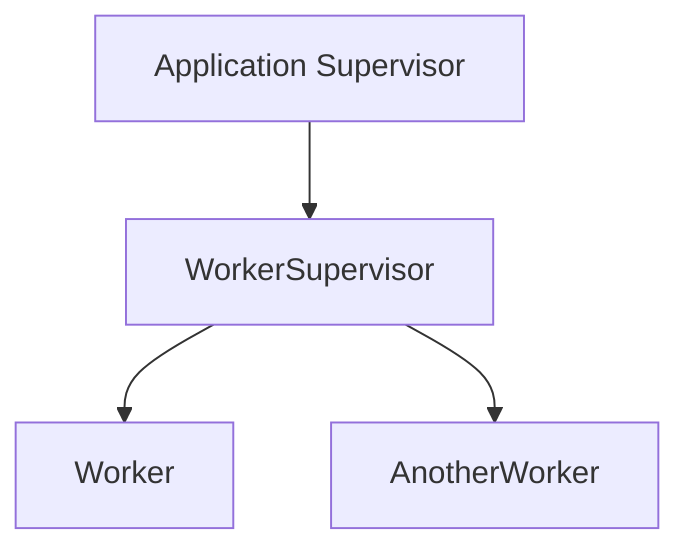
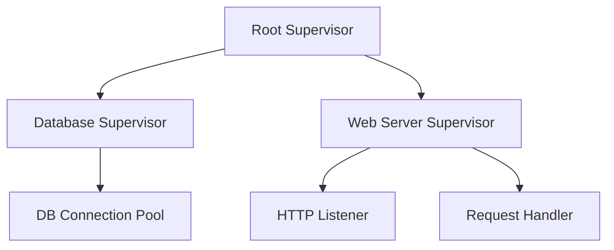

## 2.8. The "Let It Crash" Philosophy

In the world of software development, especially when dealing with concurrent and distributed systems, the concept of building resilient applications is paramount. Elixir, a functional programming language built on the Erlang VM (BEAM), embraces a unique approach to achieving resilience: the "Let It Crash" philosophy. This philosophy encourages developers to design systems that expect and gracefully handle failures, rather than attempting to prevent them entirely.

### Embracing Failure for Resilience

The "Let It Crash" philosophy is rooted in the idea that software systems should be designed to fail gracefully. Instead of writing complex error-handling logic within each process, Elixir developers are encouraged to allow processes to fail and rely on supervisors to manage their lifecycles. This approach simplifies code and enhances the overall reliability of the system.

#### Allowing Processes to Fail and Restart Cleanly

In Elixir, processes are lightweight, isolated units of computation. They are designed to be independent and can fail without affecting other processes. When a process encounters an error, it is allowed to crash, and a supervisor takes responsibility for restarting it. This leads to a system that is more robust and easier to maintain.

```elixir
defmodule Worker do
  use GenServer

  # Client API
  def start_link(initial_state) do
    GenServer.start_link(__MODULE__, initial_state, name: __MODULE__)
  end

  def do_work do
    GenServer.call(__MODULE__, :do_work)
  end

  # Server Callbacks
  def init(initial_state) do
    {:ok, initial_state}
  end

  def handle_call(:do_work, _from, state) do
    # Simulating a failure
    if state == :error do
      raise "Unexpected error!"
    end
    {:reply, :ok, state}
  end
end
```

In the example above, the `Worker` process may encounter an error during its operation. Instead of handling the error internally, it is allowed to crash. The supervisor, which we'll discuss next, will handle the restart logic.

#### Relying on Supervisors to Manage Process Lifecycles

Supervisors are a core component of the "Let It Crash" philosophy. They monitor processes and automatically restart them when they fail. This ensures that the system remains operational even in the face of unexpected errors.

```elixir
defmodule WorkerSupervisor do
  use Supervisor

  def start_link do
    Supervisor.start_link(__MODULE__, :ok, name: __MODULE__)
  end

  def init(:ok) do
    children = [
      {Worker, :ok}
    ]

    Supervisor.init(children, strategy: :one_for_one)
  end
end
```

In this example, the `WorkerSupervisor` is responsible for starting and supervising the `Worker` process. The `:one_for_one` strategy indicates that if a child process terminates, only that process is restarted.

### Designing Fault-Tolerant Systems

Building fault-tolerant systems requires structuring applications to isolate failures and leverage supervision trees effectively.

#### Structuring Applications to Isolate Failures

Isolation is a key principle in designing fault-tolerant systems. By isolating processes, we ensure that a failure in one part of the system does not cascade to others. This is achieved by organizing processes into supervision trees.

```elixir
defmodule MyApp.Application do
  use Application

  def start(_type, _args) do
    children = [
      WorkerSupervisor
    ]

    opts = [strategy: :one_for_all, name: MyApp.Supervisor]
    Supervisor.start_link(children, opts)
  end
end
```

In this example, the `MyApp.Application` module defines a supervision tree that includes the `WorkerSupervisor`. The `:one_for_all` strategy means that if one child process fails, all other child processes are terminated and restarted. This strategy is useful when processes are interdependent.

#### Understanding and Implementing Supervision Trees

Supervision trees are hierarchical structures that organize processes into parent-child relationships. Each supervisor can have multiple child processes, and each child can be a worker or another supervisor. This hierarchy allows for complex systems to be managed effectively.


```mermaid
graph TD;
    A[Application Supervisor] --> B[WorkerSupervisor];
    B --> C[Worker];
    B --> D[AnotherWorker];
```

In the diagram above, the `Application Supervisor` oversees the `WorkerSupervisor`, which in turn manages individual worker processes. This structure allows failures to be contained and managed efficiently.

### Benefits of the "Let It Crash" Philosophy

Adopting the "Let It Crash" philosophy offers several advantages:

- **Increased System Uptime and Reliability**: By allowing processes to fail and restart automatically, systems remain operational even in the face of unexpected errors.
- **Simplified Error-Handling Logic**: Developers can focus on building core functionality without being bogged down by complex error-handling code.
- **Scalability**: The lightweight nature of processes in Elixir allows systems to scale horizontally with ease.

### Try It Yourself

To fully grasp the "Let It Crash" philosophy, try modifying the `Worker` module to simulate different types of failures and observe how the supervisor handles them. Experiment with different supervision strategies (`:one_for_one`, `:one_for_all`, `:rest_for_one`) to see how they affect the system's behavior.

### Visualizing Supervision Trees

Understanding supervision trees is crucial for designing fault-tolerant systems. Let's visualize a simple supervision tree to see how processes are organized.


```mermaid
graph TD;
    A[Root Supervisor] --> B[Database Supervisor];
    A --> C[Web Server Supervisor];
    B --> D[DB Connection Pool];
    C --> E[HTTP Listener];
    C --> F[Request Handler];
```

In this diagram, the `Root Supervisor` oversees two child supervisors: `Database Supervisor` and `Web Server Supervisor`. Each of these supervisors manages specific processes related to their domain, such as database connections or web requests.

### References and Further Reading

- [Elixir Official Documentation](https://elixir-lang.org/docs.html)
- [Erlang and OTP in Action](https://www.manning.com/books/erlang-and-otp-in-action)
- [Designing for Scalability with Erlang/OTP](https://pragprog.com/titles/jaerlang/designing-for-scalability-with-erlangotp/)

### Knowledge Check

- How does the "Let It Crash" philosophy contribute to system reliability?
- What role do supervisors play in managing process lifecycles?
- How can different supervision strategies affect a system's behavior?

### Embrace the Journey

Remember, the "Let It Crash" philosophy is a powerful tool in your arsenal as an Elixir developer. By embracing failure and designing systems that can recover gracefully, you can build applications that are robust, scalable, and maintainable. Keep experimenting, stay curious, and enjoy the journey of mastering Elixir!

## Quiz Time!



### What is the primary goal of the "Let It Crash" philosophy in Elixir?

- [x] To increase system reliability by allowing processes to fail and restart
- [ ] To prevent all possible errors from occurring
- [ ] To write complex error-handling code within each process
- [ ] To avoid using supervisors altogether

> **Explanation:** The "Let It Crash" philosophy aims to increase system reliability by allowing processes to fail and restart cleanly, rather than preventing all errors.

### What is the role of a supervisor in Elixir?

- [x] To monitor and restart child processes when they fail
- [ ] To handle all errors within a process
- [ ] To execute business logic
- [ ] To prevent processes from crashing

> **Explanation:** Supervisors monitor child processes and restart them when they fail, ensuring the system remains operational.

### Which supervision strategy restarts all child processes if one fails?

- [ ] :one_for_one
- [x] :one_for_all
- [ ] :rest_for_one
- [ ] :simple_one_for_one

> **Explanation:** The :one_for_all strategy restarts all child processes if one fails, useful for interdependent processes.

### How do supervision trees enhance fault tolerance?

- [x] By organizing processes into hierarchical structures for effective management
- [ ] By eliminating all possible errors in the system
- [ ] By preventing any processes from crashing
- [ ] By avoiding the use of lightweight processes

> **Explanation:** Supervision trees organize processes hierarchically, allowing for effective management and containment of failures.

### What is a key benefit of allowing processes to crash and restart?

- [x] Simplified error-handling logic
- [ ] Increased code complexity
- [ ] Decreased system reliability
- [ ] More manual intervention required

> **Explanation:** Allowing processes to crash and restart simplifies error-handling logic, making systems easier to maintain.

### What does the "Let It Crash" philosophy encourage developers to focus on?

- [x] Building core functionality without complex error-handling code
- [ ] Writing extensive error-handling logic
- [ ] Preventing all possible failures
- [ ] Avoiding the use of supervisors

> **Explanation:** The philosophy encourages developers to focus on core functionality, relying on supervisors for error management.

### What is the advantage of using lightweight processes in Elixir?

- [x] Scalability and efficient resource usage
- [ ] Increased memory consumption
- [ ] Complex error handling
- [ ] Slower performance

> **Explanation:** Lightweight processes allow for scalability and efficient resource usage, a key advantage in Elixir.

### How can developers experiment with the "Let It Crash" philosophy?

- [x] By modifying process modules to simulate failures and observe supervisor behavior
- [ ] By writing complex error-handling code
- [ ] By preventing all processes from crashing
- [ ] By avoiding the use of supervision trees

> **Explanation:** Developers can simulate failures and observe supervisor behavior to experiment with the philosophy.

### What does the :rest_for_one supervision strategy do?

- [x] Restarts the failed process and any subsequent processes in the list
- [ ] Restarts all child processes if one fails
- [ ] Restarts only the failed process
- [ ] Prevents any processes from crashing

> **Explanation:** The :rest_for_one strategy restarts the failed process and any subsequent processes in the list.

### True or False: The "Let It Crash" philosophy eliminates the need for error handling in Elixir.

- [ ] True
- [x] False

> **Explanation:** False. While the philosophy simplifies error handling by relying on supervisors, it does not eliminate the need for error handling altogether.


