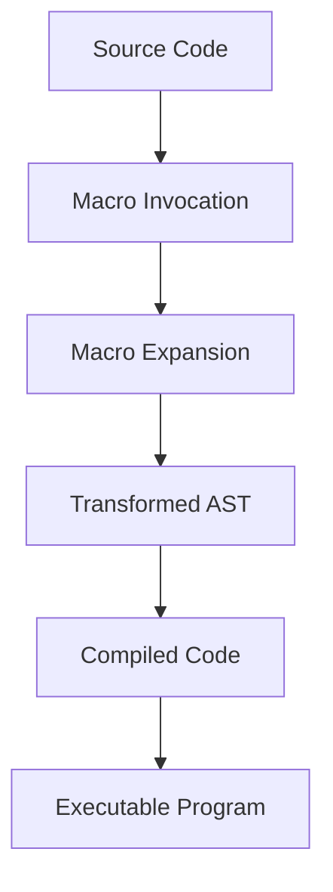

## 2.9. Metaprogramming and Macros Overview

Metaprogramming in Elixir is a powerful technique that allows developers to write code that writes code. This capability is facilitated by Elixir's ability to manipulate its own abstract syntax tree (AST), enabling the creation of macros that can transform and generate code at compile time. In this section, we will delve into the concepts of metaprogramming and macros, explore their use cases, and discuss the considerations and potential pitfalls associated with their use.

### Introduction to Metaprogramming

Metaprogramming is the practice of writing code that can produce or modify other code. In Elixir, this is achieved through the manipulation of the abstract syntax tree (AST), which represents the structure of the code. By understanding and leveraging the AST, developers can create macros that perform complex code transformations, automate repetitive tasks, and enhance the expressiveness of the language.

#### Writing Code That Writes Code

The essence of metaprogramming is the ability to write code that can generate or alter other code. This is particularly useful in scenarios where repetitive patterns emerge, or when there is a need to extend the language's capabilities. In Elixir, metaprogramming is primarily achieved through macros, which are special constructs that allow developers to inject custom code transformations into the compilation process.

#### The Role of Abstract Syntax Trees (AST) in Elixir

The abstract syntax tree (AST) is a tree representation of the syntactic structure of code. In Elixir, the AST is a key component of metaprogramming, as it allows developers to inspect, modify, and generate code at a structural level. The AST is composed of tuples that represent different elements of the code, such as function calls, variables, and literals.

```elixir
# Example of an AST representation
{:def, [line: 1], [{:my_function, [line: 1], []}, [do: {:ok, :result}]]}
```

In this example, the AST represents a simple function definition. By manipulating the AST, developers can create macros that transform this structure into new code.

### Macros in Elixir

Macros are a fundamental aspect of metaprogramming in Elixir. They allow developers to define custom code transformations that are applied during the compilation process. Unlike functions, which are evaluated at runtime, macros operate at compile time, enabling them to generate and modify code before it is executed.

#### Defining Macros Using `defmacro`

Macros in Elixir are defined using the `defmacro` keyword. A macro is similar to a function, but it operates on the AST of its arguments and returns a new AST that represents the transformed code.

```elixir
defmodule MyMacros do
  defmacro my_macro do
    quote do
      IO.puts("Hello from a macro!")
    end
  end
end
```

In this example, `my_macro` is a simple macro that injects a call to `IO.puts/1` into the code. The `quote` block is used to construct the AST that the macro returns.

#### Differences Between Macros and Functions

While macros and functions may appear similar, they have distinct differences in their behavior and use cases:

- **Evaluation Time**: Functions are evaluated at runtime, while macros are expanded at compile time.
- **Code Generation**: Macros can generate and transform code, whereas functions can only execute code.
- **Complexity**: Macros can introduce complexity and should be used judiciously, as they can make code harder to read and maintain.

### Use Cases and Considerations

Macros are a powerful tool, but they should be used with care. Understanding when and how to use macros effectively is crucial for maintaining code quality and readability.

#### When to Use Macros for Code Generation

Macros are particularly useful in scenarios where code generation can simplify complex patterns or automate repetitive tasks. Some common use cases for macros include:

- **Domain-Specific Languages (DSLs)**: Creating DSLs that provide a more expressive syntax for specific tasks.
- **Code Optimization**: Generating optimized code paths for performance-critical sections.
- **Boilerplate Reduction**: Eliminating repetitive code patterns by generating common structures.

#### Potential Risks, Such as Code Complexity and Maintainability

While macros offer significant benefits, they also come with potential risks:

- **Complexity**: Macros can make code harder to understand, as they introduce additional layers of abstraction.
- **Maintainability**: Overuse of macros can lead to code that is difficult to maintain and debug.
- **Error Propagation**: Errors in macro-generated code can be challenging to trace back to the source macro.

### Code Examples

Let's explore some practical examples of macros in Elixir to illustrate their capabilities and potential pitfalls.

#### Example 1: A Simple Logging Macro

```elixir
defmodule LoggerMacros do
  defmacro log(message) do
    quote do
      IO.puts("Log: #{unquote(message)}")
    end
  end
end

defmodule MyApp do
  require LoggerMacros

  def run do
    LoggerMacros.log("Application started")
  end
end

MyApp.run()
```

In this example, we define a simple logging macro that injects a call to `IO.puts/1` with a prefixed message. The `unquote` function is used to insert the value of `message` into the quoted expression.

#### Example 2: A Macro for Conditional Compilation

```elixir
defmodule ConditionalMacros do
  defmacro if_prod(do: block) do
    if Mix.env() == :prod do
      block
    else
      quote do
        :ok
      end
    end
  end
end

defmodule MyApp do
  require ConditionalMacros

  def run do
    ConditionalMacros.if_prod do
      IO.puts("Running in production!")
    end
  end
end

MyApp.run()
```

This example demonstrates a macro that conditionally includes code based on the current environment. The `if_prod` macro checks if the environment is `:prod` and includes the provided block only if the condition is met.

### Visualizing Macros and AST

To better understand how macros and AST work together, let's visualize the process of macro expansion and code transformation.



**Diagram Description**: This diagram illustrates the process of macro expansion in Elixir. The source code is transformed by macro invocations, resulting in a transformed AST. This AST is then compiled into executable code.

### References and Links

For further reading on metaprogramming and macros in Elixir, consider exploring the following resources:

- [Elixir Lang - Metaprogramming](https://elixir-lang.org/getting-started/meta/metaprogramming.html)
- [Programming Elixir ≥ 1.6](https://pragprog.com/titles/elixir16/programming-elixir-1-6/)
- [Elixir School - Metaprogramming](https://elixirschool.com/en/lessons/advanced/metaprogramming/)

### Knowledge Check

To reinforce your understanding of metaprogramming and macros in Elixir, consider the following questions and exercises:

1. What is the primary difference between macros and functions in Elixir?
2. How does the abstract syntax tree (AST) facilitate metaprogramming in Elixir?
3. Create a macro that generates a function to calculate the square of a number.
4. Discuss the potential risks associated with overusing macros in a codebase.
5. Experiment with modifying the logging macro example to include a timestamp.

### Embrace the Journey

Metaprogramming and macros in Elixir open up a world of possibilities for code generation and transformation. As you explore these concepts, remember that with great power comes great responsibility. Use macros judiciously, and always strive for clarity and maintainability in your code. Keep experimenting, stay curious, and enjoy the journey of mastering Elixir's metaprogramming capabilities!

## Quiz: Metaprogramming and Macros Overview



### What is metaprogramming in Elixir?

- [x] Writing code that writes or modifies other code.
- [ ] A technique for optimizing runtime performance.
- [ ] A method for debugging Elixir applications.
- [ ] A way to manage dependencies in Elixir projects.

> **Explanation:** Metaprogramming involves writing code that can generate or alter other code, often using macros.

### How are macros different from functions in Elixir?

- [x] Macros are expanded at compile time, while functions are evaluated at runtime.
- [ ] Macros can only be used for logging purposes.
- [ ] Functions can modify the AST, while macros cannot.
- [ ] Macros are a type of function in Elixir.

> **Explanation:** Macros operate at compile time and can transform code, whereas functions are executed at runtime.

### What is the role of the abstract syntax tree (AST) in metaprogramming?

- [x] It represents the structure of code, allowing for manipulation and transformation.
- [ ] It is used to optimize code execution at runtime.
- [ ] It is a debugging tool for Elixir applications.
- [ ] It manages dependencies in Elixir projects.

> **Explanation:** The AST is a structural representation of code that enables manipulation and transformation in metaprogramming.

### Which keyword is used to define macros in Elixir?

- [x] defmacro
- [ ] def
- [ ] defmodule
- [ ] defstruct

> **Explanation:** The `defmacro` keyword is used to define macros in Elixir.

### What is a potential risk of using macros excessively?

- [x] Increased code complexity and reduced maintainability.
- [ ] Improved runtime performance.
- [ ] Simplified debugging process.
- [ ] Enhanced readability of code.

> **Explanation:** Overusing macros can lead to complex and hard-to-maintain code.

### What function is used to insert values into a quoted expression in a macro?

- [x] unquote
- [ ] quote
- [ ] insert
- [ ] eval

> **Explanation:** The `unquote` function is used to insert values into a quoted expression within a macro.

### When is a macro expanded in Elixir?

- [x] At compile time.
- [ ] At runtime.
- [ ] During debugging.
- [ ] During dependency resolution.

> **Explanation:** Macros are expanded at compile time, allowing for code transformation before execution.

### What is a common use case for macros in Elixir?

- [x] Creating domain-specific languages (DSLs).
- [ ] Managing dependencies.
- [ ] Debugging applications.
- [ ] Optimizing runtime performance.

> **Explanation:** Macros are often used to create DSLs and automate repetitive code patterns.

### True or False: Macros can be used to generate optimized code paths.

- [x] True
- [ ] False

> **Explanation:** Macros can generate optimized code paths by transforming code at compile time.

### What is the purpose of the `quote` block in a macro?

- [x] To construct the AST that the macro returns.
- [ ] To execute code at runtime.
- [ ] To manage dependencies.
- [ ] To debug applications.

> **Explanation:** The `quote` block is used to construct the AST that a macro returns, enabling code transformation.




