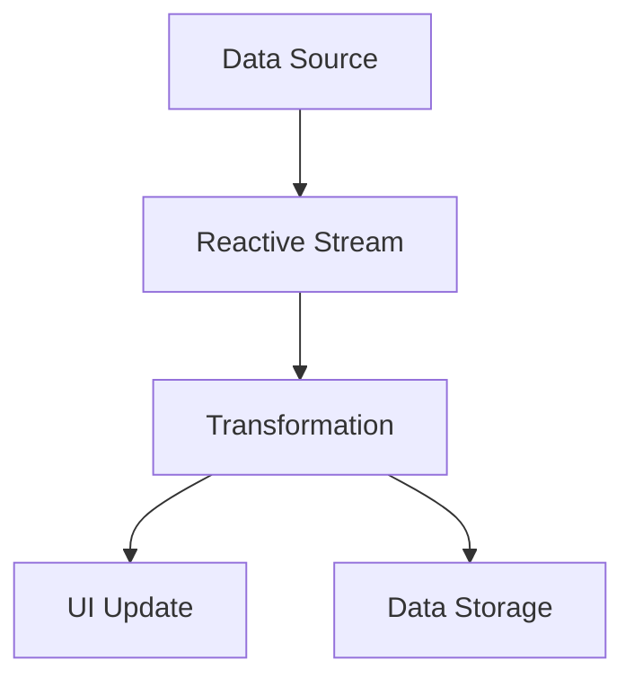

## 20.1. Functional Reactive Programming

Functional Reactive Programming (FRP) is a paradigm that combines the principles of functional programming with reactive data flows. It allows developers to build systems that respond to changes in data over time, making it particularly useful for applications that require dynamic UI updates and real-time data processing. In this section, we will explore how FRP can be implemented in Elixir, leveraging libraries like `Reactrix` to create responsive and efficient applications.

### Concept Overview

Functional Reactive Programming is built on two core concepts: **functional programming** and **reactive programming**. Let's break these down:

- **Functional Programming**: This paradigm emphasizes the use of pure functions, immutability, and higher-order functions. It avoids shared state and mutable data, leading to more predictable and testable code.

- **Reactive Programming**: This paradigm focuses on asynchronous data streams and the propagation of change. It allows systems to react to data changes in real-time, making it ideal for applications that require continuous updates.

By combining these two paradigms, FRP enables developers to create systems that are both declarative and responsive, allowing for more intuitive and maintainable code.

### Implementation in Elixir

Elixir, with its functional nature and robust concurrency model, is well-suited for implementing FRP. One of the libraries that facilitate FRP in Elixir is `Reactrix`. Let's explore how to use this library to build reactive applications.

#### Setting Up Reactrix

To get started with `Reactrix`, you'll need to add it to your Elixir project. Add the following line to your `mix.exs` file under the `deps` function:

```elixir
defp deps do
  [
    {:reactrix, "~> 0.1.0"}
  ]
end
```

Then, run `mix deps.get` to fetch the library.

#### Creating Reactive Streams

With `Reactrix`, you can create reactive streams that represent data flows in your application. Here's a simple example of creating a stream that emits numbers from 1 to 10:

```elixir
alias Reactrix.Stream

stream = Stream.interval(1000)
|> Stream.map(fn _ -> Enum.random(1..10) end)
|> Stream.take(10)

stream
|> Stream.each(&IO.inspect/1)
|> Stream.run()
```

In this example, we create a stream that emits a random number between 1 and 10 every second. The `Stream.each/2` function is used to print each number to the console.

#### Transforming Streams

Streams in `Reactrix` can be transformed using various operators. For instance, you can filter, map, and reduce streams to create complex data flows. Here's an example of filtering even numbers from a stream:

```elixir
stream
|> Stream.filter(fn x -> rem(x, 2) == 0 end)
|> Stream.each(&IO.inspect/1)
|> Stream.run()
```

This code filters the stream to only include even numbers, which are then printed to the console.

#### Combining Streams

One of the powerful features of FRP is the ability to combine multiple streams. This allows you to create complex data flows that react to multiple sources of data. Here's an example of combining two streams:

```elixir
stream1 = Stream.interval(1000) |> Stream.map(fn _ -> Enum.random(1..5) end)
stream2 = Stream.interval(1500) |> Stream.map(fn _ -> Enum.random(6..10) end)

combined_stream = Stream.zip(stream1, stream2)

combined_stream
|> Stream.each(fn {x, y} -> IO.inspect({x, y}) end)
|> Stream.run()
```

In this example, we create two streams that emit random numbers at different intervals. The `Stream.zip/2` function combines these streams into a single stream of tuples.

### Applications of Functional Reactive Programming

FRP is particularly useful for applications that require dynamic UI updates and real-time data processing. Here are some common use cases:

#### Dynamic UI Updates

In modern web applications, UIs need to be responsive to user interactions and data changes. FRP allows you to create UIs that automatically update in response to changes in data. For example, you can use FRP to build a live chat application where messages are displayed in real-time as they are received.

#### Real-Time Data Streams

FRP is ideal for processing real-time data streams, such as sensor data, financial market data, or social media feeds. By using reactive streams, you can build applications that process and analyze data as it arrives, providing immediate insights and actions.

### Visualizing Functional Reactive Programming

To better understand how FRP works, let's visualize the flow of data in a reactive system using a Mermaid.js diagram:



In this diagram, data flows from a source into a reactive stream, where it undergoes transformations. The transformed data is then used to update the UI and store data as needed.

### Try It Yourself

To get hands-on experience with FRP in Elixir, try modifying the code examples provided. Here are some suggestions:

- Change the interval of the streams to see how it affects the output.
- Add additional transformations to the streams, such as mapping or reducing.
- Combine more than two streams and explore the resulting data flow.

### References and Links

For further reading on Functional Reactive Programming and Elixir, consider the following resources:

- [Elixir Official Documentation](https://elixir-lang.org/docs.html)
- [Reactrix GitHub Repository](https://github.com/reactrix/reactrix)
- [Functional Reactive Programming on Wikipedia](https://en.wikipedia.org/wiki/Functional_reactive_programming)

### Knowledge Check

Before moving on, let's review some key concepts:

- What are the core principles of Functional Reactive Programming?
- How can streams be transformed and combined in Elixir?
- What are some common applications of FRP?

### Embrace the Journey

Remember, mastering Functional Reactive Programming in Elixir is a journey. As you continue to explore and experiment, you'll discover new ways to build responsive and efficient applications. Stay curious, keep learning, and enjoy the process!

## Quiz: Functional Reactive Programming



### What are the core principles of Functional Reactive Programming?

- [x] Functional programming and reactive data flows
- [ ] Object-oriented programming and reactive data flows
- [ ] Functional programming and imperative data flows
- [ ] Object-oriented programming and imperative data flows

> **Explanation:** FRP combines functional programming with reactive data flows to create responsive systems.

### Which Elixir library is commonly used for Functional Reactive Programming?

- [x] Reactrix
- [ ] Phoenix
- [ ] Ecto
- [ ] Plug

> **Explanation:** Reactrix is a library that facilitates Functional Reactive Programming in Elixir.

### What is a common use case for Functional Reactive Programming?

- [x] Dynamic UI updates
- [ ] Static website generation
- [ ] Batch processing
- [ ] File system management

> **Explanation:** FRP is ideal for applications that require dynamic UI updates and real-time data processing.

### How can streams be combined in Elixir?

- [x] Using the Stream.zip function
- [ ] Using the Stream.concat function
- [ ] Using the Stream.merge function
- [ ] Using the Stream.split function

> **Explanation:** The Stream.zip function combines multiple streams into a single stream of tuples.

### What is the purpose of the Stream.each function in Elixir?

- [x] To perform side effects for each element in a stream
- [ ] To filter elements in a stream
- [ ] To map elements in a stream
- [ ] To reduce elements in a stream

> **Explanation:** Stream.each is used to perform side effects, such as printing, for each element in a stream.

### What does the Stream.filter function do?

- [x] Filters elements in a stream based on a predicate
- [ ] Maps elements in a stream to new values
- [ ] Combines multiple streams into one
- [ ] Reduces elements in a stream to a single value

> **Explanation:** Stream.filter is used to filter elements in a stream based on a given predicate function.

### Which of the following is NOT a feature of Functional Reactive Programming?

- [ ] Asynchronous data streams
- [ ] Propagation of change
- [x] Shared mutable state
- [ ] Declarative code

> **Explanation:** FRP avoids shared mutable state, focusing on immutability and pure functions.

### What is the result of combining two streams using Stream.zip?

- [x] A single stream of tuples
- [ ] Two separate streams
- [ ] A single stream of lists
- [ ] A single stream of maps

> **Explanation:** Stream.zip combines two streams into a single stream of tuples, pairing elements from each stream.

### How can you modify a stream to only include even numbers?

- [x] Use Stream.filter with a predicate checking for even numbers
- [ ] Use Stream.map to transform numbers to even
- [ ] Use Stream.reduce to accumulate even numbers
- [ ] Use Stream.concat to add even numbers

> **Explanation:** Stream.filter can be used with a predicate function to filter out even numbers from a stream.

### True or False: Functional Reactive Programming is only applicable to UI development.

- [ ] True
- [x] False

> **Explanation:** While FRP is useful for UI development, it is also applicable to real-time data processing and other domains.




