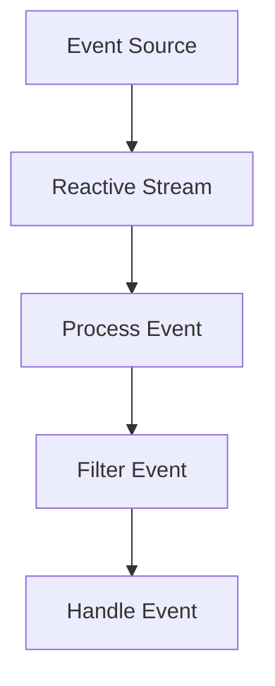

## 20.1. Functional Reactive Programming

Functional Reactive Programming (FRP) represents a paradigm shift in how we handle dynamic data flows and interactive applications. By combining the principles of functional programming with reactive data streams, FRP offers a robust framework for building responsive, high-performance applications. In this section, we will delve into the intricacies of FRP, its implementation in Elixir, and its practical applications.

### Concept Overview

Functional Reactive Programming is a programming paradigm that integrates functional programming with reactive programming. It focuses on the propagation of changes in data through a system in a declarative manner. This approach allows developers to express dynamic behavior in a clear and concise way, making it easier to manage complex data flows and interactions.

#### Key Concepts of FRP

1. **Reactive Data Streams**: In FRP, data is represented as streams that can be observed and reacted to. These streams can be composed, transformed, and filtered to create complex data flows.

2. **Declarative Programming**: FRP emphasizes a declarative style, where you specify what should happen in response to changes in data, rather than how it should happen.

3. **Time-Varying Values**: FRP introduces the concept of time-varying values, which represent values that change over time. These values can be used to model dynamic behavior in applications.

4. **Composability**: FRP allows for the composition of data streams and transformations, enabling developers to build complex data flows from simple building blocks.

5. **Immutability and Pure Functions**: Leveraging functional programming principles, FRP ensures that data transformations are pure and side-effect-free, leading to more predictable and maintainable code.

### Implementation in Elixir

Elixir, with its functional programming roots and powerful concurrency model, is well-suited for implementing FRP. While Elixir does not natively support FRP, there are libraries such as `Reactrix` that facilitate the integration of FRP concepts into Elixir applications.

#### Using Reactrix in Elixir

`Reactrix` is a library designed to bring FRP to Elixir. It provides tools for creating and managing reactive data streams, making it easier to build applications that respond to real-time data changes.

```elixir
defmodule MyApp.ReactiveExample do
  use Reactrix

  # Define a reactive stream that listens to an event source
  def start_link do
    Reactrix.stream(:event_source)
    |> Reactrix.map(&process_event/1)
    |> Reactrix.filter(&filter_event/1)
    |> Reactrix.subscribe(&handle_event/1)
  end

  # Process each event in the stream
  defp process_event(event) do
    # Transform the event data
    Map.update!(event, :value, &(&1 * 2))
  end

  # Filter events based on a condition
  defp filter_event(event) do
    event.value > 10
  end

  # Handle the filtered and processed event
  defp handle_event(event) do
    IO.inspect(event, label: "Processed Event")
  end
end
```

In this example, we define a reactive stream that listens to an event source, processes each event, filters them based on a condition, and handles the resulting events. The use of `Reactrix` allows us to express these operations in a declarative and composable manner.

#### Key Features of Reactrix

- **Stream Composition**: Easily compose streams using functions like `map`, `filter`, and `merge`.
- **Event Handling**: Define how your application should react to changes in data.
- **Concurrency**: Leverage Elixir's concurrency model to handle multiple streams efficiently.
- **Integration**: Seamlessly integrate with other Elixir libraries and frameworks.

### Applications of Functional Reactive Programming

FRP is particularly useful in scenarios where applications need to respond to real-time data changes or user interactions. Here are some common applications of FRP:

#### Dynamic UI Updates

In modern web and mobile applications, user interfaces need to be dynamic and responsive to user interactions. FRP provides a framework for building UI components that automatically update in response to changes in data.

```elixir
defmodule MyApp.DynamicUI do
  use Reactrix

  def start_link do
    Reactrix.stream(:user_input)
    |> Reactrix.map(&update_ui/1)
    |> Reactrix.subscribe(&render_ui/1)
  end

  defp update_ui(input) do
    # Update the UI state based on user input
    %{text: input}
  end

  defp render_ui(state) do
    IO.puts("Rendering UI with state: #{state.text}")
  end
end
```

In this example, the UI automatically updates whenever the user input changes, providing a seamless and interactive experience.

#### Real-Time Data Streams

FRP is ideal for applications that need to process and react to real-time data streams, such as financial applications, IoT systems, and live data dashboards.

```elixir
defmodule MyApp.RealTimeData do
  use Reactrix

  def start_link do
    Reactrix.stream(:sensor_data)
    |> Reactrix.map(&process_sensor_data/1)
    |> Reactrix.subscribe(&update_dashboard/1)
  end

  defp process_sensor_data(data) do
    # Process the sensor data
    %{temperature: data.temperature * 1.8 + 32}
  end

  defp update_dashboard(data) do
    IO.puts("Updating dashboard with temperature: #{data.temperature}°F")
  end
end
```

In this scenario, the application processes sensor data in real-time and updates a dashboard with the latest information.

### Visualizing Reactive Data Flows

To better understand FRP, it's helpful to visualize the flow of data through a system. The following diagram illustrates a typical reactive data flow in an FRP application:


```mermaid
graph TD;
    A[Event Source] --> B[Reactive Stream];
    B --> C[Process Event];
    C --> D[Filter Event];
    D --> E[Handle Event];
```

In this diagram, we see how data flows from an event source through a series of transformations and filters, ultimately being handled by the application.

### Challenges and Considerations

While FRP offers many benefits, it also presents some challenges and considerations:

1. **Complexity**: FRP can introduce additional complexity, especially in large applications with many data streams. It's important to carefully design and organize your streams to avoid confusion.

2. **Performance**: Managing multiple reactive streams can impact performance, particularly if streams are not properly optimized. Consider using techniques like backpressure and throttling to manage load.

3. **Learning Curve**: FRP introduces new concepts and requires a shift in thinking, which can be challenging for developers new to the paradigm. However, the benefits of FRP often outweigh the initial learning curve.

### Try It Yourself

To get hands-on experience with FRP in Elixir, try modifying the code examples provided. Experiment with different event sources, transformations, and filters to see how they affect the behavior of the application. Consider creating your own reactive streams and integrating them into a larger application.

### Further Reading and Resources

- [Reactive Programming in Elixir](https://elixir-lang.org/getting-started/mix-otp/introduction-to-mix.html)
- [Reactrix Library Documentation](https://hexdocs.pm/reactrix)
- [Functional Reactive Programming: The Basics](https://www.manning.com/books/functional-reactive-programming)
- [Elixir's Concurrency Model](https://elixir-lang.org/getting-started/processes.html)

### Knowledge Check

- What is Functional Reactive Programming, and how does it differ from traditional programming paradigms?
- How can you implement FRP in Elixir using the Reactrix library?
- What are some common applications of FRP in modern software development?
- What challenges might you encounter when implementing FRP in a large-scale application?

### Summary

Functional Reactive Programming is a powerful paradigm that combines the best of functional programming and reactive data flows. By leveraging libraries like Reactrix, Elixir developers can build responsive, high-performance applications that handle dynamic data with ease. As you continue to explore FRP, remember to experiment, stay curious, and enjoy the journey of learning and discovery.

## Quiz Time!



### What is a key concept of Functional Reactive Programming?

- [x] Reactive Data Streams
- [ ] Object-Oriented Design
- [ ] Imperative Programming
- [ ] Static Typing

> **Explanation:** Reactive data streams are central to FRP, allowing data to flow reactively through a system.

### Which library is commonly used for FRP in Elixir?

- [x] Reactrix
- [ ] Phoenix
- [ ] Ecto
- [ ] Plug

> **Explanation:** Reactrix is a library that facilitates FRP in Elixir by providing tools for creating and managing reactive data streams.

### What does FRP emphasize in terms of programming style?

- [x] Declarative Programming
- [ ] Procedural Programming
- [ ] Object-Oriented Programming
- [ ] Assembly Language

> **Explanation:** FRP emphasizes a declarative style, where developers specify what should happen in response to data changes.

### In the context of FRP, what are time-varying values?

- [x] Values that change over time
- [ ] Static constants
- [ ] Immutable data structures
- [ ] Fixed variables

> **Explanation:** Time-varying values represent values that change over time, modeling dynamic behavior in applications.

### What is a common application of FRP?

- [x] Dynamic UI Updates
- [ ] Static Web Pages
- [ ] Batch Processing
- [ ] File System Management

> **Explanation:** FRP is often used for dynamic UI updates, where interfaces automatically respond to changes in data.

### What challenge might you encounter with FRP?

- [x] Complexity
- [ ] Lack of Libraries
- [ ] Incompatibility with Elixir
- [ ] No Support for Concurrency

> **Explanation:** FRP can introduce additional complexity, especially in large applications with many data streams.

### How does FRP handle data transformations?

- [x] Through pure functions and immutability
- [ ] By modifying global state
- [ ] Using side effects
- [ ] With mutable variables

> **Explanation:** FRP uses pure functions and immutability to ensure predictable and maintainable data transformations.

### What is an advantage of using FRP?

- [x] Composability of data streams
- [ ] Increased code verbosity
- [ ] Reduced performance
- [ ] Limited scalability

> **Explanation:** FRP allows for the composition of data streams, enabling developers to build complex flows from simple building blocks.

### Can FRP be used for real-time data processing?

- [x] True
- [ ] False

> **Explanation:** FRP is ideal for real-time data processing, enabling applications to react to changes in data streams as they occur.

### What is a benefit of using Reactrix in Elixir?

- [x] Seamless integration with Elixir's concurrency model
- [ ] Lack of documentation
- [ ] Limited functionality
- [ ] Incompatibility with other libraries

> **Explanation:** Reactrix integrates seamlessly with Elixir's concurrency model, allowing efficient handling of multiple streams.


