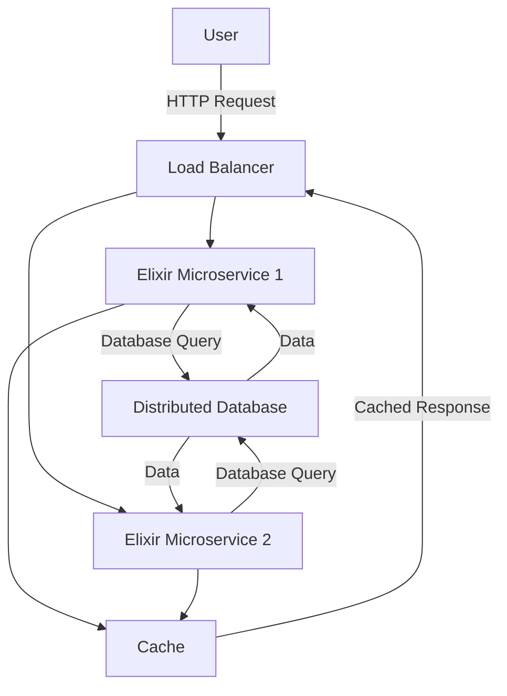

## 20.10. Cloud-Native Applications with Elixir

### Introduction

Cloud-native applications are designed to leverage the advantages of cloud computing, offering scalability, resilience, and flexibility. Elixir, with its concurrency model and fault-tolerance features, is well-suited for building cloud-native applications. In this chapter, we will explore the design principles, containerization, and orchestration techniques that are essential for developing robust cloud-native applications using Elixir.

### Design Principles

Building cloud-native applications involves adhering to specific design principles that optimize for cloud environments. These principles ensure that applications can scale efficiently, recover from failures, and adapt to changing demands.

#### Microservices Architecture

**Explain** the microservices architecture, which involves decomposing applications into small, independent services that communicate over a network. Each service is responsible for a specific business capability, promoting modularity and ease of deployment.

**Demonstrate** how Elixir's lightweight processes and message-passing capabilities make it an excellent choice for implementing microservices.

#### Scalability and Resilience

**Provide** insights into designing Elixir applications that can scale horizontally by adding more instances. Discuss the importance of statelessness in services to facilitate scaling and the use of distributed databases for state management.

**Include** strategies for achieving resilience, such as using Elixir's OTP (Open Telecom Platform) to create fault-tolerant systems that can self-heal from failures.

#### Continuous Integration and Continuous Deployment (CI/CD)

**Explain** the importance of CI/CD pipelines in cloud-native development. These pipelines automate the process of testing, building, and deploying applications, ensuring that changes can be delivered quickly and reliably.

**Demonstrate** how to integrate Elixir applications with popular CI/CD tools such as Jenkins, GitHub Actions, or GitLab CI.

### Containerization

Containerization is a key aspect of cloud-native development, providing consistency across different environments and simplifying deployment.

#### Dockerizing Elixir Applications

**Explain** the benefits of containerizing Elixir applications using Docker. Containers encapsulate the application and its dependencies, ensuring that it runs consistently regardless of the environment.

**Provide** a step-by-step guide to creating a Dockerfile for an Elixir application:

```dockerfile
# Use the official Elixir image
FROM elixir:1.13

# Set the working directory
WORKDIR /app

# Install Hex package manager
RUN mix local.hex --force

# Install Rebar
RUN mix local.rebar --force

# Copy the application code
COPY . .

# Install dependencies
RUN mix deps.get

# Compile the application
RUN mix compile

# Expose the application port
EXPOSE 4000

# Start the application
CMD ["mix", "phx.server"]
```

**Highlight** key lines in the Dockerfile, such as installing Hex and Rebar, which are essential for managing Elixir dependencies.

#### Try It Yourself

Encourage readers to experiment by modifying the Dockerfile to include additional tools or configurations specific to their application.

### Orchestration

Orchestration tools like Kubernetes and Nomad are crucial for managing containerized applications in a cloud-native environment. They handle tasks such as scaling, networking, and resource allocation.

#### Managing Containers with Kubernetes

**Explain** the role of Kubernetes in orchestrating containerized applications. Kubernetes automates the deployment, scaling, and management of containerized applications, making it easier to maintain complex systems.

**Provide** an example of a Kubernetes deployment configuration for an Elixir application:

```yaml
apiVersion: apps/v1
kind: Deployment
metadata:
  name: elixir-app
spec:
  replicas: 3
  selector:
    matchLabels:
      app: elixir-app
  template:
    metadata:
      labels:
        app: elixir-app
    spec:
      containers:
      - name: elixir-app
        image: elixir-app:latest
        ports:
        - containerPort: 4000
```

**Highlight** the importance of specifying replicas for scaling and using labels for organizing and managing resources.

#### Using Nomad for Orchestration

**Introduce** Nomad as an alternative to Kubernetes for orchestrating containerized applications. Nomad is a simpler, more flexible orchestration tool that can manage both containerized and non-containerized applications.

**Demonstrate** how to define a Nomad job for an Elixir application:

```hcl
job "elixir-app" {
  datacenters = ["dc1"]

  group "web" {
    count = 3

    task "server" {
      driver = "docker"

      config {
        image = "elixir-app:latest"
        port_map {
          http = 4000
        }
      }

      resources {
        cpu    = 500
        memory = 256
      }

      service {
        name = "elixir-app"
        port = "http"
      }
    }
  }
}
```

**Explain** the configuration, emphasizing the flexibility of Nomad in managing resources and services.

### Visualizing Cloud-Native Architecture

**Provide** a visual representation of a cloud-native architecture using Elixir, Docker, and Kubernetes. The diagram should illustrate the flow of data and interactions between microservices, containers, and orchestration tools.


```mermaid
graph TD;
  A[User] -->|HTTP Request| B[Load Balancer];
  B --> C[Elixir Microservice 1];
  B --> D[Elixir Microservice 2];
  C -->|Database Query| E[Distributed Database];
  D -->|Database Query| E;
  C --> F[Cache];
  D --> F;
  F -->|Cached Response| B;
  E -->|Data| C;
  E -->|Data| D;
```

**Caption**: Diagram illustrating a cloud-native architecture with Elixir microservices, Docker containers, and Kubernetes orchestration.

### References and Links

- [Docker Documentation](https://docs.docker.com/)
- [Kubernetes Documentation](https://kubernetes.io/docs/)
- [Nomad Documentation](https://www.nomadproject.io/docs)

### Knowledge Check

- **Pose** questions to engage readers, such as: "What are the benefits of using containers in cloud-native applications?"
- **Include** exercises, such as deploying a simple Elixir application using Docker and Kubernetes.

### Embrace the Journey

Remember, building cloud-native applications is a journey. As you progress, you'll encounter new challenges and opportunities to optimize your systems. Keep experimenting, stay curious, and enjoy the journey!

### Quiz Time!



### What is a key benefit of using microservices architecture in cloud-native applications?

- [x] Modularity and ease of deployment
- [ ] Increased complexity
- [ ] Reduced scalability
- [ ] Higher costs

> **Explanation:** Microservices architecture promotes modularity and ease of deployment by decomposing applications into independent services.

### Which tool is commonly used for containerizing Elixir applications?

- [x] Docker
- [ ] Kubernetes
- [ ] Nomad
- [ ] Jenkins

> **Explanation:** Docker is commonly used for containerizing applications, providing consistency across environments.

### What is the role of Kubernetes in cloud-native applications?

- [x] Automating deployment, scaling, and management of containers
- [ ] Writing application code
- [ ] Managing databases
- [ ] Designing user interfaces

> **Explanation:** Kubernetes automates the deployment, scaling, and management of containerized applications.

### In a Dockerfile, what is the purpose of the `EXPOSE` command?

- [x] To specify the port on which the application will run
- [ ] To install dependencies
- [ ] To set environment variables
- [ ] To start the application

> **Explanation:** The `EXPOSE` command specifies the port on which the application will run inside the container.

### What is a key feature of Nomad compared to Kubernetes?

- [x] Simplicity and flexibility
- [ ] More complex configuration
- [ ] Limited scalability
- [ ] Exclusive support for containerized applications

> **Explanation:** Nomad is known for its simplicity and flexibility, supporting both containerized and non-containerized applications.

### Which Elixir feature is particularly useful for building fault-tolerant systems?

- [x] OTP (Open Telecom Platform)
- [ ] Pattern matching
- [ ] The pipe operator
- [ ] Macros

> **Explanation:** OTP provides tools for building fault-tolerant systems, such as supervisors and GenServers.

### What is a benefit of using CI/CD pipelines in cloud-native development?

- [x] Automating testing, building, and deployment
- [ ] Increasing manual intervention
- [ ] Reducing code quality
- [ ] Slowing down release cycles

> **Explanation:** CI/CD pipelines automate testing, building, and deployment, ensuring quick and reliable delivery of changes.

### What is the purpose of using a load balancer in a cloud-native architecture?

- [x] To distribute incoming traffic across multiple instances
- [ ] To store application data
- [ ] To compile application code
- [ ] To manage user authentication

> **Explanation:** A load balancer distributes incoming traffic across multiple instances, ensuring availability and reliability.

### Which command in a Dockerfile is used to install Elixir dependencies?

- [x] RUN mix deps.get
- [ ] COPY .
- [ ] CMD ["mix", "phx.server"]
- [ ] WORKDIR /app

> **Explanation:** `RUN mix deps.get` is used to install Elixir dependencies in a Dockerfile.

### True or False: Cloud-native applications are designed to leverage the advantages of cloud computing.

- [x] True
- [ ] False

> **Explanation:** Cloud-native applications are specifically designed to leverage the advantages of cloud computing, such as scalability and resilience.


