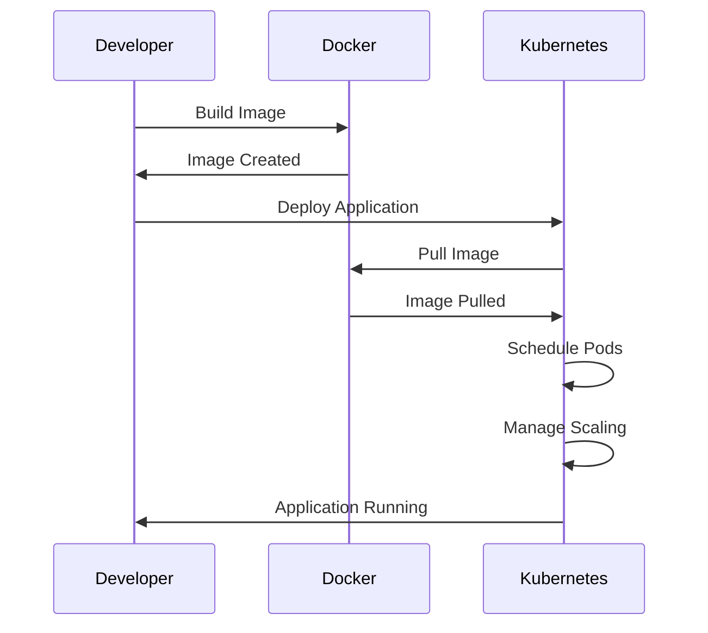

## 20.11. Containerization and Orchestration (Docker, Kubernetes)

As we delve into the realm of containerization and orchestration, we focus on leveraging Docker and Kubernetes to enhance the deployment and management of Elixir applications. This section will guide you through the essentials of creating and managing container images, orchestrating containers with Kubernetes, and addressing Elixir-specific considerations for distributed systems.

### Docker Basics

Docker is a platform that enables developers to package applications into containers—standardized executable components that combine application source code with the operating system libraries and dependencies required to run that code in any environment. Let's explore the core concepts of Docker and how they apply to Elixir applications.

#### Creating and Managing Container Images

Docker images are the blueprint of containers. They encapsulate everything needed to run an application, including the code, runtime, libraries, and environment variables. Here's how you can create and manage Docker images for your Elixir applications:

1. **Dockerfile**: The Dockerfile is a script containing a series of instructions on how to build a Docker image. Here's a basic Dockerfile for an Elixir application:

    ```dockerfile
    # Use the official Elixir image as a base
    FROM elixir:1.14

    # Set the working directory
    WORKDIR /app

    # Copy the mix.exs and mix.lock files
    COPY mix.exs mix.lock ./

    # Install dependencies
    RUN mix do deps.get, deps.compile

    # Copy the application source code
    COPY . .

    # Compile the application
    RUN mix compile

    # Expose the port the app runs on
    EXPOSE 4000

    # Start the application
    CMD ["mix", "phx.server"]
    ```

    - **FROM**: Specifies the base image to use.
    - **WORKDIR**: Sets the working directory inside the container.
    - **COPY**: Copies files from the host to the container.
    - **RUN**: Executes commands in the container.
    - **EXPOSE**: Informs Docker that the container listens on the specified network ports.
    - **CMD**: Provides the default command to run when the container starts.

2. **Building the Image**: Use the `docker build` command to create an image from the Dockerfile.

    ```bash
    docker build -t my_elixir_app .
    ```

3. **Running Containers**: Once the image is built, you can run it as a container using the `docker run` command.

    ```bash
    docker run -p 4000:4000 my_elixir_app
    ```

    - **-p**: Maps a port on the host to a port on the container.

4. **Managing Images and Containers**: Use `docker images` to list images and `docker ps` to list running containers. Use `docker stop` and `docker rm` to stop and remove containers, respectively.

#### Try It Yourself

Experiment with the Dockerfile by modifying the base image or adding additional dependencies. Observe how these changes affect the build and run process.

### Orchestrating Containers

While Docker is excellent for managing individual containers, Kubernetes is the go-to solution for orchestrating containers at scale. Kubernetes automates deployment, scaling, and management of containerized applications.

#### Automating Deployment, Scaling, and Management with Kubernetes

Kubernetes provides a robust framework for running distributed systems resiliently. It takes care of scaling and failover for your application, provides deployment patterns, and more. Let's explore how Kubernetes can be used to manage Elixir applications.

1. **Kubernetes Architecture**: At its core, Kubernetes consists of a master node and worker nodes. The master node manages the cluster, while worker nodes run the application containers.

    ```mermaid
    graph TD;
        A[Master Node] -->|Schedules| B[Worker Node 1];
        A -->|Schedules| C[Worker Node 2];
        A -->|Schedules| D[Worker Node 3];
        B -->|Runs| E[Pod];
        C -->|Runs| F[Pod];
        D -->|Runs| G[Pod];
    ```

    - **Master Node**: Manages the cluster and schedules workloads.
    - **Worker Nodes**: Execute workloads in the form of Pods.
    - **Pods**: The smallest deployable units in Kubernetes, which can contain one or more containers.

2. **Deploying Elixir Applications**: Use Kubernetes manifests to define the desired state of your application.

    ```yaml
    apiVersion: apps/v1
    kind: Deployment
    metadata:
      name: elixir-app
    spec:
      replicas: 3
      selector:
        matchLabels:
          app: elixir-app
      template:
        metadata:
          labels:
            app: elixir-app
        spec:
          containers:
          - name: elixir-app
            image: my_elixir_app
            ports:
            - containerPort: 4000
    ```

    - **Deployment**: Manages a set of identical Pods, ensuring the desired number of replicas are running.
    - **Replicas**: Specifies the number of Pod instances.
    - **Selector**: Matches Pods with the same labels.
    - **Template**: Defines the Pod's configuration.

3. **Scaling and Load Balancing**: Kubernetes automatically scales applications based on resource utilization and balances traffic across Pods.

4. **Service Discovery and Networking**: Kubernetes provides built-in service discovery and load balancing, allowing Pods to communicate with each other seamlessly.

#### Try It Yourself

Modify the number of replicas in the Kubernetes manifest and observe how Kubernetes scales the application. Experiment with different configurations to understand how Kubernetes manages resources.

### Elixir-Specific Considerations

Elixir applications, especially those using the Erlang VM, have unique considerations when running in a containerized environment. Let's explore these considerations and how to address them.

#### Handling Distributed Erlang Clusters within Containers

Elixir applications often run as distributed systems, leveraging the Erlang VM's capabilities. When deploying such applications in containers, consider the following:

1. **Node Naming and Clustering**: Ensure that each containerized instance of your application has a unique node name and can communicate with other nodes in the cluster.

    ```elixir
    # Set the node name and cookie for clustering
    config :my_app, MyApp.Endpoint,
      http: [port: 4000],
      url: [host: "localhost"],
      secret_key_base: "SECRET_KEY_BASE",
      server: true

    config :my_app, :node,
      name: "my_app@127.0.0.1",
      cookie: "SECRET_COOKIE"
    ```

2. **Service Discovery**: Use Kubernetes services to facilitate service discovery between nodes. This can be achieved by configuring the application to use Kubernetes DNS for node discovery.

3. **Networking**: Ensure that the network configuration allows for communication between nodes. This may involve configuring Kubernetes network policies or using a service mesh.

4. **Stateful Applications**: If your application maintains state, consider using StatefulSets in Kubernetes to manage stateful workloads.

#### Try It Yourself

Experiment with different node configurations and observe how they affect clustering. Test the application's ability to discover and communicate with other nodes in the cluster.

### Best Practices

To ensure the successful deployment and operation of Elixir applications in a containerized environment, follow these best practices:

#### Configuring Networking, Environment Variables, Persistent Storage

1. **Networking**: Configure Kubernetes network policies to secure communication between Pods. Consider using a service mesh for advanced networking features.

2. **Environment Variables**: Use Kubernetes ConfigMaps and Secrets to manage environment variables and sensitive information.

3. **Persistent Storage**: Use Kubernetes Persistent Volumes and Persistent Volume Claims to manage persistent storage for your applications.

4. **Monitoring and Logging**: Implement monitoring and logging solutions to gain insights into application performance and troubleshoot issues.

5. **Security**: Follow security best practices, such as running containers with the least privilege and regularly updating images.

#### Try It Yourself

Implement a monitoring solution for your Kubernetes cluster and observe the metrics collected. Experiment with different storage configurations to understand how Kubernetes manages persistent data.

### Visualizing Containerization and Orchestration

To better understand the flow of containerization and orchestration, let's visualize the process using a sequence diagram.



This diagram illustrates the interaction between the developer, Docker, and Kubernetes during the deployment process.

### References and Links

- [Docker Documentation](https://docs.docker.com/)
- [Kubernetes Documentation](https://kubernetes.io/docs/)
- [Elixir and Docker](https://hexdocs.pm/elixir/docker.html)
- [Kubernetes for Elixir Developers](https://elixir-lang.org/blog/2019/01/30/kubernetes-for-elixir-developers/)

### Knowledge Check

- What are the key components of a Dockerfile?
- How does Kubernetes manage scaling and load balancing?
- What are the unique considerations for running Elixir applications in containers?

### Embrace the Journey

As you explore containerization and orchestration, remember that this is just the beginning. The skills you develop here will empower you to build scalable, resilient applications. Keep experimenting, stay curious, and enjoy the journey!

## Quiz: Containerization and Orchestration (Docker, Kubernetes)



### What is the primary purpose of a Dockerfile?

- [x] To define the steps to build a Docker image
- [ ] To run a Docker container
- [ ] To manage Kubernetes deployments
- [ ] To configure network settings

> **Explanation:** A Dockerfile contains instructions to build a Docker image, specifying the base image, dependencies, and commands to run.

### How does Kubernetes ensure high availability of applications?

- [x] By managing replicas of Pods
- [ ] By using Docker Compose
- [ ] By running applications on a single node
- [ ] By disabling network policies

> **Explanation:** Kubernetes uses Deployments to manage replicas of Pods, ensuring that the desired number of instances are running for high availability.

### What is a Pod in Kubernetes?

- [x] The smallest deployable unit that can contain one or more containers
- [ ] A virtual machine
- [ ] A Docker image
- [ ] A network policy

> **Explanation:** A Pod is the smallest deployable unit in Kubernetes, which can contain one or more containers that share resources.

### Which Kubernetes resource is used to manage stateful applications?

- [x] StatefulSet
- [ ] Deployment
- [ ] ConfigMap
- [ ] Secret

> **Explanation:** StatefulSets are used to manage stateful applications, providing unique identities and stable storage.

### What is the role of Kubernetes Services?

- [x] To provide service discovery and load balancing
- [ ] To build Docker images
- [ ] To manage Kubernetes nodes
- [ ] To configure network policies

> **Explanation:** Kubernetes Services provide service discovery and load balancing, allowing Pods to communicate with each other.

### How can you manage environment variables in Kubernetes?

- [x] Using ConfigMaps and Secrets
- [ ] Using Dockerfiles
- [ ] Using StatefulSets
- [ ] Using Pods

> **Explanation:** ConfigMaps and Secrets are used to manage environment variables and sensitive information in Kubernetes.

### What is the purpose of the `EXPOSE` instruction in a Dockerfile?

- [x] To inform Docker about the network ports the container listens on
- [ ] To run a command in the container
- [ ] To copy files into the container
- [ ] To set environment variables

> **Explanation:** The `EXPOSE` instruction informs Docker about the network ports the container listens on, facilitating communication.

### How does Kubernetes handle scaling of applications?

- [x] By adjusting the number of Pod replicas
- [ ] By modifying Docker images
- [ ] By changing network policies
- [ ] By updating environment variables

> **Explanation:** Kubernetes handles scaling by adjusting the number of Pod replicas based on resource utilization.

### What is the function of a Kubernetes Deployment?

- [x] To manage a set of identical Pods
- [ ] To build Docker images
- [ ] To configure network settings
- [ ] To manage environment variables

> **Explanation:** A Kubernetes Deployment manages a set of identical Pods, ensuring the desired number of replicas are running.

### True or False: Docker and Kubernetes can be used together to deploy and manage applications.

- [x] True
- [ ] False

> **Explanation:** Docker and Kubernetes are often used together, with Docker providing containerization and Kubernetes managing orchestration.




