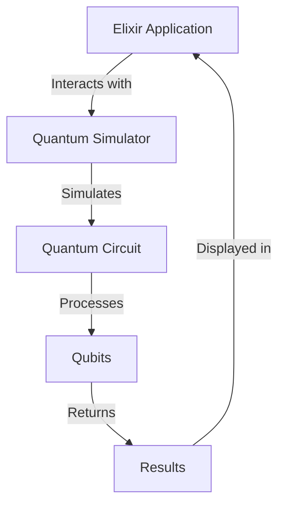

## 20.12. Quantum Computing and Elixir

As we stand on the cusp of a new era in computing, quantum computing promises to revolutionize the way we solve complex problems. Elixir, with its robust concurrency model and functional programming paradigm, offers unique opportunities to interface with this emerging technology. In this section, we will delve into the principles of quantum computing, explore how Elixir can integrate with quantum systems, and consider the potential for future applications and experimentation.

### Overview of Quantum Computing

Quantum computing is a transformative technology that leverages the principles of quantum mechanics to process information in fundamentally different ways than classical computers. Let's explore the core principles and potential impacts of quantum computing.

#### Principles of Quantum Computing

1. **Qubits and Superposition**: Unlike classical bits, which can be either 0 or 1, qubits can exist in a superposition of states, representing both 0 and 1 simultaneously. This property enables quantum computers to process a vast amount of information in parallel.

2. **Entanglement**: Qubits can be entangled, meaning the state of one qubit is directly related to the state of another, regardless of distance. This phenomenon allows for complex correlations and faster information processing.

3. **Quantum Gates and Circuits**: Quantum gates manipulate qubits through operations that change their state. Quantum circuits, composed of these gates, perform computations by transforming input qubits into output qubits.

4. **Quantum Interference**: Quantum algorithms exploit interference to amplify correct solutions and cancel out incorrect ones, enhancing computational efficiency.

#### Potential Impacts of Quantum Computing

- **Cryptography**: Quantum computers could break current cryptographic systems, necessitating new quantum-resistant algorithms.
- **Optimization**: Problems in logistics, finance, and manufacturing could be solved more efficiently with quantum algorithms.
- **Drug Discovery**: Quantum simulations could model complex molecular interactions, accelerating drug development.
- **Artificial Intelligence**: Quantum computing could enhance machine learning algorithms, leading to more powerful AI systems.

### Elixir Integration

Elixir, known for its scalability and fault tolerance, can play a pivotal role in interfacing with quantum computing systems. Let's explore how Elixir can be integrated with quantum simulators or hardware.

#### Exploring Interfaces to Quantum Simulators or Hardware

1. **Quantum Simulators**: Quantum simulators emulate quantum systems on classical computers, allowing developers to experiment with quantum algorithms. Elixir can interact with these simulators through APIs and libraries.

2. **Quantum Hardware**: As quantum hardware becomes more accessible, Elixir can interface with quantum processors using specialized protocols and communication channels.

3. **Libraries and Tools**: Several libraries and tools facilitate the integration of Elixir with quantum systems. For example, the `Qiskit` library, developed by IBM, provides a Python interface to quantum simulators and hardware. Elixir can interact with `Qiskit` through ports or NIFs (Native Implemented Functions).

#### Code Example: Interfacing Elixir with a Quantum Simulator

Let's consider a simple example of using Elixir to interface with a quantum simulator. We'll use a Python script to simulate a quantum circuit and call it from Elixir.

```elixir
# Elixir code to call a Python script using Ports

defmodule QuantumSimulator do
  def run_simulation do
    port = Port.open({:spawn, "python3 quantum_simulator.py"}, [:binary])
    send(port, {self(), {:command, "run"}})
    receive do
      {^port, {:data, result}} ->
        IO.puts("Simulation Result: #{result}")
    end
  end
end

# Python script (quantum_simulator.py) to simulate a quantum circuit

import qiskit

def run_simulation():
    # Create a quantum circuit with 2 qubits
    circuit = qiskit.QuantumCircuit(2)
    circuit.h(0)  # Apply Hadamard gate to the first qubit
    circuit.cx(0, 1)  # Apply CNOT gate

    # Simulate the circuit
    simulator = qiskit.Aer.get_backend('statevector_simulator')
    result = qiskit.execute(circuit, simulator).result()
    statevector = result.get_statevector()

    print(statevector)

if __name__ == "__main__":
    run_simulation()
```

In this example, the Elixir module `QuantumSimulator` uses a port to execute a Python script that simulates a quantum circuit. The Python script uses `Qiskit` to create and simulate a simple quantum circuit, printing the resulting state vector.

### Research and Development

The intersection of quantum computing and Elixir opens up exciting possibilities for research and development. Let's explore the potential for future applications and experimentation.

#### Potential for Future Applications and Experimentation

1. **Quantum Algorithms**: As quantum algorithms evolve, Elixir can serve as a platform for developing and testing new quantum solutions. Researchers can leverage Elixir's concurrency model to manage complex quantum computations.

2. **Hybrid Systems**: Combining classical and quantum computing resources can lead to hybrid systems that capitalize on the strengths of both paradigms. Elixir can orchestrate these systems, managing communication and data flow between classical and quantum components.

3. **Quantum Cryptography**: Elixir can play a role in developing quantum-resistant cryptographic protocols, ensuring secure communication in a quantum-enabled world.

4. **Educational Tools**: Elixir's simplicity and expressiveness make it an ideal language for creating educational tools that introduce developers to quantum computing concepts.

#### Diagram: Visualizing Quantum Computing and Elixir Integration



This diagram illustrates the interaction between an Elixir application and a quantum simulator. The Elixir application sends commands to the simulator, which processes qubits through a quantum circuit and returns results to the application.

### Conclusion

Quantum computing represents a paradigm shift in how we approach complex computational problems. By integrating Elixir with quantum systems, we can harness the power of both technologies to explore new frontiers in computing. As quantum hardware becomes more accessible and quantum algorithms continue to evolve, Elixir's role in this emerging field will undoubtedly expand.

Remember, this is just the beginning. As you explore the intersection of quantum computing and Elixir, keep experimenting, stay curious, and enjoy the journey!

## Quiz: Quantum Computing and Elixir



### What is a qubit?

- [x] A quantum bit that can exist in superposition
- [ ] A classical bit that can be either 0 or 1
- [ ] A type of quantum gate
- [ ] A unit of quantum entanglement

> **Explanation:** A qubit is a quantum bit that can exist in a superposition of states, representing both 0 and 1 simultaneously.

### What is the role of entanglement in quantum computing?

- [x] It allows qubits to be correlated regardless of distance
- [ ] It is used to measure qubits
- [ ] It is a type of quantum gate
- [ ] It is a method for error correction

> **Explanation:** Entanglement allows qubits to be correlated in such a way that the state of one qubit is directly related to the state of another, regardless of distance.

### How does Elixir interact with quantum simulators?

- [x] Through APIs and libraries
- [ ] By directly manipulating qubits
- [ ] By using quantum gates
- [ ] By simulating quantum circuits natively

> **Explanation:** Elixir interacts with quantum simulators through APIs and libraries, allowing developers to experiment with quantum algorithms.

### What is the purpose of quantum gates?

- [x] To manipulate qubits and change their state
- [ ] To measure the state of qubits
- [ ] To entangle qubits
- [ ] To create classical circuits

> **Explanation:** Quantum gates are used to manipulate qubits, changing their state and performing computations.

### What is a potential application of quantum computing?

- [x] Drug discovery
- [ ] Word processing
- [ ] Web development
- [ ] Image editing

> **Explanation:** Quantum computing can be used in drug discovery to model complex molecular interactions and accelerate development.

### How can Elixir contribute to quantum cryptography?

- [x] By developing quantum-resistant protocols
- [ ] By breaking classical encryption
- [ ] By simulating quantum circuits
- [ ] By measuring qubits

> **Explanation:** Elixir can contribute to quantum cryptography by developing quantum-resistant cryptographic protocols.

### What is the significance of the Hadamard gate in quantum circuits?

- [x] It creates superposition in qubits
- [ ] It measures qubits
- [ ] It entangles qubits
- [ ] It resets qubits to 0

> **Explanation:** The Hadamard gate is used to create superposition in qubits, allowing them to represent both 0 and 1 simultaneously.

### What is the role of Elixir in hybrid computing systems?

- [x] To orchestrate communication between classical and quantum components
- [ ] To simulate quantum circuits
- [ ] To measure qubits
- [ ] To create quantum gates

> **Explanation:** Elixir can orchestrate communication and data flow between classical and quantum components in hybrid computing systems.

### What is the primary advantage of quantum computing over classical computing?

- [x] Parallel processing of vast amounts of information
- [ ] Faster execution of classical algorithms
- [ ] Simpler programming models
- [ ] Lower energy consumption

> **Explanation:** Quantum computing's primary advantage is its ability to process vast amounts of information in parallel through superposition and entanglement.

### True or False: Elixir can natively simulate quantum circuits.

- [ ] True
- [x] False

> **Explanation:** Elixir cannot natively simulate quantum circuits; it interacts with quantum simulators through APIs and libraries.


