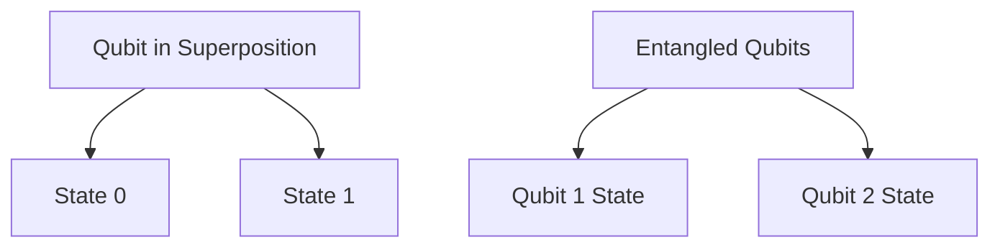
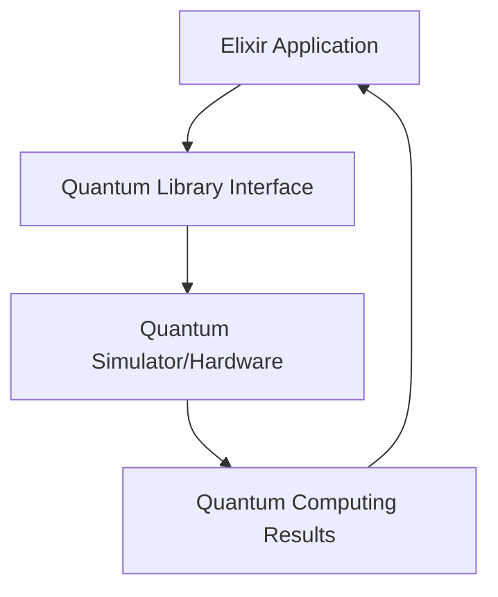

## 20.12. Quantum Computing and Elixir

As we stand on the brink of a new era in computing, quantum computing promises to revolutionize the way we solve complex problems. While classical computers rely on bits as the smallest unit of data, quantum computers use quantum bits, or qubits, which can exist in multiple states simultaneously. This unique property, along with entanglement and superposition, allows quantum computers to perform certain calculations exponentially faster than their classical counterparts.

In this section, we will explore the principles of quantum computing, discuss how Elixir can be integrated with quantum technologies, and examine the potential for future applications and experimentation. Whether you're an expert in Elixir or new to quantum computing, this guide will provide you with the tools and knowledge to navigate this exciting field.

### Overview of Quantum Computing

#### Principles and Potential Impacts

Quantum computing is built on the principles of quantum mechanics, a branch of physics that describes the behavior of matter and energy at the smallest scales. The key principles of quantum computing include:

- **Superposition**: Unlike classical bits, which are either 0 or 1, qubits can exist in a superposition of states, representing both 0 and 1 simultaneously. This allows quantum computers to process a vast amount of information at once.

- **Entanglement**: Qubits can become entangled, meaning the state of one qubit is dependent on the state of another, no matter the distance between them. This property enables quantum computers to perform complex calculations more efficiently.

- **Quantum Interference**: Quantum algorithms leverage interference to amplify correct solutions and cancel out incorrect ones, enhancing the probability of arriving at the right answer.

The potential impacts of quantum computing are immense, with applications spanning various fields such as cryptography, optimization, drug discovery, and artificial intelligence. Quantum computers could break current cryptographic systems, optimize complex systems like supply chains, and simulate molecular interactions for drug development.

#### Visualizing Quantum Computing Concepts

To better understand these principles, let's visualize the concept of superposition and entanglement using a simple diagram.


```mermaid
graph TD;
    A[Qubit in Superposition] --> B[State 0]
    A --> C[State 1]
    D[Entangled Qubits] --> E[Qubit 1 State]
    D --> F[Qubit 2 State]
```

**Figure 1**: Visualization of Superposition and Entanglement in Quantum Computing.

### Elixir Integration

#### Exploring Interfaces to Quantum Simulators or Hardware

Elixir, known for its concurrency and fault-tolerance capabilities, is a functional programming language that can be integrated with quantum technologies to create powerful applications. While Elixir is not inherently designed for quantum computing, it can interface with quantum simulators and hardware through various methods:

1. **Using Quantum Libraries**: There are several quantum computing libraries available in other programming languages, such as Python's Qiskit and Microsoft's Quantum Development Kit. Elixir can interact with these libraries through ports or NIFs (Native Implemented Functions), allowing developers to leverage quantum algorithms within Elixir applications.

2. **Quantum Simulators**: Quantum simulators mimic the behavior of quantum computers and are useful for testing and developing quantum algorithms. Elixir can interface with these simulators to experiment with quantum computing concepts.

3. **Cloud-Based Quantum Services**: Companies like IBM and Google offer cloud-based quantum computing services. Elixir applications can access these services through APIs, enabling developers to run quantum algorithms on real quantum hardware.

#### Sample Code Snippet: Interfacing with a Quantum Simulator

Let's explore a simple example of how Elixir can interface with a quantum simulator using Python's Qiskit library. We'll use Elixir's `:os.cmd/1` function to execute a Python script that simulates a quantum circuit.

```elixir
defmodule QuantumSimulator do
  def run_circuit do
    # Define the Python script to run
    python_script = """
    from qiskit import QuantumCircuit, Aer, execute

    # Create a Quantum Circuit with 1 qubit
    qc = QuantumCircuit(1)

    # Apply a Hadamard gate to put the qubit in superposition
    qc.h(0)

    # Measure the qubit
    qc.measure_all()

    # Execute the circuit on a simulator
    simulator = Aer.get_backend('qasm_simulator')
    result = execute(qc, simulator, shots=1024).result()

    # Print the result
    print(result.get_counts(qc))
    """

    # Run the Python script using Elixir's :os.cmd/1
    result = :os.cmd('python3 -c "#{python_script}"')
    IO.puts("Quantum Circuit Result: #{result}")
  end
end

# Run the quantum circuit simulation
QuantumSimulator.run_circuit()
```

**Explanation**: This Elixir module defines a function `run_circuit` that creates a quantum circuit using Qiskit. The circuit applies a Hadamard gate to a single qubit, putting it in superposition, and then measures the qubit. The result is printed to the console.

**Try It Yourself**: Modify the Python script to add more qubits or apply different quantum gates. Observe how the results change and experiment with different quantum circuits.

### Research and Development

#### Potential for Future Applications and Experimentation

Quantum computing is still in its infancy, but the potential for future applications is vast. As quantum hardware and algorithms continue to evolve, Elixir developers can play a crucial role in exploring new possibilities and pushing the boundaries of what is possible. Here are some areas where Elixir and quantum computing could intersect:

- **Optimization Problems**: Quantum computers excel at solving optimization problems, such as finding the shortest path in a network or optimizing resource allocation. Elixir's concurrency model can complement quantum algorithms to tackle these challenges efficiently.

- **Cryptography**: Quantum computing poses a threat to current cryptographic systems, but it also offers opportunities for developing new, quantum-resistant encryption methods. Elixir can be used to implement and test these novel cryptographic techniques.

- **Machine Learning**: Quantum machine learning is an emerging field that combines quantum computing with machine learning algorithms. Elixir's functional programming paradigm can be leveraged to create scalable and efficient quantum machine learning applications.

- **Scientific Research**: Quantum simulations can model complex systems in physics, chemistry, and biology. Elixir can interface with quantum simulators to assist researchers in conducting experiments and analyzing data.

#### Visualizing Quantum Computing and Elixir Integration

To illustrate the integration of Elixir with quantum computing, let's visualize a high-level architecture of a quantum-enabled Elixir application.


```mermaid
flowchart TD;
    A[Elixir Application] --> B[Quantum Library Interface]
    B --> C[Quantum Simulator/Hardware]
    C --> D[Quantum Computing Results]
    D --> A
```

**Figure 2**: High-Level Architecture of a Quantum-Enabled Elixir Application.

### Conclusion

As we have explored, quantum computing and Elixir offer a powerful combination for tackling complex problems and exploring new frontiers in technology. By leveraging Elixir's concurrency model and interfacing with quantum simulators and hardware, developers can create innovative applications that harness the power of quantum computing.

Remember, this is just the beginning. As quantum computing technology advances, the possibilities for Elixir developers will continue to expand. Keep experimenting, stay curious, and enjoy the journey!

---

## Quiz Time!



### What is superposition in quantum computing?

- [x] A qubit's ability to exist in multiple states simultaneously
- [ ] A qubit's ability to communicate with other qubits
- [ ] A qubit's ability to be in a single state at a time
- [ ] A qubit's ability to perform calculations

> **Explanation:** Superposition allows qubits to exist in multiple states at once, enabling quantum computers to process more information simultaneously.

### How can Elixir interface with quantum computing libraries?

- [x] Through ports or NIFs
- [ ] By directly executing quantum algorithms
- [ ] By converting Elixir code to quantum code
- [ ] By using Elixir's built-in quantum functions

> **Explanation:** Elixir can interface with quantum computing libraries through ports or NIFs, allowing it to leverage quantum algorithms.

### What is entanglement in quantum computing?

- [x] A phenomenon where qubits are interconnected and the state of one affects the other
- [ ] A process of measuring qubits
- [ ] A method of encoding information in qubits
- [ ] A technique for optimizing quantum circuits

> **Explanation:** Entanglement is a unique quantum phenomenon where qubits are interconnected, affecting each other's states.

### Which company offers cloud-based quantum computing services?

- [x] IBM
- [ ] Google
- [ ] Microsoft
- [ ] Amazon

> **Explanation:** IBM offers cloud-based quantum computing services that developers can access through APIs.

### What is the potential impact of quantum computing on cryptography?

- [x] It could break current cryptographic systems
- [ ] It will make cryptography obsolete
- [ ] It will have no impact on cryptography
- [ ] It will enhance current cryptographic systems

> **Explanation:** Quantum computing has the potential to break current cryptographic systems by solving complex problems faster.

### What is the role of Elixir in quantum machine learning?

- [x] To create scalable and efficient applications
- [ ] To replace quantum algorithms
- [ ] To simulate quantum hardware
- [ ] To perform quantum measurements

> **Explanation:** Elixir's functional programming paradigm can be leveraged to create scalable and efficient quantum machine learning applications.

### What is a quantum simulator?

- [x] A tool that mimics the behavior of quantum computers
- [ ] A device that performs quantum measurements
- [ ] A library for writing quantum algorithms
- [ ] A hardware component of quantum computers

> **Explanation:** Quantum simulators are tools that mimic the behavior of quantum computers, useful for testing and developing algorithms.

### How does quantum interference enhance quantum algorithms?

- [x] By amplifying correct solutions and canceling out incorrect ones
- [ ] By increasing the speed of calculations
- [ ] By reducing the number of qubits needed
- [ ] By simplifying quantum circuits

> **Explanation:** Quantum interference enhances algorithms by amplifying correct solutions and canceling out incorrect ones, improving accuracy.

### What is the primary benefit of using Elixir with quantum computing?

- [x] Leveraging Elixir's concurrency model
- [ ] Directly executing quantum algorithms
- [ ] Converting Elixir code to quantum code
- [ ] Using Elixir's built-in quantum functions

> **Explanation:** Elixir's concurrency model complements quantum algorithms, making it beneficial for quantum computing applications.

### Quantum computing is still in its infancy, but the potential for future applications is vast.

- [x] True
- [ ] False

> **Explanation:** Quantum computing is an emerging field with immense potential for future applications across various industries.



---
