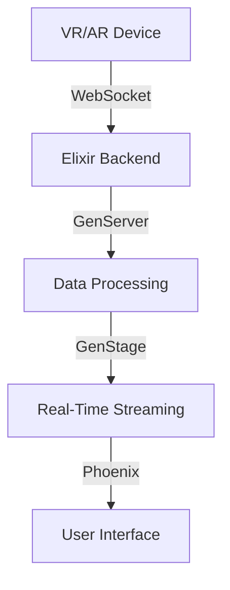

## 20.13. Elixir in Virtual and Augmented Reality

As we delve into the realm of Virtual Reality (VR) and Augmented Reality (AR), the role of backend technologies becomes increasingly crucial. Elixir, with its robust concurrency model and fault-tolerant design, is uniquely positioned to manage the backend services that power these immersive experiences. In this section, we will explore how Elixir facilitates real-time data streaming, supports multiplayer gaming and collaborative environments, and integrates with VR/AR technologies to create seamless and interactive applications.

### Understanding the Role of Elixir in VR/AR

Virtual and Augmented Reality applications require a backend that can handle high volumes of data with minimal latency. Elixir's strengths in concurrency, scalability, and fault tolerance make it an ideal choice for managing these backend services. Let's explore the key roles Elixir plays in VR/AR:

#### Managing Backend Services for Immersive Experiences

Elixir's ability to manage thousands of concurrent connections makes it perfect for VR/AR applications that require real-time data processing. Whether it's a multiplayer game or a collaborative virtual workspace, Elixir can handle the backend logic, ensuring that users experience smooth and uninterrupted interactions.

#### Real-Time Data Streaming

One of the most critical aspects of VR/AR applications is the ability to stream data in real-time. Elixir, with its lightweight processes and message-passing capabilities, facilitates low-latency data streaming, ensuring that users receive updates instantaneously. This is crucial for maintaining the illusion of reality in VR and enhancing the user's experience in AR.

#### Applications in Multiplayer Gaming and Collaborative Environments

Elixir's concurrency model allows developers to build scalable multiplayer gaming platforms and collaborative environments. By leveraging Elixir's OTP (Open Telecom Platform) framework, developers can create applications that support real-time interactions between multiple users, making it ideal for VR/AR applications that require a high degree of interactivity.

### Real-Time Data Streaming with Elixir

Real-time data streaming is a cornerstone of VR/AR applications. Let's explore how Elixir facilitates this process:

#### The Need for Real-Time Data in VR/AR

In VR/AR applications, real-time data streaming is essential for providing users with a seamless experience. Whether it's updating the position of a virtual object or synchronizing user actions in a multiplayer game, data must be transmitted and processed with minimal delay.

#### Leveraging Elixir's Concurrency Model

Elixir's concurrency model, based on the Actor model, allows developers to create lightweight processes that can handle multiple tasks simultaneously. This is particularly useful for VR/AR applications, where multiple data streams need to be processed in parallel.

```elixir
defmodule VRServer do
  use GenServer

  # Client API
  def start_link(initial_state) do
    GenServer.start_link(__MODULE__, initial_state, name: __MODULE__)
  end

  def update_position(pid, position) do
    GenServer.cast(pid, {:update_position, position})
  end

  # Server Callbacks
  def init(initial_state) do
    {:ok, initial_state}
  end

  def handle_cast({:update_position, position}, state) do
    # Process the position update
    new_state = Map.put(state, :position, position)
    {:noreply, new_state}
  end
end
```

In this example, we define a simple GenServer module that handles position updates for a VR application. The `update_position/2` function allows clients to send position updates to the server, which are then processed asynchronously.

#### Ensuring Low Latency with Elixir

Elixir's message-passing capabilities ensure that data is transmitted with minimal latency. By using lightweight processes and asynchronous communication, Elixir can handle high volumes of data without compromising performance.

```elixir
defmodule DataStreamer do
  use GenStage

  def start_link(initial_state) do
    GenStage.start_link(__MODULE__, initial_state, name: __MODULE__)
  end

  def init(initial_state) do
    {:producer, initial_state}
  end

  def handle_demand(demand, state) do
    events = Enum.take(state, demand)
    {:noreply, events, state}
  end
end
```

In this example, we use GenStage, a library for building data processing pipelines, to create a data streamer that produces events on demand. This ensures that data is streamed efficiently, reducing latency and improving the user experience.

### Applications in Multiplayer Gaming and Collaborative Environments

Elixir's strengths in concurrency and scalability make it an excellent choice for building multiplayer gaming platforms and collaborative environments. Let's explore how Elixir can be used to create these applications:

#### Building Multiplayer Gaming Platforms

Multiplayer games require a backend that can handle multiple players interacting in real-time. Elixir's concurrency model allows developers to create scalable gaming platforms that support thousands of concurrent players.

```elixir
defmodule GameServer do
  use GenServer

  def start_link(initial_state) do
    GenServer.start_link(__MODULE__, initial_state, name: __MODULE__)
  end

  def join_game(pid, player_id) do
    GenServer.cast(pid, {:join_game, player_id})
  end

  def handle_cast({:join_game, player_id}, state) do
    new_state = Map.update(state, :players, [player_id], fn players -> [player_id | players] end)
    {:noreply, new_state}
  end
end
```

In this example, we define a simple GenServer module that manages player interactions in a multiplayer game. The `join_game/2` function allows players to join the game, and their IDs are added to the list of active players.

#### Creating Collaborative Environments

Collaborative environments, such as virtual workspaces, require a backend that can synchronize user actions in real-time. Elixir's message-passing capabilities make it easy to build applications that support real-time collaboration.

```elixir
defmodule CollaborationServer do
  use GenServer

  def start_link(initial_state) do
    GenServer.start_link(__MODULE__, initial_state, name: __MODULE__)
  end

  def update_document(pid, changes) do
    GenServer.cast(pid, {:update_document, changes})
  end

  def handle_cast({:update_document, changes}, state) do
    new_state = apply_changes(state, changes)
    {:noreply, new_state}
  end

  defp apply_changes(state, changes) do
    # Apply the changes to the document
    Map.update(state, :document, changes, fn doc -> doc ++ changes end)
  end
end
```

In this example, we define a GenServer module that manages document updates in a collaborative environment. The `update_document/2` function allows users to send changes to the server, which are then applied to the document in real-time.

### Integrating Elixir with VR/AR Technologies

To create immersive VR/AR applications, Elixir must be integrated with various VR/AR technologies. Let's explore how this integration can be achieved:

#### Communicating with VR/AR Devices

Elixir can communicate with VR/AR devices using various protocols and libraries. For example, WebSockets can be used to establish a real-time connection between the Elixir backend and the VR/AR device.

```elixir
defmodule VRWebSocket do
  use Phoenix.Socket

  channel "vr:lobby", VRChannel

  def connect(_params, socket, _connect_info) do
    {:ok, socket}
  end

  def id(_socket), do: nil
end
```

In this example, we define a Phoenix Socket module that establishes a WebSocket connection with a VR device. The `connect/3` function is used to authenticate the connection, and the `channel/2` macro defines a channel for communication.

#### Leveraging Elixir's Ecosystem

Elixir's rich ecosystem provides various libraries and tools for integrating with VR/AR technologies. For example, the `Phoenix` framework can be used to build real-time web applications, while `Nerves` can be used to deploy Elixir applications on embedded devices.

#### Visualizing Data with Elixir

Elixir can be used to visualize data in VR/AR applications. By integrating with graphics libraries and rendering engines, Elixir can generate 3D models and visualizations that enhance the user's experience.

### Design Considerations for VR/AR Applications

When building VR/AR applications with Elixir, there are several design considerations to keep in mind:

#### Ensuring Scalability and Performance

VR/AR applications must be scalable and performant to handle large volumes of data and users. Elixir's concurrency model and lightweight processes make it easy to build scalable applications, but developers must also consider factors such as network latency and data throughput.

#### Handling Fault Tolerance and Reliability

Elixir's fault-tolerant design ensures that applications remain reliable even in the face of failures. By using OTP's supervision trees and error-handling mechanisms, developers can build applications that recover gracefully from errors and continue to function smoothly.

#### Maintaining Security and Privacy

VR/AR applications often handle sensitive user data, so security and privacy must be a top priority. Elixir provides various tools and libraries for securing applications, such as encryption libraries and authentication frameworks.

### Try It Yourself: Building a Simple VR/AR Backend with Elixir

To get hands-on experience with Elixir in VR/AR, try building a simple backend for a VR/AR application. Here are some steps to get you started:

1. **Set Up Your Elixir Environment**: Install Elixir and Phoenix on your machine and create a new Phoenix project.

2. **Create a GenServer Module**: Define a GenServer module to manage user interactions and data processing.

3. **Establish a WebSocket Connection**: Use Phoenix Sockets to establish a WebSocket connection with a VR/AR device.

4. **Implement Real-Time Data Streaming**: Use GenStage or another library to implement real-time data streaming.

5. **Test Your Application**: Test your application with a VR/AR device to ensure that data is transmitted and processed in real-time.

### Visualizing Elixir's Role in VR/AR

To better understand Elixir's role in VR/AR applications, let's visualize the architecture of a typical VR/AR backend:



**Diagram Description**: This diagram illustrates the architecture of a VR/AR backend powered by Elixir. The VR/AR device communicates with the Elixir backend via WebSockets, which manages data processing and real-time streaming using GenServer and GenStage. The processed data is then sent to the user interface via Phoenix.

### References and Further Reading

- [Elixir Official Website](https://elixir-lang.org/)
- [Phoenix Framework](https://www.phoenixframework.org/)
- [GenStage Documentation](https://hexdocs.pm/gen_stage/GenStage.html)
- [Nerves Project](https://nerves-project.org/)

### Knowledge Check

To reinforce your understanding of Elixir in VR/AR, consider the following questions:

1. How does Elixir's concurrency model benefit VR/AR applications?
2. What role does GenServer play in managing VR/AR backend services?
3. How can Elixir be integrated with VR/AR devices using WebSockets?
4. What are some design considerations for building scalable VR/AR applications with Elixir?

### Embrace the Journey

Remember, this is just the beginning. As you explore the possibilities of Elixir in VR/AR, you'll discover new ways to create immersive and interactive experiences. Keep experimenting, stay curious, and enjoy the journey!

## Quiz: Elixir in Virtual and Augmented Reality



### How does Elixir's concurrency model benefit VR/AR applications?

- [x] It allows handling multiple data streams simultaneously.
- [ ] It simplifies the user interface design.
- [ ] It reduces the need for hardware resources.
- [ ] It eliminates the need for a database.

> **Explanation:** Elixir's concurrency model, based on the Actor model, allows handling multiple data streams simultaneously, which is crucial for real-time VR/AR applications.

### What is the primary role of GenServer in VR/AR backend services?

- [x] Managing state and handling asynchronous requests.
- [ ] Rendering 3D graphics.
- [ ] Establishing network connections.
- [ ] Encrypting user data.

> **Explanation:** GenServer is used to manage state and handle asynchronous requests, making it ideal for managing backend services in VR/AR applications.

### How can Elixir be integrated with VR/AR devices?

- [x] Using WebSockets for real-time communication.
- [ ] Using HTTP for batch processing.
- [ ] Using FTP for file transfers.
- [ ] Using SMTP for email notifications.

> **Explanation:** WebSockets are used for real-time communication between Elixir backends and VR/AR devices, enabling low-latency interactions.

### What is a key design consideration for VR/AR applications built with Elixir?

- [x] Ensuring scalability and performance.
- [ ] Focusing solely on visual aesthetics.
- [ ] Minimizing code complexity at all costs.
- [ ] Avoiding the use of external libraries.

> **Explanation:** Ensuring scalability and performance is crucial for VR/AR applications to handle large volumes of data and users effectively.

### Which Elixir library is commonly used for real-time data streaming?

- [x] GenStage
- [ ] Ecto
- [ ] Plug
- [ ] ExUnit

> **Explanation:** GenStage is commonly used for building data processing pipelines and real-time data streaming in Elixir applications.

### What is the purpose of using Phoenix Sockets in VR/AR applications?

- [x] To establish real-time connections with VR/AR devices.
- [ ] To store user data in a database.
- [ ] To generate static web pages.
- [ ] To perform background tasks.

> **Explanation:** Phoenix Sockets are used to establish real-time connections with VR/AR devices, facilitating interactive communication.

### How does Elixir ensure fault tolerance in VR/AR applications?

- [x] By using OTP's supervision trees and error-handling mechanisms.
- [ ] By relying on external monitoring tools.
- [ ] By minimizing code changes.
- [ ] By using a single-threaded architecture.

> **Explanation:** Elixir ensures fault tolerance by using OTP's supervision trees and error-handling mechanisms, allowing applications to recover gracefully from errors.

### What is a common application of Elixir in VR/AR?

- [x] Multiplayer gaming platforms.
- [ ] Static website hosting.
- [ ] Email marketing campaigns.
- [ ] Spreadsheet processing.

> **Explanation:** Elixir is commonly used to build multiplayer gaming platforms due to its concurrency and scalability features.

### True or False: Elixir can be used to visualize data in VR/AR applications.

- [x] True
- [ ] False

> **Explanation:** True. Elixir can be integrated with graphics libraries and rendering engines to visualize data in VR/AR applications.

### What is the benefit of using GenStage in VR/AR applications?

- [x] It enables efficient data processing and streaming.
- [ ] It simplifies user authentication.
- [ ] It enhances data encryption.
- [ ] It reduces application size.

> **Explanation:** GenStage enables efficient data processing and streaming, which is essential for real-time VR/AR applications.




