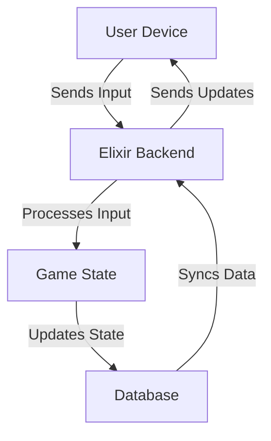

## 20.13. Elixir in Virtual and Augmented Reality

Virtual Reality (VR) and Augmented Reality (AR) are transforming the way we interact with digital content, creating immersive experiences that blend the physical and virtual worlds. Elixir, with its functional programming paradigm and robust concurrency model, plays a pivotal role in managing the backend services required for these experiences. In this section, we will explore how Elixir can be leveraged in VR and AR applications, focusing on real-time data streaming, multiplayer gaming, and collaborative environments.

### Role of Elixir in VR/AR

Elixir's role in VR and AR is primarily centered around managing backend services that support immersive experiences. This includes handling real-time data streaming, ensuring low-latency interactions, and providing a scalable infrastructure for multiplayer and collaborative environments.

#### Managing Backend Services

Elixir's concurrency model, based on the Actor Model, is particularly well-suited for managing the backend services of VR and AR applications. The language's lightweight processes allow for efficient handling of numerous simultaneous connections, which is essential for real-time interactions in virtual environments.

- **Concurrency and Scalability**: Elixir's ability to handle thousands of concurrent processes with minimal overhead is crucial for VR/AR applications that require real-time updates and interactions.
- **Fault Tolerance**: Elixir's "let it crash" philosophy ensures that systems can recover gracefully from failures, maintaining a seamless user experience even in the face of unexpected errors.

#### Real-Time Data Streaming

Real-time data streaming is a critical component of VR and AR applications. Elixir's capabilities in this area make it an excellent choice for facilitating smooth, low-latency interactions.

- **Low-Latency Communication**: Elixir's GenServer and GenStage modules provide the tools needed to implement low-latency communication channels, essential for real-time VR/AR experiences.
- **Data Synchronization**: Efficient data synchronization across distributed systems ensures that all users have a consistent view of the virtual environment.

#### Applications in VR/AR

Elixir's strengths in managing real-time data and concurrency make it ideal for several VR and AR applications, including multiplayer gaming and collaborative environments.

- **Multiplayer Gaming**: Elixir's ability to handle multiple connections simultaneously makes it perfect for multiplayer VR games, where players interact with each other in real-time.
- **Collaborative Environments**: In AR applications, Elixir can manage the backend services that allow multiple users to collaborate on shared projects, such as virtual design or remote assistance.

### Real-Time Data Streaming with Elixir

Real-time data streaming is the backbone of any VR or AR application. It ensures that users receive timely updates, which is crucial for maintaining immersion in virtual environments. Let's delve deeper into how Elixir facilitates real-time data streaming.

#### GenStage and Flow

Elixir's GenStage and Flow libraries provide powerful abstractions for building data processing pipelines, which are essential for real-time data streaming in VR/AR applications.

- **GenStage**: This library allows you to define a pipeline of stages, each responsible for a specific part of the data processing workflow. This is particularly useful for managing the flow of real-time data in VR/AR applications.
- **Flow**: Built on top of GenStage, Flow provides a higher-level abstraction for parallel data processing, making it easier to build scalable real-time data pipelines.

```elixir
defmodule VRDataPipeline do
  use GenStage

  def start_link(opts) do
    GenStage.start_link(__MODULE__, opts, name: __MODULE__)
  end

  def init(_) do
    {:producer, :ok}
  end

  def handle_demand(demand, state) when demand > 0 do
    events = for _ <- 1..demand, do: generate_event()
    {:noreply, events, state}
  end

  defp generate_event do
    # Simulate data generation for VR
    %{timestamp: :os.system_time(:milliseconds), data: :rand.uniform()}
  end
end
```

In this example, we define a simple GenStage producer that generates random data events, simulating real-time data generation for a VR application.

#### Low-Latency Communication

Maintaining low latency is crucial for VR/AR applications to ensure a seamless user experience. Elixir's lightweight processes and efficient message passing make it an excellent choice for implementing low-latency communication channels.

```elixir
defmodule VRServer do
  use GenServer

  def start_link(_) do
    GenServer.start_link(__MODULE__, %{}, name: __MODULE__)
  end

  def init(state) do
    {:ok, state}
  end

  def handle_call(:get_data, _from, state) do
    {:reply, fetch_data(), state}
  end

  defp fetch_data do
    # Simulate fetching real-time data
    %{position: {rand(:uniform), rand(:uniform), rand(:uniform)}}
  end
end
```

This GenServer module simulates a VR server that provides real-time data to clients. The `handle_call/3` function is used to fetch data with minimal latency.

#### Data Synchronization

Data synchronization is essential for ensuring that all users in a VR/AR environment have a consistent view of the virtual world. Elixir's distributed nature allows for efficient data synchronization across multiple nodes.

```elixir
defmodule VRDataSync do
  use GenServer

  def start_link(initial_state) do
    GenServer.start_link(__MODULE__, initial_state, name: __MODULE__)
  end

  def init(state) do
    {:ok, state}
  end

  def handle_cast({:update, new_data}, _state) do
    # Broadcast new data to all connected clients
    broadcast_to_clients(new_data)
    {:noreply, new_data}
  end

  defp broadcast_to_clients(data) do
    # Simulate broadcasting data to clients
    IO.inspect("Broadcasting data: #{inspect(data)}")
  end
end
```

In this example, we define a GenServer module that handles data synchronization by broadcasting updates to all connected clients.

### Applications in Multiplayer Gaming and Collaborative Environments

Elixir's strengths in concurrency and real-time data streaming make it ideal for applications in multiplayer gaming and collaborative environments.

#### Multiplayer Gaming

In multiplayer VR games, Elixir can manage the backend services that handle player interactions, ensuring a smooth and immersive experience.

- **Player Interactions**: Elixir's concurrency model allows for efficient handling of player interactions, such as movement and actions, in real-time.
- **Game State Management**: Elixir's GenServer modules can be used to manage the game state, ensuring consistency across all players.

```elixir
defmodule MultiplayerGame do
  use GenServer

  def start_link(_) do
    GenServer.start_link(__MODULE__, %{}, name: __MODULE__)
  end

  def init(state) do
    {:ok, state}
  end

  def handle_cast({:player_action, player_id, action}, state) do
    new_state = update_game_state(state, player_id, action)
    {:noreply, new_state}
  end

  defp update_game_state(state, player_id, action) do
    # Simulate updating game state based on player action
    IO.inspect("Player #{player_id} performed action: #{action}")
    state
  end
end
```

In this example, we define a GenServer module that manages player actions in a multiplayer game, updating the game state accordingly.

#### Collaborative Environments

In AR applications, Elixir can manage the backend services that enable multiple users to collaborate on shared projects.

- **Shared State Management**: Elixir's GenServer modules can be used to manage the shared state of a collaborative environment, ensuring consistency across all users.
- **Real-Time Updates**: Elixir's real-time data streaming capabilities ensure that all users receive timely updates, maintaining a seamless collaborative experience.

```elixir
defmodule CollaborativeProject do
  use GenServer

  def start_link(initial_state) do
    GenServer.start_link(__MODULE__, initial_state, name: __MODULE__)
  end

  def init(state) do
    {:ok, state}
  end

  def handle_cast({:update_project, user_id, changes}, state) do
    new_state = apply_changes(state, user_id, changes)
    {:noreply, new_state}
  end

  defp apply_changes(state, user_id, changes) do
    # Simulate applying changes to the project
    IO.inspect("User #{user_id} made changes: #{inspect(changes)}")
    state
  end
end
```

This GenServer module manages a collaborative project, applying changes made by users in real-time.

### Visualizing Elixir's Role in VR/AR

To better understand Elixir's role in VR and AR applications, let's visualize the architecture of a typical VR/AR system using Mermaid.js.


```mermaid
graph TD;
    A[User Device] -->|Sends Input| B[Elixir Backend]
    B -->|Processes Input| C[Game State]
    C -->|Updates State| D[Database]
    D -->|Syncs Data| B
    B -->|Sends Updates| A
```

**Description**: This diagram illustrates the flow of data in a VR/AR system. User devices send input to the Elixir backend, which processes the input and updates the game state. The updated state is stored in a database and synchronized across all devices, ensuring consistency.

### Elixir's Unique Features for VR/AR

Elixir offers several unique features that make it particularly well-suited for VR and AR applications:

- **Lightweight Processes**: Elixir's lightweight processes allow for efficient management of numerous simultaneous connections, essential for real-time VR/AR interactions.
- **Fault Tolerance**: Elixir's "let it crash" philosophy ensures that systems can recover gracefully from failures, maintaining a seamless user experience.
- **Scalability**: Elixir's ability to handle thousands of concurrent processes with minimal overhead makes it ideal for scalable VR/AR applications.

### Differences and Similarities with Other Technologies

While Elixir offers several advantages for VR and AR applications, it's important to understand how it compares to other technologies commonly used in this space.

- **Similarities**: Like other backend technologies, Elixir provides the tools needed for real-time data streaming and concurrency management.
- **Differences**: Elixir's functional programming paradigm and lightweight processes set it apart from other technologies, offering unique advantages in terms of scalability and fault tolerance.

### Design Considerations for VR/AR Applications

When designing VR and AR applications with Elixir, there are several important considerations to keep in mind:

- **Latency**: Minimizing latency is crucial for maintaining immersion in VR/AR environments. Elixir's lightweight processes and efficient message passing can help achieve this.
- **Scalability**: VR/AR applications often require the ability to scale to accommodate large numbers of users. Elixir's concurrency model makes it well-suited for scalable applications.
- **Fault Tolerance**: Ensuring fault tolerance is essential for maintaining a seamless user experience. Elixir's "let it crash" philosophy can help achieve this.

### Try It Yourself

To get hands-on experience with Elixir in VR and AR applications, try modifying the code examples provided in this section. Experiment with different data processing pipelines, communication channels, and state management techniques to see how they affect the performance and scalability of your application.

### Knowledge Check

To reinforce your understanding of Elixir's role in VR and AR applications, consider the following questions:

- How does Elixir's concurrency model benefit VR/AR applications?
- What are the advantages of using GenStage and Flow for real-time data streaming?
- How can Elixir's "let it crash" philosophy improve fault tolerance in VR/AR systems?

### Conclusion

Elixir's functional programming paradigm, robust concurrency model, and real-time data streaming capabilities make it an excellent choice for VR and AR applications. By leveraging Elixir's unique features, developers can create immersive, scalable, and fault-tolerant virtual experiences that push the boundaries of what's possible in the digital world. Remember, this is just the beginning. As you continue to explore Elixir's capabilities, you'll discover new ways to create innovative and engaging VR/AR applications. Keep experimenting, stay curious, and enjoy the journey!

## Quiz Time!



### How does Elixir's concurrency model benefit VR/AR applications?

- [x] It allows for efficient handling of numerous simultaneous connections.
- [ ] It increases the complexity of managing processes.
- [ ] It requires more resources to manage concurrency.
- [ ] It limits the scalability of applications.

> **Explanation:** Elixir's concurrency model, based on the Actor Model, allows for efficient handling of numerous simultaneous connections, which is essential for real-time interactions in VR/AR applications.

### What is the primary role of Elixir in VR/AR applications?

- [x] Managing backend services for immersive experiences.
- [ ] Creating 3D models and textures.
- [ ] Designing user interfaces.
- [ ] Developing hardware for VR/AR devices.

> **Explanation:** Elixir's primary role in VR/AR applications is managing backend services that support immersive experiences, including real-time data streaming and low-latency interactions.

### Which Elixir library is used for building data processing pipelines?

- [x] GenStage
- [ ] Phoenix
- [ ] Ecto
- [ ] Plug

> **Explanation:** GenStage is an Elixir library used for building data processing pipelines, which are essential for real-time data streaming in VR/AR applications.

### How does Elixir's "let it crash" philosophy improve fault tolerance?

- [x] It allows systems to recover gracefully from failures.
- [ ] It prevents any crashes from occurring.
- [ ] It increases the complexity of error handling.
- [ ] It requires manual intervention to handle errors.

> **Explanation:** Elixir's "let it crash" philosophy allows systems to recover gracefully from failures, maintaining a seamless user experience even in the face of unexpected errors.

### What is a key benefit of using GenServer in VR/AR applications?

- [x] Managing real-time data and state
- [ ] Designing user interfaces
- [ ] Creating 3D models
- [ ] Developing hardware

> **Explanation:** GenServer is used in VR/AR applications for managing real-time data and state, ensuring consistency and low-latency interactions.

### How does Elixir ensure low-latency communication in VR/AR applications?

- [x] Through lightweight processes and efficient message passing
- [ ] By increasing the number of servers
- [ ] By using complex algorithms
- [ ] By reducing the number of users

> **Explanation:** Elixir ensures low-latency communication through its lightweight processes and efficient message passing, which are crucial for maintaining immersion in VR/AR environments.

### What is the advantage of using Flow in Elixir?

- [x] It provides a higher-level abstraction for parallel data processing.
- [ ] It simplifies user interface design.
- [ ] It enhances 3D rendering capabilities.
- [ ] It reduces the need for backend services.

> **Explanation:** Flow provides a higher-level abstraction for parallel data processing, making it easier to build scalable real-time data pipelines in Elixir.

### How can Elixir's distributed nature benefit VR/AR applications?

- [x] By allowing efficient data synchronization across multiple nodes
- [ ] By simplifying the development of user interfaces
- [ ] By reducing the need for real-time data
- [ ] By limiting the scalability of applications

> **Explanation:** Elixir's distributed nature allows for efficient data synchronization across multiple nodes, ensuring that all users have a consistent view of the virtual environment.

### What is a common application of Elixir in AR?

- [x] Collaborative environments
- [ ] Designing hardware
- [ ] Creating 3D models
- [ ] Developing user interfaces

> **Explanation:** A common application of Elixir in AR is managing backend services that enable collaborative environments, allowing multiple users to work on shared projects.

### True or False: Elixir is used to create 3D models and textures for VR/AR applications.

- [ ] True
- [x] False

> **Explanation:** False. Elixir is primarily used for managing backend services, real-time data streaming, and concurrency in VR/AR applications, not for creating 3D models and textures.


