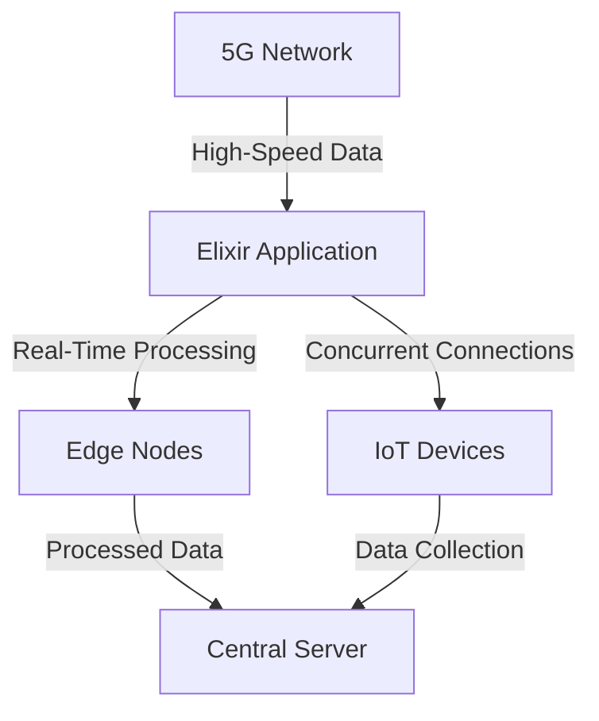

## 20.14. Utilizing Elixir in 5G Networks

The advent of 5G technology marks a significant leap in mobile communication, offering unprecedented speed, low latency, and the capacity to connect a vast number of devices simultaneously. This evolution opens up new possibilities for applications in various domains, including the Internet of Things (IoT), edge computing, and real-time data processing. In this context, Elixir, with its robust concurrency model and fault-tolerant architecture, emerges as a powerful tool for developing applications that can leverage the full potential of 5G networks.

### 5G Capabilities

5G networks are designed to provide:

- **High-Speed Data Transfer**: With speeds up to 10 Gbps, 5G is set to revolutionize data-intensive applications.
- **Low Latency**: Latency as low as 1 millisecond enables real-time communication and interaction.
- **Massive Device Connectivity**: 5G can support up to a million devices per square kilometer, making it ideal for IoT applications.
- **Enhanced Reliability**: Improved network reliability ensures consistent performance for critical applications.

These capabilities make 5G an attractive platform for a wide range of applications, from autonomous vehicles to smart cities and beyond.

### Elixir’s Advantages

Elixir is a functional programming language built on the Erlang VM (BEAM), known for its ability to handle concurrent processes efficiently. Here are some reasons why Elixir is well-suited for 5G applications:

- **Concurrency**: Elixir's lightweight processes allow for handling millions of concurrent connections, which is essential for 5G's massive connectivity.
- **Fault Tolerance**: Elixir's "let it crash" philosophy and supervision trees ensure that applications can recover from failures gracefully.
- **Real-Time Processing**: With low-latency communication, Elixir can process data in real-time, making it ideal for applications that require immediate feedback.
- **Scalability**: Elixir applications can scale horizontally across distributed systems, aligning with 5G's need for scalable solutions.

### Potential Applications

#### IoT Device Management

5G's ability to connect a vast number of devices makes it a perfect match for IoT applications. Elixir can manage these devices efficiently by leveraging its concurrency model to handle numerous simultaneous connections. Here's a simple example of how Elixir can be used to manage IoT devices:

```elixir
defmodule IoTDeviceManager do
  use GenServer

  # Client API
  def start_link(device_id) do
    GenServer.start_link(__MODULE__, device_id, name: via_tuple(device_id))
  end

  def send_command(device_id, command) do
    GenServer.call(via_tuple(device_id), {:send_command, command})
  end

  # Server Callbacks
  def init(device_id) do
    {:ok, %{device_id: device_id, status: :idle}}
  end

  def handle_call({:send_command, command}, _from, state) do
    # Simulate sending a command to the device
    IO.puts("Sending command #{command} to device #{state.device_id}")
    {:reply, :ok, state}
  end

  defp via_tuple(device_id) do
    {:via, Registry, {IoTDeviceRegistry, device_id}}
  end
end
```

In this example, each IoT device is managed by a GenServer process, allowing for concurrent command execution and state management.

#### Edge Computing

Edge computing involves processing data closer to the source, reducing latency and bandwidth usage. Elixir's ability to run distributed applications makes it an excellent choice for edge computing in 5G networks. By deploying Elixir nodes at the edge, we can process data locally and only send necessary information to the central servers.

```elixir
defmodule EdgeProcessor do
  use GenServer

  # Client API
  def start_link(initial_data) do
    GenServer.start_link(__MODULE__, initial_data, name: __MODULE__)
  end

  def process_data(data) do
    GenServer.cast(__MODULE__, {:process_data, data})
  end

  # Server Callbacks
  def init(initial_data) do
    {:ok, initial_data}
  end

  def handle_cast({:process_data, data}, state) do
    # Perform data processing
    processed_data = perform_computation(data)
    IO.puts("Processed data: #{processed_data}")
    {:noreply, state}
  end

  defp perform_computation(data) do
    # Simulate data processing
    data * 2
  end
end
```

By using GenServer, we can handle data processing tasks asynchronously, ensuring that the system remains responsive even under heavy load.

### Visualizing Elixir in 5G Networks

To better understand how Elixir fits into the 5G ecosystem, let's visualize a typical architecture using Mermaid.js:



**Diagram Description**: This diagram illustrates how an Elixir application can interact with a 5G network to manage IoT devices and perform edge computing. The Elixir application handles concurrent connections from IoT devices and processes data in real-time at the edge nodes before sending it to the central server.

### Design Considerations

When utilizing Elixir in 5G networks, consider the following:

- **Network Reliability**: Ensure that your application can handle network fluctuations and maintain performance.
- **Security**: Implement robust security measures to protect data and devices connected to the network.
- **Scalability**: Design your application to scale with the growing number of connected devices and data volume.
- **Latency**: Optimize your application to minimize latency, taking advantage of 5G's low-latency capabilities.

### Elixir Unique Features

Elixir's unique features, such as its actor model for concurrency and fault-tolerant design, make it particularly well-suited for 5G applications. The language's ability to handle distributed systems and real-time processing aligns perfectly with the demands of 5G networks.

### Differences and Similarities

While Elixir shares some concurrency features with other functional languages like Erlang, its syntax and tooling make it more accessible and productive for developers. Compared to object-oriented languages, Elixir's functional paradigm offers a different approach to managing state and side effects, which can be advantageous in the context of 5G networks.

### Try It Yourself

To experiment with Elixir in a 5G context, try modifying the IoTDeviceManager and EdgeProcessor modules to simulate different scenarios, such as handling device failures or processing large data sets. This hands-on approach will deepen your understanding of how Elixir can be leveraged in 5G networks.

### References and Links

- [5G Technology Overview](https://www.3gpp.org/technologies/5g)
- [Elixir Official Website](https://elixir-lang.org/)
- [Erlang and Elixir Ecosystem](https://www.erlang-solutions.com/)

### Knowledge Check

- How does Elixir's concurrency model benefit 5G applications?
- What are some potential use cases for Elixir in 5G networks?
- How can Elixir's fault-tolerance features be leveraged in a 5G context?

### Embrace the Journey

As we explore the intersection of Elixir and 5G networks, remember that this is just the beginning. The potential applications are vast, and the journey of discovery is ongoing. Keep experimenting, stay curious, and enjoy the process of building innovative solutions in this exciting new frontier.

## Quiz: Utilizing Elixir in 5G Networks



### What is one of the primary advantages of using Elixir in 5G networks?

- [x] Concurrency and fault tolerance
- [ ] Object-oriented programming
- [ ] High-level abstraction
- [ ] Static typing

> **Explanation:** Elixir's concurrency model and fault-tolerant architecture make it ideal for handling the demands of 5G networks.

### How does Elixir handle concurrent connections in a 5G environment?

- [x] Through lightweight processes
- [ ] By using threads
- [ ] With heavy-weight processes
- [ ] By using locks

> **Explanation:** Elixir uses lightweight processes to efficiently manage concurrent connections, which is crucial for 5G applications.

### What is a potential application of Elixir in 5G networks?

- [x] IoT device management
- [ ] Desktop application development
- [ ] Video game design
- [ ] Spreadsheet software

> **Explanation:** Elixir is well-suited for managing IoT devices due to its ability to handle numerous concurrent connections.

### What is a key feature of 5G networks?

- [x] Low latency
- [ ] High latency
- [ ] Low bandwidth
- [ ] High power consumption

> **Explanation:** 5G networks are characterized by low latency, which is essential for real-time applications.

### How can Elixir be used in edge computing within 5G networks?

- [x] By deploying nodes at the edge for local data processing
- [ ] By centralizing all processing tasks
- [ ] By using a single server for all computations
- [ ] By relying solely on cloud computing

> **Explanation:** Elixir can be deployed at the edge to process data locally, reducing latency and bandwidth usage.

### What is a challenge when using Elixir in 5G networks?

- [x] Ensuring network reliability
- [ ] Lack of concurrency support
- [ ] Inability to handle real-time data
- [ ] Poor scalability

> **Explanation:** Ensuring network reliability is a challenge that must be addressed when deploying Elixir applications in 5G networks.

### What is the "let it crash" philosophy in Elixir?

- [x] Allowing processes to fail and recover gracefully
- [ ] Preventing any process from crashing
- [ ] Ignoring process failures
- [ ] Manually restarting failed processes

> **Explanation:** The "let it crash" philosophy involves allowing processes to fail and recover automatically, enhancing fault tolerance.

### What is a benefit of using Elixir for IoT device management in 5G networks?

- [x] Efficient handling of concurrent connections
- [ ] High power consumption
- [ ] Complex syntax
- [ ] Lack of scalability

> **Explanation:** Elixir's concurrency model allows it to efficiently manage numerous IoT devices simultaneously.

### How does Elixir's functional paradigm benefit 5G applications?

- [x] By managing state and side effects effectively
- [ ] By using classes and objects
- [ ] By relying on inheritance
- [ ] By using static typing

> **Explanation:** Elixir's functional paradigm helps manage state and side effects, which is beneficial for 5G applications.

### True or False: Elixir is not suitable for real-time processing in 5G networks.

- [ ] True
- [x] False

> **Explanation:** Elixir is highly suitable for real-time processing due to its low-latency communication capabilities.


