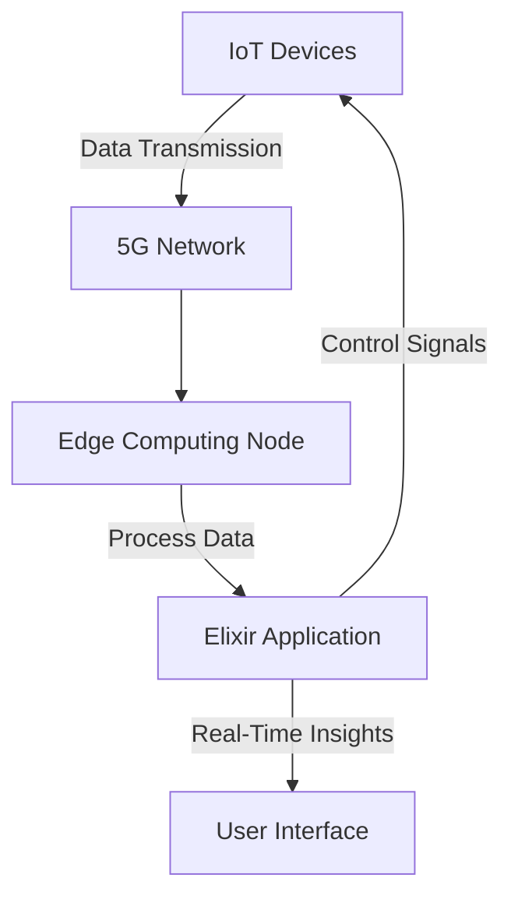

## 20.14. Utilizing Elixir in 5G Networks

The advent of 5G networks marks a significant evolution in mobile communication technology, offering unprecedented speed and low latency. These capabilities open up new possibilities in various domains, including the Internet of Things (IoT), edge computing, and real-time data processing. In this article, we will explore how Elixir, with its robust concurrency model and functional programming paradigm, is uniquely positioned to harness the potential of 5G networks.

### Understanding 5G Capabilities

5G networks are designed to provide:

- **High-Speed Data Transfer**: 5G can achieve speeds up to 10 Gbps, enabling faster data transfer and more efficient communication.
- **Low Latency**: With latency as low as 1 millisecond, 5G supports real-time applications that require immediate data processing and response.
- **Massive Device Connectivity**: 5G can support up to a million devices per square kilometer, making it ideal for IoT applications.
- **Enhanced Reliability**: 5G offers improved reliability and stability, essential for mission-critical applications.

### Elixir’s Advantages in 5G Networks

Elixir is a functional, concurrent language built on the Erlang VM, known for its ability to handle numerous simultaneous connections and processes. Here are some of the key advantages of using Elixir in 5G networks:

- **Concurrency and Parallelism**: Elixir's lightweight processes and message-passing model allow it to manage thousands of concurrent connections efficiently, a crucial requirement in 5G environments.
- **Fault Tolerance**: Elixir inherits Erlang's "let it crash" philosophy, enabling the development of resilient systems that can recover from failures gracefully.
- **Real-Time Processing**: With its ability to handle low-latency communication, Elixir is well-suited for real-time data processing and analytics.
- **Scalability**: Elixir's architecture supports horizontal scaling, making it ideal for applications that need to grow with increasing demand.

### Potential Applications of Elixir in 5G Networks

#### IoT Device Management

5G's massive connectivity capability makes it perfect for IoT applications, where numerous devices need to communicate seamlessly. Elixir can manage these connections efficiently due to its concurrency model.

- **Device Communication**: Elixir's lightweight processes can handle communication between IoT devices, ensuring data is transmitted and received reliably.
- **Data Aggregation and Processing**: Elixir can aggregate data from multiple IoT devices and process it in real-time, providing valuable insights and analytics.

#### Edge Computing

Edge computing involves processing data closer to its source rather than relying on a centralized data center. This approach reduces latency and bandwidth usage, making it ideal for 5G networks.

- **Local Data Processing**: Elixir can perform computations at the edge, minimizing the need to send data back to a central server. This reduces latency and enhances performance.
- **Real-Time Decision Making**: With its low-latency processing capabilities, Elixir can make real-time decisions at the edge, critical for applications like autonomous vehicles and smart cities.

#### Real-Time Applications

5G's low latency and high-speed capabilities make it suitable for real-time applications, such as gaming, augmented reality, and virtual reality.

- **Interactive Gaming**: Elixir can manage real-time interactions in multiplayer games, ensuring smooth and responsive gameplay.
- **Augmented and Virtual Reality**: Elixir's ability to process data in real-time enhances the user experience in AR and VR applications, providing seamless interactions and immersive environments.

### Code Examples

To illustrate how Elixir can be utilized in 5G networks, let's explore some code examples that demonstrate its concurrency and real-time processing capabilities.

#### Example 1: Managing Concurrent Connections

```elixir
defmodule ConnectionManager do
  use GenServer

  # Client API
  def start_link(initial_state) do
    GenServer.start_link(__MODULE__, initial_state, name: __MODULE__)
  end

  def handle_connection(device_id) do
    GenServer.call(__MODULE__, {:handle_connection, device_id})
  end

  # Server Callbacks
  def init(initial_state) do
    {:ok, initial_state}
  end

  def handle_call({:handle_connection, device_id}, _from, state) do
    # Simulate handling a connection
    IO.puts("Handling connection for device: #{device_id}")
    {:reply, :ok, state}
  end
end

# Start the connection manager
{:ok, _pid} = ConnectionManager.start_link(%{})

# Handle connections from multiple devices
ConnectionManager.handle_connection("device_1")
ConnectionManager.handle_connection("device_2")
```

**Explanation**: This code demonstrates how Elixir's GenServer can be used to manage concurrent connections from multiple devices. Each connection is handled in a separate process, allowing for efficient management of numerous connections.

#### Example 2: Real-Time Data Processing

```elixir
defmodule DataProcessor do
  def process_data(data) do
    # Simulate real-time data processing
    IO.inspect(data, label: "Processing data")
    :ok
  end
end

defmodule DeviceSimulator do
  def simulate_device_data do
    Enum.each(1..10, fn i ->
      data = %{device_id: i, value: :rand.uniform(100)}
      DataProcessor.process_data(data)
      :timer.sleep(1000) # Simulate data arrival every second
    end)
  end
end

# Simulate data from devices
DeviceSimulator.simulate_device_data()
```

**Explanation**: This example simulates real-time data processing from devices. The `DataProcessor` module processes incoming data, and the `DeviceSimulator` module generates data at regular intervals, mimicking real-time data flow.

### Visualizing Elixir's Role in 5G Networks

To better understand how Elixir fits into the 5G ecosystem, let's visualize the architecture of a 5G-enabled IoT system using Elixir.


```mermaid
graph TD;
    A[IoT Devices] -->|Data Transmission| B[5G Network];
    B --> C[Edge Computing Node];
    C -->|Process Data| D[Elixir Application];
    D -->|Real-Time Insights| E[User Interface];
    D -->|Control Signals| A;
```

**Diagram Explanation**: This diagram illustrates a 5G-enabled IoT system where IoT devices communicate via the 5G network. Data is processed at the edge by an Elixir application, which provides real-time insights to the user interface and sends control signals back to the devices.

### Key Considerations for Using Elixir in 5G Networks

- **Latency**: Ensure that Elixir applications are optimized for low-latency processing to fully leverage 5G's capabilities.
- **Scalability**: Design Elixir systems to scale horizontally, accommodating the massive connectivity offered by 5G.
- **Fault Tolerance**: Utilize Elixir's fault-tolerant features to build resilient systems that can handle failures gracefully.
- **Security**: Implement robust security measures to protect data transmitted over 5G networks, considering encryption and authentication mechanisms.

### Elixir's Unique Features in 5G Networks

Elixir's unique features, such as its lightweight processes, message-passing model, and fault-tolerant architecture, make it particularly well-suited for 5G networks. These features enable Elixir to handle the challenges of high-speed, low-latency communication and massive device connectivity effectively.

### Differences and Similarities with Other Technologies

While other languages and frameworks can be used in 5G networks, Elixir stands out due to its concurrency model and fault tolerance. Unlike traditional object-oriented languages, Elixir's functional paradigm and process-based concurrency offer distinct advantages in managing real-time, distributed systems.

### Try It Yourself

To further explore Elixir's capabilities in 5G networks, try modifying the code examples provided. Experiment with handling more concurrent connections or processing data from additional devices. Observe how Elixir's concurrency model efficiently manages these tasks.

### Conclusion

Elixir is a powerful tool for leveraging the capabilities of 5G networks. Its concurrency model, fault tolerance, and real-time processing capabilities make it ideal for applications in IoT, edge computing, and real-time data processing. As 5G technology continues to evolve, Elixir will play a crucial role in building scalable, resilient systems that can meet the demands of this new era.

## Quiz Time!



### What is one of the primary advantages of 5G networks?

- [x] High-speed data transfer
- [ ] Limited device connectivity
- [ ] High latency
- [ ] Low reliability

> **Explanation:** 5G networks are known for their high-speed data transfer capabilities, enabling faster communication.

### How does Elixir handle concurrent connections efficiently?

- [x] Through lightweight processes and message-passing
- [ ] By using threads
- [ ] By creating multiple instances of the application
- [ ] By relying on external libraries

> **Explanation:** Elixir uses lightweight processes and message-passing to handle concurrent connections efficiently.

### What is a potential application of Elixir in 5G networks?

- [x] IoT device management
- [ ] Desktop application development
- [ ] Static website hosting
- [ ] Video editing software

> **Explanation:** Elixir is well-suited for IoT device management due to its concurrency model and real-time processing capabilities.

### What is a key feature of Elixir that supports fault tolerance?

- [x] The "let it crash" philosophy
- [ ] Object-oriented design
- [ ] Global variables
- [ ] Synchronous communication

> **Explanation:** Elixir's "let it crash" philosophy supports fault tolerance by allowing systems to recover from failures gracefully.

### How can Elixir be used in edge computing?

- [x] By processing data closer to its source
- [ ] By centralizing data processing
- [ ] By storing data in the cloud
- [ ] By using a single server for all computations

> **Explanation:** In edge computing, Elixir processes data closer to its source, reducing latency and bandwidth usage.

### What is one of the unique features of Elixir that makes it suitable for 5G networks?

- [x] Lightweight processes
- [ ] Static typing
- [ ] Object-oriented programming
- [ ] Global state management

> **Explanation:** Elixir's lightweight processes make it suitable for handling the massive connectivity of 5G networks.

### What is an example of a real-time application that can benefit from Elixir in 5G networks?

- [x] Interactive gaming
- [ ] Batch processing
- [ ] Offline data analysis
- [ ] Static content delivery

> **Explanation:** Interactive gaming can benefit from Elixir's real-time processing capabilities in 5G networks.

### What should be considered when designing Elixir systems for 5G networks?

- [x] Scalability and latency
- [ ] Single-threaded execution
- [ ] Monolithic architecture
- [ ] High memory usage

> **Explanation:** Scalability and low latency are crucial considerations when designing Elixir systems for 5G networks.

### How does Elixir's architecture support scalability?

- [x] Through horizontal scaling
- [ ] By increasing CPU usage
- [ ] By using global variables
- [ ] By relying on a single server

> **Explanation:** Elixir's architecture supports scalability through horizontal scaling, accommodating increasing demand.

### True or False: Elixir's concurrency model is based on threads.

- [ ] True
- [x] False

> **Explanation:** Elixir's concurrency model is based on lightweight processes and message-passing, not threads.



Remember, this is just the beginning. As you progress, you'll discover more ways to leverage Elixir in the rapidly evolving 5G landscape. Keep experimenting, stay curious, and enjoy the journey!
