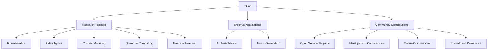

## 20.15. Experimenting with Elixir in Unconventional Domains

Elixir, with its robust concurrency model and functional programming paradigm, is not only a powerful tool for building scalable and fault-tolerant systems but also a versatile language that can be applied in unconventional domains. In this section, we will explore how Elixir is being used in research projects, creative applications, and how the community is contributing to its expansion into new fields.

### Research Projects

Research projects often require innovative approaches and tools that can handle complex computations and data processing efficiently. Elixir, with its ability to leverage the Erlang VM (BEAM) for concurrent processing, is well-suited for such tasks.

#### Applying Elixir to New and Emerging Fields

Elixir's capabilities make it an attractive choice for researchers exploring new and emerging fields. Let's delve into some areas where Elixir is making an impact:

1. **Bioinformatics**: Elixir's ability to handle large datasets and perform parallel computations makes it ideal for bioinformatics. Researchers can use Elixir to process genomic data, perform sequence alignment, and analyze biological networks.

2. **Astrophysics**: The need for processing vast amounts of data from telescopes and simulations makes Elixir a suitable choice for astrophysics research. Its concurrency model allows for efficient data processing and analysis.

3. **Climate Modeling**: Elixir can be used to simulate climate models, analyze environmental data, and predict weather patterns. Its scalability ensures that complex simulations can be run efficiently.

4. **Quantum Computing**: While still in its infancy, quantum computing research can benefit from Elixir's ability to handle concurrent processes and manage state efficiently.

5. **Machine Learning**: Although not traditionally associated with machine learning, Elixir can be used to build distributed machine learning systems, leveraging its concurrency model to train models in parallel.

#### Code Example: Parallel Data Processing in Bioinformatics

```elixir
defmodule Bioinformatics do
  # Function to process genomic data in parallel
  def process_genomic_data(data) do
    data
    |> Enum.chunk_every(1000)
    |> Enum.map(&Task.async(fn -> analyze_chunk(&1) end))
    |> Enum.map(&Task.await/1)
  end

  # Simulated analysis function
  defp analyze_chunk(chunk) do
    # Perform complex computations on the chunk
    Enum.map(chunk, &(&1 * 2)) # Placeholder for actual analysis
  end
end

# Example usage
genomic_data = Enum.to_list(1..10_000)
Bioinformatics.process_genomic_data(genomic_data)
```

In this example, we demonstrate how Elixir can be used to process genomic data in parallel, leveraging its concurrency model to handle large datasets efficiently.

### Creative Applications

Elixir's versatility extends beyond traditional software development into the realm of creative applications. Artists and musicians are finding innovative ways to use Elixir in their work.

#### Art Installations

Elixir can be used to create interactive art installations that respond to user input or environmental changes. By leveraging Elixir's real-time capabilities, artists can build installations that react to sound, light, or motion.

#### Music Generation

Elixir's functional programming paradigm and concurrency model make it an excellent choice for music generation. Musicians can use Elixir to create generative music systems that produce unique compositions in real-time.

#### Code Example: Generative Music System

```elixir
defmodule MusicGenerator do
  # Function to generate a random melody
  def generate_melody do
    Enum.map(1..8, fn _ -> random_note() end)
  end

  # Function to play the melody
  def play_melody(melody) do
    Enum.each(melody, fn note ->
      play_note(note)
      :timer.sleep(500) # Pause between notes
    end)
  end

  # Simulated function to play a note
  defp play_note(note) do
    IO.puts("Playing note: #{note}")
  end

  # Function to generate a random note
  defp random_note do
    Enum.random(["C", "D", "E", "F", "G", "A", "B"])
  end
end

# Example usage
melody = MusicGenerator.generate_melody()
MusicGenerator.play_melody(melody)
```

In this example, we demonstrate how Elixir can be used to generate and play a random melody, showcasing its potential in music generation.

### Community Contributions

The Elixir community plays a vital role in expanding the language's reach into unconventional domains. By sharing their experiences and projects, community members inspire others to explore new possibilities with Elixir.

#### Encouraging Exploration and Sharing of Unique Use Cases

1. **Open Source Projects**: The Elixir community is known for its vibrant open-source ecosystem. Developers are encouraged to contribute to existing projects or start new ones that explore unconventional domains.

2. **Meetups and Conferences**: Elixir meetups and conferences provide a platform for developers to share their experiences and learn from others. These events often feature talks on innovative uses of Elixir in various fields.

3. **Online Communities**: Online forums and social media groups offer a space for Elixir enthusiasts to discuss ideas, seek advice, and collaborate on projects.

4. **Educational Resources**: Community members contribute to the growth of Elixir by creating educational resources, such as tutorials, blog posts, and videos, that explore unconventional applications of the language.

### Visualizing Elixir's Impact in Unconventional Domains

To better understand how Elixir is being used in unconventional domains, let's visualize its impact using a flowchart:



This diagram illustrates the various unconventional domains where Elixir is making an impact, highlighting the interconnectedness of research, creativity, and community contributions.

### Knowledge Check

Before we conclude, let's reinforce what we've learned with a few questions:

- How can Elixir be applied in bioinformatics research?
- What are some creative applications of Elixir in the arts?
- How does the Elixir community contribute to its expansion into unconventional domains?

### Embrace the Journey

Experimenting with Elixir in unconventional domains is an exciting journey that opens up new possibilities for innovation and creativity. As you explore these new fields, remember to share your experiences with the community and contribute to the growing body of knowledge around Elixir.

Keep experimenting, stay curious, and enjoy the journey!

## Quiz: Experimenting with Elixir in Unconventional Domains



### How can Elixir be applied in bioinformatics research?

- [x] For processing genomic data
- [ ] For creating web applications
- [ ] For designing user interfaces
- [ ] For managing databases

> **Explanation:** Elixir's concurrency model makes it suitable for processing large datasets, such as genomic data in bioinformatics research.

### What makes Elixir suitable for astrophysics research?

- [x] Its ability to handle vast amounts of data
- [ ] Its support for object-oriented programming
- [ ] Its built-in graphics library
- [ ] Its compatibility with Java

> **Explanation:** Elixir's concurrency model allows it to efficiently process and analyze large datasets, making it suitable for astrophysics research.

### How can Elixir be used in creative applications?

- [x] For generating music
- [ ] For building mobile apps
- [ ] For developing operating systems
- [ ] For creating spreadsheets

> **Explanation:** Elixir's functional programming paradigm and concurrency model make it an excellent choice for creative applications, such as music generation.

### What role does the Elixir community play in its expansion?

- [x] Sharing experiences and projects
- [ ] Developing proprietary software
- [ ] Limiting access to resources
- [ ] Focusing solely on web development

> **Explanation:** The Elixir community contributes to its expansion by sharing experiences, projects, and educational resources, encouraging exploration in unconventional domains.

### What is an example of an unconventional domain for Elixir?

- [x] Quantum computing
- [ ] Web development
- [ ] Database management
- [ ] Mobile app development

> **Explanation:** Quantum computing is an emerging field where Elixir's concurrency model can be applied, making it an unconventional domain for the language.

### How can Elixir be used in art installations?

- [x] By creating interactive installations that respond to input
- [ ] By designing static sculptures
- [ ] By painting canvases
- [ ] By sculpting clay

> **Explanation:** Elixir's real-time capabilities allow artists to create interactive installations that respond to user input or environmental changes.

### What is a benefit of using Elixir in climate modeling?

- [x] Its scalability for running complex simulations
- [ ] Its ability to create 3D graphics
- [ ] Its support for machine learning libraries
- [ ] Its integration with JavaScript

> **Explanation:** Elixir's scalability ensures that complex climate simulations can be run efficiently, making it beneficial for climate modeling.

### How does Elixir contribute to machine learning?

- [x] By building distributed systems for parallel training
- [ ] By providing built-in machine learning algorithms
- [ ] By offering a graphical user interface
- [ ] By supporting SQL queries

> **Explanation:** Elixir can be used to build distributed machine learning systems, leveraging its concurrency model to train models in parallel.

### What is a key feature of Elixir that benefits unconventional domains?

- [x] Its concurrency model
- [ ] Its object-oriented design
- [ ] Its graphical capabilities
- [ ] Its SQL support

> **Explanation:** Elixir's concurrency model is a key feature that benefits unconventional domains, allowing for efficient data processing and parallel computations.

### True or False: Elixir is only suitable for traditional software development.

- [ ] True
- [x] False

> **Explanation:** False. Elixir is suitable for a wide range of applications, including unconventional domains such as research projects and creative arts.


