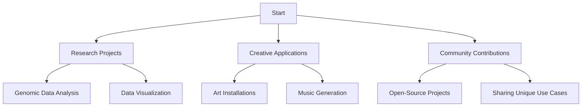

## 20.15. Experimenting with Elixir in Unconventional Domains

Elixir, with its robust concurrency model and functional programming paradigm, has carved a niche for itself in traditional domains like web development and distributed systems. However, its potential extends far beyond these areas. In this section, we'll explore how Elixir is being experimented with in unconventional domains such as art, music, and research projects. We'll also look at community contributions that encourage exploration and sharing of unique use cases.

### Research Projects

#### Applying Elixir to New and Emerging Fields

Elixir's capabilities make it an attractive choice for research projects in fields like data science, machine learning, and bioinformatics. Its ability to handle concurrent processes efficiently allows researchers to process large datasets and perform complex computations.

##### Example: Genomic Data Analysis

In bioinformatics, analyzing genomic data requires processing vast amounts of information. Elixir's concurrency model can be leveraged to parallelize tasks such as sequence alignment and variant calling.

```elixir
defmodule GenomicAnalyzer do
  def analyze_sequences(sequences) do
    sequences
    |> Enum.map(&Task.async(fn -> process_sequence(&1) end))
    |> Enum.map(&Task.await(&1))
  end

  defp process_sequence(sequence) do
    # Simulate a complex computation on the sequence
    :timer.sleep(1000)
    {:ok, "Processed #{sequence}"}
  end
end

sequences = ["ATCG", "GCTA", "TTAG"]
GenomicAnalyzer.analyze_sequences(sequences)
```

In this example, each sequence is processed concurrently using Elixir's `Task` module, demonstrating how Elixir can efficiently handle parallel computations.

#### Visualizing Complex Data

Elixir can also be used to create visualizations of complex data. Using libraries like `VegaLite`, researchers can generate interactive visualizations directly from Elixir.

```elixir
# Example of using VegaLite to create a simple bar chart
data = [
  %{category: "A", value: 30},
  %{category: "B", value: 80},
  %{category: "C", value: 45}
]

VegaLite.new()
|> VegaLite.data_from_values(data)
|> VegaLite.mark(:bar)
|> VegaLite.encode_field(:x, "category", type: :ordinal)
|> VegaLite.encode_field(:y, "value", type: :quantitative)
|> VegaLite.render()
```

This code snippet demonstrates how to create a basic bar chart, showcasing Elixir's ability to integrate with data visualization tools.

### Creative Applications

#### Art Installations

Elixir's real-time capabilities make it ideal for interactive art installations. Artists can use Elixir to control lights, sounds, and other elements in response to user interactions or environmental changes.

##### Example: Interactive Light Display

Imagine an art installation where lights change color based on sound levels in the environment. Elixir can be used to process audio input and control the lighting system.

```elixir
defmodule LightController do
  def start do
    # Simulate listening to audio input and controlling lights
    :timer.sleep(1000)
    IO.puts("Changing light color based on sound level")
  end
end

LightController.start()
```

This simple example illustrates the concept of using Elixir to create interactive experiences by responding to real-time data.

#### Music Generation

Elixir can also be used for algorithmic music generation. By leveraging libraries like `SonicPi`, developers can create dynamic soundscapes and compositions.

```elixir
defmodule MusicGenerator do
  def play_notes(notes) do
    Enum.each(notes, fn note ->
      # Simulate playing a note
      IO.puts("Playing note: #{note}")
      :timer.sleep(500)
    end)
  end
end

notes = ["C", "E", "G", "B"]
MusicGenerator.play_notes(notes)
```

In this example, a sequence of notes is played, showcasing how Elixir can be used to generate music programmatically.

### Community Contributions

#### Encouraging Exploration and Sharing of Unique Use Cases

The Elixir community is known for its vibrant and supportive nature. Developers are encouraged to experiment with Elixir in unconventional domains and share their findings through blogs, talks, and open-source projects.

##### Example: Open-Source Projects

Several open-source projects have emerged from the community, demonstrating Elixir's versatility. For instance, `Nerves` is a framework for building embedded systems with Elixir, enabling developers to create IoT devices.

```elixir
# Example of using Nerves to control an LED
defmodule LEDController do
  use Nerves.GPIO

  def start do
    {:ok, gpio} = GPIO.open(17, :output)
    GPIO.write(gpio, 1)
    :timer.sleep(1000)
    GPIO.write(gpio, 0)
  end
end

LEDController.start()
```

This code snippet shows how Elixir can be used to control hardware components, highlighting its applicability in the IoT domain.

### Visualizing Elixir's Interaction with Unconventional Domains

To better understand how Elixir interacts with unconventional domains, let's visualize the process using a flowchart.


```mermaid
graph TD
    A[Start] --> B[Research Projects]
    B --> C[Genomic Data Analysis]
    B --> D[Data Visualization]
    A --> E[Creative Applications]
    E --> F[Art Installations]
    E --> G[Music Generation]
    A --> H[Community Contributions]
    H --> I[Open-Source Projects]
    H --> J[Sharing Unique Use Cases]
```

This diagram illustrates the different paths Elixir can take when applied to unconventional domains, emphasizing the interconnectedness of research, creativity, and community involvement.

### Knowledge Check

- **Question:** How can Elixir's concurrency model benefit genomic data analysis?
  - **Answer:** By parallelizing tasks such as sequence alignment and variant calling, improving efficiency.

- **Question:** What library can be used with Elixir to create data visualizations?
  - **Answer:** `VegaLite` is a library that can be used to generate interactive visualizations.

### Exercises

1. Modify the `GenomicAnalyzer` module to process sequences in batches instead of individually.
2. Create a new music composition using the `MusicGenerator` module, experimenting with different note sequences.
3. Explore the `Nerves` framework and build a simple IoT device that responds to environmental changes.

### Embrace the Journey

Experimenting with Elixir in unconventional domains is an exciting journey that opens up new possibilities for creativity and innovation. As you explore these areas, remember to share your findings with the community and contribute to the growing body of knowledge around Elixir's potential. Keep experimenting, stay curious, and enjoy the journey!

## Quiz Time!



### How can Elixir's concurrency model benefit genomic data analysis?

- [x] By parallelizing tasks such as sequence alignment and variant calling
- [ ] By reducing the need for data storage
- [ ] By simplifying the data analysis algorithms
- [ ] By eliminating the need for error handling

> **Explanation:** Elixir's concurrency model allows for parallel processing, which is beneficial for tasks like sequence alignment and variant calling in genomic data analysis.

### What library can be used with Elixir to create data visualizations?

- [x] VegaLite
- [ ] Phoenix
- [ ] Ecto
- [ ] Plug

> **Explanation:** VegaLite is a library that can be used with Elixir to generate interactive visualizations.

### Which Elixir framework is used for building embedded systems and IoT devices?

- [x] Nerves
- [ ] Phoenix
- [ ] Ecto
- [ ] Plug

> **Explanation:** Nerves is a framework for building embedded systems and IoT devices using Elixir.

### In the context of creative applications, what can Elixir be used for?

- [x] Art installations
- [x] Music generation
- [ ] Database management
- [ ] Web scraping

> **Explanation:** Elixir can be used for creative applications such as art installations and music generation.

### What is a key benefit of using Elixir for real-time applications?

- [x] Its robust concurrency model
- [ ] Its object-oriented programming paradigm
- [ ] Its lack of error handling
- [ ] Its use of mutable state

> **Explanation:** Elixir's robust concurrency model makes it ideal for real-time applications.

### How can the Elixir community contribute to its growth in unconventional domains?

- [x] By sharing unique use cases
- [x] By developing open-source projects
- [ ] By keeping their projects private
- [ ] By avoiding experimentation

> **Explanation:** The Elixir community can contribute by sharing unique use cases and developing open-source projects.

### What is one way Elixir can be used in art installations?

- [x] By controlling lights and sounds in response to environmental changes
- [ ] By managing database transactions
- [ ] By optimizing web server performance
- [ ] By handling user authentication

> **Explanation:** Elixir can be used in art installations to control lights and sounds based on environmental changes.

### What is the purpose of the `Task` module in Elixir?

- [x] To handle concurrent processes
- [ ] To manage database connections
- [ ] To generate HTML templates
- [ ] To encrypt data

> **Explanation:** The `Task` module in Elixir is used to handle concurrent processes.

### How can Elixir be used in music generation?

- [x] By leveraging libraries like SonicPi for algorithmic music generation
- [ ] By storing music files in a database
- [ ] By managing user playlists
- [ ] By streaming music over the internet

> **Explanation:** Elixir can be used for algorithmic music generation by leveraging libraries like SonicPi.

### True or False: Elixir is only suitable for traditional domains like web development.

- [ ] True
- [x] False

> **Explanation:** False. Elixir is suitable for a wide range of domains, including unconventional ones like art, music, and research projects.


