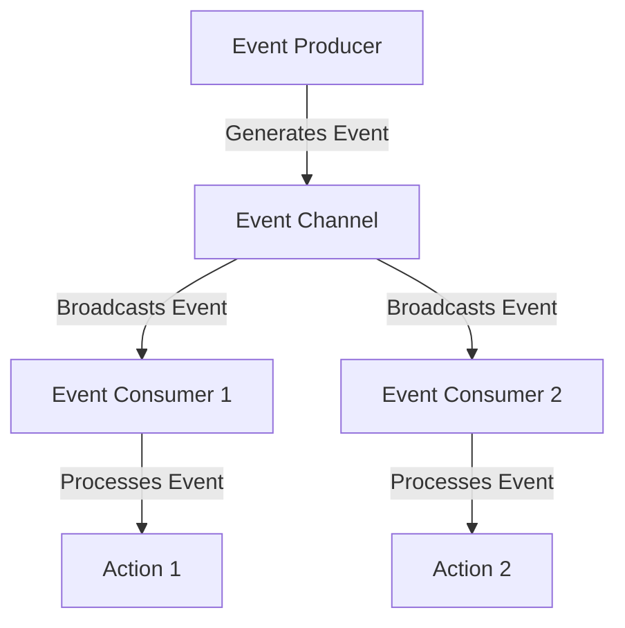

## 20.2. Event-Driven Architecture

In the realm of software architecture, Event-Driven Architecture (EDA) stands out as a powerful paradigm that allows systems to react to events asynchronously. This approach is particularly beneficial in building scalable and decoupled systems, where components can operate independently and communicate through events. In this section, we will delve into the principles of EDA, explore its benefits, and demonstrate how to implement it in Elixir using message passing and PubSub systems.

### Understanding Event-Driven Architecture

Event-Driven Architecture is a design pattern where the flow of the program is determined by events. These events can be anything from user actions, sensor outputs, or messages from other programs. The key components of EDA include:

- **Event Producers**: Components that generate events.
- **Event Consumers**: Components that react to events.
- **Event Channels**: Pathways through which events are transmitted.

EDA is particularly useful in systems that require high scalability and flexibility, as it allows for the decoupling of components. This means that changes in one part of the system do not necessarily affect others, promoting easier maintenance and evolution.

### Asynchronous Event Handling

Asynchronous event handling is at the core of EDA. It allows systems to process events without blocking the execution of other tasks. This is crucial for maintaining responsiveness and performance in distributed systems. In Elixir, asynchronous handling is achieved through:

- **Processes**: Lightweight, concurrent units of execution.
- **Message Passing**: Communication between processes using messages.
- **PubSub Systems**: Publish-subscribe mechanisms for broadcasting events.

### Benefits of Event-Driven Architecture

EDA offers several advantages:

- **Scalability**: Systems can handle a large number of events and users by distributing the load across multiple components.
- **Decoupling**: Components are independent, making it easier to modify or replace them without affecting the entire system.
- **Flexibility**: New features can be added by introducing new event producers or consumers.
- **Resilience**: Systems can continue to operate even if some components fail, as long as the event channels remain intact.

### Implementing Event-Driven Architecture in Elixir

Elixir, with its functional programming paradigm and robust concurrency model, is well-suited for implementing EDA. Let's explore how to build an event-driven system in Elixir.

#### Designing an Event-Driven System

1. **Identify Events**: Determine the events that will drive your system. These could be user actions, system events, or external signals.
2. **Define Event Producers**: Create components that generate events. In Elixir, these could be GenServers or other processes.
3. **Set Up Event Channels**: Use message passing or PubSub systems to transmit events.
4. **Implement Event Consumers**: Develop components that react to events. These could be processes that perform specific tasks when an event is received.

#### Using Message Passing

In Elixir, processes communicate through message passing. Here's a simple example:

```elixir
defmodule EventProducer do
  def start_link do
    spawn_link(__MODULE__, :loop, [])
  end

  def loop do
    receive do
      {:event, message} ->
        IO.puts("Received event: #{message}")
        loop()
    end
  end
end

defmodule EventConsumer do
  def send_event(pid, message) do
    send(pid, {:event, message})
  end
end

# Usage
producer = EventProducer.start_link()
EventConsumer.send_event(producer, "Hello, Event-Driven World!")
```

In this example, `EventProducer` is a process that listens for events, and `EventConsumer` sends events to it. This demonstrates the basic principle of message passing in Elixir.

#### Implementing PubSub Systems

Elixir's `Phoenix.PubSub` library provides a robust mechanism for implementing PubSub systems. Here's how you can use it:

1. **Add Dependency**: Include `phoenix_pubsub` in your `mix.exs` file.
2. **Start PubSub**: Initialize the PubSub system in your application.

```elixir
defmodule MyApp.Application do
  use Application

  def start(_type, _args) do
    children = [
      {Phoenix.PubSub, name: MyApp.PubSub}
    ]

    Supervisor.start_link(children, strategy: :one_for_one)
  end
end
```

3. **Publish Events**: Use `Phoenix.PubSub.broadcast/3` to publish events.

```elixir
Phoenix.PubSub.broadcast(MyApp.PubSub, "events", {:new_event, "Event Data"})
```

4. **Subscribe to Events**: Use `Phoenix.PubSub.subscribe/2` to listen for events.

```elixir
Phoenix.PubSub.subscribe(MyApp.PubSub, "events")

receive do
  {:new_event, data} ->
    IO.puts("Received event: #{data}")
end
```

This setup allows multiple consumers to react to events published by producers, facilitating a scalable and decoupled architecture.

### Visualizing Event-Driven Architecture

To better understand the flow of events in an EDA system, let's visualize it using a Mermaid.js diagram:



In this diagram, the event producer generates an event that is transmitted through an event channel. Multiple event consumers receive and process the event, performing different actions.

### Design Considerations

When implementing EDA in Elixir, consider the following:

- **Event Granularity**: Define the level of detail for events. Too granular events can lead to excessive communication overhead, while too coarse events may lack necessary information.
- **Error Handling**: Implement robust error handling to ensure that failures in one component do not propagate through the system.
- **Performance**: Monitor the performance of your event channels to prevent bottlenecks.
- **Security**: Ensure that sensitive data is protected when transmitted through events.

### Elixir Unique Features

Elixir offers unique features that enhance EDA:

- **Lightweight Processes**: Elixir's processes are lightweight and can handle millions of concurrent connections, making them ideal for event-driven systems.
- **Fault Tolerance**: The "Let It Crash" philosophy and supervision trees ensure that systems can recover from failures gracefully.
- **Functional Programming**: Immutability and pure functions promote predictable and reliable event handling.

### Differences and Similarities

EDA is often compared with other architectural patterns like Microservices and Service-Oriented Architecture (SOA). While all these patterns promote decoupling, EDA focuses on event-driven communication, whereas Microservices and SOA emphasize service boundaries and interfaces.

### Try It Yourself

To deepen your understanding of EDA in Elixir, try modifying the code examples:

- **Experiment with Different Events**: Create new types of events and observe how they propagate through the system.
- **Add More Consumers**: Implement additional consumers to handle events in different ways.
- **Integrate with External Systems**: Use HTTP clients or message brokers to send and receive events from external sources.

### Knowledge Check

- **What are the key components of an Event-Driven Architecture?**
- **How does asynchronous event handling improve system performance?**
- **What are the benefits of using PubSub systems in Elixir?**

### Embrace the Journey

Remember, mastering Event-Driven Architecture in Elixir is a journey. As you explore this powerful paradigm, you'll unlock new possibilities for building scalable and resilient systems. Keep experimenting, stay curious, and enjoy the process!

## Quiz: Event-Driven Architecture



### What is a key benefit of Event-Driven Architecture?

- [x] Scalability
- [ ] Complexity
- [ ] Tight coupling
- [ ] Synchronous processing

> **Explanation:** Scalability is a key benefit of Event-Driven Architecture, allowing systems to handle a large number of events and users efficiently.

### Which component generates events in an Event-Driven Architecture?

- [x] Event Producer
- [ ] Event Consumer
- [ ] Event Channel
- [ ] Event Handler

> **Explanation:** Event Producers are responsible for generating events in an Event-Driven Architecture.

### How do processes communicate in Elixir?

- [x] Message Passing
- [ ] Shared Memory
- [ ] Direct Function Calls
- [ ] Global Variables

> **Explanation:** In Elixir, processes communicate through message passing, which is a core feature of its concurrency model.

### What library in Elixir provides a robust PubSub system?

- [x] Phoenix.PubSub
- [ ] Ecto
- [ ] Plug
- [ ] Logger

> **Explanation:** Phoenix.PubSub is a library in Elixir that provides a robust publish-subscribe system for broadcasting events.

### What is the "Let It Crash" philosophy in Elixir?

- [x] A fault tolerance strategy
- [ ] A debugging technique
- [ ] A performance optimization
- [ ] A security measure

> **Explanation:** The "Let It Crash" philosophy is a fault tolerance strategy in Elixir that allows systems to recover gracefully from failures.

### What is a potential downside of too granular events?

- [x] Excessive communication overhead
- [ ] Lack of information
- [ ] Improved performance
- [ ] Enhanced security

> **Explanation:** Too granular events can lead to excessive communication overhead, which may impact system performance.

### What is a common use case for Event-Driven Architecture?

- [x] Real-time data processing
- [ ] Batch processing
- [ ] Static web pages
- [ ] Monolithic applications

> **Explanation:** Real-time data processing is a common use case for Event-Driven Architecture, as it allows systems to react to events as they occur.

### How can you protect sensitive data in an Event-Driven Architecture?

- [x] Implement security measures
- [ ] Ignore it
- [ ] Use plain text
- [ ] Share it widely

> **Explanation:** Implementing security measures is crucial to protect sensitive data when transmitted through events.

### What is a benefit of decoupling components in an Event-Driven Architecture?

- [x] Easier maintenance
- [ ] Increased complexity
- [ ] Reduced flexibility
- [ ] Tight integration

> **Explanation:** Decoupling components makes it easier to maintain and evolve the system, as changes in one part do not necessarily affect others.

### True or False: Event-Driven Architecture is only suitable for large systems.

- [x] False
- [ ] True

> **Explanation:** Event-Driven Architecture can be beneficial for systems of various sizes, not just large ones, as it promotes scalability and flexibility.




