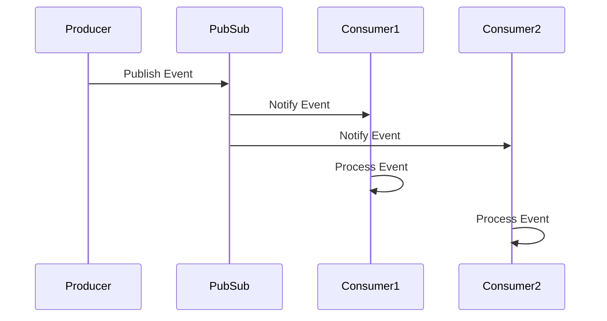

## 20.2. Event-Driven Architecture

Event-Driven Architecture (EDA) is a powerful paradigm that enables systems to react to events rather than following a predefined control flow. In the context of Elixir, EDA leverages the language's strengths in concurrency and fault tolerance to build scalable, decoupled systems. Let's delve into the core concepts of EDA, explore its benefits, and demonstrate how to implement it in Elixir using message passing and PubSub systems.

### Understanding Event-Driven Architecture

EDA revolves around the concept of events, which are significant occurrences within a system that can trigger responses. These events can originate from user actions, system changes, or external inputs. The architecture is characterized by the following components:

1. **Event Producers**: These are sources that generate events. They can be user interfaces, sensors, or other systems.
2. **Event Consumers**: These are entities that react to events. They can perform actions, update state, or trigger further events.
3. **Event Channels**: These are pathways through which events are transmitted from producers to consumers. In Elixir, these often take the form of message queues or PubSub systems.

### Asynchronous Event Handling

Asynchronous event handling is at the heart of EDA. It allows systems to process events independently of the main execution flow, improving responsiveness and throughput. In Elixir, this is achieved through lightweight processes and message passing.

#### Designing Systems That React to Events

To design an event-driven system, follow these steps:

1. **Identify Events**: Determine the significant occurrences that should trigger actions in your system.
2. **Define Event Producers**: Specify the components responsible for generating events.
3. **Establish Event Channels**: Set up the pathways for event transmission, such as message queues or PubSub systems.
4. **Implement Event Consumers**: Develop components that listen for and react to events.

### Benefits of Event-Driven Architecture

EDA offers several advantages:

- **Scalability**: By decoupling components, EDA allows systems to scale horizontally. Each component can be scaled independently based on demand.
- **Decoupling**: Components in an event-driven system are loosely coupled, enabling easier maintenance and evolution.
- **Resilience**: EDA supports fault tolerance by isolating failures to individual components, preventing system-wide impacts.
- **Flexibility**: Systems can easily adapt to new requirements by adding or modifying event producers and consumers.

### Implementing Event-Driven Architecture in Elixir

Elixir's concurrency model and message-passing capabilities make it an ideal choice for implementing EDA. Let's explore how to use these features to build an event-driven system.

#### Using Message Passing

Elixir processes communicate via message passing, a core feature that facilitates asynchronous event handling. Here's a simple example of message passing between processes:

```elixir
defmodule EventProducer do
  def start_link do
    spawn_link(__MODULE__, :loop, [])
  end

  def loop do
    receive do
      {:event, message} ->
        IO.puts("Received event: #{message}")
        loop()
    end
  end
end

defmodule EventConsumer do
  def start_link(producer_pid) do
    spawn_link(__MODULE__, :loop, [producer_pid])
  end

  def loop(producer_pid) do
    send(producer_pid, {:event, "Hello, Event-Driven Architecture!"})
    :timer.sleep(1000)
    loop(producer_pid)
  end
end

# Start the producer and consumer
producer_pid = EventProducer.start_link()
EventConsumer.start_link(producer_pid)
```

**Explanation**: In this example, `EventProducer` listens for events and prints them, while `EventConsumer` sends events to the producer. This demonstrates basic message passing in Elixir.

#### Using PubSub Systems

PubSub (Publish-Subscribe) systems are a common pattern in EDA, allowing multiple consumers to subscribe to events from various producers. In Elixir, the `Phoenix.PubSub` library provides a robust implementation.

```elixir
defmodule MyApp.PubSub do
  use Phoenix.PubSub, otp_app: :my_app
end

defmodule EventProducer do
  def publish_event(event) do
    Phoenix.PubSub.broadcast(MyApp.PubSub, "events", {:event, event})
  end
end

defmodule EventConsumer do
  def start_link do
    Phoenix.PubSub.subscribe(MyApp.PubSub, "events")
    loop()
  end

  def loop do
    receive do
      {:event, message} ->
        IO.puts("Received event: #{message}")
        loop()
    end
  end
end

# Start the consumer
EventConsumer.start_link()
# Publish an event
EventProducer.publish_event("Hello, PubSub!")
```

**Explanation**: Here, `EventProducer` publishes events to a channel, and `EventConsumer` subscribes to the channel to receive events. This pattern allows multiple consumers to react to the same event.

### Visualizing Event-Driven Architecture

To better understand EDA, let's visualize the flow of events between producers and consumers using a sequence diagram.


```mermaid
sequenceDiagram
    participant Producer
    participant PubSub
    participant Consumer1
    participant Consumer2

    Producer->>PubSub: Publish Event
    PubSub->>Consumer1: Notify Event
    PubSub->>Consumer2: Notify Event
    Consumer1->>Consumer1: Process Event
    Consumer2->>Consumer2: Process Event
```

**Description**: This diagram illustrates how a producer publishes an event to a PubSub system, which then notifies multiple consumers. Each consumer processes the event independently.

### Key Considerations

When implementing EDA in Elixir, consider the following:

- **Event Granularity**: Determine the level of detail for events. Too granular can lead to excessive noise, while too coarse can miss important changes.
- **Error Handling**: Implement robust error handling to manage failures in event processing.
- **Performance**: Monitor and optimize performance, especially in high-throughput systems.
- **Security**: Ensure that event channels are secure to prevent unauthorized access or tampering.

### Elixir Unique Features

Elixir's unique features enhance EDA implementation:

- **Lightweight Processes**: Elixir's processes are lightweight, enabling efficient handling of concurrent events.
- **Fault Tolerance**: The "let it crash" philosophy supports resilient systems by allowing processes to fail and recover gracefully.
- **OTP**: The Open Telecom Platform provides tools for building robust, scalable applications, including GenServer and Supervisor patterns.

### Differences and Similarities with Other Patterns

EDA shares similarities with other patterns, such as:

- **Observer Pattern**: Both involve notifying components of changes, but EDA is more scalable and decoupled.
- **Message Queues**: EDA can use message queues for event transmission, similar to traditional messaging systems.

### Try It Yourself

Experiment with the code examples by:

- Modifying event messages to see how consumers react.
- Adding more consumers to observe PubSub behavior.
- Implementing error handling in the event loop.

### Knowledge Check

1. What is the main advantage of using EDA in a distributed system?
2. How does Elixir's concurrency model benefit EDA?
3. Describe the role of PubSub in an event-driven system.
4. What are some key considerations when designing an event-driven system?
5. How does EDA differ from the Observer pattern?

### Embrace the Journey

Remember, mastering EDA is a journey. As you explore and implement these concepts, you'll build more resilient and scalable systems. Keep experimenting, stay curious, and enjoy the process!

## Quiz Time!



### What is a core component of Event-Driven Architecture?

- [x] Event Producers
- [ ] Database Tables
- [ ] Static Files
- [ ] CSS Stylesheets

> **Explanation:** Event Producers are a core component of EDA, responsible for generating events.

### How does Elixir handle asynchronous event processing?

- [x] Through message passing
- [ ] By using global variables
- [ ] Through synchronous function calls
- [ ] By using shared memory

> **Explanation:** Elixir uses message passing between processes to handle asynchronous event processing.

### What is the role of PubSub in EDA?

- [x] To broadcast events to multiple consumers
- [ ] To store events in a database
- [ ] To compile code at runtime
- [ ] To manage user sessions

> **Explanation:** PubSub systems broadcast events to multiple consumers, allowing them to react independently.

### Which Elixir feature supports fault tolerance in EDA?

- [x] The "let it crash" philosophy
- [ ] Global locks
- [ ] Synchronous execution
- [ ] Manual memory management

> **Explanation:** The "let it crash" philosophy supports fault tolerance by allowing processes to fail and recover.

### What is a benefit of decoupling components in EDA?

- [x] Easier maintenance and evolution
- [ ] Increased code complexity
- [ ] Slower system performance
- [ ] More rigid architecture

> **Explanation:** Decoupling components makes systems easier to maintain and evolve.

### Which of the following is NOT a characteristic of EDA?

- [ ] Scalability
- [ ] Decoupling
- [x] Tight coupling
- [ ] Flexibility

> **Explanation:** EDA is characterized by decoupling, not tight coupling.

### What is an advantage of using lightweight processes in Elixir?

- [x] Efficient handling of concurrent events
- [ ] Increased memory usage
- [ ] Slower execution
- [ ] More complex code

> **Explanation:** Lightweight processes enable efficient handling of concurrent events.

### How does EDA differ from the Observer pattern?

- [x] EDA is more scalable and decoupled
- [ ] EDA uses synchronous notifications
- [ ] Observer pattern is more scalable
- [ ] Observer pattern uses PubSub systems

> **Explanation:** EDA is more scalable and decoupled compared to the Observer pattern.

### What should be considered when designing an event-driven system?

- [x] Event granularity
- [ ] Hardcoding all values
- [ ] Using only synchronous operations
- [ ] Avoiding error handling

> **Explanation:** Event granularity is important to avoid excessive noise or missing changes.

### True or False: EDA can use message queues for event transmission.

- [x] True
- [ ] False

> **Explanation:** EDA can use message queues to transmit events between producers and consumers.




