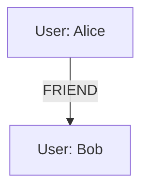

## 20.3. Graph Databases and Property Graphs

Graph databases have emerged as a powerful tool for managing complex data relationships, offering a flexible and intuitive way to model interconnected data. In this section, we will delve into the world of graph databases and property graphs, exploring their integration with Elixir, and examining their use cases and practical applications.

### Understanding Graph Databases

Graph databases are designed to store and manage data in a graph format, which consists of nodes, edges, and properties. This structure is particularly well-suited for representing complex relationships and interconnected data, making graph databases an ideal choice for applications such as social networks, recommendation engines, and fraud detection systems.

#### Key Concepts

- **Nodes**: Represent entities or objects in the graph. Each node can have properties that describe its characteristics.
- **Edges**: Define the relationships between nodes. Edges can also have properties that provide additional context about the relationship.
- **Properties**: Attributes or metadata associated with nodes and edges. Properties can store various types of data, such as strings, numbers, or dates.

#### Advantages of Graph Databases

- **Flexibility**: Graph databases allow for dynamic schema evolution, enabling developers to adapt the data model as requirements change.
- **Performance**: Efficiently handle complex queries involving deep relationships and interconnected data.
- **Intuitiveness**: Provide a natural way to model real-world relationships, making it easier to visualize and understand data.

### Integration with Elixir

Elixir, with its functional programming paradigm and robust concurrency model, is well-suited for integrating with graph databases. By leveraging Elixir's capabilities, developers can build scalable and efficient applications that harness the power of graph databases.

#### Connecting to Graph Databases

One of the most popular graph databases is Neo4j, which can be integrated with Elixir using the Bolt protocol. The Bolt protocol is a binary protocol designed for efficient communication with Neo4j databases.

##### Setting Up Neo4j

To get started with Neo4j, follow these steps:

1. **Install Neo4j**: Download and install Neo4j from the [official website](https://neo4j.com/download/).
2. **Start the Neo4j Server**: Launch the Neo4j server and access the Neo4j Browser at `http://localhost:7474`.
3. **Create a Database**: Use the Neo4j Browser to create a new database and define your graph schema.

##### Connecting Elixir to Neo4j

To connect Elixir to Neo4j, we can use the `bolt_sips` library, which provides a client for the Bolt protocol.

```elixir
# Add bolt_sips to your mix.exs dependencies
defp deps do
  [
    {:bolt_sips, "~> 2.0"}
  ]
end

# Configure the Bolt connection in config/config.exs
config :bolt_sips, Bolt,
  url: "bolt://localhost:7687",
  basic_auth: [username: "neo4j", password: "password"],
  pool_size: 10

# Use Bolt.Sips to interact with the Neo4j database
defmodule MyApp.Neo4jClient do
  alias Bolt.Sips, as: Neo4j

  def get_all_nodes do
    query = "MATCH (n) RETURN n"
    Neo4j.query!(Neo4j.conn(), query)
  end
end
```

### Use Cases for Graph Databases

Graph databases excel in scenarios where data relationships are complex and interconnected. Here are some common use cases:

#### Social Networks

Graph databases are ideal for modeling social networks, where users are connected through various relationships such as friendships, follows, and likes. The graph structure allows for efficient traversal and querying of these relationships.

#### Recommendation Engines

Recommendation engines can leverage graph databases to analyze user preferences and behaviors, identifying patterns and suggesting relevant content or products. The ability to traverse relationships quickly makes graph databases a powerful tool for building recommendation systems.

#### Complex Relationship Management

In domains such as supply chain management, healthcare, and finance, graph databases can model intricate relationships between entities, enabling organizations to gain insights and optimize processes.

### Practical Implementation in Elixir

Let's explore a practical example of using Elixir to interact with a graph database. We'll build a simple application that models a social network and performs basic operations such as adding users and establishing friendships.

#### Defining the Graph Schema

First, we'll define the schema for our social network graph. We'll have two types of nodes: `User` and `Friendship`.

```cypher
// Create User nodes
CREATE (u:User {name: 'Alice', age: 30})
CREATE (u:User {name: 'Bob', age: 25})

// Create Friendship relationships
MATCH (a:User {name: 'Alice'}), (b:User {name: 'Bob'})
CREATE (a)-[:FRIEND]->(b)
```

#### Implementing Elixir Functions

Next, we'll implement Elixir functions to interact with our graph database.

```elixir
defmodule MyApp.SocialNetwork do
  alias Bolt.Sips, as: Neo4j

  def add_user(name, age) do
    query = """
    CREATE (u:User {name: $name, age: $age})
    """
    Neo4j.query!(Neo4j.conn(), query, %{name: name, age: age})
  end

  def add_friendship(user1, user2) do
    query = """
    MATCH (a:User {name: $user1}), (b:User {name: $user2})
    CREATE (a)-[:FRIEND]->(b)
    """
    Neo4j.query!(Neo4j.conn(), query, %{user1: user1, user2: user2})
  end

  def get_friends(user) do
    query = """
    MATCH (a:User {name: $user})-[:FRIEND]->(b)
    RETURN b.name AS friend
    """
    Neo4j.query!(Neo4j.conn(), query, %{user: user})
  end
end
```

#### Testing the Implementation

Let's test our implementation by adding users and establishing friendships.

```elixir
MyApp.SocialNetwork.add_user("Alice", 30)
MyApp.SocialNetwork.add_user("Bob", 25)
MyApp.SocialNetwork.add_friendship("Alice", "Bob")

friends_of_alice = MyApp.SocialNetwork.get_friends("Alice")
IO.inspect(friends_of_alice)
```

### Visualizing Graph Data

Visualizing graph data can provide valuable insights into the structure and relationships within your data. Neo4j offers built-in visualization tools, and you can also use external tools like Graphviz to create custom visualizations.



### Design Considerations

When integrating graph databases with Elixir, consider the following:

- **Data Modeling**: Carefully design your graph schema to accurately represent the relationships and entities in your domain.
- **Query Optimization**: Optimize your queries to ensure efficient traversal and data retrieval.
- **Scalability**: Leverage Elixir's concurrency model to handle large volumes of data and concurrent requests.

### Elixir Unique Features

Elixir's functional programming paradigm and concurrency model make it an excellent choice for building applications that integrate with graph databases. The ability to handle concurrent requests efficiently and the support for pattern matching and immutability align well with the needs of graph database applications.

### Differences and Similarities

Graph databases share similarities with other NoSQL databases in terms of flexibility and scalability. However, they differ in their focus on relationships and graph structures, making them uniquely suited for certain applications.

### Try It Yourself

Experiment with the code examples provided in this section. Try adding more users, creating additional relationships, and querying the graph to explore its structure. Consider visualizing the graph using Neo4j's tools or external visualization libraries.

### Knowledge Check

- What are the key components of a graph database?
- How does Elixir's concurrency model benefit graph database integration?
- What are some common use cases for graph databases?

### Summary

Graph databases offer a powerful way to model and manage complex relationships in data. By integrating graph databases with Elixir, developers can build scalable and efficient applications that leverage the strengths of both technologies. As you continue to explore graph databases, remember to experiment, visualize, and optimize your data models and queries.

## Quiz: Graph Databases and Property Graphs



### What are the primary components of a graph database?

- [x] Nodes, edges, and properties
- [ ] Tables, columns, and rows
- [ ] Documents, collections, and fields
- [ ] Keys, values, and indexes

> **Explanation:** Graph databases consist of nodes, edges, and properties, which represent entities, relationships, and attributes, respectively.

### Which protocol is commonly used to connect Elixir to Neo4j?

- [x] Bolt protocol
- [ ] HTTP protocol
- [ ] WebSocket protocol
- [ ] MQTT protocol

> **Explanation:** The Bolt protocol is a binary protocol designed for efficient communication with Neo4j databases.

### What is a common use case for graph databases?

- [x] Social networks
- [ ] Relational data storage
- [ ] Flat file storage
- [ ] Key-value storage

> **Explanation:** Graph databases are well-suited for modeling social networks due to their ability to efficiently handle complex relationships.

### How does Elixir's concurrency model benefit graph database integration?

- [x] Efficient handling of concurrent requests
- [ ] Simplifies data modeling
- [ ] Reduces memory usage
- [ ] Enhances visualization capabilities

> **Explanation:** Elixir's concurrency model allows for efficient handling of concurrent requests, which is beneficial for applications that integrate with graph databases.

### What is the purpose of the `bolt_sips` library in Elixir?

- [x] To connect Elixir to Neo4j using the Bolt protocol
- [ ] To visualize graph data
- [ ] To perform data encryption
- [ ] To manage database migrations

> **Explanation:** The `bolt_sips` library provides a client for connecting Elixir to Neo4j using the Bolt protocol.

### Which of the following is NOT a benefit of graph databases?

- [ ] Flexibility
- [ ] Performance
- [x] Fixed schema
- [ ] Intuitiveness

> **Explanation:** Graph databases offer flexibility, performance, and intuitiveness, but they do not have a fixed schema.

### What is a key advantage of using graph databases for recommendation engines?

- [x] Efficient traversal of relationships
- [ ] Simplified data encryption
- [ ] Reduced storage requirements
- [ ] Enhanced data visualization

> **Explanation:** Graph databases allow for efficient traversal of relationships, making them ideal for recommendation engines.

### What is the role of properties in a graph database?

- [x] To store attributes of nodes and edges
- [ ] To define relationships between nodes
- [ ] To manage database transactions
- [ ] To visualize graph data

> **Explanation:** Properties store attributes or metadata associated with nodes and edges in a graph database.

### Which Elixir feature aligns well with graph database applications?

- [x] Concurrency model
- [ ] Object-oriented programming
- [ ] Fixed schema design
- [ ] Low-level memory management

> **Explanation:** Elixir's concurrency model aligns well with the needs of graph database applications, allowing for efficient handling of concurrent requests.

### True or False: Graph databases are a type of NoSQL database.

- [x] True
- [ ] False

> **Explanation:** Graph databases are a type of NoSQL database, focusing on relationships and graph structures.



Remember, this is just the beginning. As you progress, you'll build more complex and interactive applications that leverage the power of graph databases. Keep experimenting, stay curious, and enjoy the journey!
