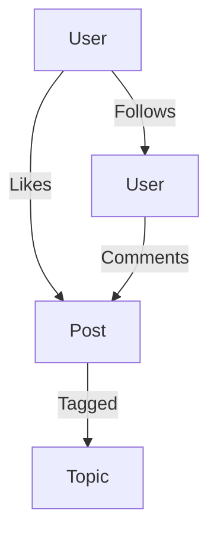

## 20.3. Graph Databases and Property Graphs

As we delve deeper into advanced topics and emerging technologies, understanding graph databases and property graphs becomes essential for expert software engineers and architects. These tools are crucial in managing complex data relationships and are widely used in applications such as social networks, recommendation engines, and systems requiring intricate relationship management.

### Understanding Graph Databases

Graph databases are designed to store data in a graph structure, consisting of nodes, edges, and properties. This model is particularly effective for representing and querying complex relationships and interconnected data.

#### Key Concepts

- **Nodes**: These are the entities or objects within the database. Each node can have properties, which are key-value pairs that describe the node.
- **Edges**: These define the relationships between nodes. Like nodes, edges can also have properties.
- **Properties**: These are attributes or metadata associated with nodes and edges, providing additional context.

#### Why Use Graph Databases?

Graph databases excel in scenarios where relationships between data points are as important as the data itself. They provide:

- **Flexibility**: Easily accommodate changes in the data model.
- **Performance**: Efficiently traverse relationships, making them ideal for real-time applications.
- **Intuitiveness**: Represent data in a way that mirrors real-world relationships.

### Integration with Elixir

Elixir, known for its concurrency and fault-tolerance, can be effectively integrated with graph databases to leverage these strengths. One popular graph database is Neo4j, which can be accessed using the Bolt protocol.

#### Connecting to Neo4j with Elixir

To connect Elixir applications to Neo4j, we can use libraries like `bolt_sips`. This library allows us to interact with Neo4j using the Bolt protocol, providing a seamless integration.

```elixir
# Add bolt_sips to your mix.exs dependencies
defp deps do
  [
    {:bolt_sips, "~> 2.0"}
  ]
end
```

```elixir
# Configuration for connecting to Neo4j
config :bolt_sips, Bolt,
  url: "bolt://localhost:7687",
  basic_auth: [username: "neo4j", password: "password"],
  pool_size: 10
```

```elixir
# Example of querying Neo4j from Elixir
defmodule GraphExample do
  alias Bolt.Sips, as: Bolt

  def fetch_data do
    Bolt.query!(Bolt.conn(), "MATCH (n) RETURN n LIMIT 10")
  end
end
```

### Use Cases

Graph databases are versatile and can be applied across various domains:

- **Social Networks**: Model users, relationships, and interactions.
- **Recommendation Engines**: Analyze user preferences and behaviors to suggest content.
- **Fraud Detection**: Identify unusual patterns and connections in financial transactions.
- **Network and IT Operations**: Map and manage complex IT infrastructures.

### Visualizing Graph Databases

To better understand the structure and relationships within a graph database, visualizations can be incredibly helpful. Below is a simple representation using Mermaid.js to illustrate how nodes and edges connect.


```mermaid
graph TD;
    A[User] -->|Follows| B[User]
    A -->|Likes| C[Post]
    B -->|Comments| C
    C -->|Tagged| D[Topic]
```

**Description**: This diagram shows a basic social network model where users can follow each other, like posts, and comment on them. Posts can also be tagged with topics.

### Elixir's Unique Features for Graph Databases

Elixir's strengths, such as concurrency and fault tolerance, complement graph databases well:

- **Concurrency**: Handle multiple queries and operations simultaneously.
- **Fault Tolerance**: Ensure the system remains operational even when parts fail.
- **Scalability**: Easily scale applications to manage large datasets and user bases.

### Differences and Similarities with Other Data Models

While graph databases are distinct in their focus on relationships, they share some similarities with other data models:

- **Relational Databases**: Both can store structured data, but graph databases excel in querying complex relationships.
- **Document Stores**: Like graph databases, document stores offer flexibility, but they lack the inherent relationship modeling capabilities.

### Design Considerations

When deciding to use a graph database, consider the following:

- **Complexity of Relationships**: Use graph databases when relationships are complex and numerous.
- **Real-Time Requirements**: Ideal for applications needing real-time data traversal and analysis.
- **Integration Needs**: Ensure the database can integrate seamlessly with existing systems and technologies.

### Try It Yourself

To get hands-on experience, try modifying the Elixir code example to perform different queries or connect to a different graph database. Experiment with adding nodes, creating relationships, and querying them to see how graph databases can be applied to your projects.

### Knowledge Check

To reinforce your understanding, consider the following questions:

- What are the primary components of a graph database?
- How does Elixir's concurrency model benefit graph database interactions?
- In what scenarios would a graph database be more beneficial than a relational database?

### Summary

Graph databases and property graphs offer a powerful way to model and query complex relationships. By integrating these with Elixir, developers can build scalable, fault-tolerant applications that leverage the strengths of both technologies. As you continue to explore these tools, remember to experiment and apply them to real-world scenarios to fully grasp their potential.

## Quiz Time!



### What is a primary advantage of using graph databases?

- [x] Efficiently traverse complex relationships
- [ ] Store large amounts of unstructured data
- [ ] Simplify data normalization
- [ ] Reduce storage costs

> **Explanation:** Graph databases are designed to efficiently traverse and query complex relationships between data points.

### Which Elixir library is commonly used to connect to Neo4j?

- [x] bolt_sips
- [ ] ecto
- [ ] phoenix
- [ ] plug

> **Explanation:** The `bolt_sips` library is used to connect Elixir applications to Neo4j using the Bolt protocol.

### What are nodes in a graph database?

- [x] Entities or objects with properties
- [ ] Connections between entities
- [ ] Key-value pairs
- [ ] Indexes for fast retrieval

> **Explanation:** Nodes represent entities or objects in a graph database and can have properties.

### How does Elixir's concurrency model benefit graph database interactions?

- [x] Allows handling multiple queries simultaneously
- [ ] Simplifies database schema design
- [ ] Reduces data redundancy
- [ ] Increases data storage capacity

> **Explanation:** Elixir's concurrency model allows handling multiple queries and operations simultaneously, enhancing performance.

### In what scenario would a graph database be more beneficial than a relational database?

- [x] Modeling complex relationships
- [ ] Storing large binary files
- [ ] Performing simple CRUD operations
- [ ] Managing flat, tabular data

> **Explanation:** Graph databases excel in scenarios where modeling and querying complex relationships are required.

### What is the Bolt protocol used for?

- [x] Connecting to Neo4j databases
- [ ] Encrypting data in transit
- [ ] Managing database transactions
- [ ] Synchronizing distributed systems

> **Explanation:** The Bolt protocol is used for connecting to Neo4j databases from client applications.

### What is an edge in a graph database?

- [x] A relationship between nodes
- [ ] A property of a node
- [ ] A type of database index
- [ ] A method of data encryption

> **Explanation:** An edge represents a relationship between nodes in a graph database.

### Which of the following is a use case for graph databases?

- [x] Social networks
- [ ] Flat file storage
- [ ] Simple key-value storage
- [ ] Basic arithmetic operations

> **Explanation:** Graph databases are well-suited for use cases like social networks, where complex relationships are prevalent.

### What is a property in a graph database?

- [x] An attribute or metadata associated with nodes or edges
- [ ] A type of database schema
- [ ] A method for data encryption
- [ ] A protocol for database communication

> **Explanation:** Properties are attributes or metadata associated with nodes or edges in a graph database.

### True or False: Elixir's fault tolerance is beneficial for maintaining operational graph database systems.

- [x] True
- [ ] False

> **Explanation:** Elixir's fault tolerance ensures that systems remain operational even when parts fail, which is beneficial for maintaining graph database systems.



Remember, this is just the beginning. As you progress, you'll discover more about the power of graph databases and their integration with Elixir. Keep exploring, stay curious, and enjoy the journey!
