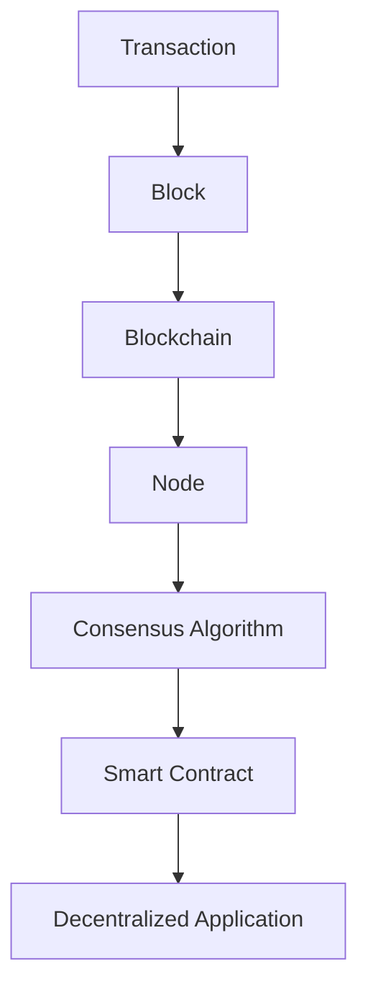

## 20.4. Blockchain and Distributed Ledger Technologies

Blockchain technology has revolutionized the way we think about data integrity, security, and decentralization. As expert software engineers and architects, understanding how to leverage Elixir in building blockchain applications can open up new possibilities for creating scalable and fault-tolerant systems. In this section, we will delve into the basics of blockchain, explore how Elixir can be used in blockchain development, and examine some projects and frameworks that utilize Elixir for blockchain solutions.

### Blockchain Basics

Blockchain is a decentralized, immutable ledger technology that allows for secure and transparent record-keeping. It is the backbone of cryptocurrencies like Bitcoin and Ethereum, but its applications extend far beyond digital currencies. Let's break down the core components of blockchain technology:

- **Decentralization**: Unlike traditional databases that are controlled by a central authority, blockchains are distributed across a network of nodes. Each node has a copy of the entire blockchain, ensuring that no single point of failure exists.

- **Immutability**: Once data is recorded on the blockchain, it cannot be altered or deleted. This is achieved through cryptographic hashing and consensus algorithms, which ensure the integrity of the data.

- **Transparency**: All transactions on a blockchain are visible to all participants in the network. This transparency builds trust among users, as they can verify transactions independently.

- **Consensus Mechanisms**: Blockchains use various consensus mechanisms, such as Proof of Work (PoW) and Proof of Stake (PoS), to agree on the validity of transactions and maintain the integrity of the ledger.

#### Key Components of a Blockchain

1. **Blocks**: Each block contains a list of transactions, a timestamp, and a cryptographic hash of the previous block, linking them together in a chain.

2. **Nodes**: These are the computers that participate in the blockchain network. They validate and relay transactions, ensuring the network's security and integrity.

3. **Smart Contracts**: These are self-executing contracts with the terms of the agreement directly written into code. They automatically enforce and execute the terms of the contract when predefined conditions are met.

4. **Cryptographic Hashing**: This ensures the security and integrity of the data on the blockchain. Each block contains a hash of the previous block, creating a secure chain of blocks.

5. **Consensus Algorithms**: These are protocols that nodes in the network use to agree on the state of the blockchain. They ensure that all copies of the distributed ledger are the same.

### Elixir in Blockchain

Elixir, with its concurrency model and fault-tolerant design, is well-suited for building blockchain applications. Here are some reasons why Elixir is a great choice for blockchain development:

- **Concurrency**: Elixir's lightweight processes and message-passing capabilities make it ideal for handling the high concurrency demands of blockchain networks.

- **Fault Tolerance**: Built on the Erlang VM, Elixir inherits its fault-tolerant capabilities, making it robust against failures and ensuring high availability.

- **Scalability**: Elixir's ability to handle thousands of concurrent connections makes it suitable for large-scale blockchain applications.

- **Functional Programming**: Elixir's functional programming paradigm encourages immutability and statelessness, aligning well with the principles of blockchain technology.

#### Building Blockchain Applications with Elixir

To build a blockchain application in Elixir, you need to understand the following concepts:

1. **Node Communication**: Use Elixir's GenServer and GenStage to manage node communication and transaction processing.

2. **Data Structures**: Implement efficient data structures to store and manage blockchain data, such as Merkle trees for transaction verification.

3. **Consensus Algorithms**: Implement consensus algorithms using Elixir's concurrency features to ensure data integrity and agreement among nodes.

4. **Smart Contracts**: Develop smart contracts using Elixir's metaprogramming capabilities to create self-executing contracts.

5. **Security**: Leverage Elixir's cryptographic libraries to ensure the security and integrity of blockchain data.

#### Sample Code: A Simple Blockchain in Elixir

Let's look at a simple example of a blockchain implementation in Elixir:

```elixir
defmodule Blockchain do
  defstruct chain: []

  def new_blockchain do
    %Blockchain{chain: [%{index: 0, previous_hash: "0", timestamp: :os.system_time(:seconds), data: "Genesis Block", hash: "0"}]}
  end

  def add_block(blockchain, data) do
    previous_block = List.last(blockchain.chain)
    index = previous_block.index + 1
    timestamp = :os.system_time(:seconds)
    previous_hash = previous_block.hash
    hash = :crypto.hash(:sha256, "#{index}#{previous_hash}#{timestamp}#{data}") |> Base.encode16()
    new_block = %{index: index, previous_hash: previous_hash, timestamp: timestamp, data: data, hash: hash}
    %{blockchain | chain: blockchain.chain ++ [new_block]}
  end
end

# Create a new blockchain
blockchain = Blockchain.new_blockchain()

# Add a new block
blockchain = Blockchain.add_block(blockchain, "New Block Data")

IO.inspect(blockchain)
```

In this example, we define a simple blockchain with functions to create a new blockchain and add new blocks. Each block contains an index, previous hash, timestamp, data, and hash. The `add_block` function calculates the hash of the new block using the SHA-256 algorithm.

### Projects and Frameworks

Several projects and frameworks leverage Elixir for blockchain development. Let's explore some notable ones:

#### Aeternity

Aeternity is a blockchain platform built with Elixir that focuses on scalability, efficiency, and security. It introduces several innovative features, such as state channels for off-chain transactions and oracles for real-world data integration.

- **State Channels**: Aeternity uses state channels to enable off-chain transactions, reducing the load on the main blockchain and increasing transaction throughput.

- **Oracles**: Oracles allow smart contracts to interact with real-world data, enabling a wide range of decentralized applications.

- **Sophia Smart Contracts**: Aeternity uses the Sophia programming language for smart contracts, which is designed to be secure and efficient.

#### Other Elixir-Based Blockchain Projects

- **ArcBlock**: A blockchain platform that uses Elixir for building decentralized applications and services.

- **POA Network**: A blockchain network that uses Elixir for its consensus mechanism and node management.

### Visualizing Blockchain Architecture

To better understand the architecture of a blockchain, let's visualize it using a Mermaid.js diagram:



This diagram illustrates the flow of a transaction through the blockchain architecture, from the initial transaction to its inclusion in a block, propagation across nodes, consensus validation, and execution of smart contracts in decentralized applications.

### Design Considerations

When designing blockchain applications with Elixir, consider the following:

- **Scalability**: Ensure your application can handle a large number of transactions and nodes.

- **Security**: Implement robust security measures to protect against attacks and ensure data integrity.

- **Interoperability**: Design your application to interact with other blockchain networks and systems.

- **Usability**: Focus on creating user-friendly interfaces and experiences for interacting with the blockchain.

### Elixir Unique Features

Elixir's unique features, such as its concurrency model, fault tolerance, and functional programming paradigm, make it an excellent choice for blockchain development. These features enable developers to build scalable, secure, and efficient blockchain applications.

### Differences and Similarities

Blockchain technology shares similarities with distributed databases, but it differs in its decentralization, immutability, and consensus mechanisms. Understanding these differences is crucial for designing effective blockchain solutions.

### Try It Yourself

Experiment with the provided code example by modifying the data structure or implementing additional features, such as a consensus algorithm or smart contract execution. This hands-on approach will deepen your understanding of blockchain development with Elixir.

### Knowledge Check

- What are the key components of a blockchain?
- How does Elixir's concurrency model benefit blockchain development?
- What are state channels, and how do they improve blockchain scalability?
- How can Elixir's metaprogramming capabilities be used in smart contract development?

### Summary

Blockchain technology offers a decentralized, secure, and transparent way to manage data. Elixir's concurrency, fault tolerance, and functional programming features make it a powerful tool for building blockchain applications. By understanding the basics of blockchain and leveraging Elixir's unique capabilities, you can create scalable and efficient decentralized solutions.

## Quiz: Blockchain and Distributed Ledger Technologies



### What is a key feature of blockchain technology?

- [x] Immutability
- [ ] Centralization
- [ ] Volatility
- [ ] Anonymity

> **Explanation:** Immutability ensures that once data is recorded on the blockchain, it cannot be altered or deleted.

### How does Elixir's concurrency model benefit blockchain development?

- [x] It allows handling high concurrency demands.
- [ ] It simplifies smart contract development.
- [ ] It reduces the need for cryptographic hashing.
- [ ] It eliminates the need for consensus mechanisms.

> **Explanation:** Elixir's concurrency model allows for handling multiple processes simultaneously, which is essential for blockchain networks.

### What is a state channel in blockchain technology?

- [x] A method for off-chain transactions
- [ ] A type of consensus algorithm
- [ ] A cryptographic hash function
- [ ] A smart contract language

> **Explanation:** State channels enable off-chain transactions, reducing the load on the main blockchain.

### Which Elixir feature is particularly useful for smart contract development?

- [x] Metaprogramming
- [ ] Pattern matching
- [ ] Tail call optimization
- [ ] The pipe operator

> **Explanation:** Metaprogramming allows for creating self-executing contracts with dynamic behavior.

### What is the role of nodes in a blockchain network?

- [x] Validate and relay transactions
- [ ] Create smart contracts
- [ ] Store user data
- [ ] Manage consensus algorithms

> **Explanation:** Nodes validate and relay transactions, ensuring the network's security and integrity.

### Which project uses Elixir for blockchain development?

- [x] Aeternity
- [ ] Ethereum
- [ ] Bitcoin
- [ ] Ripple

> **Explanation:** Aeternity is a blockchain platform built with Elixir, focusing on scalability and security.

### What is a consensus algorithm?

- [x] A protocol for agreeing on the state of the blockchain
- [ ] A method for encrypting data
- [ ] A type of smart contract
- [ ] A blockchain data structure

> **Explanation:** Consensus algorithms ensure that all copies of the distributed ledger are the same.

### How does Elixir's fault tolerance benefit blockchain applications?

- [x] It ensures high availability and robustness against failures.
- [ ] It simplifies transaction processing.
- [ ] It reduces the need for cryptographic hashing.
- [ ] It eliminates the need for smart contracts.

> **Explanation:** Fault tolerance ensures that blockchain applications remain available and robust, even in the face of failures.

### What is the purpose of cryptographic hashing in blockchain?

- [x] To ensure data security and integrity
- [ ] To create smart contracts
- [ ] To manage consensus algorithms
- [ ] To store user data

> **Explanation:** Cryptographic hashing ensures the security and integrity of data on the blockchain.

### True or False: Elixir is not suitable for blockchain development due to its lack of concurrency features.

- [ ] True
- [x] False

> **Explanation:** False. Elixir's concurrency features make it well-suited for blockchain development.



Remember, this is just the beginning. As you progress, you'll build more complex and interactive blockchain applications. Keep experimenting, stay curious, and enjoy the journey!
