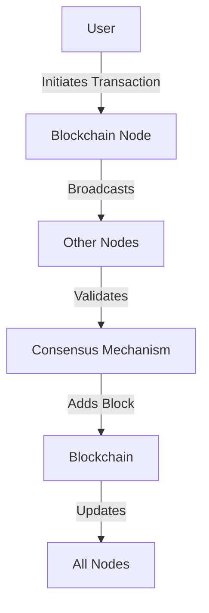

## 20.4. Blockchain and Distributed Ledger Technologies

Blockchain and distributed ledger technologies (DLT) have emerged as revolutionary concepts in the realm of digital transactions and data management. They offer a decentralized, immutable way to record and verify transactions, making them highly secure and transparent. In this section, we will delve into the fundamentals of blockchain, explore how Elixir's unique features can be leveraged in blockchain development, and examine some notable projects and frameworks built with Elixir.

### Blockchain Basics

Blockchain is essentially a distributed database that maintains a continuously growing list of ordered records called blocks. Each block contains a timestamp, a cryptographic hash of the previous block, and transaction data. The decentralized nature of blockchain ensures that no single entity has control over the entire chain, making it resistant to modification and fraud.

#### Key Characteristics of Blockchain

1. **Decentralization**: Unlike traditional databases that are controlled by a central authority, blockchains operate on a peer-to-peer network where each participant has access to the entire database.

2. **Immutability**: Once data is recorded in a blockchain, it is extremely difficult to alter. This is achieved through cryptographic hashes and consensus algorithms.

3. **Transparency**: All transactions on a blockchain are visible to all participants, promoting transparency and trust.

4. **Security**: The use of cryptographic techniques ensures that data is secure and protected against unauthorized access.

#### Types of Blockchains

- **Public Blockchains**: Open to anyone to participate, such as Bitcoin and Ethereum.
- **Private Blockchains**: Restricted access, typically used within organizations.
- **Consortium Blockchains**: Controlled by a group of organizations, offering a balance between openness and privacy.

### Elixir in Blockchain

Elixir is a functional, concurrent language built on the Erlang VM, known for its scalability and fault tolerance. These features make Elixir an excellent choice for blockchain development, where handling numerous transactions simultaneously and maintaining system reliability are crucial.

#### Leveraging Concurrency

Elixir's concurrency model, based on lightweight processes, allows developers to build scalable applications that can handle thousands of concurrent connections. This is particularly beneficial in blockchain networks, where multiple nodes need to process transactions simultaneously.

```elixir
defmodule Blockchain.TransactionProcessor do
  use GenServer

  # Starts the GenServer
  def start_link(initial_state) do
    GenServer.start_link(__MODULE__, initial_state, name: __MODULE__)
  end

  # Handles incoming transactions
  def handle_call({:process, transaction}, _from, state) do
    # Simulate transaction processing
    new_state = [transaction | state]
    {:reply, :ok, new_state}
  end
end
```

In the above example, we define a `TransactionProcessor` module using Elixir's `GenServer` to handle incoming transactions concurrently. This demonstrates how Elixir's concurrency model can be harnessed in blockchain applications.

#### Fault Tolerance and Reliability

Elixir's fault-tolerant design, inherited from Erlang, is another significant advantage for blockchain development. The "let it crash" philosophy encourages developers to build systems that can recover gracefully from failures, ensuring continuous operation.

```elixir
defmodule Blockchain.NodeSupervisor do
  use Supervisor

  def start_link(_) do
    Supervisor.start_link(__MODULE__, :ok, name: __MODULE__)
  end

  def init(:ok) do
    children = [
      {Blockchain.TransactionProcessor, []}
    ]

    Supervisor.init(children, strategy: :one_for_one)
  end
end
```

Here, we define a `NodeSupervisor` to manage the lifecycle of the `TransactionProcessor`. If the processor crashes, the supervisor will automatically restart it, maintaining the system's reliability.

### Projects and Frameworks

Several blockchain projects and frameworks have been developed using Elixir, taking advantage of its strengths in concurrency and fault tolerance.

#### Aeternity

Aeternity is a blockchain platform designed for scalable smart contracts and decentralized applications (dApps). Built with Elixir, Aeternity leverages Elixir's concurrency model to handle a high throughput of transactions and smart contract executions.

- **State Channels**: Aeternity uses state channels to enable off-chain transactions, reducing the load on the main blockchain and increasing transaction speed.
- **Oracles**: The platform integrates oracles to fetch real-world data for smart contracts, enhancing their functionality.

#### Other Notable Projects

- **ArcBlock**: A decentralized application development platform that uses Elixir for its backend services.
- **PoA Network**: A sidechain of Ethereum that utilizes Elixir for its consensus mechanism.

### Visualizing Blockchain Architecture

To better understand how blockchain operates, let's visualize its architecture using a simple diagram.


```mermaid
graph TD;
    A[User] -->|Initiates Transaction| B[Blockchain Node];
    B -->|Broadcasts| C[Other Nodes];
    C -->|Validates| D[Consensus Mechanism];
    D -->|Adds Block| E[Blockchain];
    E -->|Updates| F[All Nodes];
```

**Description**: This diagram illustrates the flow of a transaction in a blockchain network. A user initiates a transaction, which is broadcasted to the blockchain nodes. The nodes validate the transaction using a consensus mechanism, and once validated, the transaction is added as a block to the blockchain. All nodes then update their copies of the blockchain.

### Elixir's Unique Features in Blockchain

Elixir offers several unique features that make it well-suited for blockchain development:

- **Pattern Matching**: Simplifies data extraction and manipulation, which is crucial in processing blockchain transactions.
- **Immutable Data Structures**: Ensures data integrity and consistency, aligning with the immutable nature of blockchains.
- **Hot Code Swapping**: Allows for seamless updates to blockchain nodes without downtime, maintaining network availability.

### Design Considerations

When developing blockchain applications with Elixir, consider the following:

- **Scalability**: Leverage Elixir's concurrency to handle a large number of transactions.
- **Security**: Implement robust cryptographic techniques to protect data.
- **Interoperability**: Ensure compatibility with other blockchain networks and technologies.

### Try It Yourself

To get hands-on experience with Elixir and blockchain, try modifying the `TransactionProcessor` example to include transaction validation logic. Experiment with adding new features, such as logging transactions or implementing a simple consensus mechanism.

### Knowledge Check

- How does Elixir's concurrency model benefit blockchain development?
- What role does fault tolerance play in maintaining blockchain reliability?
- How can pattern matching in Elixir simplify blockchain transaction processing?

### References and Further Reading

- [Elixir Lang](https://elixir-lang.org/)
- [Aeternity Blockchain](https://aeternity.com/)
- [ArcBlock](https://www.arcblock.io/)

### Embrace the Journey

Remember, this is just the beginning. As you explore blockchain development with Elixir, you'll uncover new possibilities and challenges. Keep experimenting, stay curious, and enjoy the journey!

## Quiz Time!



### What is a key characteristic of blockchain technology?

- [x] Decentralization
- [ ] Centralization
- [ ] Mutability
- [ ] Single-point control

> **Explanation:** Blockchain is decentralized, meaning it operates on a peer-to-peer network without a central authority.

### How does Elixir's concurrency model benefit blockchain applications?

- [x] It allows handling thousands of concurrent transactions.
- [ ] It centralizes transaction processing.
- [ ] It limits the number of nodes in the network.
- [ ] It prevents transaction validation.

> **Explanation:** Elixir's concurrency model enables handling numerous transactions simultaneously, which is crucial for blockchain applications.

### What is the "let it crash" philosophy in Elixir?

- [x] Encouraging systems to recover gracefully from failures.
- [ ] Avoiding any system failures.
- [ ] Ignoring system errors.
- [ ] Preventing system crashes at all costs.

> **Explanation:** The "let it crash" philosophy focuses on building systems that can recover from failures, ensuring continuous operation.

### Which blockchain project is built with Elixir?

- [x] Aeternity
- [ ] Bitcoin
- [ ] Ethereum
- [ ] Ripple

> **Explanation:** Aeternity is a blockchain platform built using Elixir, leveraging its concurrency and fault tolerance.

### What is a state channel in blockchain?

- [x] A mechanism for off-chain transactions.
- [ ] A type of consensus algorithm.
- [ ] A blockchain node.
- [ ] A cryptographic hash function.

> **Explanation:** State channels enable off-chain transactions, reducing the load on the main blockchain and increasing speed.

### What is the primary use of pattern matching in Elixir?

- [x] Simplifying data extraction and manipulation.
- [ ] Encrypting blockchain data.
- [ ] Creating immutable data structures.
- [ ] Managing blockchain nodes.

> **Explanation:** Pattern matching in Elixir simplifies extracting and manipulating data, which is crucial for processing blockchain transactions.

### How does Elixir's hot code swapping benefit blockchain networks?

- [x] Allows seamless updates without downtime.
- [ ] Increases transaction speed.
- [ ] Enhances cryptographic security.
- [ ] Reduces node communication.

> **Explanation:** Hot code swapping enables updates to blockchain nodes without downtime, maintaining network availability.

### Which feature of Elixir ensures data integrity in blockchain?

- [x] Immutable data structures
- [ ] Mutable data structures
- [ ] Centralized control
- [ ] Single-threaded processing

> **Explanation:** Elixir's immutable data structures ensure data integrity and consistency, aligning with blockchain's immutable nature.

### What is a consortium blockchain?

- [x] Controlled by a group of organizations.
- [ ] Open to anyone to participate.
- [ ] Restricted to a single organization.
- [ ] A type of cryptographic hash function.

> **Explanation:** Consortium blockchains are controlled by a group of organizations, offering a balance between openness and privacy.

### True or False: Elixir is not suitable for blockchain development.

- [ ] True
- [x] False

> **Explanation:** False. Elixir is well-suited for blockchain development due to its concurrency, fault tolerance, and unique features.




