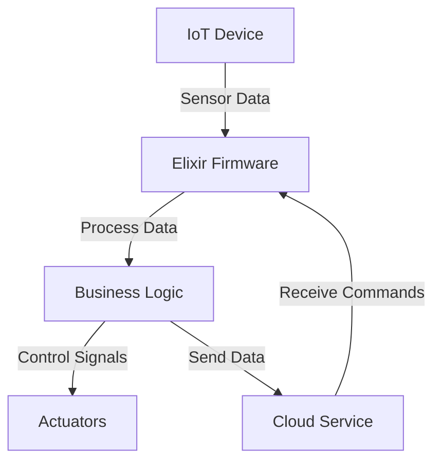

## 20.5. Internet of Things (IoT) with Nerves

The Internet of Things (IoT) has revolutionized the way we interact with the world around us, enabling a myriad of devices to communicate and perform tasks autonomously. In this section, we delve into the Nerves framework, a powerful tool for building IoT devices using Elixir. We will explore its architecture, use cases, and provide practical examples to help you get started with building your own IoT solutions.

### Introduction to Nerves

Nerves is an open-source framework designed to simplify the process of building and deploying embedded software. It leverages the power of Elixir, a functional programming language known for its concurrency and fault-tolerance, to create robust and scalable IoT applications. By using Nerves, developers can write firmware and system software in Elixir, taking advantage of its expressive syntax and powerful abstractions.

#### Key Features of Nerves

- **Unified Development Environment**: Nerves provides a consistent environment for developing, testing, and deploying embedded applications.
- **Cross-Platform Support**: It supports a wide range of hardware platforms, including Raspberry Pi, BeagleBone, and more.
- **Efficient Resource Management**: Nerves is optimized for low-resource environments, making it ideal for IoT devices.
- **Fault-Tolerant Design**: Built on the BEAM VM, Nerves inherits Elixir's fault-tolerance and concurrency capabilities.

### Building IoT Devices with Nerves

Building IoT devices involves several key steps, from writing firmware to deploying the final product. Let's explore each of these steps in detail.

#### Setting Up Your Development Environment

Before you start building IoT devices with Nerves, you need to set up your development environment. This involves installing Elixir, Erlang, and the Nerves framework.

1. **Install Elixir and Erlang**: Follow the instructions on the [Elixir website](https://elixir-lang.org/install.html) to install Elixir and Erlang on your machine.
2. **Install Nerves**: Use the following command to install Nerves:

   ```bash
   mix archive.install hex nerves_bootstrap
   ```

3. **Create a New Nerves Project**: Use the `mix` tool to create a new Nerves project:

   ```bash
   mix nerves.new my_iot_device
   cd my_iot_device
   ```

4. **Configure Your Target Hardware**: Edit the `mix.exs` file to specify your target hardware platform, such as Raspberry Pi or BeagleBone.

#### Writing Firmware in Elixir

Nerves allows you to write firmware in Elixir, providing a high-level abstraction over the underlying hardware. This makes it easier to develop complex IoT applications without worrying about low-level details.

- **Define Hardware Interfaces**: Use Elixir modules to define interfaces for interacting with hardware components, such as sensors and actuators.
- **Implement Business Logic**: Write Elixir functions to implement the business logic of your IoT application, such as data processing and decision-making.
- **Handle Concurrency**: Leverage Elixir's concurrency model to handle multiple tasks simultaneously, such as reading sensor data and sending alerts.

#### Deploying Your IoT Application

Once your application is ready, you can deploy it to your target hardware using Nerves. This involves building a firmware image and flashing it onto the device.

1. **Build the Firmware**: Use the following command to build the firmware image:

   ```bash
   mix firmware
   ```

2. **Flash the Firmware**: Connect your target device to your computer and use the following command to flash the firmware:

   ```bash
   mix firmware.burn
   ```

3. **Deploy and Test**: Deploy the firmware to your device and test its functionality. Use the Nerves REPL for interactive debugging and monitoring.

### Use Cases for Nerves in IoT

Nerves is versatile and can be used in a wide range of IoT applications. Here are some common use cases:

#### Home Automation

Nerves can be used to build smart home devices, such as thermostats, lighting systems, and security cameras. By leveraging Elixir's concurrency model, these devices can handle multiple tasks simultaneously, such as monitoring sensors and controlling actuators.

#### Industrial Monitoring

In industrial settings, Nerves can be used to build monitoring systems that track equipment performance and detect anomalies. These systems can process large volumes of data in real-time, providing valuable insights for predictive maintenance and optimization.

#### Connected Devices

Nerves is ideal for building connected devices that communicate with each other and with cloud services. These devices can be used in applications such as smart agriculture, healthcare, and transportation.

### Code Examples

Let's look at some code examples to illustrate how to build IoT applications with Nerves.

#### Example 1: Reading Sensor Data

In this example, we'll read data from a temperature sensor and log it to the console.

```elixir
defmodule MyIoTDevice.Sensor do
  use GenServer

  # Start the GenServer
  def start_link(_) do
    GenServer.start_link(__MODULE__, %{}, name: __MODULE__)
  end

  # Initialize the state
  def init(state) do
    schedule_read()
    {:ok, state}
  end

  # Handle the scheduled read
  def handle_info(:read_sensor, state) do
    temperature = read_temperature_sensor()
    IO.puts("Temperature: #{temperature}°C")
    schedule_read()
    {:noreply, state}
  end

  # Schedule the next read
  defp schedule_read() do
    Process.send_after(self(), :read_sensor, 1000)
  end

  # Simulate reading from a temperature sensor
  defp read_temperature_sensor() do
    :rand.uniform(30) + 10
  end
end
```

#### Example 2: Controlling an Actuator

In this example, we'll control an LED based on the temperature reading.

```elixir
defmodule MyIoTDevice.Actuator do
  use GenServer

  # Start the GenServer
  def start_link(_) do
    GenServer.start_link(__MODULE__, %{}, name: __MODULE__)
  end

  # Initialize the state
  def init(state) do
    {:ok, state}
  end

  # Control the LED based on temperature
  def handle_cast({:set_led, temperature}, state) do
    if temperature > 25 do
      turn_on_led()
    else
      turn_off_led()
    end
    {:noreply, state}
  end

  # Simulate turning on the LED
  defp turn_on_led() do
    IO.puts("LED is ON")
  end

  # Simulate turning off the LED
  defp turn_off_led() do
    IO.puts("LED is OFF")
  end
end
```

### Visualizing IoT Architecture with Nerves

To better understand how Nerves fits into the IoT ecosystem, let's visualize the architecture of a typical IoT application built with Nerves.



**Diagram Description:** This diagram illustrates the flow of data in a typical IoT application built with Nerves. Sensor data is processed by the Elixir firmware, which implements the business logic. The firmware controls actuators and communicates with a cloud service for further processing and command reception.

### Try It Yourself

Now that you've seen some examples, try modifying the code to suit your needs. Here are some suggestions:

- **Add More Sensors**: Integrate additional sensors, such as humidity or light sensors, and log their data.
- **Implement Alerts**: Send alerts via email or SMS when certain conditions are met, such as high temperature.
- **Connect to a Cloud Service**: Use a cloud service to store and analyze sensor data over time.

### References and Links

- [Nerves Project](https://nerves-project.org/)
- [Elixir Lang](https://elixir-lang.org/)
- [Raspberry Pi](https://www.raspberrypi.org/)
- [BeagleBone](https://beagleboard.org/)

### Knowledge Check

- What are the key features of the Nerves framework?
- How does Nerves leverage Elixir's concurrency model?
- What are some common use cases for Nerves in IoT applications?

### Embrace the Journey

Building IoT applications with Nerves is an exciting journey that combines the power of Elixir with the world of embedded systems. Remember, this is just the beginning. As you progress, you'll build more complex and interactive IoT solutions. Keep experimenting, stay curious, and enjoy the journey!

## Quiz: Internet of Things (IoT) with Nerves



### What is Nerves?

- [x] An open-source framework for building embedded software using Elixir.
- [ ] A hardware platform for IoT devices.
- [ ] A cloud service for IoT data processing.
- [ ] A programming language for IoT applications.

> **Explanation:** Nerves is an open-source framework designed to simplify the process of building and deploying embedded software using Elixir.

### Which of the following is a key feature of Nerves?

- [x] Cross-platform support for various hardware.
- [ ] Built-in machine learning capabilities.
- [ ] Native support for JavaScript.
- [ ] Integrated web server for hosting applications.

> **Explanation:** Nerves supports a wide range of hardware platforms, making it versatile for different IoT applications.

### How does Nerves handle concurrency?

- [x] By leveraging Elixir's concurrency model.
- [ ] By using multi-threading.
- [ ] By offloading tasks to the cloud.
- [ ] By using a single-threaded event loop.

> **Explanation:** Nerves leverages Elixir's concurrency model, which is based on lightweight processes and message passing.

### What is the primary programming language used in Nerves?

- [x] Elixir
- [ ] Python
- [ ] C++
- [ ] Java

> **Explanation:** Nerves is built on Elixir, allowing developers to write firmware and system software in this functional programming language.

### Which of the following is a common use case for Nerves?

- [x] Home automation
- [ ] Video game development
- [ ] Web application hosting
- [ ] Desktop software development

> **Explanation:** Nerves is commonly used in IoT applications such as home automation, industrial monitoring, and connected devices.

### What command is used to create a new Nerves project?

- [x] mix nerves.new my_iot_device
- [ ] mix new nerves_project
- [ ] nerves create my_iot_device
- [ ] elixir new nerves_project

> **Explanation:** The command `mix nerves.new my_iot_device` is used to create a new Nerves project.

### How can you deploy firmware to a target device using Nerves?

- [x] By using the command `mix firmware.burn`
- [ ] By uploading the firmware via FTP
- [ ] By using a USB drive
- [ ] By sending the firmware over Bluetooth

> **Explanation:** The command `mix firmware.burn` is used to flash the firmware onto the target device.

### What is the role of GenServer in Nerves applications?

- [x] To manage state and handle concurrency
- [ ] To serve web pages
- [ ] To compile Elixir code
- [ ] To interface with databases

> **Explanation:** GenServer is used in Nerves applications to manage state and handle concurrency, leveraging Elixir's process model.

### Which hardware platform is NOT supported by Nerves?

- [ ] Raspberry Pi
- [ ] BeagleBone
- [x] Arduino
- [ ] x86-based systems

> **Explanation:** Nerves supports platforms like Raspberry Pi and BeagleBone, but not Arduino, which typically uses a different programming model.

### True or False: Nerves can only be used for IoT applications.

- [ ] True
- [x] False

> **Explanation:** While Nerves is primarily designed for IoT applications, it can be used for any embedded system development where Elixir's features are beneficial.


