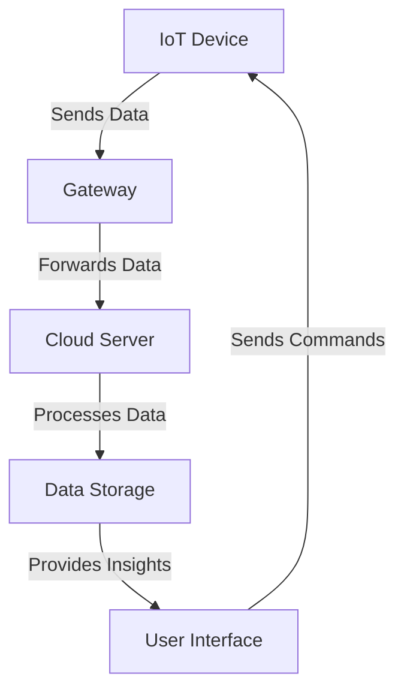

## 20.5. Internet of Things (IoT) with Nerves

As technology continues to evolve, the Internet of Things (IoT) has become a pivotal part of modern innovation. The ability to connect devices and systems, enabling them to communicate and interact, has opened up a world of possibilities. In this section, we will explore how Elixir, through the Nerves framework, is revolutionizing the development of IoT devices. 

### Introduction to Nerves

Nerves is an open-source framework that allows developers to build and deploy embedded software using Elixir. It leverages the power of the BEAM VM to create reliable, fault-tolerant systems that are perfect for IoT applications. With Nerves, developers can write firmware and system software in Elixir, allowing them to take advantage of Elixir's functional programming paradigm, concurrency model, and robust ecosystem.

#### Key Features of Nerves

- **Cross-Platform Support**: Nerves supports a wide range of hardware platforms, making it versatile for various IoT applications.
- **Small Footprint**: It produces minimal firmware images, which are ideal for resource-constrained IoT devices.
- **Robust Networking**: Nerves provides comprehensive networking capabilities, essential for IoT communication.
- **Fault Tolerance**: Built on the BEAM VM, Nerves inherits Elixir's fault-tolerant and concurrent processing capabilities.

### Building IoT Devices with Nerves

Building IoT devices with Nerves involves several steps, from setting up the development environment to deploying the firmware on a device. Let's walk through the process step-by-step.

#### Setting Up the Development Environment

Before we start building IoT devices, we need to set up our development environment. This includes installing Elixir, Erlang, and the Nerves framework.

1. **Install Elixir and Erlang**: Ensure you have the latest versions of Elixir and Erlang installed on your system. You can follow the official [Elixir installation guide](https://elixir-lang.org/install.html) for instructions.

2. **Install Nerves**: Use the following command to install the Nerves framework:

   ```bash
   mix archive.install hex nerves_bootstrap
   ```

3. **Create a New Nerves Project**: Use the Nerves generator to create a new project:

   ```bash
   mix nerves.new my_iot_device
   ```

   This command will generate a new Nerves project with the necessary files and structure.

#### Writing Firmware and System Software

Once the environment is set up, the next step is to write the firmware and system software for your IoT device. Nerves projects are structured similarly to standard Elixir applications, with some additional configuration for embedded systems.

- **Configure the Target**: Specify the target hardware for your IoT device in the `mix.exs` file. Nerves supports various targets, including Raspberry Pi, BeagleBone, and more.

- **Develop the Application Logic**: Write your application logic using Elixir's functional programming features. Use GenServers, Supervisors, and other OTP components to manage state and processes.

- **Networking and Communication**: Implement networking capabilities using libraries like `nerves_network` and `nerves_init_gadget`. These libraries provide tools for setting up Wi-Fi, Ethernet, and other network interfaces.

- **Interfacing with Hardware**: Use the `elixir_ale` library to interface with hardware components like GPIO, I2C, and SPI. This allows your IoT device to interact with sensors, actuators, and other peripherals.

#### Deploying the Firmware

After developing the firmware, the next step is deploying it to your IoT device. Nerves simplifies this process with its streamlined deployment tools.

1. **Build the Firmware**: Use the following command to build the firmware image:

   ```bash
   mix firmware
   ```

2. **Burn the Firmware**: Transfer the firmware image to an SD card or other storage medium using the `mix burn` command:

   ```bash
   mix burn
   ```

3. **Boot the Device**: Insert the storage medium into your IoT device and power it on. The device will boot up with the newly deployed firmware.

### Use Cases for Nerves in IoT

Nerves is versatile and can be used in a variety of IoT applications. Here are some common use cases:

#### Home Automation

Nerves can be used to build smart home devices that automate tasks and improve convenience. Examples include smart thermostats, lighting systems, and security cameras.

#### Industrial Monitoring

In industrial settings, Nerves can be used to develop monitoring systems that track equipment performance, detect anomalies, and prevent downtime.

#### Connected Devices

Nerves enables the development of connected devices that communicate with each other and the cloud. This includes wearable devices, smart appliances, and more.

### Code Example: Building a Simple IoT Device

Let's build a simple IoT device using Nerves. We'll create a temperature monitoring system that reads data from a sensor and sends it to a server.

#### Step 1: Set Up the Project

Create a new Nerves project:

```bash
mix nerves.new temp_monitor
cd temp_monitor
```

#### Step 2: Configure the Target

Edit the `mix.exs` file to specify the target hardware, such as Raspberry Pi:

```elixir
defp deps do
  [
    {:nerves, "~> 1.7", runtime: false},
    {:nerves_runtime, "~> 0.11"},
    {:nerves_pack, "~> 0.4"}
  ]
end
```

#### Step 3: Write the Application Logic

Implement the temperature monitoring logic in `lib/temp_monitor.ex`:

```elixir
defmodule TempMonitor do
  use GenServer

  def start_link(_) do
    GenServer.start_link(__MODULE__, %{}, name: __MODULE__)
  end

  def init(state) do
    schedule_reading()
    {:ok, state}
  end

  def handle_info(:read_temperature, state) do
    temperature = read_temperature_sensor()
    send_to_server(temperature)
    schedule_reading()
    {:noreply, state}
  end

  defp schedule_reading do
    Process.send_after(self(), :read_temperature, 60_000) # every 60 seconds
  end

  defp read_temperature_sensor do
    # Simulate reading from a sensor
    :rand.uniform(30) + 10
  end

  defp send_to_server(temperature) do
    IO.puts("Sending temperature: #{temperature}")
    # Implement HTTP request to send data to server
  end
end
```

#### Step 4: Deploy and Test

Build and deploy the firmware, then test the device to ensure it reads and transmits temperature data correctly.

### Visualizing IoT Architecture with Nerves

To better understand how Nerves fits into the IoT ecosystem, let's visualize a typical IoT architecture using a diagram.


```mermaid
graph TD;
    A[IoT Device] -->|Sends Data| B[Gateway]
    B -->|Forwards Data| C[Cloud Server]
    C -->|Processes Data| D[Data Storage]
    D -->|Provides Insights| E[User Interface]
    E -->|Sends Commands| A
```

**Diagram Description**: This diagram illustrates a typical IoT architecture, where an IoT device communicates with a gateway, which forwards data to a cloud server for processing and storage. Insights are provided to a user interface, which can send commands back to the device.

### Key Considerations for IoT Development with Nerves

When developing IoT devices with Nerves, consider the following:

- **Security**: Ensure that your IoT devices are secure, with encrypted communication and secure boot processes.
- **Scalability**: Design your system to handle a large number of devices and data streams.
- **Reliability**: Leverage Elixir's fault-tolerant features to build robust systems that can recover from failures.

### Elixir's Unique Features for IoT

Elixir's features make it particularly well-suited for IoT development:

- **Concurrency**: Elixir's lightweight processes allow for efficient handling of multiple tasks simultaneously.
- **Fault Tolerance**: The "let it crash" philosophy helps build resilient systems that can recover from unexpected errors.
- **Functional Programming**: Elixir's functional nature promotes clean, maintainable code, which is crucial for complex IoT systems.

### Differences and Similarities with Other IoT Frameworks

Nerves stands out from other IoT frameworks due to its integration with Elixir and the BEAM VM. Unlike traditional C-based frameworks, Nerves allows developers to use high-level abstractions and leverage Elixir's powerful features.

### Knowledge Check

- **Question**: What are the key benefits of using Nerves for IoT development?
- **Exercise**: Modify the temperature monitoring code to include humidity readings.

### Embrace the Journey

Building IoT devices with Nerves is an exciting journey. As you continue to explore the possibilities, remember to experiment, learn from failures, and enjoy the process. The IoT landscape is vast, and with Nerves, you're equipped to make a significant impact.

### Conclusion

Nerves is a powerful tool for IoT development, offering the reliability and scalability needed for modern applications. By leveraging Elixir's strengths, Nerves enables developers to build innovative, efficient IoT devices. As you continue your journey, remember that the possibilities are endless, and the skills you gain will be invaluable in the ever-evolving world of technology.

## Quiz Time!



### What is Nerves?

- [x] An Elixir framework for building embedded software
- [ ] A Python library for data analysis
- [ ] A JavaScript framework for web development
- [ ] A database management tool

> **Explanation:** Nerves is an Elixir framework specifically designed for building embedded software and IoT devices.

### Which of the following is a key feature of Nerves?

- [x] Cross-platform support
- [ ] Built-in machine learning algorithms
- [ ] Automatic code generation
- [ ] Integrated game development tools

> **Explanation:** Nerves supports a wide range of hardware platforms, making it versatile for various IoT applications.

### What is the primary programming paradigm used in Elixir?

- [x] Functional programming
- [ ] Object-oriented programming
- [ ] Procedural programming
- [ ] Logic programming

> **Explanation:** Elixir is a functional programming language, which emphasizes immutability and first-class functions.

### How does Nerves handle networking for IoT devices?

- [x] Through libraries like `nerves_network` and `nerves_init_gadget`
- [ ] By integrating with third-party VPN services
- [ ] Using built-in machine learning models
- [ ] With a dedicated hardware module

> **Explanation:** Nerves provides comprehensive networking capabilities through libraries like `nerves_network` and `nerves_init_gadget`.

### What is a common use case for Nerves in IoT?

- [x] Home automation
- [ ] Video game development
- [ ] Financial modeling
- [ ] Desktop application development

> **Explanation:** Nerves is commonly used in home automation, industrial monitoring, and other IoT applications.

### Which Elixir feature is particularly beneficial for IoT development?

- [x] Concurrency model
- [ ] Static typing
- [ ] Built-in graphics rendering
- [ ] Automatic memory management

> **Explanation:** Elixir's lightweight processes allow for efficient handling of multiple tasks simultaneously, which is crucial for IoT devices.

### What is the "let it crash" philosophy in Elixir?

- [x] A fault-tolerance approach that allows processes to fail and recover gracefully
- [ ] A debugging technique for identifying errors
- [ ] A method for optimizing performance
- [ ] A strategy for managing memory usage

> **Explanation:** The "let it crash" philosophy helps build resilient systems that can recover from unexpected errors.

### How does Nerves differ from traditional C-based IoT frameworks?

- [x] It allows developers to use high-level abstractions and leverage Elixir's features
- [ ] It requires manual memory management
- [ ] It is limited to a single hardware platform
- [ ] It lacks support for networking

> **Explanation:** Nerves stands out due to its integration with Elixir and the BEAM VM, allowing for high-level abstractions and powerful features.

### What is a benefit of using Elixir's functional programming for IoT?

- [x] Promotes clean, maintainable code
- [ ] Simplifies object-oriented design
- [ ] Enhances graphical user interface development
- [ ] Reduces the need for testing

> **Explanation:** Elixir's functional nature promotes clean, maintainable code, which is crucial for complex IoT systems.

### True or False: Nerves can only be used for home automation projects.

- [ ] True
- [x] False

> **Explanation:** Nerves is versatile and can be used in various IoT applications, including industrial monitoring and connected devices.




