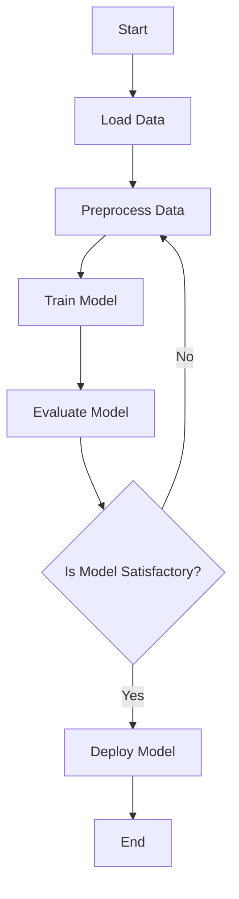

## 20.6. Artificial Intelligence Implementations

Artificial Intelligence (AI) is revolutionizing the way we interact with technology, offering capabilities such as smart assistants, predictive analytics, and more. In this section, we will explore how Elixir, a functional programming language known for its concurrency and fault tolerance, can be leveraged to implement AI solutions. We will cover the integration of AI algorithms and models, interoperability with existing AI libraries, and practical applications of AI in Elixir.

### AI Concepts in Elixir

Elixir, with its functional programming paradigm, provides a unique approach to implementing AI algorithms and models. Let's delve into how Elixir can be used to create AI solutions.

#### Implementing Algorithms and Models

AI algorithms, such as decision trees, neural networks, and clustering algorithms, can be implemented in Elixir using its functional constructs. Elixir's immutability and pattern matching make it an excellent choice for building robust and maintainable AI models.

**Example: Implementing a Simple Decision Tree**

```elixir
defmodule DecisionTree do
  # Define a simple decision tree structure
  defstruct [:attribute, :threshold, :left, :right, :value]

  # Function to create a decision tree node
  def create_node(attribute, threshold, left, right) do
    %DecisionTree{attribute: attribute, threshold: threshold, left: left, right: right}
  end

  # Function to classify data using the decision tree
  def classify(%DecisionTree{value: value}, _data) when not is_nil(value), do: value
  def classify(%DecisionTree{attribute: attr, threshold: thresh, left: left, right: right}, data) do
    if Map.get(data, attr) <= thresh do
      classify(left, data)
    else
      classify(right, data)
    end
  end
end

# Example usage
tree = DecisionTree.create_node(:temperature, 20,
  DecisionTree.create_node(nil, nil, nil, nil, "Cold"),
  DecisionTree.create_node(nil, nil, nil, nil, "Warm")
)

IO.inspect DecisionTree.classify(tree, %{temperature: 15}) # Output: "Cold"
```

In this example, we define a simple decision tree structure and a function to classify data based on the tree. The use of pattern matching and recursion in Elixir simplifies the implementation of such algorithms.

#### Leveraging Elixir's Concurrency

Elixir's concurrency model, based on the Actor model, is particularly useful for AI applications that require parallel processing. For instance, training a neural network can be parallelized by distributing the computation across multiple processes.

**Example: Parallelizing Neural Network Training**

```elixir
defmodule NeuralNetwork do
  def train(data, model, epochs) do
    Enum.reduce(1..epochs, model, fn _, acc_model ->
      # Parallelize the training process
      Task.async_stream(data, fn sample ->
        update_model(acc_model, sample)
      end)
      |> Enum.reduce(acc_model, fn {:ok, updated_model}, acc -> merge_models(acc, updated_model) end)
    end)
  end

  defp update_model(model, sample) do
    # Update model with sample
    # Placeholder for actual update logic
    model
  end

  defp merge_models(model1, model2) do
    # Merge two models
    # Placeholder for actual merge logic
    model1
  end
end
```

In this example, we use `Task.async_stream` to parallelize the training of a neural network, allowing for efficient utilization of system resources.

### Interoperability with AI Libraries

While Elixir is powerful, it may not have all the AI libraries available in other languages like Python. However, Elixir's interoperability features allow us to leverage external AI frameworks through ports or Native Implemented Functions (NIFs).

#### Using Ports and NIFs

Ports and NIFs enable Elixir to communicate with external programs and libraries, allowing us to integrate AI libraries written in languages like Python or C.

**Example: Integrating with a Python AI Library**

```elixir
defmodule PythonAI do
  def call_python_script(script, args) do
    port = Port.open({:spawn, "python3 #{script} #{Enum.join(args, " ")}"}, [:binary])
    receive do
      {^port, {:data, result}} -> result
    end
  end
end

# Example usage
result = PythonAI.call_python_script("path/to/script.py", ["arg1", "arg2"])
IO.puts("Result from Python: #{result}")
```

In this example, we use a port to call a Python script from Elixir, allowing us to leverage Python's extensive AI libraries.

#### Leveraging External AI Frameworks

By using NIFs, we can directly call C functions from Elixir, enabling high-performance integration with AI libraries.

**Example: Using a C Library for AI**

```elixir
defmodule CIntegration do
  use Rustler, otp_app: :my_app, crate: "my_crate"

  # Define a function that calls a C function
  def my_function(arg), do: :erlang.nif_error(:nif_not_loaded)
end
```

In this example, we use the Rustler library to create a NIF that calls a C function, allowing us to integrate high-performance AI libraries into our Elixir application.

### Applications of AI in Elixir

Elixir's capabilities make it suitable for a variety of AI applications, from smart assistants to predictive analytics.

#### Smart Assistants

Elixir's concurrency model and fault tolerance make it ideal for building smart assistants that require real-time processing and high availability.

**Example: Building a Smart Assistant**

```elixir
defmodule SmartAssistant do
  def start_link do
    Task.start_link(fn -> listen_for_commands() end)
  end

  defp listen_for_commands do
    receive do
      {:command, cmd} -> process_command(cmd)
    end
    listen_for_commands()
  end

  defp process_command("weather"), do: IO.puts("Fetching weather information...")
  defp process_command("news"), do: IO.puts("Fetching latest news...")
end

# Start the smart assistant
{:ok, _pid} = SmartAssistant.start_link()
```

In this example, we create a simple smart assistant that listens for commands and processes them accordingly.

#### Predictive Analytics

Elixir's data processing capabilities can be used to build predictive analytics solutions that analyze large datasets and provide insights.

**Example: Implementing Predictive Analytics**

```elixir
defmodule PredictiveAnalytics do
  def analyze(data) do
    # Perform data analysis
    # Placeholder for actual analysis logic
    Enum.map(data, fn x -> x * 2 end)
  end
end

# Example usage
data = [1, 2, 3, 4, 5]
result = PredictiveAnalytics.analyze(data)
IO.inspect(result) # Output: [2, 4, 6, 8, 10]
```

In this example, we implement a simple predictive analytics function that processes data and provides insights.

### Visualizing AI Implementations

To better understand the flow of AI implementations in Elixir, let's visualize the process using Mermaid.js diagrams.



**Diagram Description:** This flowchart represents the typical process of implementing an AI model in Elixir, from loading and preprocessing data to training, evaluating, and deploying the model.

### References and Links

- [Elixir Official Documentation](https://elixir-lang.org/docs.html)
- [Python AI Libraries](https://www.tensorflow.org/)
- [Rustler for NIFs](https://github.com/rusterlium/rustler)

### Knowledge Check

- What are the benefits of using Elixir for AI implementations?
- How can Elixir's concurrency model be leveraged in AI applications?
- What are the advantages of using ports and NIFs for AI library integration?

### Embrace the Journey

Remember, integrating AI into Elixir applications is just the beginning. As you progress, you'll discover more complex and powerful ways to leverage AI in your projects. Keep experimenting, stay curious, and enjoy the journey!

### Quiz: Artificial Intelligence Implementations



### What is a key advantage of using Elixir for AI implementations?

- [x] Concurrency and fault tolerance
- [ ] Object-oriented programming
- [ ] Extensive built-in AI libraries
- [ ] High-level syntax

> **Explanation:** Elixir's concurrency and fault tolerance make it ideal for AI applications that require real-time processing and high availability.

### How can Elixir integrate with external AI libraries?

- [x] Using ports and NIFs
- [ ] Only through built-in libraries
- [ ] By rewriting libraries in Elixir
- [ ] Through direct import statements

> **Explanation:** Elixir can use ports and NIFs to integrate with external AI libraries, allowing it to leverage libraries written in other languages.

### What is the purpose of the `Task.async_stream` function in Elixir?

- [x] To parallelize tasks
- [ ] To serialize tasks
- [ ] To delay task execution
- [ ] To cancel tasks

> **Explanation:** `Task.async_stream` is used to parallelize tasks, making it useful for AI applications that require concurrent processing.

### Which Elixir feature is particularly useful for building smart assistants?

- [x] Concurrency model
- [ ] Object-oriented design
- [ ] Static typing
- [ ] Built-in AI libraries

> **Explanation:** Elixir's concurrency model is ideal for building smart assistants that require real-time processing and high availability.

### What is a common use case for predictive analytics in Elixir?

- [x] Analyzing large datasets
- [ ] Building web applications
- [ ] Creating static websites
- [ ] Designing user interfaces

> **Explanation:** Predictive analytics in Elixir is commonly used for analyzing large datasets and providing insights.

### How does Elixir's immutability benefit AI implementations?

- [x] It ensures data consistency
- [ ] It allows for mutable state
- [ ] It simplifies object-oriented design
- [ ] It enables dynamic typing

> **Explanation:** Immutability ensures data consistency, which is crucial for building reliable AI models.

### What is a key feature of Elixir's pattern matching in AI?

- [x] Simplifies algorithm implementation
- [ ] Allows for mutable state
- [ ] Enables dynamic typing
- [ ] Supports object-oriented design

> **Explanation:** Pattern matching simplifies the implementation of AI algorithms by allowing for clear and concise code.

### Which Elixir construct is useful for control flow in AI models?

- [x] Pattern matching
- [ ] Inheritance
- [ ] Polymorphism
- [ ] Dynamic typing

> **Explanation:** Pattern matching is useful for control flow in AI models, allowing for clear and concise decision-making.

### What is the role of NIFs in Elixir AI implementations?

- [x] To call C functions
- [ ] To create web servers
- [ ] To manage databases
- [ ] To handle user input

> **Explanation:** NIFs (Native Implemented Functions) allow Elixir to call C functions, enabling high-performance integration with AI libraries.

### True or False: Elixir has extensive built-in AI libraries.

- [ ] True
- [x] False

> **Explanation:** Elixir does not have extensive built-in AI libraries, but it can integrate with external libraries using ports and NIFs.




