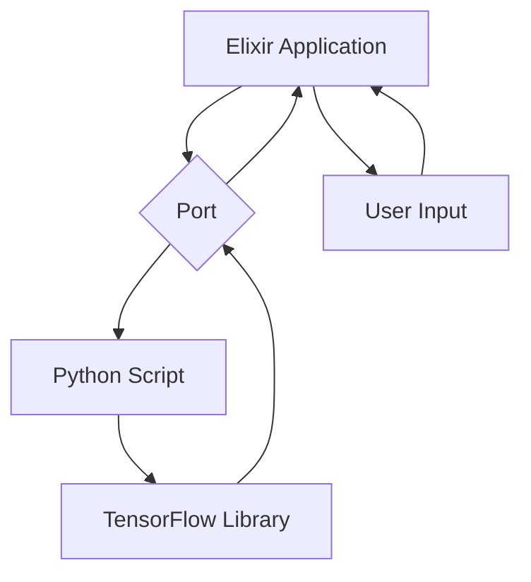

## 20.6. Artificial Intelligence Implementations

Artificial Intelligence (AI) is transforming industries by enabling machines to perform tasks that typically require human intelligence. As an expert software engineer or architect, understanding how to implement AI in Elixir can open new avenues for building intelligent, scalable applications. This section delves into AI concepts in Elixir, interoperability with AI libraries, and practical applications such as smart assistants and predictive analytics.

### AI Concepts in Elixir

Elixir, with its functional programming paradigm, provides a unique approach to implementing AI algorithms and models. Let's explore how Elixir can be leveraged for AI development.

#### Implementing Algorithms and Models

Elixir's functional nature makes it well-suited for implementing AI algorithms. Functional programming emphasizes immutability and pure functions, which can lead to more predictable and maintainable code.

**Key Concepts:**

- **Immutability**: AI models often require manipulation of large datasets. Immutability ensures that data is not altered unexpectedly, which is crucial for maintaining the integrity of AI computations.
- **Pattern Matching**: This feature allows for concise and clear handling of different data structures, which is beneficial when processing complex datasets.
- **Concurrency**: Elixir's lightweight processes and the Actor model enable parallel execution of tasks, essential for handling large-scale AI computations.

**Example: Implementing a Simple Linear Regression**

Linear regression is a fundamental algorithm in machine learning. Let's implement a simple linear regression model in Elixir.

```elixir
defmodule LinearRegression do
  # Calculate the mean of a list
  defp mean(list) do
    Enum.sum(list) / length(list)
  end

  # Calculate the covariance between two lists
  defp covariance(xs, ys) do
    x_mean = mean(xs)
    y_mean = mean(ys)
    Enum.zip(xs, ys)
    |> Enum.map(fn {x, y} -> (x - x_mean) * (y - y_mean) end)
    |> Enum.sum()
  end

  # Calculate the variance of a list
  defp variance(xs) do
    x_mean = mean(xs)
    Enum.map(xs, fn x -> (x - x_mean) ** 2 end)
    |> Enum.sum()
  end

  # Perform linear regression to find slope and intercept
  def fit(xs, ys) do
    slope = covariance(xs, ys) / variance(xs)
    intercept = mean(ys) - slope * mean(xs)
    {slope, intercept}
  end

  # Predict y values based on slope and intercept
  def predict(xs, {slope, intercept}) do
    Enum.map(xs, fn x -> slope * x + intercept end)
  end
end

# Usage
xs = [1, 2, 3, 4, 5]
ys = [2, 4, 6, 8, 10]
{m, b} = LinearRegression.fit(xs, ys)
predictions = LinearRegression.predict(xs, {m, b})
IO.inspect(predictions)
```

**Explanation:**

- **Mean Calculation**: We calculate the mean of a list to use in further computations.
- **Covariance and Variance**: These are calculated to determine the relationship between the datasets and their spread.
- **Fit Function**: Computes the slope and intercept for the linear regression line.
- **Predict Function**: Uses the slope and intercept to predict new y-values.

### Interoperability with AI Libraries

Elixir can interoperate with more established AI libraries through ports or Native Implemented Functions (NIFs). This allows developers to leverage powerful AI frameworks like TensorFlow or PyTorch while maintaining the benefits of Elixir's concurrency and fault tolerance.

#### Leveraging External AI Frameworks

**Ports and NIFs:**

- **Ports**: Allow communication with external programs, enabling Elixir to send and receive data from AI libraries written in other languages.
- **NIFs**: Enable writing performance-critical parts of the application in C or Rust, which can be directly called from Elixir.

**Example: Using TensorFlow with Elixir**

To integrate TensorFlow with Elixir, we can use a port to communicate with a Python script running TensorFlow.

```elixir
defmodule TensorflowPort do
  def start do
    Port.open({:spawn, "python3 tensorflow_script.py"}, [:binary])
  end

  def send_data(port, data) do
    Port.command(port, data)
  end

  def receive_data(port) do
    receive do
      {^port, {:data, response}} -> response
    end
  end
end

# Usage
port = TensorflowPort.start()
TensorflowPort.send_data(port, "input_data")
response = TensorflowPort.receive_data(port)
IO.puts("Received from TensorFlow: #{response}")
```

**Explanation:**

- **Port Creation**: Starts a Python process running TensorFlow.
- **Data Communication**: Sends data to and receives data from the TensorFlow process.

#### NIFs for Performance

For operations requiring high performance, NIFs can be used to execute C or Rust code directly from Elixir. However, care must be taken as errors in NIFs can crash the Erlang VM.

### Applications of AI in Elixir

Elixir's capabilities can be harnessed to build various AI applications, from smart assistants to predictive analytics.

#### Smart Assistants

Smart assistants require real-time processing and decision-making capabilities. Elixir's concurrency model is ideal for handling multiple simultaneous requests efficiently.

**Example: Building a Simple Smart Assistant**

```elixir
defmodule SmartAssistant do
  def handle_request("weather") do
    "The weather today is sunny with a high of 25°C."
  end

  def handle_request("news") do
    "Today's headlines: Elixir continues to gain popularity in AI applications."
  end

  def handle_request(_other) do
    "I'm sorry, I don't understand that request."
  end
end

# Usage
IO.puts(SmartAssistant.handle_request("weather"))
IO.puts(SmartAssistant.handle_request("news"))
```

**Explanation:**

- **Pattern Matching**: Used to handle different types of requests.
- **Concurrency**: Elixir processes can handle multiple requests simultaneously, making it suitable for real-time applications.

#### Predictive Analytics

Predictive analytics involves analyzing historical data to make predictions about future events. Elixir's data processing capabilities can be leveraged to build robust predictive models.

**Example: Predictive Analytics for Sales Forecasting**

```elixir
defmodule SalesForecast do
  def forecast(sales_data) do
    # Simple moving average prediction
    Enum.chunk_every(sales_data, 3, 1, :discard)
    |> Enum.map(&Enum.sum(&1) / 3)
  end
end

# Usage
sales_data = [100, 150, 200, 250, 300, 350]
predictions = SalesForecast.forecast(sales_data)
IO.inspect(predictions)
```

**Explanation:**

- **Moving Average**: A simple method to predict future sales based on past data.
- **Chunking**: Divides the data into chunks for averaging.

### Visualizing AI Implementations

To better understand how AI is implemented in Elixir, let's visualize the process of integrating Elixir with an external AI library using ports.


```mermaid
flowchart TD
    A[Elixir Application] --> B{Port}
    B --> C[Python Script]
    C --> D[TensorFlow Library]
    A --> E[User Input]
    E --> A
    D --> B
    B --> A
```

**Diagram Explanation:**

- **Elixir Application**: The main application that handles user input and communicates with the AI library.
- **Port**: Acts as a bridge between Elixir and the Python script.
- **Python Script**: Executes AI models using TensorFlow.
- **TensorFlow Library**: Provides the AI capabilities.

### References and Links

- [Elixir Official Documentation](https://elixir-lang.org/docs.html)
- [TensorFlow](https://www.tensorflow.org/)
- [NIFs in Elixir](https://hexdocs.pm/elixir/Port.html)

### Knowledge Check

- **What are the advantages of using Elixir for AI implementations?**
- **How can Elixir interoperate with external AI libraries?**
- **What are some practical applications of AI in Elixir?**

### Embrace the Journey

Remember, implementing AI in Elixir is just the beginning. As you progress, you'll discover more advanced techniques and applications. Keep experimenting, stay curious, and enjoy the journey!

### Quiz Time!



### What is a key advantage of using Elixir for AI implementations?

- [x] Concurrency
- [ ] Object-Oriented Programming
- [ ] Mutable State
- [ ] Lack of Pattern Matching

> **Explanation:** Elixir's concurrency model is a significant advantage for AI implementations, enabling efficient handling of parallel tasks.

### How does Elixir interoperate with external AI libraries?

- [x] Through Ports and NIFs
- [ ] By using only Elixir's built-in libraries
- [ ] Through JavaScript integration
- [ ] By converting Elixir code to Python

> **Explanation:** Elixir can interoperate with external AI libraries using Ports and NIFs, allowing communication with programs written in other languages.

### What is an example of a simple AI application in Elixir?

- [x] Smart Assistant
- [ ] Web Browser
- [ ] Text Editor
- [ ] Spreadsheet

> **Explanation:** A smart assistant is an example of an AI application that can be implemented in Elixir, leveraging its concurrency model.

### Which Elixir feature is beneficial for handling large datasets in AI?

- [x] Immutability
- [ ] Mutable State
- [ ] Global Variables
- [ ] Inheritance

> **Explanation:** Immutability ensures data integrity, which is crucial when handling large datasets in AI applications.

### What is a potential risk when using NIFs in Elixir?

- [x] Crashing the Erlang VM
- [ ] Slower Execution
- [ ] Lack of Concurrency
- [ ] Inability to Use Pattern Matching

> **Explanation:** NIFs run native code, and errors can crash the Erlang VM, making them risky if not handled carefully.

### Which AI library is commonly used with Elixir for machine learning?

- [x] TensorFlow
- [ ] Rails
- [ ] React
- [ ] Angular

> **Explanation:** TensorFlow is a popular machine learning library that can be used with Elixir through interoperability techniques.

### What is a simple method for sales forecasting in Elixir?

- [x] Moving Average
- [ ] Neural Networks
- [ ] Decision Trees
- [ ] Genetic Algorithms

> **Explanation:** A moving average is a straightforward method for sales forecasting, utilizing historical data to predict future trends.

### Which Elixir feature allows concise handling of different data structures?

- [x] Pattern Matching
- [ ] Classes
- [ ] Inheritance
- [ ] Mutable State

> **Explanation:** Pattern matching in Elixir allows concise and clear handling of various data structures, making it beneficial for AI applications.

### What is a benefit of using Ports in Elixir?

- [x] Communication with external programs
- [ ] Direct execution of JavaScript
- [ ] Built-in AI capabilities
- [ ] Automatic data visualization

> **Explanation:** Ports enable Elixir to communicate with external programs, such as those running AI libraries in other languages.

### True or False: Elixir's Actor model is ideal for real-time AI applications.

- [x] True
- [ ] False

> **Explanation:** True. Elixir's Actor model is well-suited for real-time AI applications, allowing efficient handling of concurrent tasks.



---
