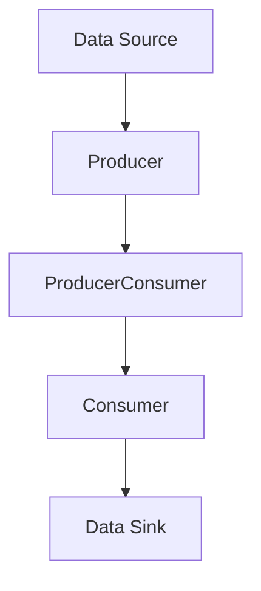

## 20.7. Real-Time Data Processing and Analytics

In today's fast-paced digital world, the ability to process and analyze data in real-time is crucial for many applications, from financial tickers to sensor data analysis. Elixir, with its robust concurrency model and the power of the BEAM VM, provides an excellent platform for building scalable, fault-tolerant real-time data processing systems. In this section, we will explore the concepts of stream processing, the tools and frameworks available in Elixir, and practical use cases that demonstrate the power of real-time data analytics.

### Stream Processing

Stream processing is a method of handling data streams with low latency, allowing systems to process data as it arrives rather than in batches. This approach is essential for applications that require immediate insights or actions based on incoming data, such as monitoring financial markets, analyzing IoT sensor data, or providing real-time recommendations.

#### Key Concepts

- **Low Latency**: The primary goal of stream processing is to minimize the delay between data arrival and processing. This is achieved by processing data in small increments as it arrives.
- **Scalability**: Stream processing systems must handle varying data loads efficiently, scaling up or down as needed.
- **Fault Tolerance**: Ensuring that the system continues to operate correctly even in the presence of failures is critical for real-time applications.

#### Elixir's Strengths in Stream Processing

Elixir's concurrency model, based on the Actor model, is well-suited for stream processing. Processes in Elixir are lightweight and can be used to handle individual data streams or tasks concurrently. The language's immutable data structures and functional programming paradigm also contribute to building reliable and maintainable stream processing systems.

### Tools and Frameworks

Elixir offers several tools and frameworks that facilitate real-time data processing and analytics. Two of the most prominent are GenStage and Flow.

#### GenStage

GenStage is a specification and computational model for Elixir that provides a way to build data processing pipelines. It allows developers to define stages that produce and consume data, enabling backpressure and flow control.

- **Producer**: A stage that emits data.
- **Consumer**: A stage that receives and processes data.
- **ProducerConsumer**: A stage that acts as both a producer and a consumer, transforming data as it passes through.

##### Example: Building a Simple GenStage Pipeline

```elixir
defmodule Producer do
  use GenStage

  def start_link(initial) do
    GenStage.start_link(__MODULE__, initial, name: __MODULE__)
  end

  def init(initial) do
    {:producer, initial}
  end

  def handle_demand(demand, state) when demand > 0 do
    events = Enum.to_list(state..(state + demand - 1))
    {:noreply, events, state + demand}
  end
end

defmodule Consumer do
  use GenStage

  def start_link() do
    GenStage.start_link(__MODULE__, :ok, name: __MODULE__)
  end

  def init(:ok) do
    {:consumer, :ok}
  end

  def handle_events(events, _from, state) do
    Enum.each(events, fn event ->
      IO.inspect(event, label: "Consumed")
    end)
    {:noreply, [], state}
  end
end

{:ok, producer} = Producer.start_link(0)
{:ok, consumer} = Consumer.start_link()

GenStage.sync_subscribe(consumer, to: producer)
```

In this example, we define a simple GenStage pipeline with a producer that generates numbers and a consumer that prints them. The `handle_demand` function in the producer generates a list of numbers based on the demand from the consumer.

#### Flow

Flow is built on top of GenStage and provides a higher-level abstraction for parallel data processing. It is designed to work with large datasets and can automatically partition and distribute work across multiple cores.

- **Partitioning**: Flow can partition data across multiple stages, allowing for parallel processing.
- **Windowing**: Flow supports windowing operations, which are useful for aggregating data over time intervals.

##### Example: Using Flow for Parallel Processing

```elixir
alias Experimental.Flow

1..1000
|> Flow.from_enumerable()
|> Flow.partition()
|> Flow.map(&(&1 * 2))
|> Flow.reduce(fn -> 0 end, &(&1 + &2))
|> Enum.to_list()
```

In this example, we use Flow to process a range of numbers in parallel. The `Flow.partition` function distributes the work across multiple stages, and the `Flow.map` function doubles each number. Finally, we reduce the results to a single sum.

### Use Cases

Real-time data processing and analytics have numerous applications across various industries. Let's explore a few common use cases.

#### Financial Tickers

Financial markets generate vast amounts of data that need to be processed in real-time to make informed trading decisions. Elixir's real-time capabilities make it an excellent choice for building systems that handle financial tickers.

- **Market Data Aggregation**: Collecting and aggregating data from multiple sources to provide a comprehensive view of the market.
- **Trade Execution**: Making split-second decisions based on market conditions to execute trades.
- **Risk Management**: Monitoring and managing risk in real-time to prevent significant losses.

#### Sensor Data Analysis

IoT devices generate continuous streams of data that need to be processed and analyzed in real-time. Elixir's concurrency model and fault tolerance make it ideal for handling sensor data.

- **Environmental Monitoring**: Analyzing data from sensors to monitor environmental conditions, such as temperature, humidity, and air quality.
- **Predictive Maintenance**: Using sensor data to predict equipment failures and schedule maintenance before issues occur.
- **Smart Cities**: Integrating data from various sensors to optimize city operations, such as traffic management and energy consumption.

### Visualizing Real-Time Data Processing

To better understand the flow of data in a real-time processing system, let's visualize a simple pipeline using Mermaid.js.



In this diagram, data flows from a source to a producer, which generates events. These events are then processed by a producer-consumer stage before being consumed and sent to a data sink.

### Design Considerations

When building real-time data processing systems in Elixir, several design considerations should be kept in mind:

- **Backpressure**: Implementing backpressure is crucial to prevent overwhelming consumers with too much data.
- **Fault Tolerance**: Design systems to handle failures gracefully, using Elixir's supervision trees and fault-tolerant processes.
- **Scalability**: Ensure that the system can scale horizontally to handle increased data loads.
- **Latency**: Minimize latency by optimizing data processing pipelines and using efficient data structures.

### Elixir Unique Features

Elixir's unique features, such as lightweight processes, immutable data structures, and the Actor model, make it particularly well-suited for real-time data processing. The language's focus on concurrency and fault tolerance allows developers to build robust systems that can handle large volumes of data with low latency.

### Differences and Similarities

Real-time data processing in Elixir shares similarities with other functional programming languages, such as Scala and Clojure, which also emphasize concurrency and immutability. However, Elixir's integration with the BEAM VM and its focus on fault tolerance set it apart, providing a unique platform for building reliable real-time systems.

### Try It Yourself

To gain hands-on experience with real-time data processing in Elixir, try modifying the code examples provided in this section. Experiment with different data sources, processing stages, and transformations to see how they affect the system's performance and behavior.

### Knowledge Check

- What are the key components of a GenStage pipeline?
- How does Flow differ from GenStage in terms of data processing?
- What are some common use cases for real-time data processing in Elixir?
- How can Elixir's concurrency model benefit real-time data processing systems?

### Embrace the Journey

Remember, mastering real-time data processing and analytics in Elixir is a journey. As you explore these concepts and tools, you'll gain valuable insights into building scalable, fault-tolerant systems. Keep experimenting, stay curious, and enjoy the journey!

## Quiz: Real-Time Data Processing and Analytics



### What is the primary goal of stream processing?

- [x] Minimize latency between data arrival and processing
- [ ] Maximize data storage capacity
- [ ] Reduce code complexity
- [ ] Increase data redundancy

> **Explanation:** Stream processing aims to minimize the delay between data arrival and processing, allowing for real-time insights and actions.

### Which Elixir tool provides a higher-level abstraction for parallel data processing?

- [ ] GenStage
- [x] Flow
- [ ] Ecto
- [ ] Phoenix

> **Explanation:** Flow is built on top of GenStage and provides a higher-level abstraction for parallel data processing, making it easier to work with large datasets.

### What is a key feature of Elixir's concurrency model that benefits real-time data processing?

- [x] Lightweight processes
- [ ] Mutable data structures
- [ ] Synchronous execution
- [ ] Single-threaded processing

> **Explanation:** Elixir's lightweight processes allow for efficient concurrent data processing, which is essential for real-time applications.

### In a GenStage pipeline, what role does a ProducerConsumer stage play?

- [x] Acts as both a producer and a consumer
- [ ] Only produces data
- [ ] Only consumes data
- [ ] Manages data storage

> **Explanation:** A ProducerConsumer stage in GenStage acts as both a producer and a consumer, transforming data as it passes through.

### What is a common use case for real-time data processing in Elixir?

- [x] Financial tickers
- [ ] Batch data processing
- [ ] Static website generation
- [ ] Image rendering

> **Explanation:** Real-time data processing in Elixir is commonly used for applications like financial tickers, where immediate data insights are crucial.

### How does Flow handle data partitioning?

- [x] Automatically distributes work across multiple stages
- [ ] Requires manual partitioning by the developer
- [ ] Uses a single-threaded approach
- [ ] Ignores data partitioning

> **Explanation:** Flow automatically partitions data across multiple stages, allowing for parallel processing and efficient use of resources.

### What is a benefit of using immutable data structures in real-time data processing?

- [x] Ensures data consistency and reliability
- [ ] Increases memory usage
- [ ] Simplifies code syntax
- [ ] Reduces processing speed

> **Explanation:** Immutable data structures ensure data consistency and reliability, which is important for maintaining accuracy in real-time processing.

### How can Elixir's supervision trees contribute to fault tolerance in real-time systems?

- [x] By managing process failures and restarts
- [ ] By increasing data redundancy
- [ ] By simplifying code syntax
- [ ] By reducing memory usage

> **Explanation:** Supervision trees in Elixir manage process failures and restarts, contributing to the fault tolerance of real-time systems.

### What is a key consideration when designing real-time data processing systems?

- [x] Implementing backpressure
- [ ] Maximizing code complexity
- [ ] Reducing data storage
- [ ] Ignoring fault tolerance

> **Explanation:** Implementing backpressure is crucial to prevent overwhelming consumers with too much data, ensuring smooth data flow.

### True or False: Elixir's integration with the BEAM VM is a key factor in its suitability for real-time data processing.

- [x] True
- [ ] False

> **Explanation:** Elixir's integration with the BEAM VM provides a robust platform for building reliable real-time systems, thanks to its concurrency and fault tolerance capabilities.


