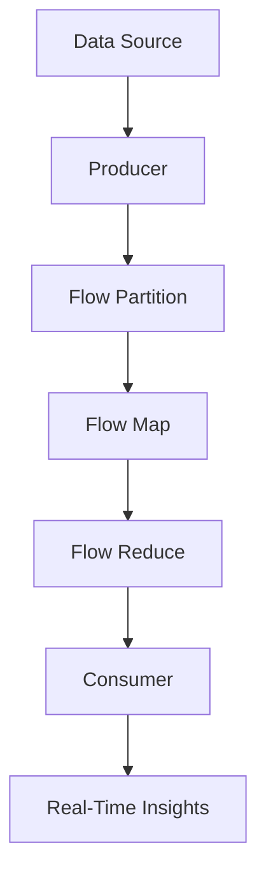

## 20.7. Real-Time Data Processing and Analytics

In today's fast-paced digital world, the ability to process and analyze data in real-time is crucial for many applications, from financial tickers to sensor data analysis. Elixir, with its powerful concurrency model and robust ecosystem, provides an excellent platform for building real-time data processing systems. In this section, we will delve into the concepts and tools that make Elixir a strong choice for real-time data processing and analytics.

### Stream Processing

Stream processing is the continuous ingestion and processing of data streams with low latency. This approach allows systems to handle large volumes of data in real-time, making it ideal for applications that require immediate insights or actions. Let's explore the key concepts and how Elixir facilitates stream processing.

#### Handling Data Streams with Low Latency

In stream processing, data is processed as it arrives, rather than being stored and processed later. This requires a system that can handle high throughput and low latency. Elixir's lightweight processes and message-passing capabilities make it well-suited for these requirements.

**Key Concepts:**

- **Data Streams**: Continuous flows of data that need to be processed in real-time.
- **Low Latency**: The ability to process data with minimal delay.
- **High Throughput**: The capacity to handle large volumes of data efficiently.

**Elixir Features for Stream Processing:**

- **Concurrency Model**: Elixir's actor model, based on Erlang's BEAM VM, allows for millions of lightweight processes to run concurrently, making it ideal for handling data streams.
- **Fault Tolerance**: Elixir's "let it crash" philosophy ensures that systems can recover from failures quickly, maintaining the flow of data.
- **Scalability**: Elixir's ability to distribute processes across nodes allows for horizontal scaling, essential for handling increasing data loads.

#### Tools and Frameworks

Elixir offers several tools and frameworks that simplify the implementation of real-time data processing systems. Two of the most prominent are GenStage and Flow.

##### GenStage

GenStage is a framework for building data processing pipelines. It provides a way to define stages that can produce, consume, and transform data. GenStage is highly flexible and can be used to build complex data processing workflows.

**Key Features of GenStage:**

- **Producer-Consumer Model**: GenStage uses a producer-consumer model, where data flows from producers to consumers through a series of stages.
- **Backpressure Management**: GenStage handles backpressure, ensuring that producers do not overwhelm consumers with data.
- **Dynamic Pipelines**: Stages can be added, removed, or modified at runtime, allowing for dynamic pipeline configurations.

**Sample Code Snippet:**

```elixir
defmodule Producer do
  use GenStage

  def start_link(initial) do
    GenStage.start_link(__MODULE__, initial)
  end

  def init(initial) do
    {:producer, initial}
  end

  def handle_demand(demand, state) do
    events = Enum.to_list(state..(state + demand - 1))
    {:noreply, events, state + demand}
  end
end

defmodule Consumer do
  use GenStage

  def start_link() do
    GenStage.start_link(__MODULE__, :ok)
  end

  def init(:ok) do
    {:consumer, :ok}
  end

  def handle_events(events, _from, state) do
    for event <- events do
      IO.inspect(event)
    end
    {:noreply, [], state}
  end
end

{:ok, producer} = Producer.start_link(0)
{:ok, consumer} = Consumer.start_link()

GenStage.sync_subscribe(consumer, to: producer)
```

**Explanation:**

- **Producer**: Generates a sequence of numbers and sends them to the consumer.
- **Consumer**: Receives and processes the numbers, printing them to the console.

##### Flow

Flow is built on top of GenStage and provides a higher-level abstraction for data processing pipelines. It is designed for parallel processing of data collections, making it easier to work with large datasets.

**Key Features of Flow:**

- **Parallel Processing**: Flow automatically partitions data and processes it in parallel, leveraging all available CPU cores.
- **Stream-like API**: Flow provides a familiar API similar to Elixir's `Enum` and `Stream` modules, making it easy to use.
- **Fault Tolerance**: Flow inherits the fault tolerance characteristics of GenStage, ensuring reliable data processing.

**Sample Code Snippet:**

```elixir
alias Experimental.Flow

Flow.from_enumerable(1..1000)
|> Flow.map(&(&1 * 2))
|> Flow.partition()
|> Flow.reduce(fn -> 0 end, &(&1 + &2))
|> Enum.to_list()
```

**Explanation:**

- **Flow.from_enumerable**: Creates a flow from an enumerable data source.
- **Flow.map**: Transforms each element by multiplying it by 2.
- **Flow.partition**: Partitions the data for parallel processing.
- **Flow.reduce**: Aggregates the results by summing them up.

#### Use Cases

Real-time data processing and analytics have numerous applications across various industries. Let's explore some common use cases where Elixir's capabilities can be leveraged.

##### Financial Tickers

Financial markets generate a massive amount of data every second. Real-time processing of this data is crucial for making informed trading decisions. Elixir's concurrency model and fault tolerance make it an excellent choice for building systems that handle financial tickers.

**Example:**

- **Stock Price Updates**: Continuously ingest and process stock price updates, providing real-time insights to traders.
- **Alert Systems**: Trigger alerts based on predefined conditions, such as significant price changes.

##### Sensor Data Analysis

In IoT applications, sensors generate continuous streams of data that need to be processed in real-time. Elixir's ability to handle large volumes of data with low latency makes it suitable for sensor data analysis.

**Example:**

- **Environmental Monitoring**: Process data from environmental sensors to detect anomalies or changes in conditions.
- **Predictive Maintenance**: Analyze sensor data from machinery to predict and prevent failures.

### Visualizing Real-Time Data Processing

To better understand the flow of data in a real-time processing system, let's visualize a typical pipeline using Mermaid.js.


```mermaid
graph TD;
    A[Data Source] --> B[Producer];
    B --> C[Flow Partition];
    C --> D[Flow Map];
    D --> E[Flow Reduce];
    E --> F[Consumer];
    F --> G[Real-Time Insights];
```

**Diagram Explanation:**

- **Data Source**: Represents the origin of the data, such as a financial market feed or IoT sensors.
- **Producer**: Ingests data from the source and sends it to the processing pipeline.
- **Flow Partition**: Divides the data into partitions for parallel processing.
- **Flow Map**: Transforms the data as needed for analysis.
- **Flow Reduce**: Aggregates the results to produce meaningful insights.
- **Consumer**: Receives the processed data and takes appropriate actions.
- **Real-Time Insights**: Represents the final output, providing actionable information.

### Design Considerations

When building real-time data processing systems with Elixir, there are several design considerations to keep in mind.

#### Scalability

Ensure that your system can scale horizontally by distributing processes across multiple nodes. This is crucial for handling increasing data loads without sacrificing performance.

#### Fault Tolerance

Design your system to be resilient to failures. Use Elixir's supervision trees to automatically restart failed processes and maintain system stability.

#### Backpressure Management

Implement backpressure mechanisms to prevent data producers from overwhelming consumers. This ensures that your system can handle varying data rates without crashing.

#### Latency

Optimize your system for low latency by minimizing the time it takes to process and deliver data. This is especially important for applications that require immediate insights or actions.

### Elixir Unique Features

Elixir offers several unique features that make it particularly well-suited for real-time data processing and analytics.

- **Lightweight Processes**: Elixir's processes are extremely lightweight, allowing for millions of concurrent processes without significant overhead.
- **Message Passing**: Processes communicate via message passing, which is both fast and reliable.
- **Hot Code Upgrades**: Elixir supports hot code upgrades, allowing you to update your system without downtime.

### Try It Yourself

Now that we've covered the basics of real-time data processing with Elixir, it's time to try it yourself. Use the code examples provided as a starting point and experiment with different data sources and transformations. Here are a few suggestions:

- Modify the `Producer` to generate random numbers and filter them in the `Consumer`.
- Use Flow to process a large dataset, such as a CSV file, and extract meaningful insights.
- Implement a simple alert system that triggers notifications based on specific conditions.

### Knowledge Check

To reinforce your understanding of real-time data processing with Elixir, let's pose a few questions and challenges:

- What are the key differences between GenStage and Flow?
- How does Elixir's concurrency model benefit real-time data processing?
- Implement a simple real-time data processing pipeline using GenStage and Flow.

### Embrace the Journey

Remember, this is just the beginning. As you progress, you'll build more complex and efficient real-time data processing systems. Keep experimenting, stay curious, and enjoy the journey!

### References and Links

For further reading and exploration, consider the following resources:

- [GenStage Documentation](https://hexdocs.pm/gen_stage/GenStage.html)
- [Flow Documentation](https://hexdocs.pm/flow/Flow.html)
- [Elixir's Concurrency Model](https://elixir-lang.org/getting-started/processes.html)
- [Real-Time Data Processing Concepts](https://en.wikipedia.org/wiki/Stream_processing)

## Quiz Time!



### What is the primary advantage of using Elixir for real-time data processing?

- [x] Concurrency and fault tolerance
- [ ] Object-oriented programming
- [ ] High memory usage
- [ ] Lack of scalability

> **Explanation:** Elixir's concurrency model and fault tolerance make it ideal for real-time data processing.

### Which framework in Elixir is used for building data processing pipelines?

- [x] GenStage
- [ ] Phoenix
- [ ] Ecto
- [ ] Plug

> **Explanation:** GenStage is specifically designed for building data processing pipelines in Elixir.

### What is a key feature of Flow that distinguishes it from GenStage?

- [x] Parallel processing of data collections
- [ ] Object-oriented design
- [ ] Lack of fault tolerance
- [ ] High latency

> **Explanation:** Flow provides parallel processing of data collections, which is a key feature that distinguishes it from GenStage.

### How does Elixir handle backpressure in data processing pipelines?

- [x] By managing demand between producers and consumers
- [ ] By ignoring excess data
- [ ] By increasing latency
- [ ] By using shared mutable state

> **Explanation:** Elixir manages backpressure by controlling the demand between producers and consumers, preventing data overload.

### Which of the following is a use case for real-time data processing with Elixir?

- [x] Financial tickers
- [ ] Batch processing
- [ ] Static website hosting
- [ ] Offline data analysis

> **Explanation:** Real-time data processing with Elixir is well-suited for applications like financial tickers that require immediate insights.

### What is the role of a Producer in a GenStage pipeline?

- [x] To generate and emit data
- [ ] To consume and process data
- [ ] To store data
- [ ] To visualize data

> **Explanation:** In a GenStage pipeline, a Producer generates and emits data to be processed by Consumers.

### What does Flow's `partition` function do?

- [x] Divides data for parallel processing
- [ ] Combines data into a single stream
- [ ] Increases data latency
- [ ] Reduces data size

> **Explanation:** Flow's `partition` function divides data into partitions for parallel processing, improving efficiency.

### How does Elixir's "let it crash" philosophy benefit real-time data processing?

- [x] By allowing systems to recover quickly from failures
- [ ] By preventing any process crashes
- [ ] By increasing system complexity
- [ ] By reducing system scalability

> **Explanation:** Elixir's "let it crash" philosophy allows systems to recover quickly from failures, maintaining data flow.

### Which Elixir feature allows for updating systems without downtime?

- [x] Hot code upgrades
- [ ] High memory usage
- [ ] Object-oriented design
- [ ] Static typing

> **Explanation:** Elixir supports hot code upgrades, allowing systems to be updated without downtime.

### True or False: Elixir's lightweight processes allow for millions of concurrent processes.

- [x] True
- [ ] False

> **Explanation:** Elixir's lightweight processes enable millions of concurrent processes, making it ideal for real-time data processing.


