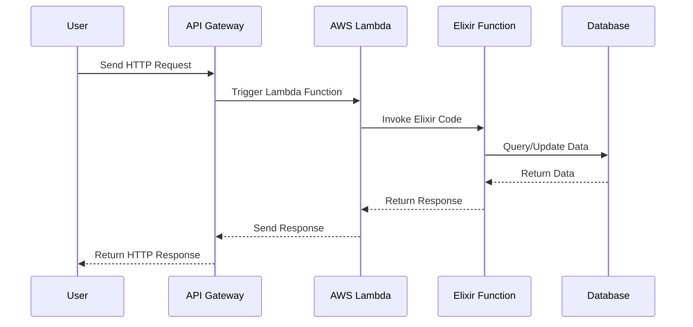

## 20.8. Serverless Architecture with Elixir

In the ever-evolving landscape of software development, serverless architecture has emerged as a revolutionary paradigm that allows developers to focus on writing code without the burden of managing server infrastructure. This section delves into the integration of Elixir, a functional programming language known for its concurrency and fault tolerance, with serverless architecture. We will explore the concept of serverless, how Elixir fits into this model, the benefits and challenges, and provide practical examples to illustrate these concepts.

### Understanding Serverless Architecture

**Concept of Serverless**

Serverless architecture is a cloud-computing execution model where the cloud provider dynamically manages the allocation and provisioning of servers. In this model, developers write and deploy code in the form of functions, which are executed in response to events. This approach abstracts the underlying infrastructure, allowing developers to focus solely on code and business logic.

- **Event-Driven Execution**: Functions are triggered by events such as HTTP requests, database changes, or message queue updates.
- **Automatic Scaling**: Functions automatically scale with the demand, ensuring efficient resource utilization.
- **Pay-as-You-Go**: Costs are incurred only for the compute time consumed by the functions, making it a cost-effective solution.

**Elixir and Serverless**

Elixir, with its robust concurrency model and fault-tolerant design, is well-suited for serverless applications. While traditionally used in long-running applications, Elixir can be adapted to the serverless model by deploying functions to serverless platforms such as AWS Lambda, Google Cloud Functions, and Azure Functions.

- **AWS Lambda**: Supports Elixir through custom runtimes, allowing developers to run Elixir code in response to AWS events.
- **Google Cloud Functions**: Offers a flexible environment for deploying Elixir functions with minimal configuration.
- **Azure Functions**: Provides integration with Elixir through custom handlers and extensions.

### Benefits of Serverless Architecture with Elixir

**Cost Efficiency**

Serverless architecture offers a cost-effective solution by charging only for the compute time consumed by the functions. This model eliminates the need for provisioning and maintaining servers, reducing operational costs significantly.

**Scalability**

Elixir's concurrency model, combined with serverless architecture's automatic scaling, ensures that applications can handle varying loads efficiently. Functions scale automatically based on demand, providing seamless performance during peak times.

**Rapid Development and Deployment**

Serverless platforms simplify the deployment process, allowing developers to focus on writing code rather than managing infrastructure. This accelerates the development cycle and enables rapid iteration and deployment of new features.

**Fault Tolerance**

Elixir's inherent fault-tolerant design, coupled with the redundancy and reliability of serverless platforms, ensures high availability and resilience of applications. Functions are isolated, reducing the impact of failures and enabling graceful recovery.

### Challenges of Serverless Architecture with Elixir

**Cold Start Latency**

One of the primary challenges of serverless architecture is cold start latency, which occurs when a function is invoked after being idle. This can lead to increased response times, affecting the performance of time-sensitive applications.

**Limited Runtime Support**

While Elixir can be deployed on serverless platforms, it requires custom runtimes or containers, which may introduce additional complexity. Developers must ensure compatibility and manage dependencies effectively.

**State Management**

Serverless functions are stateless by design, which can complicate state management for applications that require persistent data. Developers must leverage external storage solutions such as databases or distributed caches to manage state effectively.

**Debugging and Monitoring**

Debugging serverless applications can be challenging due to the distributed nature of functions. Developers must implement robust logging and monitoring solutions to gain visibility into function execution and diagnose issues effectively.

### Deploying Elixir Functions to AWS Lambda

AWS Lambda is a popular serverless platform that supports Elixir through custom runtimes. Let's explore how to deploy an Elixir function to AWS Lambda.

**Step 1: Create an Elixir Project**

First, create a new Elixir project using Mix, Elixir's build tool.

```bash
mix new my_lambda_function
cd my_lambda_function
```

**Step 2: Write the Lambda Function**

Create a new module in the `lib` directory and define the Lambda function.

```elixir
defmodule MyLambdaFunction do
  def handler(event, _context) do
    # Process the event and return a response
    IO.inspect(event)
    {:ok, "Hello from Elixir Lambda!"}
  end
end
```

**Step 3: Package the Function**

Use the `mix release` command to build a release package for the Lambda function.

```bash
MIX_ENV=prod mix release
```

**Step 4: Create a Custom Runtime**

Create a custom runtime for Elixir by defining a bootstrap script that initializes the Elixir environment and invokes the function.

```bash
#!/bin/sh
set -euo pipefail

# Start the Elixir application
./bin/my_lambda_function start

# Invoke the Lambda function
while true; do
  # Read the event from the input
  EVENT_DATA=$(cat /dev/stdin)

  # Call the Elixir function
  RESPONSE=$(elixir -e "MyLambdaFunction.handler($EVENT_DATA)")

  # Write the response to the output
  echo $RESPONSE
done
```

**Step 5: Deploy to AWS Lambda**

Use the AWS CLI to create a new Lambda function and upload the package.

```bash
aws lambda create-function \
  --function-name my-elixir-lambda \
  --runtime provided \
  --handler bootstrap \
  --zip-file fileb://my_lambda_function.zip \
  --role arn:aws:iam::123456789012:role/execution_role
```

### Visualizing Serverless Architecture with Elixir

To better understand the flow of serverless architecture with Elixir, let's visualize the process using a sequence diagram.



This diagram illustrates the interaction between a user, an API Gateway, an AWS Lambda function, and a database. The user sends an HTTP request, which triggers the Lambda function. The Elixir function processes the request, interacts with the database, and returns a response to the user.

### Practical Example: Building a Serverless API with Elixir

Let's build a simple serverless API using Elixir and AWS Lambda. This API will handle HTTP requests and return a JSON response.

**Step 1: Define the API Function**

Create a new module in the `lib` directory and define the API function.

```elixir
defmodule MyApi do
  def handle_request(event, _context) do
    # Extract the HTTP method and path from the event
    method = event["httpMethod"]
    path = event["path"]

    # Process the request based on the method and path
    case {method, path} do
      {"GET", "/hello"} ->
        {:ok, %{message: "Hello, world!"}}

      _ ->
        {:error, %{error: "Not Found"}}
    end
  end
end
```

**Step 2: Update the Bootstrap Script**

Modify the bootstrap script to invoke the API function.

```bash
#!/bin/sh
set -euo pipefail

# Start the Elixir application
./bin/my_api start

# Invoke the Lambda function
while true; do
  # Read the event from the input
  EVENT_DATA=$(cat /dev/stdin)

  # Call the Elixir function
  RESPONSE=$(elixir -e "MyApi.handle_request($EVENT_DATA)")

  # Write the response to the output
  echo $RESPONSE
done
```

**Step 3: Deploy and Test the API**

Deploy the API to AWS Lambda and test it using an HTTP client such as `curl`.

```bash
curl -X GET https://api.example.com/hello
```

This request should return a JSON response with the message "Hello, world!".

### Best Practices for Serverless Architecture with Elixir

**Optimize Cold Start Performance**

To mitigate cold start latency, consider using provisioned concurrency or warming mechanisms to keep functions initialized and ready to execute.

**Manage Dependencies Efficiently**

Minimize the size of the deployment package by including only necessary dependencies. Use tools like `mix deps.get` to manage dependencies and ensure compatibility.

**Implement Robust Logging and Monitoring**

Leverage cloud provider tools such as AWS CloudWatch or Google Cloud Monitoring to track function execution, monitor performance, and diagnose issues.

**Design for Statelessness**

Embrace the stateless nature of serverless functions by using external storage solutions for state management. Consider using databases, caches, or object storage to persist data.

**Secure Function Execution**

Implement security best practices such as least privilege access, encryption, and input validation to protect serverless functions from unauthorized access and attacks.

### Try It Yourself

Experiment with the code examples provided in this section by modifying the function logic, adding new endpoints, or integrating with external services. Deploy your modified functions to a serverless platform and observe the behavior and performance.

### Further Reading and Resources

- [AWS Lambda Documentation](https://docs.aws.amazon.com/lambda/latest/dg/welcome.html)
- [Google Cloud Functions Documentation](https://cloud.google.com/functions/docs)
- [Azure Functions Documentation](https://docs.microsoft.com/en-us/azure/azure-functions/)
- [Elixir Lang](https://elixir-lang.org/)

### Summary

In this section, we explored the integration of Elixir with serverless architecture, focusing on the benefits, challenges, and practical implementation. Serverless architecture offers a cost-effective, scalable, and fault-tolerant solution for deploying Elixir applications. By leveraging platforms like AWS Lambda, developers can build and deploy serverless functions efficiently, taking advantage of Elixir's concurrency and fault-tolerance features.

## Quiz: Serverless Architecture with Elixir



### What is the primary benefit of serverless architecture?

- [x] Cost efficiency
- [ ] Increased complexity
- [ ] Manual scaling
- [ ] Server management

> **Explanation:** Serverless architecture is cost-efficient because it charges only for the compute time consumed by the functions.

### Which Elixir feature makes it well-suited for serverless applications?

- [x] Concurrency model
- [ ] Mutable state
- [ ] Object-oriented design
- [ ] Manual memory management

> **Explanation:** Elixir's concurrency model makes it well-suited for serverless applications, as it can handle multiple requests efficiently.

### What is a common challenge of serverless architecture?

- [x] Cold start latency
- [ ] High operational costs
- [ ] Manual server provisioning
- [ ] Lack of scalability

> **Explanation:** Cold start latency is a common challenge in serverless architecture, affecting the response time of functions.

### How can Elixir be deployed on AWS Lambda?

- [x] Using custom runtimes
- [ ] Directly without any configuration
- [ ] Through a built-in Elixir runtime
- [ ] By converting Elixir to JavaScript

> **Explanation:** Elixir can be deployed on AWS Lambda using custom runtimes, which allow for the execution of Elixir code.

### What is the role of the bootstrap script in AWS Lambda?

- [x] Initializes the Elixir environment and invokes the function
- [ ] Manages server infrastructure
- [ ] Provides a user interface
- [ ] Handles database connections

> **Explanation:** The bootstrap script initializes the Elixir environment and invokes the function in AWS Lambda.

### Which tool can be used for logging and monitoring serverless functions?

- [x] AWS CloudWatch
- [ ] Mix
- [ ] ExUnit
- [ ] Phoenix

> **Explanation:** AWS CloudWatch can be used for logging and monitoring serverless functions, providing insights into function execution.

### How can state be managed in serverless applications?

- [x] Using external storage solutions
- [ ] By storing state within the function
- [ ] Through global variables
- [ ] Using local files

> **Explanation:** State in serverless applications can be managed using external storage solutions like databases or caches.

### What is a best practice for securing serverless functions?

- [x] Implement least privilege access
- [ ] Use global variables
- [ ] Disable encryption
- [ ] Allow all network traffic

> **Explanation:** Implementing least privilege access is a best practice for securing serverless functions, ensuring only necessary permissions are granted.

### Which platform supports Elixir through custom runtimes?

- [x] AWS Lambda
- [ ] Heroku
- [ ] Firebase
- [ ] Netlify

> **Explanation:** AWS Lambda supports Elixir through custom runtimes, allowing developers to run Elixir code.

### True or False: Serverless architecture eliminates the need for server management.

- [x] True
- [ ] False

> **Explanation:** True. Serverless architecture abstracts the underlying infrastructure, eliminating the need for server management.



Remember, this is just the beginning. As you progress, you'll build more complex and interactive serverless applications with Elixir. Keep experimenting, stay curious, and enjoy the journey!
