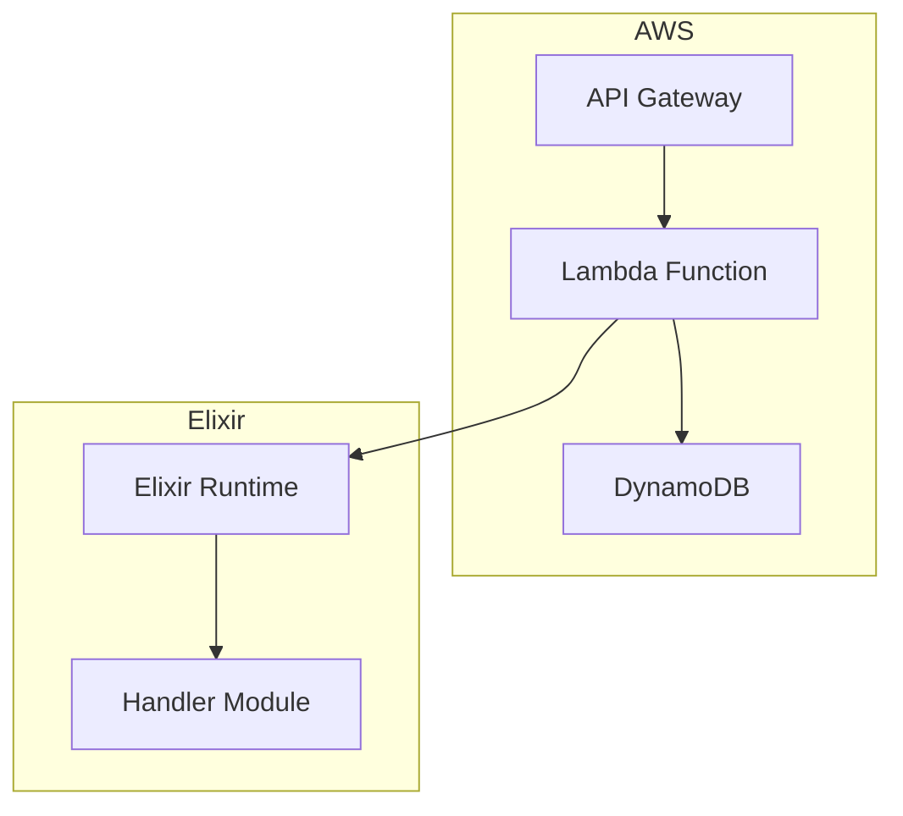

## 20.8. Serverless Architecture with Elixir

As we delve into the advanced topics of Elixir, one of the most transformative concepts in modern software architecture is the serverless paradigm. In this section, we will explore how Elixir, a functional programming language known for its scalability and fault tolerance, fits into the serverless architecture. We will cover the fundamentals of serverless computing, the integration of Elixir with serverless platforms, and the benefits and challenges associated with this approach.

### Understanding Serverless Architecture

**Concept of Serverless**

The term "serverless" can be misleading, as servers are still involved in the execution of code. However, the key difference is that developers are abstracted away from server management. In a serverless architecture, cloud providers manage the infrastructure, automatically scaling resources to meet demand, and charging based on actual usage rather than pre-allocated capacity.

**Key Characteristics of Serverless Architecture:**

- **Automatic Scaling:** Serverless functions automatically scale in response to demand, ensuring optimal resource utilization.
- **Pay-per-Use:** Billing is based on the number of executions and the duration of each execution, offering cost efficiency.
- **Event-Driven:** Functions are triggered by events, such as HTTP requests, database changes, or message queue updates.
- **Statelessness:** Each function execution is stateless, meaning it does not retain data between invocations.

### Elixir and Serverless

Elixir, with its roots in the Erlang ecosystem, is renowned for its ability to build scalable and fault-tolerant systems. Its concurrency model, based on lightweight processes, aligns well with the event-driven nature of serverless computing.

**Deploying Elixir in a Serverless Environment**

While Elixir is not natively supported on many serverless platforms, it can still be deployed effectively using custom runtimes or containers. For instance, AWS Lambda allows custom runtimes, enabling the execution of Elixir code.

#### Setting Up Elixir on AWS Lambda

Let's walk through the process of deploying an Elixir function on AWS Lambda using a custom runtime.

1. **Create an Elixir Project:**

   First, create a new Elixir project using Mix:

   ```bash
   mix new my_lambda_function
   ```

2. **Define the Lambda Function:**

   Implement the function logic in a module, for example, `MyLambdaFunction.Handler`:

   ```elixir
   defmodule MyLambdaFunction.Handler do
     def handle(event, _context) do
       # Process the event and return a response
       {:ok, "Hello, #{event["name"]}!"}
     end
   end
   ```

3. **Create a Custom Runtime Layer:**

   AWS Lambda requires a bootstrap script to execute the Elixir code. Create a `bootstrap` file in your project:

   ```bash
   #!/bin/sh
   set -euo pipefail
   ./my_lambda_function
   ```

   Ensure the `bootstrap` file is executable:

   ```bash
   chmod +x bootstrap
   ```

4. **Compile the Elixir Project:**

   Use Mix to compile the project and generate the executable:

   ```bash
   MIX_ENV=prod mix escript.build
   ```

5. **Package the Application:**

   Package the compiled application and the bootstrap script into a zip file:

   ```bash
   zip -r my_lambda_function.zip bootstrap my_lambda_function
   ```

6. **Deploy to AWS Lambda:**

   Use the AWS CLI to create a Lambda function with the custom runtime:

   ```bash
   aws lambda create-function --function-name MyElixirFunction \
     --zip-file fileb://my_lambda_function.zip \
     --handler my_lambda_function \
     --runtime provided \
     --role <your-iam-role>
   ```

### Benefits of Using Elixir in Serverless Architectures

- **Cost Efficiency:** Elixir's lightweight processes and efficient concurrency model can lead to reduced execution times, lowering costs in a pay-per-use model.
- **Scalability:** The ability to handle a large number of concurrent connections makes Elixir well-suited for serverless environments.
- **Fault Tolerance:** Built-in support for fault tolerance ensures that Elixir functions can recover gracefully from failures.

### Challenges and Considerations

Despite its advantages, deploying Elixir in a serverless architecture presents some challenges:

- **Cold Start Latency:** Serverless functions can experience latency during cold starts. Optimizing the startup time of Elixir applications is crucial.
- **Limited Runtime Support:** Not all serverless platforms natively support Elixir, requiring custom runtimes or containers.
- **Statelessness:** Managing state across function invocations can be complex, requiring external storage solutions.

### Visualizing Serverless Architecture with Elixir

Below is a diagram illustrating how Elixir functions can be integrated into a serverless architecture on AWS Lambda:


```mermaid
flowchart TD
    subgraph AWS
    A[API Gateway] --> B[Lambda Function]
    B --> C[DynamoDB]
    end
    subgraph Elixir
    B --> D[Elixir Runtime]
    D --> E[Handler Module]
    end
```

**Diagram Description:** The diagram shows an API Gateway triggering an AWS Lambda function, which runs an Elixir runtime. The function interacts with DynamoDB for data storage.

### Practical Applications and Use Cases

Elixir's capabilities can be leveraged in various serverless applications:

- **Real-Time Data Processing:** Use Elixir functions to process streaming data in real-time, such as IoT sensor data.
- **Web APIs:** Deploy Elixir-based APIs that scale automatically based on incoming requests.
- **Event-Driven Workflows:** Implement event-driven workflows using Elixir functions to handle asynchronous tasks.

### Try It Yourself

Experiment with the provided code example by modifying the handler function to process different types of events. Consider integrating with other AWS services, such as S3 or SNS, to expand the functionality of your serverless application.

### References and Further Reading

- [AWS Lambda Custom Runtimes](https://docs.aws.amazon.com/lambda/latest/dg/runtimes-custom.html)
- [Elixir Official Documentation](https://elixir-lang.org/docs.html)
- [Serverless Framework](https://www.serverless.com/)

### Knowledge Check

- What are the main benefits of using serverless architecture?
- How does Elixir's concurrency model benefit serverless applications?
- What are some challenges of deploying Elixir in serverless environments?

### Embrace the Journey

As you explore the integration of Elixir with serverless architecture, remember that this is just the beginning. The serverless paradigm offers a new way to build scalable and cost-effective applications. Keep experimenting, stay curious, and enjoy the journey!

## Quiz Time!



### What is a key characteristic of serverless architecture?

- [x] Automatic scaling
- [ ] Manual server management
- [ ] Fixed pricing
- [ ] Stateful execution

> **Explanation:** Serverless architecture automatically scales resources based on demand, providing efficiency and flexibility.

### How can Elixir be deployed on AWS Lambda?

- [x] Using a custom runtime
- [ ] Directly as a native runtime
- [ ] Through a third-party service
- [ ] By converting to JavaScript

> **Explanation:** Elixir can be deployed on AWS Lambda using a custom runtime, as it is not natively supported.

### What is a benefit of using Elixir in serverless architectures?

- [x] Cost efficiency
- [ ] Increased server management
- [ ] Decreased scalability
- [ ] Complex fault tolerance

> **Explanation:** Elixir's efficient concurrency model can lead to reduced execution times, offering cost efficiency in a pay-per-use model.

### What is a challenge of using Elixir in serverless environments?

- [x] Cold start latency
- [ ] Lack of concurrency
- [ ] High memory usage
- [ ] Complex syntax

> **Explanation:** Cold start latency is a challenge in serverless environments, as functions may take longer to initialize.

### Which AWS service can trigger a Lambda function?

- [x] API Gateway
- [ ] EC2
- [ ] RDS
- [ ] S3

> **Explanation:** API Gateway can trigger a Lambda function, allowing for event-driven execution.

### What is the role of the bootstrap script in AWS Lambda?

- [x] To execute the Elixir code
- [ ] To manage server resources
- [ ] To store data
- [ ] To handle network requests

> **Explanation:** The bootstrap script is responsible for executing the Elixir code in a custom runtime on AWS Lambda.

### How does Elixir's concurrency model benefit serverless applications?

- [x] By handling a large number of concurrent connections
- [ ] By increasing cold start times
- [ ] By reducing scalability
- [ ] By complicating fault tolerance

> **Explanation:** Elixir's concurrency model allows it to handle a large number of concurrent connections, making it well-suited for serverless applications.

### What is a common use case for Elixir in serverless architecture?

- [x] Real-time data processing
- [ ] Manual server management
- [ ] Stateful execution
- [ ] Fixed pricing applications

> **Explanation:** Real-time data processing is a common use case for Elixir in serverless architecture due to its efficient concurrency model.

### What is a limitation of serverless architecture?

- [x] Statelessness
- [ ] Automatic scaling
- [ ] Cost efficiency
- [ ] Event-driven execution

> **Explanation:** Statelessness is a limitation of serverless architecture, as it requires external solutions to manage state across function invocations.

### True or False: Elixir is natively supported on all serverless platforms.

- [ ] True
- [x] False

> **Explanation:** False. Elixir is not natively supported on all serverless platforms, requiring custom runtimes or containers for deployment.




