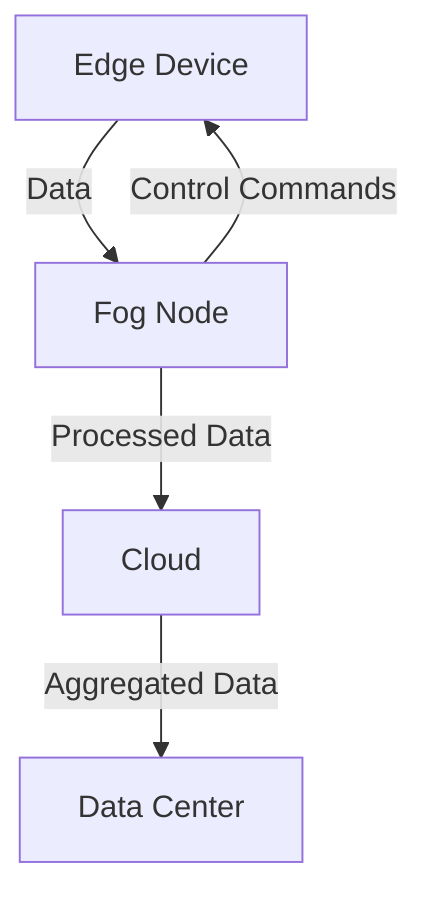

## 20.9. Edge Computing and Fog Computing

In the rapidly evolving landscape of technology, Edge Computing and Fog Computing have emerged as pivotal paradigms that address the limitations of traditional cloud computing. These decentralized computing models bring processing power closer to the data source, reducing latency and bandwidth usage, and enabling real-time analytics and localized processing. In this section, we will delve into the concepts of Edge and Fog Computing, explore Elixir's role in these paradigms, and provide practical examples and code snippets to illustrate their implementation.

### Understanding Edge Computing

**Edge Computing** refers to the practice of processing data near the source of data generation, such as IoT devices, sensors, or local servers, rather than relying on a centralized data center. This approach minimizes latency, reduces bandwidth costs, and enhances the responsiveness of applications.

#### Key Characteristics of Edge Computing

- **Proximity to Data Source**: Processing occurs close to where data is generated, reducing the need for data to travel long distances.
- **Real-Time Processing**: Enables immediate data analysis and decision-making, crucial for applications like autonomous vehicles and industrial automation.
- **Scalability**: Supports a vast number of devices and sensors, each capable of processing data independently.
- **Security and Privacy**: Data can be processed locally, reducing exposure to potential security threats during transmission.

### Understanding Fog Computing

**Fog Computing** extends the concept of Edge Computing by creating a distributed network of nodes that provide storage, compute, and networking services between end devices and the cloud. It acts as an intermediary layer that processes data closer to the edge but with more resources than individual edge devices.

#### Key Characteristics of Fog Computing

- **Distributed Architecture**: Consists of multiple nodes that can be geographically dispersed, providing a scalable and resilient infrastructure.
- **Resource Management**: Offers more computational power and storage than individual edge devices, enabling complex data processing tasks.
- **Interoperability**: Facilitates communication between heterogeneous devices and systems, supporting diverse applications and protocols.
- **Enhanced Security**: Provides additional layers of security by processing sensitive data within a controlled environment before sending it to the cloud.

### Elixir’s Role in Edge and Fog Computing

Elixir, with its robust concurrency model and distributed capabilities, is well-suited for building applications that leverage Edge and Fog Computing. The language's lightweight processes, fault-tolerance, and scalability make it an ideal choice for handling the demands of decentralized computing.

#### Using Nerves for Edge Devices

[Nerves](https://nerves-project.org/) is an open-source platform for building embedded systems with Elixir. It provides a framework for developing, deploying, and managing applications on edge devices, such as IoT sensors and gateways.

- **Lightweight and Efficient**: Nerves allows developers to create minimal and efficient firmware tailored for specific hardware, reducing resource consumption.
- **Real-Time Capabilities**: Supports real-time data processing and decision-making, essential for applications like smart homes and industrial automation.
- **Remote Management**: Facilitates remote updates and monitoring of edge devices, ensuring they remain secure and up-to-date.

#### Distributed Capabilities with Elixir

Elixir's distributed nature enables seamless communication between nodes in a Fog Computing environment. By leveraging the [Erlang VM](https://www.erlang.org/), Elixir applications can easily scale across multiple nodes, providing a robust infrastructure for Fog Computing.

- **Node Communication**: Elixir's built-in support for distributed systems allows nodes to communicate and share data efficiently.
- **Fault Tolerance**: The language's supervision trees and fault-tolerant design ensure that applications remain resilient in the face of failures.
- **Scalability**: Elixir's lightweight processes enable applications to scale horizontally, accommodating increasing workloads and devices.

### Applications of Edge and Fog Computing with Elixir

Edge and Fog Computing have a wide range of applications across various industries. Here are some examples where Elixir can play a significant role:

#### Real-Time Analytics

In scenarios where immediate data analysis is crucial, such as financial trading or healthcare monitoring, Edge and Fog Computing enable real-time analytics by processing data locally or at the fog layer. Elixir's concurrency model allows for efficient handling of high-throughput data streams.

#### Localized Processing

Applications that require localized data processing, such as smart cities or autonomous vehicles, benefit from the reduced latency and bandwidth usage of Edge and Fog Computing. Elixir's ability to run on embedded devices with Nerves makes it a suitable choice for these applications.

#### Industrial Automation

In industrial settings, Edge and Fog Computing can enhance automation by processing sensor data locally and making real-time decisions. Elixir's fault-tolerance and scalability ensure that these systems remain reliable and efficient.

### Implementing Edge and Fog Computing with Elixir

Let's explore how to implement Edge and Fog Computing using Elixir with practical examples and code snippets.

#### Setting Up an Edge Device with Nerves

To get started with Nerves, you'll need to set up a development environment and create a simple application for an edge device.

```elixir
# Install Nerves
mix archive.install hex nerves_bootstrap

# Create a new Nerves project
mix nerves.new my_edge_device

# Navigate to the project directory
cd my_edge_device

# Configure the target hardware in mix.exs
config :nerves, :firmware, target: :rpi3

# Build the firmware
mix firmware

# Burn the firmware to an SD card
mix burn
```

This code snippet demonstrates how to set up a basic Nerves project for a Raspberry Pi 3. You can modify the target hardware based on your specific device.

#### Building a Fog Node with Elixir

To create a Fog node, you can leverage Elixir's distributed capabilities to set up a node that processes data from multiple edge devices.

```elixir
defmodule FogNode do
  use GenServer

  # Start the Fog node
  def start_link(_) do
    GenServer.start_link(__MODULE__, %{}, name: __MODULE__)
  end

  # Handle incoming data from edge devices
  def handle_cast({:data, data}, state) do
    # Process the data
    processed_data = process_data(data)
    # Store or forward the processed data
    {:noreply, Map.put(state, :last_processed, processed_data)}
  end

  defp process_data(data) do
    # Perform data processing
    data |> Enum.map(&(&1 * 2))
  end
end
```

In this example, a simple GenServer is used to handle incoming data from edge devices. The `process_data/1` function processes the data, and the processed data is stored in the server's state.

### Visualizing Edge and Fog Computing Architecture

To better understand the architecture of Edge and Fog Computing, let's visualize the interaction between edge devices, fog nodes, and the cloud.



**Diagram Description**: This diagram illustrates the flow of data from edge devices to fog nodes and then to the cloud. Edge devices send raw data to fog nodes for processing. The processed data is then forwarded to the cloud for further analysis and storage. Control commands can be sent back to edge devices for real-time adjustments.

### Design Considerations for Edge and Fog Computing

When designing applications for Edge and Fog Computing, consider the following:

- **Latency Requirements**: Determine the acceptable latency for your application and choose the appropriate processing layer (edge, fog, or cloud) accordingly.
- **Data Privacy**: Ensure that sensitive data is processed locally or within a secure fog environment to protect user privacy.
- **Scalability**: Design your system to accommodate an increasing number of devices and data streams.
- **Fault Tolerance**: Implement robust error handling and recovery mechanisms to maintain system reliability.

### Elixir Unique Features for Edge and Fog Computing

Elixir offers several unique features that make it well-suited for Edge and Fog Computing:

- **Concurrency Model**: Elixir's lightweight processes and message-passing capabilities enable efficient handling of concurrent data streams.
- **Fault-Tolerance**: Supervision trees and fault-tolerant design ensure that applications remain resilient in the face of failures.
- **Scalability**: Elixir's distributed nature allows applications to scale across multiple nodes, accommodating increasing workloads.

### Differences and Similarities with Other Paradigms

Edge and Fog Computing are often compared to traditional cloud computing. Here are some key differences and similarities:

- **Differences**:
  - **Location**: Edge and Fog Computing process data closer to the source, while cloud computing relies on centralized data centers.
  - **Latency**: Edge and Fog Computing offer lower latency due to proximity to the data source.
  - **Bandwidth**: Edge and Fog Computing reduce bandwidth usage by processing data locally.

- **Similarities**:
  - **Scalability**: Both paradigms support scalable architectures, accommodating growing data volumes and devices.
  - **Interoperability**: Edge, Fog, and cloud systems can work together to provide a comprehensive computing solution.

### Try It Yourself

To deepen your understanding of Edge and Fog Computing with Elixir, try modifying the code examples provided. Experiment with different data processing techniques, add new features to the edge device application, or set up a more complex fog node with additional functionality.

### Knowledge Check

To reinforce your learning, consider the following questions:

- What are the key benefits of Edge Computing?
- How does Fog Computing differ from Edge Computing?
- What role does Elixir play in Edge and Fog Computing?
- How can Nerves be used to develop applications for edge devices?
- What are some design considerations for implementing Edge and Fog Computing?

### Embrace the Journey

Remember, this is just the beginning of your exploration into Edge and Fog Computing with Elixir. As you progress, you'll discover new ways to leverage these paradigms to build efficient, scalable, and resilient applications. Keep experimenting, stay curious, and enjoy the journey!

## Quiz: Edge Computing and Fog Computing



### What is a primary benefit of Edge Computing?

- [x] Reduced latency
- [ ] Increased centralization
- [ ] Higher bandwidth usage
- [ ] Greater data storage

> **Explanation:** Edge Computing reduces latency by processing data closer to the source, minimizing the time it takes for data to travel to a central server.

### How does Fog Computing extend Edge Computing?

- [x] By providing an intermediary layer with more resources
- [ ] By centralizing all data processing
- [ ] By eliminating the need for edge devices
- [ ] By increasing latency

> **Explanation:** Fog Computing acts as an intermediary layer between edge devices and the cloud, offering more computational power and storage than individual edge devices.

### What is Nerves used for in Elixir?

- [x] Building embedded systems for edge devices
- [ ] Managing cloud infrastructure
- [ ] Developing web applications
- [ ] Creating desktop applications

> **Explanation:** Nerves is an open-source platform for building embedded systems with Elixir, ideal for developing applications on edge devices.

### Which Elixir feature is crucial for handling concurrent data streams?

- [x] Concurrency model
- [ ] Static typing
- [ ] Object-oriented programming
- [ ] Manual memory management

> **Explanation:** Elixir's concurrency model, with its lightweight processes and message-passing capabilities, is crucial for handling concurrent data streams efficiently.

### What is a key design consideration for Edge and Fog Computing?

- [x] Latency requirements
- [ ] Centralized data storage
- [ ] Increased bandwidth usage
- [ ] Manual process management

> **Explanation:** Latency requirements are a key design consideration, as Edge and Fog Computing aim to minimize latency by processing data closer to the source.

### How does Elixir's fault-tolerance benefit Edge and Fog Computing?

- [x] Ensures system reliability in the face of failures
- [ ] Increases system complexity
- [ ] Reduces scalability
- [ ] Eliminates the need for error handling

> **Explanation:** Elixir's fault-tolerance, through supervision trees and robust error handling, ensures that applications remain reliable even when failures occur.

### What is a similarity between Edge, Fog, and Cloud Computing?

- [x] Scalability
- [ ] Centralized data processing
- [ ] High latency
- [ ] Limited interoperability

> **Explanation:** All three paradigms support scalable architectures, accommodating growing data volumes and devices.

### Which diagram best represents the flow of data in Edge and Fog Computing?

- [x] Edge Device -> Fog Node -> Cloud
- [ ] Cloud -> Edge Device -> Fog Node
- [ ] Fog Node -> Cloud -> Edge Device
- [ ] Edge Device -> Cloud -> Fog Node

> **Explanation:** The correct flow is from Edge Device to Fog Node and then to the Cloud, as Fog Nodes act as intermediaries between edge devices and the cloud.

### What is a common application of Edge and Fog Computing?

- [x] Real-time analytics
- [ ] Batch processing
- [ ] Centralized data storage
- [ ] Manual data entry

> **Explanation:** Real-time analytics is a common application, as Edge and Fog Computing enable immediate data analysis by processing data locally or at the fog layer.

### True or False: Elixir's distributed nature allows applications to scale across multiple nodes.

- [x] True
- [ ] False

> **Explanation:** True. Elixir's distributed nature, leveraging the Erlang VM, allows applications to scale across multiple nodes, providing a robust infrastructure for Fog Computing.




