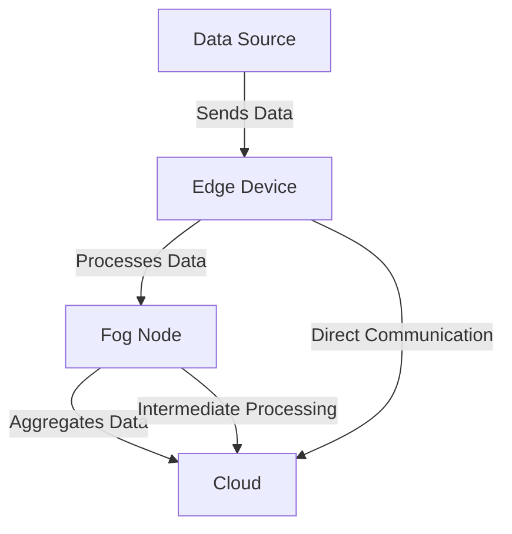

## 20.9. Edge Computing and Fog Computing

As the demand for real-time data processing and analysis grows, traditional cloud computing models are being supplemented by edge and fog computing paradigms. These paradigms bring computation and data storage closer to the data sources, reducing latency and bandwidth usage. In this chapter, we'll explore how Elixir, with its robust concurrency model and distributed system capabilities, is well-suited for edge and fog computing applications.

### Decentralized Computing: A New Era

**Decentralized Computing** refers to the distribution of computational processes across multiple nodes, which can be geographically dispersed. This approach contrasts with the centralized model of cloud computing, where data is processed in large, remote data centers.

#### Benefits of Decentralized Computing

- **Reduced Latency:** By processing data closer to its source, edge computing minimizes the delay between data generation and processing.
- **Bandwidth Efficiency:** Only essential data is sent to the cloud, reducing bandwidth usage and costs.
- **Enhanced Privacy and Security:** Localized data processing can minimize the exposure of sensitive information to external networks.
- **Reliability:** Decentralized systems can continue operating even if some nodes fail, enhancing system resilience.

### Edge Computing: Processing at the Source

**Edge Computing** involves processing data at the edge of the network, near the data source, such as IoT devices or sensors. This approach is particularly beneficial for applications requiring immediate data analysis and response.

#### Key Characteristics of Edge Computing

- **Proximity to Data Sources:** Edge devices are located close to where data is generated, enabling rapid processing.
- **Resource Constraints:** Edge devices often have limited computational power and storage, necessitating efficient software solutions.
- **Intermittent Connectivity:** Edge devices may not always have a stable connection to the central cloud, requiring autonomous operation capabilities.

### Fog Computing: Bridging the Cloud and Edge

**Fog Computing** extends cloud capabilities to the edge of the network, providing a distributed computing infrastructure. It acts as an intermediary layer between edge devices and the cloud, offering additional resources for processing and storage.

#### Key Characteristics of Fog Computing

- **Hierarchical Structure:** Fog computing creates a layered architecture where data can be processed at various levels, from the edge to the cloud.
- **Scalability:** Fog nodes can be dynamically added or removed, providing scalability based on demand.
- **Interoperability:** Fog computing supports diverse devices and communication protocols, facilitating integration with existing systems.

### Elixir’s Role in Edge and Fog Computing

Elixir, with its actor-based concurrency model and fault-tolerant design, is well-suited for building decentralized applications. Let's explore how Elixir can be leveraged in edge and fog computing scenarios.

#### Using Nerves for Edge Devices

[Nerves](https://nerves-project.org/) is an Elixir-based framework for building embedded systems. It provides a robust platform for developing and deploying software on edge devices.

- **Lightweight and Efficient:** Nerves is designed for resource-constrained environments, making it ideal for edge devices.
- **Real-Time Capabilities:** Elixir's concurrency model enables real-time data processing on edge devices.
- **Seamless Deployment:** Nerves supports over-the-air updates, simplifying the deployment of software updates to edge devices.

#### Distributed Capabilities with Elixir

Elixir's ability to create distributed systems is a key advantage in fog computing environments.

- **Node Communication:** Elixir nodes can communicate seamlessly, enabling data sharing and coordination across fog nodes.
- **Fault Tolerance:** Supervisors and GenServers provide robust fault tolerance, ensuring system reliability.
- **Dynamic Scalability:** Elixir's lightweight processes can be dynamically scaled, adapting to varying computational demands.

### Applications of Edge and Fog Computing

Edge and fog computing enable a wide range of applications across various industries. Let's explore some of these applications and how Elixir can be utilized.

#### Real-Time Analytics

- **Use Case:** Monitoring industrial equipment for predictive maintenance.
- **Solution:** Deploy Elixir-based applications on edge devices to analyze sensor data in real-time, detecting anomalies and predicting failures.

#### Localized Processing

- **Use Case:** Smart city infrastructure, such as traffic management systems.
- **Solution:** Utilize Elixir to process data from traffic sensors locally, optimizing traffic flow and reducing congestion.

#### Enhanced Privacy and Security

- **Use Case:** Healthcare applications handling sensitive patient data.
- **Solution:** Process and store patient data locally on edge devices using Elixir, minimizing exposure to external networks.

### Code Example: Building an Edge Application with Nerves

Let's build a simple edge application using Nerves to demonstrate Elixir's capabilities in edge computing.

```elixir
# Import the necessary Nerves libraries
defmodule EdgeApp do
  use GenServer

  # Initialize the GenServer
  def start_link(_) do
    GenServer.start_link(__MODULE__, %{}, name: __MODULE__)
  end

  # Handle the initialization
  def init(state) do
    # Simulate sensor data collection
    schedule_data_collection()
    {:ok, state}
  end

  # Schedule data collection every 5 seconds
  defp schedule_data_collection do
    Process.send_after(self(), :collect_data, 5000)
  end

  # Handle data collection
  def handle_info(:collect_data, state) do
    # Simulate data collection from a sensor
    sensor_data = :rand.uniform(100)
    IO.puts("Collected sensor data: #{sensor_data}")

    # Process the collected data
    process_data(sensor_data)

    # Reschedule the next data collection
    schedule_data_collection()
    {:noreply, state}
  end

  # Process the collected data
  defp process_data(data) do
    # Simple threshold check
    if data > 50 do
      IO.puts("Warning: Sensor data exceeds threshold!")
    end
  end
end

# Start the EdgeApp
{:ok, _pid} = EdgeApp.start_link(nil)
```

### Visualizing Edge and Fog Computing

Below is a diagram illustrating the architecture of edge and fog computing, highlighting the roles of edge devices, fog nodes, and the cloud.


```mermaid
graph TD
    A[Data Source] -->|Sends Data| B[Edge Device]
    B -->|Processes Data| C[Fog Node]
    C -->|Aggregates Data| D[Cloud]
    B -->|Direct Communication| D
    C -->|Intermediate Processing| D
```

**Diagram Description:** This diagram illustrates how data flows from the source to the edge device, where initial processing occurs. The data is then sent to a fog node for further aggregation and processing before reaching the cloud for long-term storage and analysis.

### Try It Yourself: Experimenting with Edge Applications

Encourage experimentation by modifying the code example above:

- **Change the Data Collection Interval:** Adjust the `schedule_data_collection` function to collect data at different intervals.
- **Implement Additional Processing Logic:** Add more complex data processing logic in the `process_data` function.
- **Integrate with External APIs:** Explore integrating the edge application with external APIs for additional functionality.

### Knowledge Check

Before we conclude, let's reinforce what we've learned with a few key takeaways:

- **Decentralized Computing** is transforming how data is processed by bringing computation closer to the data source.
- **Edge Computing** focuses on processing data at the network's edge, while **Fog Computing** provides an intermediary layer between the edge and the cloud.
- **Elixir and Nerves** offer powerful tools for building efficient, fault-tolerant applications for edge and fog computing.

### Embrace the Journey

Remember, this is just the beginning. As you progress, you'll discover more ways to leverage Elixir's capabilities for edge and fog computing. Keep experimenting, stay curious, and enjoy the journey!

### References and Links

- [Nerves Project](https://nerves-project.org/)
- [Fog Computing: Principles, Architectures, and Applications](https://www.sciencedirect.com/science/article/pii/S1084804517301788)
- [Edge Computing: Vision and Challenges](https://ieeexplore.ieee.org/document/8029757)

## Quiz Time!



### What is the primary benefit of edge computing?

- [x] Reduced latency by processing data closer to the source.
- [ ] Increased storage capacity at the data center.
- [ ] Centralized data processing.
- [ ] Enhanced data encryption.

> **Explanation:** Edge computing reduces latency by processing data closer to where it is generated, minimizing the delay between data generation and processing.

### How does fog computing differ from edge computing?

- [x] Fog computing acts as an intermediary layer between the edge and the cloud.
- [ ] Fog computing processes data exclusively at the edge.
- [ ] Fog computing is a centralized computing model.
- [ ] Fog computing only supports IoT devices.

> **Explanation:** Fog computing provides a distributed infrastructure that bridges the edge and the cloud, offering additional resources for processing and storage.

### Which Elixir framework is commonly used for building applications on edge devices?

- [x] Nerves
- [ ] Phoenix
- [ ] Ecto
- [ ] Plug

> **Explanation:** Nerves is an Elixir-based framework designed for building embedded systems and applications on edge devices.

### What is a key advantage of using Elixir for edge computing?

- [x] Elixir's actor-based concurrency model enables efficient real-time data processing.
- [ ] Elixir requires extensive hardware resources.
- [ ] Elixir is primarily used for web development.
- [ ] Elixir does not support distributed systems.

> **Explanation:** Elixir's actor-based concurrency model allows for efficient real-time data processing, making it well-suited for edge computing.

### What does the `schedule_data_collection` function do in the provided code example?

- [x] Schedules data collection every 5 seconds.
- [ ] Sends data to the cloud.
- [ ] Aggregates data from multiple sensors.
- [ ] Encrypts collected data.

> **Explanation:** The `schedule_data_collection` function schedules data collection every 5 seconds using the `Process.send_after` function.

### What is the role of fog nodes in fog computing?

- [x] They provide intermediate processing and storage between the edge and the cloud.
- [ ] They replace edge devices in data processing.
- [ ] They only store data without processing.
- [ ] They are used for encrypting data.

> **Explanation:** Fog nodes provide intermediate processing and storage, acting as a bridge between edge devices and the cloud.

### What can you modify in the code example to experiment with edge applications?

- [x] Change the data collection interval.
- [ ] Modify the cloud storage capacity.
- [ ] Alter the hardware specifications of the edge device.
- [ ] Change the programming language used.

> **Explanation:** You can experiment with the code by changing the data collection interval in the `schedule_data_collection` function.

### How does Elixir ensure fault tolerance in distributed systems?

- [x] Through supervisors and GenServers.
- [ ] By centralizing all processes.
- [ ] By using only synchronous communication.
- [ ] By eliminating all errors.

> **Explanation:** Elixir ensures fault tolerance using supervisors and GenServers, which provide robust mechanisms for handling errors and maintaining system reliability.

### What is a common application of edge computing?

- [x] Real-time analytics and monitoring.
- [ ] Long-term data storage.
- [ ] Batch processing of large datasets.
- [ ] Centralized data encryption.

> **Explanation:** Edge computing is commonly used for real-time analytics and monitoring, processing data as it is generated.

### True or False: Elixir is not suitable for applications requiring real-time data processing.

- [ ] True
- [x] False

> **Explanation:** False. Elixir is well-suited for real-time data processing due to its concurrency model and efficient process management.




