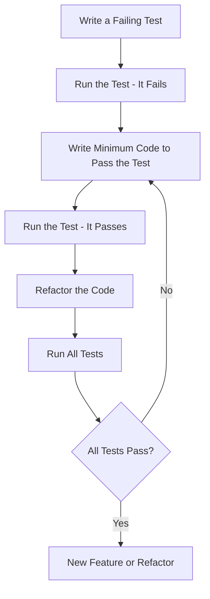

## 21.1. Test-Driven Development (TDD) with ExUnit

Test-Driven Development (TDD) is a software development process that emphasizes writing tests before writing the actual code. This approach ensures that the code meets the desired specifications and behaves as expected. In Elixir, ExUnit is the built-in testing framework that facilitates TDD by providing a robust set of tools for writing and running tests.

### Principles of TDD

The core principles of TDD revolve around writing tests before code, which helps define the desired behavior of the software. The TDD process follows an iterative development cycle known as Red, Green, Refactor:

1. **Red**: Write a test for a new feature or functionality. Initially, this test will fail because the feature has not been implemented yet.
2. **Green**: Write the minimum amount of code necessary to make the test pass. This step focuses on functionality rather than optimization.
3. **Refactor**: Improve the code while ensuring that all tests still pass. This step involves cleaning up the code, removing duplication, and enhancing readability without altering its behavior.

### Implementing TDD in Elixir

#### Setting Up Test Cases with ExUnit

ExUnit is the testing framework that comes with Elixir, providing a simple and effective way to write and run tests. To get started with ExUnit, you need to set up your test environment and create test cases.

1. **Initialize ExUnit**: Ensure that ExUnit is started in your test helper file, usually located at `test/test_helper.exs`:

   ```elixir
   ExUnit.start()
   ```

2. **Create a Test Module**: Define a test module using `ExUnit.Case`. This module will contain your test cases.

   ```elixir
   defmodule MyModuleTest do
     use ExUnit.Case
     doctest MyModule

     test "the truth" do
       assert 1 + 1 == 2
     end
   end
   ```

3. **Run Tests**: Execute your tests using the `mix test` command. This will compile your test files and run all the test cases.

#### Writing Assertions to Define Expected Outcomes

Assertions are the backbone of TDD, as they define the expected outcomes of your code. ExUnit provides a variety of assertion functions to test different conditions:

- **Basic Assertions**: Use `assert` to verify that a condition is true.

  ```elixir
  test "addition works" do
    assert 1 + 1 == 2
  end
  ```

- **Refute**: Use `refute` to verify that a condition is false.

  ```elixir
  test "subtraction fails" do
    refute 1 - 1 == 2
  end
  ```

- **Error Assertions**: Use `assert_raise` to check if a specific error is raised.

  ```elixir
  test "raises error" do
    assert_raise ArithmeticError, fn -> 1 / 0 end
  end
  ```

### Benefits of TDD

Implementing TDD in your development process offers several benefits:

- **Ensuring Code Correctness**: By writing tests before code, you ensure that the code meets the specified requirements from the outset.
- **Facilitating Cleaner Code**: TDD encourages writing modular and maintainable code, as each piece of functionality is tested independently.
- **Reducing Bugs**: Early detection of bugs is possible since tests are written before the code is implemented.
- **Improving Design**: The need to write tests forces developers to think about the design and architecture of their code, leading to better design decisions.

### Practical Examples

Let's walk through a practical example of developing a module using TDD in Elixir.

#### Step 1: Define the Test

Suppose we want to create a simple calculator module that can add two numbers. We start by writing a test for this functionality.

```elixir
defmodule CalculatorTest do
  use ExUnit.Case

  test "adds two numbers" do
    assert Calculator.add(1, 2) == 3
  end
end
```

#### Step 2: Implement the Code

Next, we implement the minimum code necessary to make the test pass.

```elixir
defmodule Calculator do
  def add(a, b) do
    a + b
  end
end
```

#### Step 3: Refactor

After ensuring that the test passes, we can refactor the code to improve its structure or readability. In this simple example, the code is already optimal, so no refactoring is needed.

#### Step 4: Expand the Test Suite

We can continue to expand our test suite by adding more tests for additional functionalities, such as subtraction, multiplication, and division.

```elixir
test "subtracts two numbers" do
  assert Calculator.subtract(5, 3) == 2
end

test "multiplies two numbers" do
  assert Calculator.multiply(4, 3) == 12
end

test "divides two numbers" do
  assert Calculator.divide(10, 2) == 5
end
```

### Best Practices

To maximize the effectiveness of TDD, consider the following best practices:

- **Keep Tests Small and Focused**: Each test should focus on a single piece of functionality. This makes it easier to identify the cause of a failure.
- **Test Edge Cases and Error Conditions**: Ensure that your tests cover edge cases and potential error conditions to improve the robustness of your code.
- **Use Descriptive Test Names**: Use clear and descriptive names for your test cases to make it easy to understand what each test is verifying.
- **Run Tests Frequently**: Run your tests frequently during development to catch issues early and ensure that your code remains functional.

### Visualizing the TDD Process

To better understand the TDD process, let's visualize the Red-Green-Refactor cycle using a flowchart.



**Figure 1**: The TDD Cycle - Red, Green, Refactor

### Try It Yourself

To deepen your understanding of TDD with ExUnit, try modifying the calculator module to include additional operations, such as exponentiation or modulus. Write tests for these new operations before implementing them, following the TDD cycle.

### References and Links

- [ExUnit Documentation](https://hexdocs.pm/ex_unit/ExUnit.html)
- [Test-Driven Development by Example](https://www.amazon.com/Test-Driven-Development-Kent-Beck/dp/0321146530) by Kent Beck
- [Elixir School: Testing](https://elixirschool.com/en/lessons/basics/testing/)

### Knowledge Check

- What are the three steps of the TDD cycle?
- How does TDD facilitate cleaner code design?
- Why is it important to write tests before code in TDD?

### Embrace the Journey

Remember, mastering TDD with ExUnit is a journey. As you continue to practice, you'll find that writing tests becomes second nature, leading to more robust and maintainable code. Keep experimenting, stay curious, and enjoy the process of building high-quality software!

## Quiz: Test-Driven Development (TDD) with ExUnit



### What is the first step in the TDD cycle?

- [x] Write a failing test
- [ ] Write the code
- [ ] Refactor the code
- [ ] Run all tests

> **Explanation:** The first step in the TDD cycle is to write a failing test that defines the desired behavior of the code.

### What does the "Green" step in TDD involve?

- [ ] Writing a failing test
- [x] Writing the minimum code to pass the test
- [ ] Refactoring the code
- [ ] Running all tests

> **Explanation:** The "Green" step involves writing the minimum amount of code necessary to make the test pass.

### Why is refactoring an important part of TDD?

- [ ] To add more features
- [ ] To write more tests
- [x] To improve code structure and readability
- [ ] To ensure tests fail

> **Explanation:** Refactoring is important to improve the code's structure and readability without changing its behavior.

### What is the purpose of assertions in TDD?

- [ ] To write code
- [x] To define expected outcomes
- [ ] To refactor code
- [ ] To run tests

> **Explanation:** Assertions are used to define the expected outcomes of the code, ensuring it behaves as intended.

### Which ExUnit function is used to verify that a condition is false?

- [ ] assert
- [x] refute
- [ ] assert_raise
- [ ] assert_error

> **Explanation:** The `refute` function is used to verify that a condition is false.

### How does TDD help in reducing bugs?

- [ ] By writing more code
- [x] By detecting bugs early through tests
- [ ] By skipping tests
- [ ] By ignoring edge cases

> **Explanation:** TDD helps in reducing bugs by detecting them early through tests written before the code is implemented.

### What should you do if a test fails during the TDD process?

- [ ] Ignore it
- [ ] Refactor the code
- [x] Write the minimum code to pass the test
- [ ] Run all tests

> **Explanation:** If a test fails, you should write the minimum code necessary to pass the test.

### What is a best practice when writing test cases?

- [ ] Write large, comprehensive tests
- [x] Keep tests small and focused
- [ ] Avoid testing edge cases
- [ ] Use vague test names

> **Explanation:** Keeping tests small and focused makes it easier to identify the cause of a failure.

### What is the role of ExUnit in Elixir?

- [ ] To compile code
- [x] To provide a framework for writing and running tests
- [ ] To deploy applications
- [ ] To manage dependencies

> **Explanation:** ExUnit is the built-in testing framework in Elixir that provides tools for writing and running tests.

### True or False: TDD requires writing tests after implementing the code.

- [ ] True
- [x] False

> **Explanation:** False. TDD requires writing tests before implementing the code to define the desired behavior.


