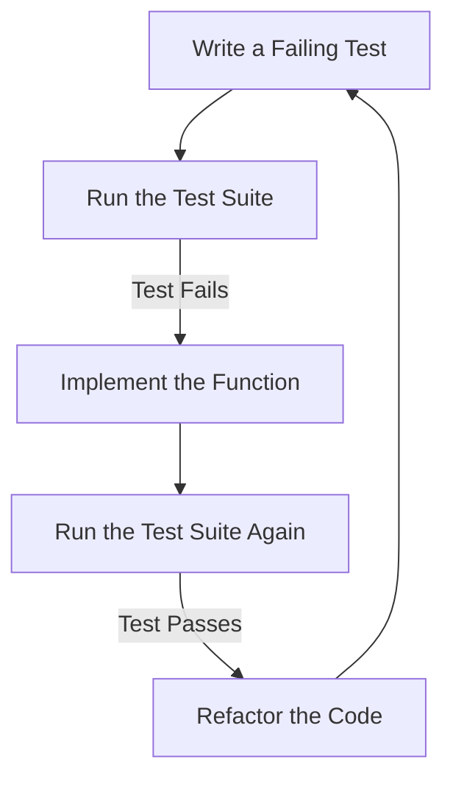

## 21.1. Test-Driven Development (TDD) with ExUnit

Test-Driven Development (TDD) is a software development process that emphasizes writing tests before writing the actual code. This approach ensures that the code meets the desired specifications and functions correctly from the outset. In Elixir, ExUnit is the built-in testing framework that provides all the necessary tools to implement TDD effectively.

### Principles of TDD

The core principles of TDD revolve around a simple yet powerful cycle known as "Red, Green, Refactor."

1. **Red**: Write a test for the next bit of functionality you want to add. Initially, this test will fail because the functionality isn't implemented yet.
2. **Green**: Write just enough code to make the test pass. The focus here is on getting the test to pass, not on writing perfect code.
3. **Refactor**: Clean up the code. Eliminate any duplication and improve the design while ensuring that all tests still pass.

This iterative cycle encourages developers to think about the requirements and design before writing code, leading to more robust and maintainable software.

### Implementing TDD in Elixir

#### Setting Up Test Cases with ExUnit

ExUnit is Elixir's test framework, and it's included by default in Elixir projects. To start using ExUnit, you need to create a test file and write test cases inside it. Let's go through the process:

1. **Create a Test File**: Test files are typically located in the `test` directory of your Elixir project and have the `_test.exs` suffix.

2. **Define a Test Module**: Use `ExUnit.Case` to define a test module. This module will contain your test cases.

3. **Write Test Cases**: Use the `test` macro to define individual test cases. Each test case should focus on a single aspect of the functionality.

Here's an example of setting up a simple test case:

```elixir
# test/calculator_test.exs
defmodule CalculatorTest do
  use ExUnit.Case

  test "addition of two numbers" do
    assert Calculator.add(1, 2) == 3
  end
end
```

#### Writing Assertions to Define Expected Outcomes

Assertions are the core of any test case. They define the expected outcome of a test and compare it against the actual result. ExUnit provides a variety of assertion functions, with `assert` being the most commonly used.

In the example above, `assert Calculator.add(1, 2) == 3` checks that the `add` function of the `Calculator` module returns `3` when given the arguments `1` and `2`.

### Benefits of TDD

Implementing TDD in your Elixir projects offers several benefits:

- **Code Correctness**: By writing tests before code, you ensure that the code meets the specified requirements from the start.
- **Cleaner Code Design**: TDD encourages writing modular and decoupled code, as it is easier to test.
- **Refactoring Confidence**: With a comprehensive suite of tests, you can refactor code with confidence, knowing that any regressions will be caught by the tests.
- **Documentation**: Tests serve as documentation for the expected behavior of the code, making it easier for new developers to understand the codebase.

### Practical Examples

Let's walk through a practical example of developing a simple module using TDD. We'll create a `Calculator` module with basic arithmetic operations.

#### Step 1: Write a Failing Test

Start by writing a test for the addition function:

```elixir
# test/calculator_test.exs
defmodule CalculatorTest do
  use ExUnit.Case

  test "addition of two numbers" do
    assert Calculator.add(1, 2) == 3
  end
end
```

Run the test suite using the command `mix test`. This will result in a failure because the `Calculator.add/2` function does not exist yet.

#### Step 2: Implement the Function

Next, implement the `add` function in the `Calculator` module to make the test pass:

```elixir
# lib/calculator.ex
defmodule Calculator do
  def add(a, b) do
    a + b
  end
end
```

Run the test suite again with `mix test`, and the test should now pass.

#### Step 3: Refactor

Once the test passes, look for opportunities to refactor the code. In this simple example, there might not be much to refactor, but as you add more functionality, refactoring becomes crucial.

#### Step 4: Repeat

Continue the cycle by writing more tests for other operations like subtraction, multiplication, and division, and implement them one by one.

### Best Practices

To get the most out of TDD with ExUnit, consider the following best practices:

- **Keep Tests Small and Focused**: Each test should cover a single aspect of the functionality. This makes it easier to pinpoint the cause of a failure.
- **Test Edge Cases and Error Conditions**: Don't just test the "happy path." Consider edge cases and error conditions to ensure robustness.
- **Use Descriptive Test Names**: Test names should clearly describe what the test is checking. This improves readability and maintainability.
- **Run Tests Frequently**: Run your tests frequently during development to catch issues early.
- **Automate Testing**: Use continuous integration tools to automate running your test suite on every commit.

### Try It Yourself

To deepen your understanding, try modifying the `Calculator` module to include additional operations such as subtraction, multiplication, and division. Write tests for each operation before implementing them.

### Visualizing TDD Workflow

Below is a diagram illustrating the TDD workflow in Elixir using ExUnit:


```mermaid
graph TD;
    A[Write a Failing Test] --> B[Run the Test Suite];
    B -->|Test Fails| C[Implement the Function];
    C --> D[Run the Test Suite Again];
    D -->|Test Passes| E[Refactor the Code];
    E --> A;
```

This diagram captures the cyclical nature of TDD, emphasizing continuous improvement and iteration.

### References and Links

- [Elixir's ExUnit Documentation](https://hexdocs.pm/ex_unit/ExUnit.html) - Official documentation for ExUnit.
- [Test-Driven Development by Example](https://www.amazon.com/Test-Driven-Development-Kent-Beck/dp/0321146530) - A foundational book on TDD by Kent Beck.

### Knowledge Check

1. What are the three phases of the TDD cycle?
2. How does TDD contribute to code quality?
3. What is the role of assertions in ExUnit?
4. Why is it important to test edge cases?

### Embrace the Journey

Remember, mastering TDD is a journey. As you practice, you'll develop a deeper understanding of both your code and the domain it operates in. Keep experimenting, stay curious, and enjoy the process of building high-quality software.

## Quiz Time!



### What is the first step in the TDD cycle?

- [x] Write a failing test
- [ ] Implement the function
- [ ] Refactor the code
- [ ] Run the test suite

> **Explanation:** The TDD cycle begins with writing a failing test to define the desired functionality.

### What is the primary purpose of assertions in ExUnit?

- [x] To define expected outcomes
- [ ] To refactor code
- [ ] To write documentation
- [ ] To automate deployments

> **Explanation:** Assertions in ExUnit are used to define the expected outcomes of tests.

### How does TDD help in refactoring?

- [x] Provides a safety net of tests
- [ ] Eliminates the need for tests
- [ ] Ensures code is perfect from the start
- [ ] Reduces the need for documentation

> **Explanation:** TDD provides a safety net of tests that allows developers to refactor code with confidence.

### What is a benefit of writing tests before code?

- [x] Ensures code correctness from the outset
- [ ] Makes code more complex
- [ ] Increases development time
- [ ] Reduces the need for code reviews

> **Explanation:** Writing tests before code ensures that the code meets the specified requirements from the start.

### What should test names in ExUnit be?

- [x] Descriptive
- [ ] Short
- [ ] Vague
- [ ] Random

> **Explanation:** Test names should be descriptive to clearly indicate what the test is checking.

### Why is it important to test edge cases?

- [x] To ensure robustness
- [ ] To increase test coverage
- [ ] To reduce test complexity
- [ ] To eliminate all bugs

> **Explanation:** Testing edge cases ensures that the software is robust and can handle unexpected inputs.

### What is the role of ExUnit in Elixir?

- [x] Provides a framework for testing
- [ ] Manages dependencies
- [ ] Handles database interactions
- [ ] Automates deployments

> **Explanation:** ExUnit provides a framework for writing and running tests in Elixir.

### How often should tests be run during development?

- [x] Frequently
- [ ] Rarely
- [ ] Only once
- [ ] Never

> **Explanation:** Tests should be run frequently during development to catch issues early.

### What is a key advantage of TDD?

- [x] Facilitates cleaner, more modular code design
- [ ] Eliminates the need for documentation
- [ ] Increases code complexity
- [ ] Reduces the need for testing

> **Explanation:** TDD facilitates cleaner, more modular code design by encouraging developers to think about requirements and design before writing code.

### TDD can be described as a(n) ________ process.

- [x] Iterative
- [ ] Linear
- [ ] Random
- [ ] Static

> **Explanation:** TDD is an iterative process, involving continuous cycles of writing tests, implementing code, and refactoring.


