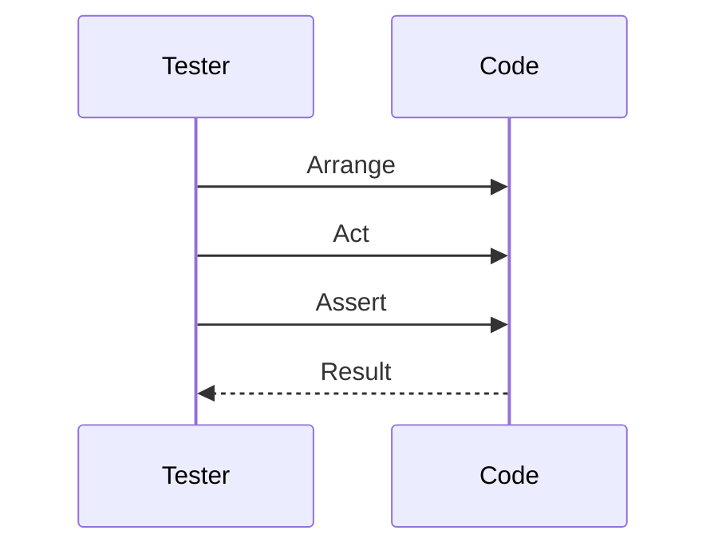

## 21.10. Writing Effective Tests

Testing is a critical component of software development, ensuring that your code behaves as expected and remains robust over time. In Elixir, the ExUnit testing framework provides a powerful toolset for writing and running tests. This section will guide you through the principles and practices of writing effective tests in Elixir, focusing on speed, reliability, and maintainability.

### Principles of Good Tests

Effective tests share several key characteristics:

- **Fast**: Tests should execute quickly to provide immediate feedback. Slow tests can hinder development speed and discourage frequent testing.
- **Reliable**: Tests must consistently pass or fail based on the code's correctness, not due to external factors or randomness.
- **Maintainable**: Tests should be easy to read, understand, and modify. They should evolve with the codebase without becoming a burden.

### Arranging Tests

A well-structured test follows the Arrange-Act-Assert (AAA) pattern:

1. **Arrange**: Set up the necessary conditions and inputs for the test.
2. **Act**: Execute the code under test.
3. **Assert**: Verify that the code behaves as expected.

#### Example: Testing a Simple Function

Let's consider a simple function that adds two numbers:

```elixir
defmodule Math do
  def add(a, b), do: a + b
end
```

Here's how you might write a test for this function using the AAA pattern:

```elixir
defmodule MathTest do
  use ExUnit.Case

  test "adds two numbers" do
    # Arrange
    a = 1
    b = 2

    # Act
    result = Math.add(a, b)

    # Assert
    assert result == 3
  end
end
```

### Test Data Management

Managing test data effectively is crucial for writing maintainable tests. Elixir provides several strategies for handling test data, including fixtures and factories.

#### Using Fixtures

Fixtures are predefined data sets used to set up the test environment. They can be defined in a separate module and imported into your tests.

```elixir
defmodule UserFixtures do
  def valid_user_attrs do
    %{name: "John Doe", email: "john.doe@example.com"}
  end
end

defmodule UserTest do
  use ExUnit.Case
  import UserFixtures

  test "creates a user with valid attributes" do
    attrs = valid_user_attrs()
    user = User.create(attrs)
    assert user.name == "John Doe"
  end
end
```

#### Using Factories

Factories generate test data dynamically, allowing for more flexibility and variation in your tests. Libraries like `ExMachina` can help create factories in Elixir.

```elixir
defmodule UserFactory do
  use ExMachina

  def user_factory do
    %User{
      name: "John Doe",
      email: sequence(:email, &"user#{&1}@example.com")
    }
  end
end

defmodule UserTest do
  use ExUnit.Case
  import UserFactory

  test "creates a user with a unique email" do
    user = insert(:user)
    assert user.email =~ ~r/user\d+@example.com/
  end
end
```

### Avoiding Common Pitfalls

To write effective tests, it's important to avoid common pitfalls that can compromise test quality.

#### Not Testing Implementation Details

Focus on testing the behavior of your code rather than its implementation. This ensures that your tests remain valid even if the internal implementation changes.

```elixir
# Bad: Testing implementation details
test "calls the helper function" do
  assert_called Helper.some_function()
end

# Good: Testing behavior
test "returns the correct result" do
  result = MyModule.some_function()
  assert result == expected_result
end
```

#### Avoiding Interdependent Tests

Each test should be independent and not rely on the outcome of other tests. This ensures that tests can be run in any order without affecting the results.

```elixir
# Bad: Interdependent tests
test "step 1" do
  assert step1() == :ok
end

test "step 2" do
  assert step2() == :ok
end

# Good: Independent tests
setup do
  {:ok, initial_state: setup_initial_state()}
end

test "step 1", %{initial_state: state} do
  assert step1(state) == :ok
end

test "step 2", %{initial_state: state} do
  assert step2(state) == :ok
end
```

### Try It Yourself

Experiment with the code examples provided by modifying them to test different scenarios. For instance, try adding more test cases to the `MathTest` module to cover edge cases like adding negative numbers or zero.

### Visualizing Test Execution Flow

To better understand the flow of test execution, consider the following sequence diagram illustrating the AAA pattern:



This diagram shows the interaction between the tester and the code under test, highlighting the three main phases of a test.

### References and Links

- [ExUnit Documentation](https://hexdocs.pm/ex_unit/ExUnit.html)
- [ExMachina GitHub Repository](https://github.com/thoughtbot/ex_machina)

### Knowledge Check

- What are the key principles of effective tests?
- How does the AAA pattern help structure tests?
- Why is it important to avoid testing implementation details?
- What strategies can be used for managing test data in Elixir?

### Embrace the Journey

Remember, writing effective tests is an ongoing process. As you gain experience, you'll develop a deeper understanding of what makes a test valuable. Keep experimenting, stay curious, and enjoy the journey!

### Quiz: Writing Effective Tests



### Which of the following is a key principle of effective tests?

- [x] Fast
- [ ] Complex
- [x] Reliable
- [ ] Interdependent

> **Explanation:** Effective tests should be fast and reliable, providing quick feedback and consistent results.

### What does the AAA pattern stand for?

- [x] Arrange, Act, Assert
- [ ] Arrange, Apply, Assert
- [ ] Act, Arrange, Assert
- [ ] Assert, Arrange, Act

> **Explanation:** The AAA pattern stands for Arrange, Act, Assert, which is a common structure for organizing tests.

### Why should you avoid testing implementation details?

- [x] To ensure tests remain valid even if the implementation changes
- [ ] To make tests more complex
- [ ] To increase test execution time
- [ ] To reduce test coverage

> **Explanation:** Avoiding implementation details ensures that tests focus on behavior, making them more robust to changes in the codebase.

### What is a fixture in testing?

- [x] Predefined data used to set up the test environment
- [ ] A type of test case
- [ ] A testing framework
- [ ] A code coverage tool

> **Explanation:** Fixtures are predefined data sets used to set up the test environment, ensuring consistency across tests.

### How can factories help in testing?

- [x] By generating test data dynamically
- [ ] By slowing down test execution
- [x] By allowing more flexibility in tests
- [ ] By reducing test coverage

> **Explanation:** Factories generate test data dynamically, providing flexibility and variation in tests.

### What is the purpose of the `setup` block in ExUnit?

- [x] To prepare the test environment before each test
- [ ] To execute tests in parallel
- [ ] To clean up after tests
- [ ] To assert test results

> **Explanation:** The `setup` block is used to prepare the test environment before each test, ensuring consistency and isolation.

### Why should tests be independent?

- [x] To ensure they can be run in any order
- [ ] To increase complexity
- [x] To avoid interdependencies
- [ ] To reduce test coverage

> **Explanation:** Independent tests can be run in any order without affecting each other, ensuring reliability and consistency.

### What is a common pitfall in testing?

- [x] Interdependent tests
- [ ] Fast execution
- [ ] Reliable results
- [ ] Clear assertions

> **Explanation:** Interdependent tests can lead to unreliable results, as they may affect each other's outcomes.

### What is the benefit of using ExMachina in Elixir tests?

- [x] It helps create factories for generating test data
- [ ] It slows down test execution
- [ ] It reduces test coverage
- [ ] It increases test complexity

> **Explanation:** ExMachina helps create factories for generating test data, providing flexibility and variation in tests.

### True or False: Tests should focus on behavior rather than implementation.

- [x] True
- [ ] False

> **Explanation:** Focusing on behavior ensures that tests remain valid even if the internal implementation changes.


