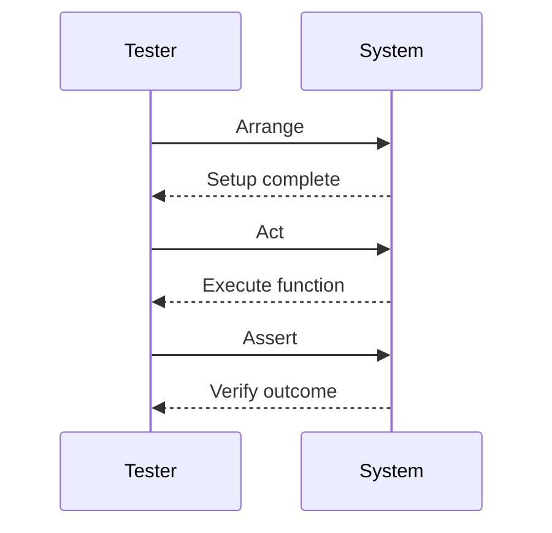

## 21.10. Writing Effective Tests

In the world of software development, testing is not just a phase but a crucial part of the development cycle. Writing effective tests ensures that your code is reliable, maintainable, and performs as expected. In this section, we will delve into the principles of writing effective tests in Elixir, explore the Arrange-Act-Assert (AAA) pattern, discuss test data management, and highlight common pitfalls to avoid.

### Principles of Good Tests

To write effective tests, it's important to adhere to certain principles that ensure your tests are both valuable and sustainable over time.

#### Tests Should Be Fast

Fast tests encourage frequent execution, which is critical in continuous integration environments. Slow tests can hinder development speed and discourage developers from running tests often. In Elixir, leveraging the concurrency model of the BEAM (Bogdan/Björn's Erlang Abstract Machine) can help in writing fast tests.

#### Tests Should Be Reliable

Reliability in tests means that they should consistently pass or fail under the same conditions. Flaky tests that pass or fail intermittently can erode trust in the test suite. Ensure that your tests are deterministic and not dependent on external factors such as network availability or specific timing.

#### Tests Should Be Maintainable

Maintainable tests are easy to understand and modify. As your codebase evolves, your tests should be straightforward to update. Use clear naming conventions and avoid complex logic within tests to maintain readability.

### Arranging Tests: The Arrange-Act-Assert (AAA) Pattern

The Arrange-Act-Assert (AAA) pattern is a widely adopted structure for writing tests. It helps in organizing tests in a clear and consistent manner.

#### Arrange

In the Arrange phase, set up the necessary preconditions and inputs for the test. This may involve initializing objects, setting up mock data, or configuring the environment.

```elixir
# Arrange
user = %User{name: "Alice", age: 30}
```

#### Act

The Act phase involves executing the function or method under test. This is where the action that you want to test takes place.

```elixir
# Act
result = User.greet(user)
```

#### Assert

In the Assert phase, verify that the outcome of the Act phase matches the expected result. This is where you check the correctness of the code.

```elixir
# Assert
assert result == "Hello, Alice!"
```

### Test Data Management

Managing test data effectively is crucial for writing reliable and maintainable tests. In Elixir, you can use fixtures or factories to generate test data.

#### Using Fixtures

Fixtures are static data sets used to populate the database with known data before tests are run. They provide a consistent state for tests to operate on.

```elixir
# Example fixture
defmodule MyApp.Fixtures do
  def user_fixture(attrs \\ %{}) do
    {:ok, user} =
      attrs
      |> Enum.into(%{name: "Alice", age: 30})
      |> MyApp.Accounts.create_user()

    user
  end
end
```

#### Using Factories

Factories are more flexible than fixtures and allow the creation of dynamic data for tests. They can generate different data sets on the fly, which is useful for testing various scenarios.

```elixir
# Example factory using ExMachina
defmodule MyApp.Factory do
  use ExMachina.Ecto, repo: MyApp.Repo

  def user_factory do
    %MyApp.User{
      name: sequence(:name, &"User #{&1}"),
      age: 30
    }
  end
end
```

### Avoiding Common Pitfalls

When writing tests, it's important to be aware of common pitfalls that can undermine the effectiveness of your test suite.

#### Not Testing Implementation Details

Tests should focus on the behavior of the code, not its implementation. Testing implementation details can lead to brittle tests that break with refactoring, even if the behavior remains unchanged.

#### Avoiding Interdependent Tests

Each test should be independent and not rely on the outcome of another test. Interdependent tests can lead to cascading failures and make it difficult to isolate issues.

### Code Examples and Exercises

Let's look at a complete example of writing an effective test in Elixir using the principles and patterns discussed.

```elixir
defmodule MyApp.UserTest do
  use ExUnit.Case
  alias MyApp.{User, Factory}

  describe "greet/1" do
    test "returns a greeting message for the user" do
      # Arrange
      user = Factory.user_factory()

      # Act
      result = User.greet(user)

      # Assert
      assert result == "Hello, #{user.name}!"
    end
  end
end
```

#### Try It Yourself

Experiment with the code above by modifying the `greet/1` function to include the user's age in the greeting message. Update the test to reflect this change.

### Visualizing Test Structures

To better understand the flow of writing tests, let's visualize the AAA pattern using a sequence diagram.


```mermaid
sequenceDiagram
    participant Tester
    participant System
    Tester->>System: Arrange
    System-->>Tester: Setup complete
    Tester->>System: Act
    System-->>Tester: Execute function
    Tester->>System: Assert
    System-->>Tester: Verify outcome
```

### References and Further Reading

- [ExUnit Documentation](https://hexdocs.pm/ex_unit/ExUnit.html)
- [ExMachina for Factories](https://hexdocs.pm/ex_machina/ExMachina.html)
- [Testing Elixir: Effective and Robust Testing for Elixir and its Ecosystem](https://pragprog.com/titles/lmelixir/testing-elixir/)

### Knowledge Check

- What are the key principles of writing effective tests?
- How does the AAA pattern help in organizing tests?
- What are the differences between fixtures and factories?
- Why should tests avoid focusing on implementation details?
- How can you ensure tests are independent?

### Embrace the Journey

Remember, writing effective tests is an ongoing process. As you gain more experience, you'll develop a deeper understanding of what makes a test suite robust and reliable. Keep experimenting, stay curious, and enjoy the journey of mastering testing in Elixir!

## Quiz Time!



### What is the primary benefit of using the Arrange-Act-Assert pattern in tests?

- [x] It provides a clear and consistent structure for tests.
- [ ] It makes tests run faster.
- [ ] It ensures tests are independent.
- [ ] It reduces the need for test data.

> **Explanation:** The Arrange-Act-Assert pattern helps in organizing tests in a clear and consistent manner, making them easier to read and maintain.

### Why should tests avoid focusing on implementation details?

- [x] To prevent brittle tests that break with refactoring.
- [ ] To make tests run faster.
- [ ] To reduce code complexity.
- [ ] To ensure tests are independent.

> **Explanation:** Focusing on implementation details can lead to brittle tests that break when the code is refactored, even if the behavior remains unchanged.

### What is a key difference between fixtures and factories?

- [x] Fixtures provide static data, while factories generate dynamic data.
- [ ] Fixtures are faster than factories.
- [ ] Factories are easier to maintain than fixtures.
- [ ] Fixtures are used for integration tests only.

> **Explanation:** Fixtures provide a consistent state with static data, whereas factories allow for the creation of dynamic data sets for testing various scenarios.

### How can you ensure tests are independent?

- [x] Avoid relying on the outcome of other tests.
- [ ] Use the AAA pattern.
- [ ] Use fixtures.
- [ ] Focus on implementation details.

> **Explanation:** Ensuring that each test does not rely on the outcome of another test helps maintain test independence.

### What is the role of the Assert phase in the AAA pattern?

- [x] To verify that the outcome matches the expected result.
- [ ] To set up the necessary preconditions.
- [ ] To execute the function under test.
- [ ] To clean up test data.

> **Explanation:** The Assert phase is where you verify that the outcome of the Act phase matches the expected result.

### Which of the following is a principle of good tests?

- [x] Tests should be fast.
- [ ] Tests should focus on implementation details.
- [ ] Tests should be interdependent.
- [ ] Tests should be complex.

> **Explanation:** Good tests should be fast, reliable, and maintainable, focusing on behavior rather than implementation details.

### What is a common pitfall in writing tests?

- [x] Testing implementation details.
- [ ] Using the AAA pattern.
- [ ] Using factories for test data.
- [ ] Writing fast tests.

> **Explanation:** Testing implementation details can lead to brittle tests that break with refactoring.

### What is the benefit of using ExMachina for test data management?

- [x] It allows for the creation of dynamic data sets.
- [ ] It makes tests run faster.
- [ ] It ensures tests are independent.
- [ ] It reduces the need for test data.

> **Explanation:** ExMachina allows for the creation of dynamic data sets, which is useful for testing various scenarios.

### How does the BEAM VM contribute to writing fast tests in Elixir?

- [x] By leveraging concurrency.
- [ ] By focusing on implementation details.
- [ ] By using static data.
- [ ] By ensuring test independence.

> **Explanation:** The BEAM VM's concurrency model helps in writing fast tests by efficiently managing concurrent processes.

### True or False: Interdependent tests can lead to cascading failures.

- [x] True
- [ ] False

> **Explanation:** Interdependent tests can lead to cascading failures, making it difficult to isolate issues and maintain test reliability.


