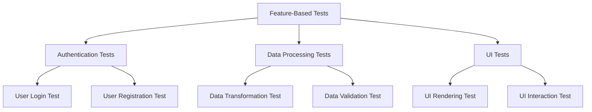

## 21.11. Test Organization and Management

In the realm of software development, testing is a critical component that ensures the reliability and robustness of applications. For Elixir developers, mastering test organization and management is essential to maintain high-quality codebases. This section delves into advanced strategies for structuring and managing test suites in Elixir, leveraging the power of ExUnit, Elixir's built-in testing framework.

### Structuring Test Suites

**Organizing Tests by Feature, Functionality, or Layers**

A well-structured test suite is crucial for maintainability and scalability. Organizing tests by feature, functionality, or architectural layers helps in isolating concerns and improving readability.

- **Feature-Based Organization**: Group tests according to the features they cover. This approach aligns with the user stories or requirements, making it easier to trace tests back to business needs.

- **Functionality-Based Organization**: Categorize tests based on the functionality they verify. For instance, separate tests for authentication, data processing, and user interface.

- **Layer-Based Organization**: Divide tests according to architectural layers, such as unit tests for individual functions, integration tests for module interactions, and end-to-end tests for the entire application flow.

#### Code Example: Organizing Tests by Feature

```elixir
# test/authentication/user_login_test.exs
defmodule MyApp.Authentication.UserLoginTest do
  use ExUnit.Case, async: true

  describe "User login" do
    test "successful login with valid credentials" do
      # Test logic here
    end

    test "failed login with invalid credentials" do
      # Test logic here
    end
  end
end

# test/data_processing/data_transformation_test.exs
defmodule MyApp.DataProcessing.DataTransformationTest do
  use ExUnit.Case, async: true

  describe "Data transformation" do
    test "transforms data correctly" do
      # Test logic here
    end
  end
end
```

### Using Test Tags

**Running Subsets of Tests Using Tags**

ExUnit allows tagging tests to run specific subsets, which is particularly useful for large test suites. Tags can be used to categorize tests by type, such as `@tag :integration`, `@tag :unit`, or by priority.

- **Defining Tags**: Use the `@tag` attribute to assign tags to tests. Tags can be boolean or key-value pairs.

- **Running Tagged Tests**: Use the `mix test` command with the `--only` option to run tests with specific tags.

#### Code Example: Using Test Tags

```elixir
defmodule MyApp.FeatureTest do
  use ExUnit.Case

  @tag :integration
  test "integration test example" do
    # Integration test logic
  end

  @tag :unit
  test "unit test example" do
    # Unit test logic
  end
end

# Running only integration tests
# mix test --only integration
```

### Setup and Teardown

**Utilizing `setup` and `on_exit` Callbacks**

Efficient test setup and teardown are vital for preparing the test environment and cleaning up resources. ExUnit provides `setup` and `on_exit` callbacks to manage these tasks.

- **`setup` Callback**: Define common setup logic for tests within a module. This can include initializing data, starting processes, or setting configurations.

- **`on_exit` Callback**: Register cleanup logic to be executed after each test. This ensures that the test environment is reset, preventing side effects.

#### Code Example: Setup and Teardown

```elixir
defmodule MyApp.SampleTest do
  use ExUnit.Case

  setup do
    # Setup logic, e.g., creating test data
    {:ok, user: %User{name: "Test User"}}
  end

  test "example test", context do
    assert context[:user].name == "Test User"
  end

  on_exit fn ->
    # Teardown logic, e.g., deleting test data
  end
end
```

### Documentation

**Writing Clear Test Descriptions for Readability**

Clear and descriptive test documentation is essential for understanding the purpose and scope of each test. This includes writing meaningful test names and using comments to explain complex logic.

- **Descriptive Test Names**: Use test names that clearly describe the behavior being tested. This aids in quickly identifying the purpose of a test.

- **Comments and Annotations**: Add comments to explain non-obvious logic or to provide context for the test scenario.

#### Code Example: Descriptive Test Documentation

```elixir
defmodule MyApp.CalculatorTest do
  use ExUnit.Case

  @doc """
  Tests the addition function for positive integers.
  """
  test "addition of two positive numbers" do
    assert MyApp.Calculator.add(1, 2) == 3
  end

  @doc """
  Tests the addition function with zero.
  """
  test "addition with zero" do
    assert MyApp.Calculator.add(0, 5) == 5
  end
end
```

### Visualizing Test Organization

To better understand how tests can be organized and managed, let's visualize the structure using a Mermaid.js diagram.



**Diagram Description**: This diagram illustrates a feature-based test organization, where tests are grouped by features such as authentication, data processing, and user interface.

### Knowledge Check

Before we move on, let's reinforce what we've learned with a few questions:

- How can organizing tests by feature improve maintainability?
- What are the benefits of using test tags in large test suites?
- How do `setup` and `on_exit` callbacks enhance test reliability?
- Why is clear test documentation important?

### Try It Yourself

To deepen your understanding, try modifying the code examples:

- Add a new feature-based test module and implement a few tests.
- Experiment with different test tags and run specific subsets.
- Implement a complex setup and teardown logic using `setup` and `on_exit`.

### Embrace the Journey

Remember, mastering test organization and management is a continuous journey. As you refine your skills, you'll discover new ways to enhance your test suites, making them more efficient and effective. Keep experimenting, stay curious, and enjoy the process!

### References and Links

For further reading and resources, consider exploring the following:

- [ExUnit Documentation](https://hexdocs.pm/ex_unit/ExUnit.html)
- [Elixir School: Testing](https://elixirschool.com/en/lessons/basics/testing/)
- [Elixir Forum: Testing Best Practices](https://elixirforum.com/c/learning-resources/testing/)

## Quiz: Test Organization and Management



### How can organizing tests by feature improve maintainability?

- [x] It aligns tests with business requirements.
- [ ] It reduces the number of tests needed.
- [ ] It makes tests run faster.
- [ ] It eliminates the need for test documentation.

> **Explanation:** Organizing tests by feature aligns them with business requirements, making it easier to trace tests back to specific needs.

### What is the primary benefit of using test tags?

- [x] Running specific subsets of tests.
- [ ] Increasing test execution speed.
- [ ] Reducing code complexity.
- [ ] Eliminating the need for setup and teardown.

> **Explanation:** Test tags allow developers to run specific subsets of tests, which is useful for managing large test suites.

### Which callback is used for cleanup after tests?

- [x] `on_exit`
- [ ] `setup`
- [ ] `before_each`
- [ ] `after_each`

> **Explanation:** The `on_exit` callback is used for cleanup after tests, ensuring the test environment is reset.

### Why is clear test documentation important?

- [x] It helps in understanding the purpose of each test.
- [ ] It reduces the number of tests needed.
- [ ] It makes tests run faster.
- [ ] It eliminates the need for test tags.

> **Explanation:** Clear test documentation helps in understanding the purpose and scope of each test, aiding in maintainability.

### What is a common use for the `setup` callback?

- [x] Initializing data for tests.
- [ ] Cleaning up resources.
- [ ] Running specific subsets of tests.
- [ ] Documenting test logic.

> **Explanation:** The `setup` callback is commonly used for initializing data or setting configurations needed for tests.

### How can test tags be defined in ExUnit?

- [x] Using the `@tag` attribute.
- [ ] Using the `setup` callback.
- [ ] Using the `on_exit` callback.
- [ ] Using the `describe` block.

> **Explanation:** Test tags are defined using the `@tag` attribute in ExUnit.

### What is the purpose of organizing tests by architectural layers?

- [x] To isolate concerns and improve readability.
- [ ] To reduce the number of tests needed.
- [ ] To make tests run faster.
- [ ] To eliminate the need for test documentation.

> **Explanation:** Organizing tests by architectural layers helps isolate concerns and improve readability.

### Which command is used to run tests with specific tags?

- [x] `mix test --only`
- [ ] `mix test --tags`
- [ ] `mix test --filter`
- [ ] `mix test --run`

> **Explanation:** The `mix test --only` command is used to run tests with specific tags.

### What is a benefit of using descriptive test names?

- [x] They clearly describe the behavior being tested.
- [ ] They reduce the number of tests needed.
- [ ] They make tests run faster.
- [ ] They eliminate the need for test tags.

> **Explanation:** Descriptive test names clearly describe the behavior being tested, aiding in understanding and maintainability.

### True or False: The `setup` callback is used for cleanup after tests.

- [ ] True
- [x] False

> **Explanation:** The `setup` callback is used for initializing data or setting configurations before tests, not for cleanup.



By mastering these advanced test organization and management techniques, you'll be well-equipped to maintain high-quality Elixir applications. Keep exploring, practicing, and refining your skills to become an expert in Elixir testing!
