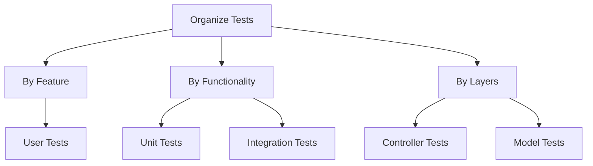

## 21.11. Test Organization and Management

Testing is a critical component of software development, ensuring that code behaves as expected and that changes do not introduce new bugs. In Elixir, the testing framework ExUnit provides powerful tools to write and manage tests. This section will explore best practices for organizing and managing test suites in Elixir, focusing on structuring test suites, using test tags, setup and teardown strategies, and writing clear documentation.

### Structuring Test Suites

Organizing test suites effectively is crucial for maintaining a clean and efficient codebase. Well-structured test suites make it easier to locate, understand, and modify tests as the codebase evolves.

#### Organizing Tests by Feature

One approach is to organize tests by feature. This involves grouping tests that relate to a specific feature or module. This organization mirrors the structure of the application code and makes it easier to find tests relevant to a particular part of the application.

```elixir
# test/my_app/user_test.exs
defmodule MyApp.UserTest do
  use ExUnit.Case
  alias MyApp.User

  describe "User creation" do
    test "creates a user with valid attributes" do
      assert {:ok, user} = User.create(%{name: "Alice", email: "alice@example.com"})
      assert user.name == "Alice"
    end

    test "fails to create a user with invalid email" do
      assert {:error, _} = User.create(%{name: "Bob", email: "invalid_email"})
    end
  end
end
```

#### Organizing Tests by Functionality

Another approach is to organize tests by functionality, such as unit tests, integration tests, and acceptance tests. This structure helps in running specific types of tests during different stages of development.

```plaintext
test/
  unit/
    user_test.exs
    post_test.exs
  integration/
    user_post_interaction_test.exs
  acceptance/
    user_flow_test.exs
```

#### Organizing Tests by Layers

Tests can also be organized by layers of the application architecture, such as controllers, models, and views. This approach aligns with the common MVC architecture in web applications.

```plaintext
test/
  controllers/
    user_controller_test.exs
  models/
    user_test.exs
  views/
    user_view_test.exs
```

### Using Test Tags

Test tags are a powerful feature in ExUnit that allows you to categorize and run subsets of tests. This is particularly useful for running only a specific group of tests, such as slow integration tests, during development.

#### Defining Test Tags

You can define tags in your tests using the `@tag` attribute. For example, you might tag integration tests as follows:

```elixir
defmodule MyApp.IntegrationTest do
  use ExUnit.Case

  @tag :integration
  test "integration test example" do
    assert 1 + 1 == 2
  end
end
```

#### Running Tests with Specific Tags

To run tests with a specific tag, use the `--only` option with the `mix test` command:

```shell
mix test --only integration
```

You can also exclude tests with certain tags using the `--exclude` option:

```shell
mix test --exclude integration
```

### Setup and Teardown

Properly setting up and tearing down test environments is essential for reliable tests. ExUnit provides `setup` and `on_exit` callbacks to manage these tasks.

#### Using `setup` Callbacks

The `setup` callback is used to prepare the environment before each test. This might include inserting data into a test database or configuring a mock server.

```elixir
defmodule MyApp.UserTest do
  use ExUnit.Case

  setup do
    {:ok, user: %MyApp.User{name: "Alice", email: "alice@example.com"}}
  end

  test "user has a name", %{user: user} do
    assert user.name == "Alice"
  end
end
```

#### Using `on_exit` Callbacks

The `on_exit` callback is used to clean up after tests. This might involve deleting test data or closing connections.

```elixir
defmodule MyApp.UserTest do
  use ExUnit.Case

  setup do
    {:ok, pid} = start_supervised(MyApp.UserSupervisor)
    on_exit(fn -> stop_supervised(pid) end)
    :ok
  end

  test "user process is running" do
    assert Process.alive?(MyApp.UserSupervisor)
  end
end
```

### Documentation

Clear documentation in tests is crucial for readability and maintainability. Test descriptions should be concise yet informative, explaining what the test is verifying.

#### Writing Clear Test Descriptions

Use descriptive test names and comments to explain the purpose and expected outcome of each test.

```elixir
defmodule MyApp.UserTest do
  use ExUnit.Case

  describe "User creation" do
    # Test that a user with valid attributes is successfully created
    test "creates a user with valid attributes" do
      assert {:ok, user} = User.create(%{name: "Alice", email: "alice@example.com"})
    end

    # Test that a user creation fails with an invalid email
    test "fails to create a user with invalid email" do
      assert {:error, _} = User.create(%{name: "Bob", email: "invalid_email"})
    end
  end
end
```

### Try It Yourself

To gain a deeper understanding, try modifying the code examples provided:

- **Experiment with Test Tags**: Add different tags to your tests and practice running them with various `mix test` options.
- **Setup and Teardown**: Implement setup and teardown logic in your tests to handle complex scenarios.
- **Enhance Documentation**: Rewrite test descriptions to be more informative and clear.

### Visualizing Test Organization


```mermaid
graph TD;
    A[Organize Tests] --> B[By Feature]
    A --> C[By Functionality]
    A --> D[By Layers]
    B --> E[User Tests]
    C --> F[Unit Tests]
    C --> G[Integration Tests]
    D --> H[Controller Tests]
    D --> I[Model Tests]
```

The diagram above illustrates different strategies for organizing test suites, providing a visual guide to structuring tests in Elixir.

### References and Links

For further reading on ExUnit and testing in Elixir, consider exploring the following resources:

- [Elixir School: Testing](https://elixirschool.com/en/lessons/testing/basics/)
- [ExUnit Documentation](https://hexdocs.pm/ex_unit/ExUnit.html)
- [Elixir Testing with ExUnit](https://pragprog.com/titles/elixir16/elixir-in-action/)

### Knowledge Check

- **What are the benefits of organizing tests by feature?**
- **How can test tags improve the testing process?**
- **Why is setup and teardown important in test management?**
- **What makes a good test description?**

### Embrace the Journey

Testing is an essential part of software development, and mastering test organization and management in Elixir will greatly enhance your ability to deliver robust and reliable applications. Remember, this is just the beginning. As you progress, you'll build more complex and comprehensive test suites. Keep experimenting, stay curious, and enjoy the journey!

## Quiz Time!



### What is the primary benefit of organizing tests by feature?

- [x] It mirrors the structure of the application code.
- [ ] It reduces the number of tests.
- [ ] It simplifies the test framework.
- [ ] It eliminates the need for test tags.

> **Explanation:** Organizing tests by feature mirrors the structure of the application code, making it easier to find and manage tests related to specific features.

### How can you run only integration tests using ExUnit?

- [x] Use the command `mix test --only integration`.
- [ ] Use the command `mix test --integration`.
- [ ] Use the command `mix test --tags integration`.
- [ ] Use the command `mix test --run integration`.

> **Explanation:** The `--only` option allows you to run tests with a specific tag, such as `integration`.

### What is the purpose of the `setup` callback in ExUnit?

- [x] To prepare the environment before each test.
- [ ] To clean up after all tests.
- [ ] To define test tags.
- [ ] To document test cases.

> **Explanation:** The `setup` callback is used to prepare the test environment before each test, ensuring that each test runs in a consistent state.

### Which of the following is NOT a way to organize tests?

- [ ] By feature
- [ ] By functionality
- [ ] By layers
- [x] By test length

> **Explanation:** Organizing by test length is not a common practice. Tests are typically organized by feature, functionality, or layers.

### What is the purpose of the `on_exit` callback?

- [x] To clean up after tests.
- [ ] To prepare the environment before tests.
- [ ] To define test tags.
- [ ] To document test cases.

> **Explanation:** The `on_exit` callback is used to perform cleanup tasks after tests have run.

### Why is clear documentation important in tests?

- [x] It improves readability and maintainability.
- [ ] It reduces the number of tests needed.
- [ ] It automates test execution.
- [ ] It eliminates the need for setup callbacks.

> **Explanation:** Clear documentation in tests improves readability and maintainability, making it easier for developers to understand the purpose and expected outcomes of tests.

### How can you exclude tests with a specific tag?

- [x] Use the command `mix test --exclude <tag>`.
- [ ] Use the command `mix test --omit <tag>`.
- [ ] Use the command `mix test --skip <tag>`.
- [ ] Use the command `mix test --remove <tag>`.

> **Explanation:** The `--exclude` option allows you to exclude tests with a specific tag from being run.

### What is a key benefit of using test tags?

- [x] They allow running subsets of tests.
- [ ] They increase test execution speed.
- [ ] They simplify test writing.
- [ ] They reduce the number of test files.

> **Explanation:** Test tags allow developers to run subsets of tests, which can be useful for focusing on specific areas during development.

### Which command is used to run all tests except those tagged as integration?

- [x] `mix test --exclude integration`
- [ ] `mix test --skip integration`
- [ ] `mix test --omit integration`
- [ ] `mix test --remove integration`

> **Explanation:** The `--exclude` option is used to exclude tests with a specific tag, such as `integration`, from being run.

### True or False: Test descriptions should be concise yet informative.

- [x] True
- [ ] False

> **Explanation:** Test descriptions should be concise yet informative to clearly convey the purpose and expected outcome of each test.


