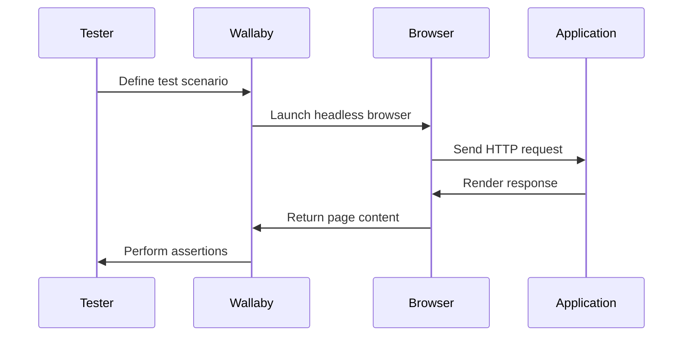

## 21.12. Integration Testing with Wallaby

In the realm of software development, ensuring that all components of an application work seamlessly together is crucial. Integration testing plays a pivotal role in this process, and when it comes to web applications, automated browser testing becomes indispensable. In this section, we will delve into integration testing using Wallaby in Elixir, focusing on simulating user interactions, setting up headless browsers, and writing comprehensive feature tests.

### Automated Browser Testing

Automated browser testing involves simulating user interactions within a web browser to verify that the application behaves as expected. This form of testing is essential for ensuring that the user interface (UI) is functional and that the application responds correctly to user inputs.

#### Key Benefits of Automated Browser Testing

- **Efficiency**: Automated tests can be run quickly and repeatedly, saving time compared to manual testing.
- **Consistency**: Automated tests provide consistent results, reducing human error.
- **Coverage**: They allow for comprehensive testing of user flows and edge cases.
- **Regression Testing**: Automated tests can be easily rerun to ensure that new changes do not break existing functionality.

### Using Wallaby

Wallaby is a powerful tool for browser-based testing in Elixir applications. It provides a simple and expressive API for interacting with web pages, making it easier to write and maintain tests.

#### Setting Up Wallaby

To get started with Wallaby, you need to add it to your Elixir project's dependencies. You can do this by adding the following line to your `mix.exs` file:

```elixir
defp deps do
  [
    {:wallaby, "~> 0.28.0", only: :test},
    {:phoenix_ecto, "~> 4.0"}
  ]
end
```

Next, configure Wallaby in your `config/test.exs` file:

```elixir
config :wallaby,
  driver: Wallaby.Chrome,
  chrome: [headless: true]
```

Ensure you have the necessary drivers installed, such as ChromeDriver, to run headless browsers like Chrome or PhantomJS.

#### Running Tests with Wallaby

Once Wallaby is set up, you can start writing tests. Wallaby tests are typically written in `test` files using ExUnit, Elixir's built-in testing framework. Here's a simple example of a Wallaby test:

```elixir
defmodule MyAppWeb.PageTest do
  use MyAppWeb.ConnCase, async: true
  use Wallaby.Feature

  feature "visiting the homepage", %{session: session} do
    session
    |> visit("/")
    |> assert_has(css("h1", text: "Welcome to MyApp"))
  end
end
```

In this example, we define a feature test that visits the homepage and asserts that an `<h1>` element with the text "Welcome to MyApp" is present.

### Writing Feature Tests

Feature tests in Wallaby allow you to test full user flows from the front-end to the back-end. These tests simulate real user interactions, such as clicking buttons, filling out forms, and navigating between pages.

#### Example: Testing a User Login Flow

Let's consider a more complex example where we test a user login flow:

```elixir
defmodule MyAppWeb.UserLoginTest do
  use MyAppWeb.ConnCase, async: true
  use Wallaby.Feature

  feature "user can log in", %{session: session} do
    session
    |> visit("/login")
    |> fill_in(css("input[name='username']"), with: "test_user")
    |> fill_in(css("input[name='password']"), with: "password123")
    |> click_button("Log In")
    |> assert_has(css(".alert-success", text: "Logged in successfully"))
  end
end
```

In this test, we simulate a user visiting the login page, entering their credentials, and clicking the "Log In" button. We then assert that a success message is displayed.

### Considerations for Effective Testing

When writing integration tests with Wallaby, it's important to ensure that your tests are deterministic and not flaky. Here are some considerations to keep in mind:

- **Isolation**: Ensure that tests do not depend on each other. Each test should set up its own data and environment.
- **Speed**: Keep tests fast by minimizing unnecessary interactions and using headless browsers.
- **Stability**: Use explicit waits or retries for elements that may take time to load.
- **Data Management**: Clean up test data after each test to maintain a consistent state.

### Visualizing the Testing Process

To better understand the flow of a Wallaby test, let's visualize the process using a sequence diagram:



This diagram illustrates the interaction between the tester, Wallaby, the browser, and the application during a test.

### Try It Yourself

To deepen your understanding, try modifying the example tests to explore different scenarios. For instance, you could:

- Test a failed login attempt and assert that an error message is displayed.
- Simulate a user signing up for a new account and verify that they are redirected to a welcome page.
- Experiment with different CSS selectors and assertions to test various elements on the page.

### References and Links

For further reading on Wallaby and browser testing in Elixir, consider the following resources:

- [Wallaby GitHub Repository](https://github.com/elixir-wallaby/wallaby)
- [Elixir Testing Guide](https://elixir-lang.org/getting-started/mix-otp/introduction-to-mix.html)
- [Headless Chrome Documentation](https://developers.google.com/web/updates/2017/04/headless-chrome)

### Knowledge Check

Before we wrap up, let's reinforce what we've learned with a few questions:

1. What is the primary purpose of automated browser testing?
2. How does Wallaby facilitate integration testing in Elixir?
3. What are some best practices for writing stable and reliable tests with Wallaby?

### Embrace the Journey

Remember, mastering integration testing with Wallaby is a journey. As you continue to experiment and refine your tests, you'll gain deeper insights into your application's behavior and improve its overall quality. Keep exploring, stay curious, and enjoy the process!

## Quiz: Integration Testing with Wallaby



### What is the primary benefit of automated browser testing?

- [x] Efficiency and consistency in testing
- [ ] Manual verification of UI elements
- [ ] Reducing the need for unit tests
- [ ] Eliminating the need for QA teams

> **Explanation:** Automated browser testing provides efficiency and consistency, allowing tests to be run quickly and repeatedly with consistent results.

### Which Elixir library is used for browser-based testing?

- [x] Wallaby
- [ ] ExUnit
- [ ] Phoenix
- [ ] Ecto

> **Explanation:** Wallaby is the library used for browser-based testing in Elixir applications.

### What is the purpose of the `visit` function in Wallaby tests?

- [x] To navigate to a specific URL
- [ ] To fill in form fields
- [ ] To assert the presence of elements
- [ ] To close the browser session

> **Explanation:** The `visit` function is used to navigate to a specific URL in a Wallaby test.

### How can you ensure that Wallaby tests are not flaky?

- [x] Use explicit waits or retries for elements
- [ ] Run tests in a random order
- [ ] Avoid using assertions
- [ ] Use only synchronous code

> **Explanation:** Using explicit waits or retries can help ensure that Wallaby tests are stable and not flaky.

### What is a key consideration when writing integration tests with Wallaby?

- [x] Ensuring tests are deterministic
- [ ] Using only synchronous code
- [ ] Avoiding assertions
- [ ] Running tests in a random order

> **Explanation:** Ensuring that tests are deterministic and not flaky is a key consideration when writing integration tests with Wallaby.

### Which of the following is a common use case for Wallaby?

- [x] Testing user login flows
- [ ] Compiling Elixir code
- [ ] Managing database migrations
- [ ] Deploying applications

> **Explanation:** Wallaby is commonly used for testing user flows, such as login processes, in web applications.

### What is the role of the `assert_has` function in Wallaby?

- [x] To verify the presence of elements on a page
- [ ] To navigate to a specific URL
- [ ] To fill in form fields
- [ ] To close the browser session

> **Explanation:** The `assert_has` function is used to verify the presence of elements on a page in a Wallaby test.

### What should you do to maintain a consistent state in tests?

- [x] Clean up test data after each test
- [ ] Use only synchronous code
- [ ] Avoid using assertions
- [ ] Run tests in a random order

> **Explanation:** Cleaning up test data after each test helps maintain a consistent state and ensures that tests do not interfere with each other.

### How can you run Wallaby tests in a headless browser?

- [x] Configure Wallaby to use a headless browser driver
- [ ] Use only synchronous code
- [ ] Avoid using assertions
- [ ] Run tests in a random order

> **Explanation:** Configuring Wallaby to use a headless browser driver allows tests to run in a headless browser environment.

### True or False: Wallaby can be used to test both front-end and back-end interactions.

- [x] True
- [ ] False

> **Explanation:** Wallaby can be used to test full user flows, including both front-end and back-end interactions, by simulating user actions in a browser.


