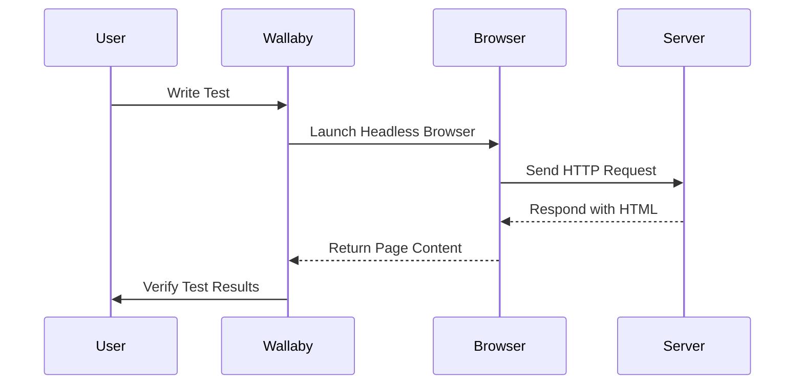

## 21.12. Integration Testing with Wallaby

As expert software engineers and architects, understanding the intricacies of integration testing is paramount to ensuring that our applications function seamlessly across various components. In this section, we will delve into the world of integration testing in Elixir using Wallaby, a powerful tool for automated browser testing. We'll explore how to simulate user interactions, set up headless browsers, and write comprehensive feature tests to validate user flows from front-end to back-end.

### Automated Browser Testing

Automated browser testing is a crucial aspect of modern web application development. It involves simulating user interactions in a web browser to verify that the application behaves as expected. This type of testing is essential for ensuring that your application is user-friendly and free from critical bugs that could impact the user experience.

#### Why Automated Browser Testing?

- **Consistency**: Automated tests provide consistent results, reducing the chances of human error.
- **Efficiency**: Tests can be executed quickly and repeatedly, saving time and resources.
- **Scalability**: Automated tests can cover a wide range of scenarios, making them suitable for large applications.

#### Key Concepts

- **Simulating User Interactions**: Automated browser tests mimic real user actions, such as clicking buttons, filling forms, and navigating pages.
- **Headless Browsers**: These are browsers that run without a graphical user interface, ideal for automated testing environments.

### Using Wallaby

Wallaby is a robust tool for automated browser testing in Elixir. It provides a simple API for interacting with web pages and supports headless browsers like Chrome and PhantomJS. Let's explore how to set up and use Wallaby in your Elixir projects.

#### Setting Up Wallaby

To get started with Wallaby, you'll need to add it to your Elixir project's dependencies. Here's how you can do it:

1. **Add Wallaby to Your Mix File**

   Open your `mix.exs` file and add Wallaby to your list of dependencies:

   ```elixir
   defp deps do
     [
       {:wallaby, "~> 0.28.0", only: :test}
     ]
   end
   ```

2. **Configure Wallaby**

   Next, configure Wallaby in your `config/test.exs` file:

   ```elixir
   config :wallaby,
     driver: Wallaby.Chrome,
     chrome: [headless: true]
   ```

   This configuration sets up Wallaby to use the Chrome browser in headless mode.

3. **Install ChromeDriver**

   Wallaby requires ChromeDriver to interact with the Chrome browser. You can install it using your system's package manager or download it from the [official website](https://sites.google.com/chromium.org/driver/).

#### Writing Your First Wallaby Test

Let's write a simple Wallaby test to verify that a page loads correctly.

1. **Create a Test Module**

   Create a new test module in your `test` directory:

   ```elixir
   defmodule MyAppWeb.PageTest do
     use ExUnit.Case, async: true
     use Wallaby.Feature

     alias Wallaby.Browser

     feature "visiting the homepage", %{session: session} do
       session
       |> visit("/")
       |> assert_has(css("h1", text: "Welcome to MyApp!"))
     end
   end
   ```

   In this test, we use Wallaby's `visit/2` function to navigate to the homepage and `assert_has/2` to check that the page contains an `<h1>` element with the text "Welcome to MyApp!".

2. **Run Your Test**

   You can run your Wallaby tests using the `mix test` command. Wallaby will launch a headless browser, execute the test, and report the results.

### Writing Feature Tests

Feature tests are an integral part of integration testing. They validate complete user flows, ensuring that all components of your application work together seamlessly. With Wallaby, you can write robust feature tests that cover a wide range of scenarios.

#### Testing User Flows

Consider a simple user flow where a user logs in, navigates to their dashboard, and logs out. Here's how you can test this flow using Wallaby:

1. **Define the Test**

   ```elixir
   feature "user login and logout", %{session: session} do
     session
     |> visit("/login")
     |> fill_in(css("input[name='username']"), with: "test_user")
     |> fill_in(css("input[name='password']"), with: "secret")
     |> click_button("Log In")
     |> assert_has(css("h1", text: "Dashboard"))
     |> click_link("Log Out")
     |> assert_has(css("h1", text: "Login"))
   end
   ```

   In this test, we simulate a user logging in by filling in the username and password fields, clicking the "Log In" button, and verifying that the dashboard loads. We then simulate logging out and check that the login page is displayed again.

#### Handling Asynchronous Operations

Web applications often involve asynchronous operations, such as AJAX requests. Wallaby provides built-in support for handling these operations, ensuring that your tests are reliable and deterministic.

- **Using `assert_has/2` with Timeout**

  Wallaby's `assert_has/2` function includes a default timeout, allowing it to wait for elements to appear on the page. You can adjust this timeout if necessary:

  ```elixir
  assert_has(css(".notification", text: "Welcome!"), timeout: 5000)
  ```

### Considerations for Reliable Tests

To ensure that your Wallaby tests are reliable and not flaky, consider the following best practices:

- **Deterministic Tests**: Ensure that your tests produce consistent results by avoiding dependencies on external services or data that may change.
- **Isolation**: Each test should run in isolation, without relying on the state of other tests.
- **Environment Configuration**: Use a consistent environment configuration for your tests, including database and server settings.

### Visualizing the Testing Workflow

To better understand the workflow of integration testing with Wallaby, let's visualize the process using a Mermaid.js diagram.


```mermaid
sequenceDiagram
    participant User
    participant Wallaby
    participant Browser
    participant Server

    User->>Wallaby: Write Test
    Wallaby->>Browser: Launch Headless Browser
    Browser->>Server: Send HTTP Request
    Server-->>Browser: Respond with HTML
    Browser-->>Wallaby: Return Page Content
    Wallaby->>User: Verify Test Results
```

**Diagram Description**: This sequence diagram illustrates the workflow of a Wallaby test. The user writes a test, Wallaby launches a headless browser, which sends an HTTP request to the server. The server responds with HTML content, which the browser returns to Wallaby for verification.

### Try It Yourself

Now that you've learned the basics of integration testing with Wallaby, it's time to put your knowledge into practice. Try modifying the code examples to test different user flows or add new assertions to check additional elements on the page. Experiment with different configurations and explore Wallaby's API to discover more features.

### References and Further Reading

- [Wallaby GitHub Repository](https://github.com/elixir-wallaby/wallaby)
- [ChromeDriver Official Website](https://sites.google.com/chromium.org/driver/)
- [Elixir Testing with ExUnit](https://hexdocs.pm/ex_unit/ExUnit.html)

### Knowledge Check

Before we wrap up, let's reinforce your understanding with a few questions:

1. What is the primary purpose of automated browser testing?
2. How does Wallaby interact with web browsers?
3. What are some best practices for writing reliable integration tests?

### Embrace the Journey

Remember, mastering integration testing with Wallaby is just one step in your journey as an expert Elixir developer. Keep experimenting, stay curious, and enjoy the process of building robust, user-friendly applications. As you continue to explore Wallaby and other testing tools, you'll gain deeper insights into creating seamless user experiences.

## Quiz Time!



### What is the main advantage of using automated browser testing?

- [x] Consistency in test results
- [ ] Faster manual testing
- [ ] Reduced need for code reviews
- [ ] Elimination of all bugs

> **Explanation:** Automated browser testing provides consistent results, reducing the chances of human error.

### Which tool does Wallaby require to interact with the Chrome browser?

- [x] ChromeDriver
- [ ] FirefoxDriver
- [ ] Selenium
- [ ] PhantomJS

> **Explanation:** Wallaby requires ChromeDriver to interact with the Chrome browser.

### What is a key feature of headless browsers?

- [x] They run without a graphical user interface
- [ ] They are slower than regular browsers
- [ ] They cannot execute JavaScript
- [ ] They require manual interaction

> **Explanation:** Headless browsers run without a graphical user interface, making them ideal for automated testing.

### How does Wallaby handle asynchronous operations in tests?

- [x] It includes a default timeout for waiting for elements
- [ ] It ignores asynchronous operations
- [ ] It requires manual synchronization
- [ ] It uses callbacks

> **Explanation:** Wallaby's `assert_has/2` function includes a default timeout, allowing it to wait for elements to appear on the page.

### What is the purpose of the `assert_has/2` function in Wallaby?

- [x] To verify that an element is present on the page
- [ ] To fill in form fields
- [ ] To navigate between pages
- [ ] To execute JavaScript

> **Explanation:** The `assert_has/2` function is used to verify that an element is present on the page.

### Which configuration file is used to set up Wallaby in an Elixir project?

- [x] `config/test.exs`
- [ ] `mix.exs`
- [ ] `config/dev.exs`
- [ ] `config/prod.exs`

> **Explanation:** Wallaby is configured in the `config/test.exs` file.

### What is a best practice for writing reliable integration tests?

- [x] Ensuring tests run in isolation
- [ ] Relying on external services
- [ ] Using random data
- [ ] Ignoring environment configuration

> **Explanation:** Each test should run in isolation, without relying on the state of other tests.

### Which of the following is NOT a benefit of automated browser testing?

- [ ] Consistent results
- [ ] Efficient test execution
- [ ] Scalable test coverage
- [x] Elimination of all bugs

> **Explanation:** While automated testing provides many benefits, it cannot eliminate all bugs.

### What does the `visit/2` function do in a Wallaby test?

- [x] Navigates to a specified URL
- [ ] Fills in a form field
- [ ] Clicks a button
- [ ] Asserts the presence of an element

> **Explanation:** The `visit/2` function is used to navigate to a specified URL in a Wallaby test.

### True or False: Wallaby can only be used with the Chrome browser.

- [ ] True
- [x] False

> **Explanation:** Wallaby supports multiple browsers, including Chrome and PhantomJS.




