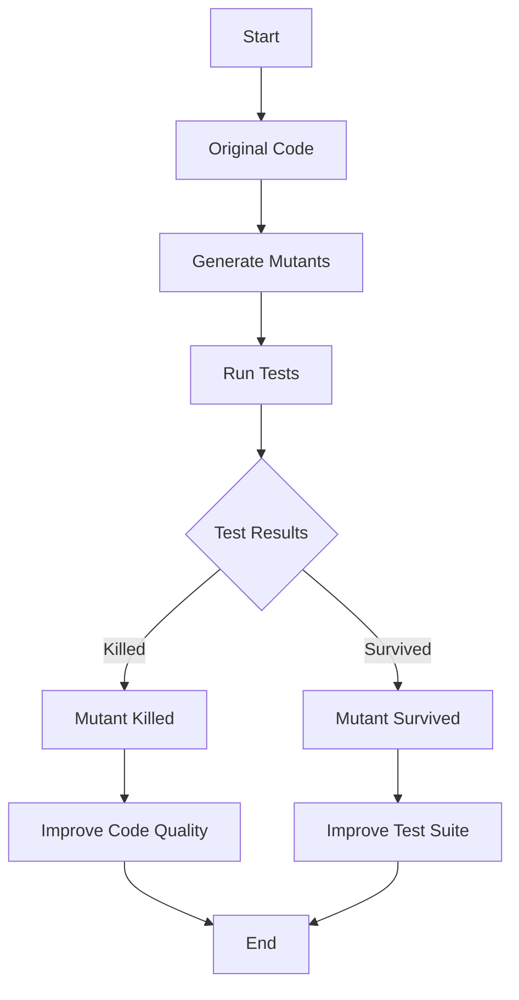

## 21.13. Mutation Testing with Muzak

Mutation testing is a powerful technique used to evaluate the quality of a test suite by introducing small changes, or "mutations," to the codebase. The goal is to determine whether the existing tests can detect these changes, thereby assessing their effectiveness. In this section, we will delve into mutation testing using Muzak, a tool specifically designed for Elixir.

### Concept of Mutation Testing

Mutation testing involves modifying a program's source code in small ways to create a set of "mutants." Each mutant is a version of the program with a slight change, such as altering a conditional statement or changing an arithmetic operator. The test suite is then run against these mutants to see if it can detect the changes. If a test fails, the mutant is considered "killed." If the test passes, the mutant "survives," indicating a potential weakness in the test suite.

#### Key Concepts

- **Mutants**: Variants of the original code with small changes.
- **Killing a Mutant**: When a test fails due to a mutation, indicating the test suite's ability to catch the change.
- **Surviving Mutant**: When a test passes despite the mutation, suggesting a gap in the test coverage.

### Using Muzak for Mutation Testing

Muzak is a mutation testing tool for Elixir that automates the process of generating mutants and running tests against them. It integrates seamlessly with Elixir's testing framework, ExUnit, to provide insights into the robustness of your test suite.

#### Installation and Setup

To get started with Muzak, you need to add it to your project's dependencies. Open your `mix.exs` file and include Muzak:

```elixir
defp deps do
  [
    {:muzak, "~> 1.0", only: :test}
  ]
end
```

Run `mix deps.get` to install the dependency.

#### Running Mutation Tests

Once installed, you can run mutation tests using the following command:

```bash
mix muzak
```

This command will generate mutants and execute your test suite against them. Muzak will provide a report detailing which mutants were killed and which survived.

#### Interpreting Results

The output from Muzak will include a list of mutants and their status. A high percentage of killed mutants indicates a robust test suite, while surviving mutants highlight areas that may require additional testing.

### Benefits of Mutation Testing

Mutation testing offers several advantages:

- **Identifying Weak Tests**: By highlighting surviving mutants, you can pinpoint tests that need improvement.
- **Improving Test Coverage**: Encourages the development of more comprehensive tests.
- **Enhancing Code Quality**: Leads to a more reliable and maintainable codebase.

### Challenges of Mutation Testing

Despite its benefits, mutation testing presents some challenges:

- **Longer Test Execution Times**: Running tests against multiple mutants can be time-consuming.
- **Interpreting Mutation Results**: Understanding why a mutant survived and how to address it can be complex.

### Practical Example

Let's explore a practical example to illustrate mutation testing with Muzak.

#### Sample Code

Consider a simple Elixir module that performs basic arithmetic operations:

```elixir
defmodule Calculator do
  def add(a, b), do: a + b
  def subtract(a, b), do: a - b
  def multiply(a, b), do: a * b
  def divide(a, b) when b != 0, do: a / b
end
```

#### Writing Tests

Here's a basic test suite for the `Calculator` module:

```elixir
defmodule CalculatorTest do
  use ExUnit.Case
  alias Calculator

  test "addition" do
    assert Calculator.add(1, 2) == 3
  end

  test "subtraction" do
    assert Calculator.subtract(5, 3) == 2
  end

  test "multiplication" do
    assert Calculator.multiply(4, 3) == 12
  end

  test "division" do
    assert Calculator.divide(10, 2) == 5
  end

  test "division by zero" do
    assert_raise ArithmeticError, fn -> Calculator.divide(10, 0) end
  end
end
```

#### Running Muzak

Execute `mix muzak` to perform mutation testing on the `Calculator` module. Muzak will generate mutants by altering operations, such as changing `+` to `-`, and run the tests to see if they catch these changes.

#### Analyzing Results

Suppose Muzak reports a surviving mutant where the addition operation was changed to subtraction. This indicates that the test for addition might not be comprehensive enough. You could enhance the test by adding more cases or edge conditions.

### Visualizing Mutation Testing

Below is a flowchart illustrating the mutation testing process with Muzak:



**Figure 1:** Mutation Testing Process with Muzak

### Try It Yourself

Experiment with the `Calculator` module by introducing additional operations or edge cases. Modify the tests to cover these scenarios and run Muzak again to see how the results change.

### References and Links

For further reading on mutation testing and Muzak, consider the following resources:

- [Muzak GitHub Repository](https://github.com/entone/muzak)
- [ExUnit Documentation](https://hexdocs.pm/ex_unit/ExUnit.html)
- [Mutation Testing Concepts](https://en.wikipedia.org/wiki/Mutation_testing)

### Knowledge Check

- What is the purpose of mutation testing?
- How does Muzak integrate with ExUnit?
- What are the benefits and challenges of mutation testing?

### Embrace the Journey

Remember, mutation testing is a journey toward improving your test suite and code quality. As you progress, you'll gain insights into the strengths and weaknesses of your tests. Keep experimenting, stay curious, and enjoy the process!

## Quiz: Mutation Testing with Muzak



### What is the primary goal of mutation testing?

- [x] To assess the effectiveness of a test suite by introducing code changes
- [ ] To improve code performance
- [ ] To refactor code for better readability
- [ ] To automate deployment processes

> **Explanation:** Mutation testing aims to evaluate the robustness of a test suite by introducing small changes to the code and checking if the tests can detect them.

### Which tool is used for mutation testing in Elixir?

- [x] Muzak
- [ ] ExUnit
- [ ] Dialyzer
- [ ] Credo

> **Explanation:** Muzak is a tool specifically designed for mutation testing in Elixir.

### What does it mean when a mutant is "killed"?

- [x] The test suite detected the mutation and failed
- [ ] The test suite passed without detecting the mutation
- [ ] The code was refactored successfully
- [ ] The mutation was ignored

> **Explanation:** A "killed" mutant indicates that the test suite successfully detected the change and failed, showing its effectiveness.

### What challenge is associated with mutation testing?

- [x] Longer test execution times
- [ ] Lack of test coverage
- [ ] Difficulty in writing tests
- [ ] Inability to run tests in parallel

> **Explanation:** Mutation testing can be time-consuming as it involves running tests against multiple mutants.

### How can surviving mutants be addressed?

- [x] By improving the test suite
- [ ] By ignoring them
- [x] By adding more test cases
- [ ] By refactoring the code

> **Explanation:** Surviving mutants suggest gaps in the test suite, which can be addressed by enhancing the tests and adding more cases.

### What is a mutant in the context of mutation testing?

- [x] A modified version of the original code
- [ ] A bug in the code
- [ ] A new feature added to the code
- [ ] A test case that fails

> **Explanation:** A mutant is a version of the code with small changes introduced to test the effectiveness of the test suite.

### What does Muzak integrate with to run mutation tests?

- [x] ExUnit
- [ ] Mix
- [ ] Dialyzer
- [ ] Credo

> **Explanation:** Muzak integrates with ExUnit, Elixir's testing framework, to run mutation tests.

### What is the benefit of mutation testing?

- [x] Identifying weak tests
- [ ] Reducing code complexity
- [ ] Automating code deployment
- [ ] Increasing code readability

> **Explanation:** Mutation testing helps identify weak tests that may not effectively cover the codebase.

### What is the significance of a surviving mutant?

- [x] It indicates a potential gap in the test suite
- [ ] It shows that the code is error-free
- [ ] It means the code is optimized
- [ ] It suggests that the code is well-documented

> **Explanation:** A surviving mutant suggests that the test suite did not detect the change, indicating a potential gap in coverage.

### True or False: Mutation testing can help improve code quality.

- [x] True
- [ ] False

> **Explanation:** True. By identifying weak tests and encouraging comprehensive test coverage, mutation testing can lead to improved code quality.


