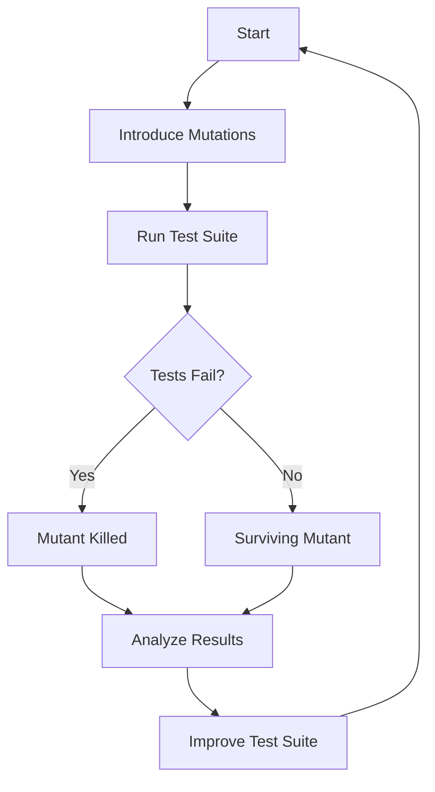

## 21.13. Mutation Testing with Muzak

In the realm of software testing, ensuring the robustness and effectiveness of your test suite is paramount. Mutation testing is a powerful technique that challenges the quality of your tests by introducing small changes, or "mutations," to your codebase. In this section, we will delve into mutation testing with Muzak, an Elixir library designed to help developers assess and enhance their test suites.

### Concept of Mutation Testing

Mutation testing operates on a simple yet profound idea: by intentionally introducing small errors into your code, you can evaluate whether your existing tests are capable of detecting these faults. This process helps in identifying weak or ineffective tests that might pass even when the code is incorrect.

#### How Mutation Testing Works

1. **Introduce Mutations**: Modify the source code in small ways, such as changing a conditional operator or altering a constant value.
2. **Run Tests**: Execute the test suite against the mutated code.
3. **Analyze Results**: Determine if the tests fail as expected. If a test passes despite the mutation, it indicates a weakness in the test suite.

#### Example of Mutation Testing

Consider a simple function in Elixir:

```elixir
defmodule Calculator do
  def add(a, b), do: a + b
end
```

A mutation might change the `+` operator to `-`, creating a mutant:

```elixir
defmodule Calculator do
  def add(a, b), do: a - b
end
```

If the test suite does not catch this change, it suggests that the tests for this function are inadequate.

### Using Muzak for Mutation Testing

Muzak is a mutation testing tool specifically designed for Elixir. It automates the process of introducing mutations and evaluating the effectiveness of your test suite.

#### Setting Up Muzak

To get started with Muzak, add it to your `mix.exs` dependencies:

```elixir
defp deps do
  [
    {:muzak, "~> 1.0", only: :test}
  ]
end
```

Run `mix deps.get` to install the dependency.

#### Running Mutation Tests

Once Muzak is installed, you can run mutation tests using the following command:

```shell
mix muzak
```

This command will:

- Generate mutants by applying small changes to your code.
- Execute your test suite against these mutants.
- Provide a report indicating which mutants were "killed" (detected by tests) and which survived.

#### Interpreting Muzak Results

Muzak provides a detailed report of the mutation testing process. Key metrics include:

- **Mutation Score**: The percentage of mutants killed by the test suite. A higher score indicates a more effective test suite.
- **Surviving Mutants**: Mutants that were not detected by the tests, highlighting potential weaknesses.

### Benefits of Mutation Testing

Mutation testing offers several advantages:

- **Identifies Weak Tests**: By revealing tests that pass despite code changes, mutation testing helps you strengthen your test suite.
- **Improves Code Quality**: Encourages writing more precise and comprehensive tests.
- **Enhances Confidence**: Provides assurance that your tests can detect real-world bugs.

### Challenges of Mutation Testing

Despite its benefits, mutation testing presents certain challenges:

- **Longer Test Execution Times**: Running mutation tests can be time-consuming, as each mutant requires a separate test run.
- **Interpreting Results**: Understanding why certain mutants survive can be complex and may require in-depth analysis.

### Overcoming Challenges

To mitigate the challenges of mutation testing:

- **Optimize Test Runs**: Use parallel execution and selective testing to reduce run times.
- **Focus on Critical Code**: Prioritize mutation testing for critical or complex parts of the codebase.
- **Iterative Improvement**: Use mutation testing results to iteratively improve your test suite over time.

### Visualizing Mutation Testing Workflow

To better understand the mutation testing process, let's visualize it using a flowchart.


```mermaid
flowchart TD
    A[Start] --> B[Introduce Mutations]
    B --> C[Run Test Suite]
    C --> D{Tests Fail?}
    D -->|Yes| E[Mutant Killed]
    D -->|No| F[Surviving Mutant]
    E --> G[Analyze Results]
    F --> G
    G --> H[Improve Test Suite]
    H --> A
```

**Figure 1:** Mutation Testing Workflow

### Try It Yourself

To gain hands-on experience with mutation testing using Muzak, try the following exercises:

1. **Modify the Calculator Module**: Introduce a mutation in the `add/2` function, such as changing `+` to `*`. Run Muzak to see if your tests catch the change.

2. **Expand Test Coverage**: Write additional tests for the `Calculator` module to ensure all basic operations are covered. Run Muzak again to evaluate the effectiveness of your expanded test suite.

3. **Analyze Surviving Mutants**: Identify any surviving mutants and modify your tests to catch them. Consider edge cases and boundary conditions.

### Knowledge Check

Before moving on, let's review some key concepts:

- What is the primary goal of mutation testing?
- How does Muzak assist in mutation testing for Elixir?
- What are the benefits and challenges associated with mutation testing?

### Summary

Mutation testing with Muzak is a valuable technique for enhancing the quality and effectiveness of your test suite in Elixir. By introducing small code changes and evaluating test responses, you can identify weaknesses and improve your tests. While mutation testing can be time-consuming, its benefits in terms of code quality and confidence make it a worthwhile investment for any serious developer.

### Further Reading

For more information on mutation testing and Muzak, consider exploring the following resources:

- [Muzak GitHub Repository](https://github.com/your-repo/muzak)
- [Elixir Testing Best Practices](https://elixir-lang.org/getting-started/mix-otp/introduction-to-mix.html)
- [Mutation Testing Concepts](https://en.wikipedia.org/wiki/Mutation_testing)

## Quiz Time!



### What is the primary purpose of mutation testing?

- [x] To evaluate the effectiveness of test suites by introducing small code changes.
- [ ] To optimize code performance by removing unused functions.
- [ ] To ensure code complies with industry standards.
- [ ] To automate the deployment process.

> **Explanation:** Mutation testing introduces small changes to the code to evaluate if the test suite can detect these changes, thereby assessing its effectiveness.

### Which Elixir library is used for mutation testing?

- [x] Muzak
- [ ] ExUnit
- [ ] Dialyzer
- [ ] Credo

> **Explanation:** Muzak is a library specifically designed for mutation testing in Elixir.

### What does a high mutation score indicate?

- [x] The test suite is effective in catching code mutations.
- [ ] The code has a high number of bugs.
- [ ] The test suite is poorly written.
- [ ] The codebase is too complex.

> **Explanation:** A high mutation score means that most of the introduced mutations were caught by the test suite, indicating its effectiveness.

### What is a surviving mutant in mutation testing?

- [x] A code mutation that was not detected by the test suite.
- [ ] A test case that fails unexpectedly.
- [ ] A bug that was fixed during testing.
- [ ] A code optimization that improved performance.

> **Explanation:** Surviving mutants are mutations that the test suite did not catch, indicating potential weaknesses in the tests.

### What is a common challenge of mutation testing?

- [x] Longer test execution times.
- [ ] Lack of test coverage.
- [ ] Difficulty in writing test cases.
- [ ] Inability to run tests in parallel.

> **Explanation:** Mutation testing often requires running the test suite multiple times, which can significantly increase execution time.

### How can you reduce the time taken for mutation testing?

- [x] Use parallel execution and selective testing.
- [ ] Increase the number of test cases.
- [ ] Simplify the codebase.
- [ ] Use a different testing framework.

> **Explanation:** Parallel execution and focusing on critical parts of the code can help reduce the time taken for mutation testing.

### What should you do if a mutant survives mutation testing?

- [x] Improve the test suite to catch the mutation.
- [ ] Ignore the mutant as it is not important.
- [ ] Remove the code causing the mutation.
- [ ] Rewrite the entire test suite.

> **Explanation:** Surviving mutants indicate weaknesses in the test suite, and you should improve the tests to catch these mutations.

### What is the first step in the mutation testing workflow?

- [x] Introduce mutations into the code.
- [ ] Analyze test results.
- [ ] Run the test suite.
- [ ] Improve the test suite.

> **Explanation:** The first step is to introduce small changes or mutations into the code to begin the testing process.

### What is the benefit of mutation testing?

- [x] It helps identify weak tests that need improvement.
- [ ] It speeds up the development process.
- [ ] It reduces the need for manual testing.
- [ ] It guarantees bug-free code.

> **Explanation:** Mutation testing helps identify tests that do not effectively catch errors, allowing developers to improve their test suite.

### True or False: Mutation testing can completely replace traditional testing methods.

- [ ] True
- [x] False

> **Explanation:** Mutation testing is a complement to traditional testing methods, not a replacement. It helps enhance the effectiveness of existing tests.



Remember, this is just the beginning. As you progress, you'll build more robust and effective test suites. Keep experimenting, stay curious, and enjoy the journey!
