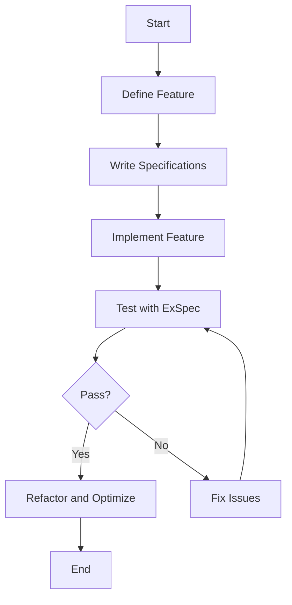

## 21.2. Behavior-Driven Development (BDD) with ExSpec

Behavior-Driven Development (BDD) is a software development approach that emphasizes collaboration between developers, testers, and non-technical stakeholders. It focuses on the behavior of the system from the user's perspective, ensuring that the software meets the needs and expectations of its users. In this section, we will explore how to implement BDD in Elixir using ExSpec, a testing framework that provides a more expressive syntax for writing tests.

### Understanding BDD

Behavior-Driven Development is an extension of Test-Driven Development (TDD) that shifts the focus from testing to specifying the behavior of the system. The key idea is to write specifications that describe how the system should behave in a language that is understandable by all stakeholders.

#### Key Concepts of BDD

- **User-Centric Approach**: BDD emphasizes understanding the user's needs and writing specifications that reflect the desired behavior from the user's perspective.
- **Collaboration**: BDD encourages collaboration between developers, testers, and business stakeholders to ensure that everyone has a shared understanding of the system's behavior.
- **Executable Specifications**: BDD specifications are written in a way that they can be executed as tests, providing both documentation and validation of the system's behavior.

### Using ExSpec

ExSpec is a testing framework for Elixir that builds on top of ExUnit, the default testing framework in Elixir. It provides a more expressive syntax for writing tests, making it easier to write BDD-style specifications.

#### Leveraging ExSpec's Syntax

ExSpec introduces several constructs that make it easier to write descriptive tests:

- **`describe` Blocks**: Used to group related tests and provide a high-level description of the feature or functionality being tested.
- **`context` Blocks**: Used to specify different scenarios or conditions under which the tests should be executed.
- **`it` Blocks**: Used to define individual test cases, describing the expected behavior of the system.

#### Structuring Tests with `describe` and `context` Blocks

When writing tests with ExSpec, it's important to structure them in a way that clearly communicates the behavior being specified. Here's an example of how to use `describe` and `context` blocks to organize tests:

```elixir
defmodule MyApp.FeatureTest do
  use ExSpec

  describe "User registration" do
    context "when the user provides valid information" do
      it "registers the user successfully" do
        # Test implementation here
      end
    end

    context "when the user provides invalid information" do
      it "returns an error message" do
        # Test implementation here
      end
    end
  end
end
```

In this example, the `describe` block provides a high-level description of the feature being tested (user registration), while the `context` blocks specify different scenarios (valid and invalid information).

### Benefits of BDD

Implementing BDD with ExSpec offers several benefits:

- **Enhanced Communication**: BDD encourages collaboration and communication between developers and stakeholders, ensuring that everyone has a shared understanding of the system's behavior.
- **Living Documentation**: BDD specifications serve as living documentation that evolves with the system, providing a clear and up-to-date description of its behavior.
- **Improved Test Coverage**: By focusing on the behavior of the system, BDD helps ensure that all important scenarios are covered by tests.

### Examples

Let's explore how to write BDD-style tests for a feature module using ExSpec.

#### Writing BDD-Style Tests for a Feature Module

Suppose we have a feature module that handles user authentication. We'll write BDD-style tests to specify the behavior of this module.

```elixir
defmodule MyApp.AuthenticationTest do
  use ExSpec

  describe "User authentication" do
    context "when the user provides valid credentials" do
      it "authenticates the user successfully" do
        # Setup
        user = %{username: "test_user", password: "secure_password"}
        
        # Exercise
        result = MyApp.Authentication.authenticate(user)

        # Verify
        assert result == {:ok, "Authenticated"}
      end
    end

    context "when the user provides invalid credentials" do
      it "returns an authentication error" do
        # Setup
        user = %{username: "test_user", password: "wrong_password"}
        
        # Exercise
        result = MyApp.Authentication.authenticate(user)

        # Verify
        assert result == {:error, "Invalid credentials"}
      end
    end
  end
end
```

In this example, we define two scenarios for user authentication: one where the user provides valid credentials and another where the user provides invalid credentials. Each scenario is specified using a `context` block, and the expected behavior is described in an `it` block.

### Visualizing BDD with ExSpec

To better understand how BDD with ExSpec works, let's visualize the process using a flowchart.



**Figure 1**: This flowchart illustrates the BDD process using ExSpec, from defining the feature to testing and refactoring.

### Try It Yourself

To get hands-on experience with BDD and ExSpec, try modifying the code examples provided. Here are some suggestions:

- Add a new scenario for user authentication, such as handling locked accounts.
- Experiment with different ways to structure `describe` and `context` blocks.
- Write tests for another feature module in your application using BDD-style specifications.

### References and Links

For further reading on BDD and ExSpec, consider the following resources:

- [ExSpec GitHub Repository](https://github.com/antonmi/ex_spec)
- [Elixir ExUnit Documentation](https://hexdocs.pm/ex_unit/ExUnit.html)
- [Cucumber: BDD for Developers](https://cucumber.io/)

### Knowledge Check

To reinforce your understanding of BDD with ExSpec, consider the following questions:

- What are the key benefits of using BDD in software development?
- How does ExSpec enhance the process of writing BDD-style tests?
- What is the purpose of `describe` and `context` blocks in ExSpec?

### Embrace the Journey

Remember, mastering BDD with ExSpec is a journey. As you continue to explore and experiment with BDD, you'll gain a deeper understanding of how to write effective specifications and tests. Keep experimenting, stay curious, and enjoy the journey!

## Quiz: Behavior-Driven Development (BDD) with ExSpec



### What is the primary focus of Behavior-Driven Development (BDD)?

- [x] Focusing on the behavior of the system from the user's perspective.
- [ ] Writing unit tests for individual functions.
- [ ] Ensuring code coverage.
- [ ] Optimizing performance.

> **Explanation:** BDD emphasizes understanding the user's needs and writing specifications that reflect the desired behavior from the user's perspective.

### Which Elixir testing framework provides a more expressive syntax for BDD-style tests?

- [x] ExSpec
- [ ] ExUnit
- [ ] ESpec
- [ ] Cucumber

> **Explanation:** ExSpec is a testing framework for Elixir that provides a more expressive syntax for writing BDD-style tests.

### What is the purpose of `describe` blocks in ExSpec?

- [x] To group related tests and provide a high-level description of the feature being tested.
- [ ] To define individual test cases.
- [ ] To specify different scenarios or conditions.
- [ ] To execute setup code.

> **Explanation:** `describe` blocks are used to group related tests and provide a high-level description of the feature or functionality being tested.

### How does BDD enhance communication between developers and stakeholders?

- [x] By encouraging collaboration and providing a shared understanding of the system's behavior.
- [ ] By writing detailed technical documentation.
- [ ] By focusing on code coverage metrics.
- [ ] By using complex technical jargon.

> **Explanation:** BDD encourages collaboration and communication between developers and stakeholders, ensuring that everyone has a shared understanding of the system's behavior.

### What is the benefit of using `context` blocks in ExSpec?

- [x] To specify different scenarios or conditions under which the tests should be executed.
- [ ] To define the expected behavior of the system.
- [ ] To execute teardown code.
- [ ] To group unrelated tests.

> **Explanation:** `context` blocks are used to specify different scenarios or conditions under which the tests should be executed.

### Which of the following is a key benefit of BDD?

- [x] Producing documentation through specifications.
- [ ] Increasing code complexity.
- [ ] Reducing test coverage.
- [ ] Focusing solely on performance optimization.

> **Explanation:** BDD specifications serve as living documentation that evolves with the system, providing a clear and up-to-date description of its behavior.

### What is the role of `it` blocks in ExSpec?

- [x] To define individual test cases, describing the expected behavior of the system.
- [ ] To execute setup code.
- [ ] To group related tests.
- [ ] To specify different scenarios.

> **Explanation:** `it` blocks are used to define individual test cases, describing the expected behavior of the system.

### How can BDD help improve test coverage?

- [x] By focusing on the behavior of the system and ensuring all important scenarios are covered by tests.
- [ ] By writing more unit tests.
- [ ] By increasing code complexity.
- [ ] By reducing the number of tests.

> **Explanation:** By focusing on the behavior of the system, BDD helps ensure that all important scenarios are covered by tests.

### True or False: ExSpec is built on top of ExUnit.

- [x] True
- [ ] False

> **Explanation:** ExSpec is a testing framework for Elixir that builds on top of ExUnit, providing a more expressive syntax for writing tests.

### What should you do if a test fails during the BDD process?

- [x] Fix the issues and rerun the tests.
- [ ] Ignore the failure and proceed.
- [ ] Remove the test case.
- [ ] Rewrite the entire feature.

> **Explanation:** If a test fails during the BDD process, you should fix the issues and rerun the tests to ensure the system behaves as expected.


