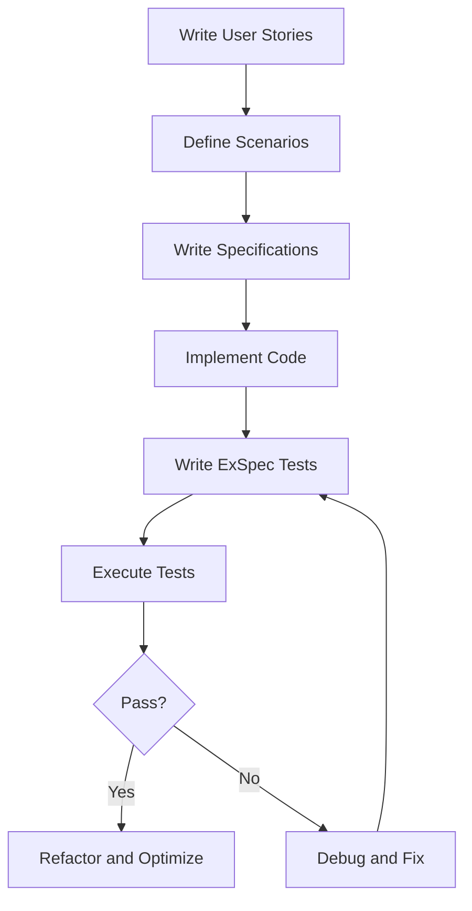

## 21.2. Behavior-Driven Development (BDD) with ExSpec

Behavior-Driven Development (BDD) is a software development process that encourages collaboration among developers, quality assurance, and non-technical or business participants in a software project. BDD extends Test-Driven Development (TDD) by writing test cases in a natural language that non-programmers can read. This section will guide you through implementing BDD in Elixir using ExSpec, a library that provides a BDD-style syntax for ExUnit, Elixir's built-in test framework.

### Understanding BDD

BDD focuses on the behavior of the system from the user's perspective. It emphasizes writing specifications that describe how the system should behave, using a language that both developers and stakeholders understand. This approach ensures that the development is aligned with business goals and user needs.

#### Key Concepts of BDD

- **User Stories**: Describe features from the user's perspective.
- **Scenarios**: Detail specific situations that illustrate the user story.
- **Acceptance Criteria**: Define what must be true for a scenario to be considered complete.

In BDD, the specifications are often written in the format of "Given-When-Then" to clearly outline the context, actions, and expected outcomes.

### Using ExSpec

ExSpec enhances Elixir's ExUnit by providing a more descriptive syntax for writing tests, making it easier to express BDD-style specifications. It allows you to structure your tests using `describe` and `context` blocks, which help organize scenarios and make the test suite more readable.

#### Setting Up ExSpec

To use ExSpec, you need to add it to your Elixir project. First, include it in your `mix.exs` file:

```elixir
defp deps do
  [
    {:ex_spec, "~> 2.0", only: :test}
  ]
end
```

Then, run `mix deps.get` to fetch the dependency.

#### Structuring Tests with `describe` and `context` Blocks

ExSpec uses `describe` and `context` blocks to group related tests. This structure helps in organizing tests logically and makes the test output more informative.

```elixir
defmodule MyApp.FeatureModuleTest do
  use ExSpec, async: true

  describe "FeatureModule" do
    context "when the user is logged in" do
      it "displays the dashboard" do
        assert FeatureModule.display_dashboard(user) == :ok
      end
    end

    context "when the user is not logged in" do
      it "redirects to the login page" do
        assert FeatureModule.redirect_to_login(user) == :ok
      end
    end
  end
end
```

### Benefits of BDD

Implementing BDD with ExSpec offers several advantages:

- **Enhanced Communication**: By using a language that stakeholders understand, BDD improves communication between developers and non-technical team members.
- **Living Documentation**: The specifications serve as documentation that evolves with the system, ensuring it remains relevant and accurate.
- **Focused Development**: By concentrating on user behavior, BDD helps developers focus on delivering features that meet user needs.

### Writing BDD-Style Tests for a Feature Module

Let's explore how to write BDD-style tests for a hypothetical feature module in an Elixir application. We'll use ExSpec to create tests that describe the desired behavior of the module.

#### Example: Testing a User Authentication Module

Consider a module responsible for user authentication. We'll write BDD-style tests to ensure it behaves as expected.

```elixir
defmodule MyApp.AuthenticationTest do
  use ExSpec, async: true

  describe "Authentication" do
    context "when the user provides valid credentials" do
      it "logs the user in successfully" do
        user = %{username: "valid_user", password: "correct_password"}
        assert MyApp.Authentication.login(user) == {:ok, user}
      end
    end

    context "when the user provides invalid credentials" do
      it "returns an error" do
        user = %{username: "invalid_user", password: "wrong_password"}
        assert MyApp.Authentication.login(user) == {:error, :invalid_credentials}
      end
    end
  end
end
```

In this example, we use `describe` to specify the module being tested and `context` to outline different scenarios. The `it` blocks contain the actual test cases, written in a way that describes the expected behavior.

### Visualizing BDD with ExSpec

To better understand how BDD with ExSpec works, let's visualize the process using a flowchart. This diagram illustrates the flow from writing user stories to executing BDD-style tests.


```mermaid
graph TD;
    A[Write User Stories] --> B[Define Scenarios]
    B --> C[Write Specifications]
    C --> D[Implement Code]
    D --> E[Write ExSpec Tests]
    E --> F[Execute Tests]
    F --> G{Pass?}
    G -->|Yes| H[Refactor and Optimize]
    G -->|No| I[Debug and Fix]
    I --> E
```

**Diagram Description**: This flowchart demonstrates the BDD process, starting from writing user stories and defining scenarios, to writing specifications, implementing code, writing ExSpec tests, and executing them. If tests pass, the code can be refactored and optimized; if not, debugging and fixing are necessary.

### Try It Yourself

To deepen your understanding, try modifying the code examples provided:

1. **Add a New Scenario**: Introduce a new context for a different user role and write a test case for it.
2. **Refactor the Code**: Change the implementation of the `login` function to handle additional edge cases and update the tests accordingly.
3. **Extend the Flowchart**: Include additional steps or decision points in the BDD process.

### References and Further Reading

- [ExSpec GitHub Repository](https://github.com/elixir-lang/ex_spec)
- [ExUnit Documentation](https://hexdocs.pm/ex_unit/ExUnit.html)
- [Behavior-Driven Development: An Introduction](https://cucumber.io/docs/bdd/)

### Knowledge Check

To ensure you've grasped the concepts covered, consider the following questions:

1. How does BDD improve communication between developers and stakeholders?
2. What is the purpose of using `describe` and `context` blocks in ExSpec?
3. How can BDD serve as living documentation for a project?

### Embrace the Journey

Remember, mastering BDD with ExSpec is a journey. As you continue to practice and apply these concepts, you'll find that your tests become more descriptive, your code more aligned with user needs, and your documentation more valuable. Keep experimenting, stay curious, and enjoy the journey!

## Quiz Time!



### What is the primary focus of Behavior-Driven Development (BDD)?

- [x] Focusing on the behavior of the system from the user's perspective.
- [ ] Writing code without tests.
- [ ] Ensuring code coverage.
- [ ] Debugging existing code.

> **Explanation:** BDD emphasizes understanding the system's behavior from the user's point of view to ensure it meets their needs.

### How does ExSpec enhance ExUnit in Elixir?

- [x] By providing a more descriptive syntax for writing tests.
- [ ] By replacing ExUnit entirely.
- [ ] By reducing the need for tests.
- [ ] By making tests run faster.

> **Explanation:** ExSpec adds a BDD-style syntax to ExUnit, making tests more descriptive and aligned with user stories.

### What is the purpose of `describe` and `context` blocks in ExSpec?

- [x] To organize tests logically and make the test suite more readable.
- [ ] To execute tests in parallel.
- [ ] To skip certain tests.
- [ ] To automatically generate test data.

> **Explanation:** These blocks help in structuring tests, making them easier to read and understand.

### Which of the following is a benefit of BDD?

- [x] Enhancing communication between developers and stakeholders.
- [ ] Reducing the number of tests needed.
- [ ] Eliminating the need for documentation.
- [ ] Increasing code complexity.

> **Explanation:** BDD improves communication by using a language that both developers and stakeholders understand.

### In the context of BDD, what does "Given-When-Then" represent?

- [x] A format to outline context, actions, and expected outcomes.
- [ ] A way to write code comments.
- [ ] A method for debugging.
- [ ] A type of database query.

> **Explanation:** "Given-When-Then" is used in BDD to describe the conditions, actions, and expected results of a scenario.

### What should you do if a test fails in the BDD process?

- [x] Debug and fix the issue.
- [ ] Ignore it and move on.
- [ ] Delete the test.
- [ ] Rewrite the user story.

> **Explanation:** If a test fails, it indicates a discrepancy between the expected and actual behavior, requiring debugging and fixing.

### How can BDD serve as living documentation?

- [x] By keeping specifications relevant and accurate as the system evolves.
- [ ] By eliminating the need for written documentation.
- [ ] By providing a history of test failures.
- [ ] By documenting only the code structure.

> **Explanation:** BDD specifications evolve with the system, providing up-to-date documentation that reflects current behavior.

### What is a common structure for writing BDD-style tests?

- [x] Using `describe`, `context`, and `it` blocks.
- [ ] Using `setup`, `execute`, and `teardown` blocks.
- [ ] Using `start`, `process`, and `end` blocks.
- [ ] Using `input`, `output`, and `result` blocks.

> **Explanation:** BDD-style tests are structured using `describe`, `context`, and `it` blocks to organize scenarios and expected outcomes.

### Why is it important to write tests in a language that stakeholders understand?

- [x] To improve collaboration and ensure the system meets business goals.
- [ ] To make tests harder to read for developers.
- [ ] To reduce the number of tests needed.
- [ ] To simplify code refactoring.

> **Explanation:** Writing tests in a stakeholder-friendly language ensures alignment with business objectives and enhances collaboration.

### True or False: BDD eliminates the need for traditional documentation.

- [ ] True
- [x] False

> **Explanation:** While BDD provides living documentation through specifications, traditional documentation may still be needed for other aspects of the project.


