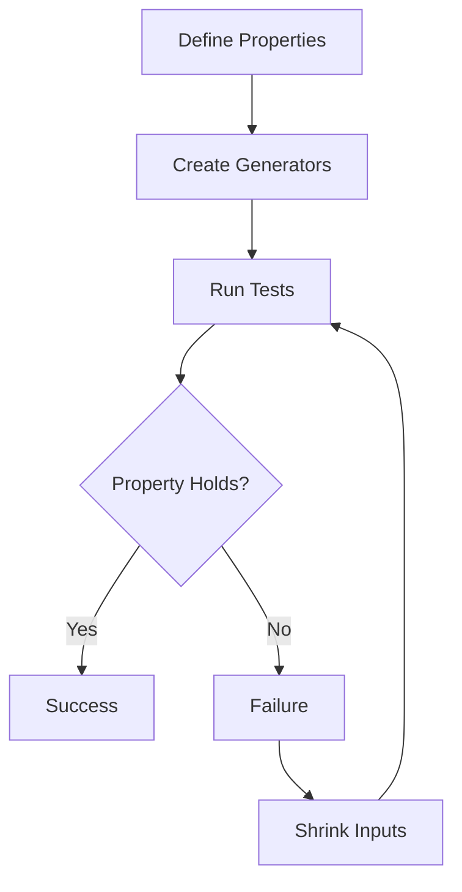

## 21.3. Property-Based Testing with StreamData

In the realm of software testing, ensuring that your code behaves correctly across a wide range of inputs is crucial. Traditional example-based testing often falls short in covering all possible scenarios, especially edge cases. This is where property-based testing shines, and in Elixir, the `StreamData` library is a powerful tool for implementing this testing strategy.

### Introduction to Property-Based Testing

Property-based testing is a testing methodology where you define properties or invariants that your code should satisfy for a wide range of inputs. Instead of writing individual test cases with specific inputs and expected outputs, you describe the general behavior of your code. The testing framework then generates numerous random inputs to verify that these properties hold true.

#### Key Concepts

- **Properties**: These are the rules or invariants that your code should always satisfy. For example, a property for a sorting function might be that the output list is always sorted.
- **Generators**: These are responsible for producing random inputs to test your properties. They can generate simple data types like integers and strings or complex structures like lists and maps.

### Using StreamData

`StreamData` is a library in Elixir that facilitates property-based testing by providing a set of tools to define generators and properties. It integrates seamlessly with `ExUnit`, Elixir's built-in test framework, allowing you to write property-based tests alongside your example-based tests.

#### Generating Random Test Data

`StreamData` provides a variety of built-in generators for common data types. You can also compose these generators to create more complex data structures.

```elixir
defmodule MyAppTest do
  use ExUnit.Case
  use ExUnitProperties

  property "list reversal is its own inverse" do
    check all list <- list_of(integer()) do
      assert Enum.reverse(Enum.reverse(list)) == list
    end
  end
end
```

In this example, `list_of(integer())` is a generator that produces lists of integers. The `check all` construct is used to specify the property to be tested.

#### Defining Properties

Properties are defined using the `property` macro. Within a property, you use the `check all` macro to specify the input generators and the assertions that should hold true.

```elixir
property "concatenating lists is associative" do
  check all list1 <- list_of(integer()),
            list2 <- list_of(integer()),
            list3 <- list_of(integer()) do
    assert Enum.concat(list1, Enum.concat(list2, list3)) ==
           Enum.concat(Enum.concat(list1, list2), list3)
  end
end
```

This property checks that list concatenation is associative, a fundamental property of list operations.

### Advantages of Property-Based Testing

Property-based testing offers several advantages over traditional example-based testing:

- **Discovering Edge Cases**: By generating a wide range of inputs, property-based testing can uncover edge cases that you might not have considered.
- **Increased Test Coverage**: Testing properties over many inputs increases the likelihood of catching bugs.
- **Robustness**: Ensures that your code behaves correctly under a variety of conditions.

### Implementation

Implementing property-based tests involves identifying the properties of your functions and writing tests to verify these properties. Let's explore a more complex example.

#### Writing Property Tests for Complex Input Domains

Consider a function that calculates the greatest common divisor (GCD) of two numbers. A property for this function could be that the GCD of two numbers divides both numbers.

```elixir
defmodule MathTest do
  use ExUnit.Case
  use ExUnitProperties

  property "gcd divides both numbers" do
    check all a <- positive_integer(),
              b <- positive_integer() do
      gcd = MyMath.gcd(a, b)
      assert rem(a, gcd) == 0
      assert rem(b, gcd) == 0
    end
  end
end
```

In this test, `positive_integer()` is a generator that produces positive integers. The property asserts that the GCD divides both input numbers.

### Visualizing Property-Based Testing

To better understand the flow of property-based testing, let's visualize the process using a flowchart.



**Figure 1**: The flow of property-based testing using `StreamData`. If a property fails, the inputs are shrunk to find the minimal failing case.

### Elixir Unique Features

Elixir's functional nature and powerful concurrency model make it an excellent fit for property-based testing. The `StreamData` library leverages Elixir's strengths, allowing you to write expressive and efficient property tests.

#### Differences and Similarities

Property-based testing is often compared to fuzz testing. While both involve generating random inputs, property-based testing focuses on verifying specific properties, whereas fuzz testing aims to crash the program.

### Try It Yourself

To get hands-on experience with property-based testing, try modifying the examples above. For instance, change the data types in the list reversal test to strings or floats and observe how the properties hold.

### Knowledge Check

- What is a property in property-based testing?
- How does `StreamData` generate test data?
- What are the benefits of property-based testing over example-based testing?
- How can you define a property for a function with complex input domains?

### Summary

Property-based testing with `StreamData` in Elixir is a powerful technique for ensuring the correctness of your code across a wide range of inputs. By defining properties and using generators to produce random data, you can uncover edge cases and increase the robustness of your tests. Remember, this is just the beginning. As you progress, you'll build more complex and interactive tests. Keep experimenting, stay curious, and enjoy the journey!

## Quiz: Property-Based Testing with StreamData



### What is the primary goal of property-based testing?

- [x] To verify that properties hold true for a wide range of inputs
- [ ] To test specific examples of input and output
- [ ] To generate random inputs without any assertions
- [ ] To replace all example-based tests

> **Explanation:** Property-based testing aims to verify that properties or invariants hold true for a wide range of inputs, rather than testing specific examples.

### How does `StreamData` help in property-based testing?

- [x] By generating random test data
- [x] By defining properties that should hold true
- [ ] By replacing all example-based tests
- [ ] By providing a GUI for testing

> **Explanation:** `StreamData` helps by generating random test data and defining properties that should hold true, enhancing the testing process.

### What is a generator in the context of `StreamData`?

- [x] A tool for producing random inputs
- [ ] A function that executes tests
- [ ] A method for defining properties
- [ ] A way to log test results

> **Explanation:** In `StreamData`, a generator is responsible for producing random inputs to test properties.

### What is the benefit of using property-based testing?

- [x] Discovering edge cases
- [x] Increasing test coverage
- [ ] Reducing the number of tests
- [ ] Simplifying code

> **Explanation:** Property-based testing helps discover edge cases and increases test coverage, making the code more robust.

### What happens if a property fails in `StreamData`?

- [x] The inputs are shrunk to find the minimal failing case
- [ ] The test is skipped
- [ ] The test is marked as passed
- [ ] The test is rerun with the same inputs

> **Explanation:** If a property fails, `StreamData` shrinks the inputs to find the minimal failing case, helping to identify the root cause.

### What is the role of the `check all` macro in `StreamData`?

- [x] To specify input generators and assertions
- [ ] To log test results
- [ ] To define properties
- [ ] To execute tests

> **Explanation:** The `check all` macro is used to specify input generators and assertions within a property test.

### How can you modify a property test to use different data types?

- [x] By changing the generators
- [ ] By rewriting the entire test
- [ ] By using a different testing framework
- [ ] By ignoring the data types

> **Explanation:** You can modify a property test to use different data types by changing the generators.

### What is the difference between property-based testing and fuzz testing?

- [x] Property-based testing verifies specific properties
- [ ] Fuzz testing verifies specific properties
- [ ] Property-based testing aims to crash the program
- [ ] Fuzz testing is used only for security testing

> **Explanation:** Property-based testing verifies specific properties, while fuzz testing aims to crash the program.

### Can property-based testing replace example-based testing entirely?

- [ ] True
- [x] False

> **Explanation:** Property-based testing complements example-based testing but does not replace it entirely, as both have their unique strengths.

### What is the purpose of shrinking inputs in `StreamData`?

- [x] To find the minimal failing case
- [ ] To increase test coverage
- [ ] To simplify the test code
- [ ] To generate more random inputs

> **Explanation:** Shrinking inputs helps find the minimal failing case, making it easier to identify the root cause of a failure.



By mastering property-based testing with `StreamData`, you can significantly enhance the reliability and robustness of your Elixir applications. Keep exploring and applying these concepts to uncover the full potential of your testing strategy!
