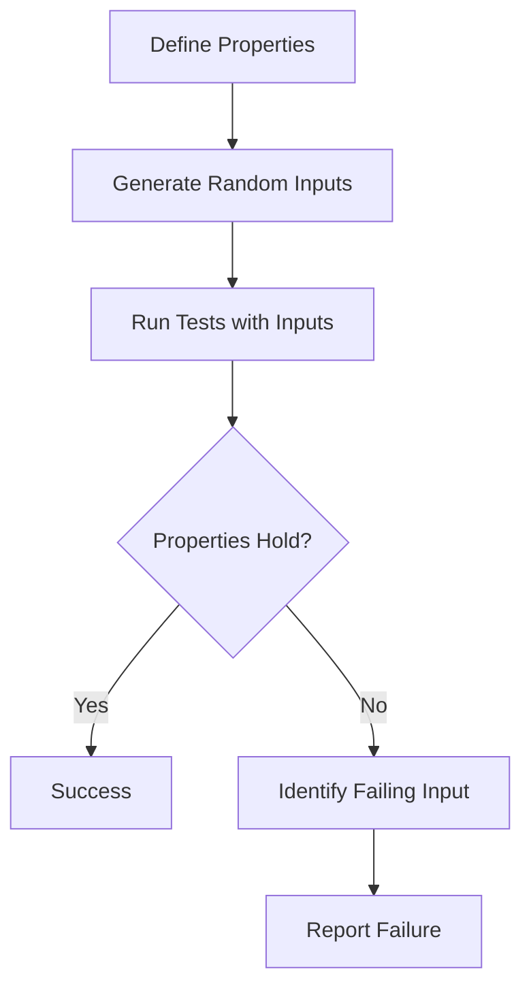

## 21.3. Property-Based Testing with StreamData

In the world of software testing, ensuring that your code behaves correctly under a wide range of conditions is crucial. Traditional example-based testing can fall short when it comes to covering the vast input space that real-world applications might encounter. This is where property-based testing shines. In this section, we'll delve into property-based testing using StreamData in Elixir, a powerful tool that allows you to define properties and test them against a multitude of automatically generated inputs.

### Introduction to Property-Based Testing

Property-based testing is a testing paradigm where you define properties or invariants that should always hold true for a given function or module. Instead of manually specifying test cases, you describe the general behavior of your code, and the testing framework generates random inputs to verify that the properties hold.

#### Key Concepts

- **Properties**: These are assertions about your code that should remain true for any valid input. For example, a property might state that sorting a list should always result in a list with the same elements, but in sorted order.
- **Generators**: These are responsible for producing random test data that is fed into your properties. They allow you to explore a wide range of input scenarios, including edge cases that you might not have considered.

### Using StreamData

StreamData is a library in Elixir that facilitates property-based testing by providing tools to generate random data and define properties. It integrates seamlessly with ExUnit, Elixir's built-in test framework, making it easy to incorporate into your existing test suite.

#### Generating Random Test Data

StreamData provides a variety of built-in generators for common data types, such as integers, floats, strings, and more. You can also compose these generators to create complex data structures.

```elixir
use ExUnit.Case
use ExUnitProperties

property "list concatenation is associative" do
  check all list1 <- list_of(integer()),
            list2 <- list_of(integer()),
            list3 <- list_of(integer()) do
    assert Enum.concat(Enum.concat(list1, list2), list3) ==
           Enum.concat(list1, Enum.concat(list2, list3))
  end
end
```

In the example above, `list_of(integer())` generates random lists of integers. The property checks that list concatenation is associative, a fundamental property of lists.

#### Defining Properties

When defining properties, it's essential to think about the invariants your code should maintain. Consider what should always be true, regardless of the input.

```elixir
property "reversing a list twice returns the original list" do
  check all list <- list_of(integer()) do
    assert Enum.reverse(Enum.reverse(list)) == list
  end
end
```

This property asserts that reversing a list twice should yield the original list, a simple yet powerful invariant.

### Advantages of Property-Based Testing

Property-based testing offers several advantages over traditional example-based testing:

- **Discovering Edge Cases**: By generating a wide range of inputs, property-based testing can uncover edge cases that you might not have considered.
- **Increased Test Coverage**: Instead of writing individual test cases for each scenario, you define properties that cover a broad spectrum of inputs.
- **Robustness**: Properties ensure that your code behaves correctly across a wide range of conditions, making it more robust and reliable.

### Implementation

Let's explore how to implement property-based tests for functions with complex input domains. We'll walk through a detailed example to illustrate the process.

#### Example: Testing a Custom Sorting Function

Suppose we have a custom sorting function that we want to test thoroughly. We'll define properties that should hold true for any sorted list.

```elixir
defmodule CustomSort do
  def sort(list) do
    # Custom sorting logic
  end
end
```

**Step 1: Define Properties**

We'll define properties that should hold for any sorted list:

1. The sorted list should have the same elements as the original list.
2. The sorted list should be in non-decreasing order.

**Step 2: Implement Property-Based Tests**

```elixir
defmodule CustomSortTest do
  use ExUnit.Case
  use ExUnitProperties

  property "sorted list has the same elements as the original" do
    check all list <- list_of(integer()) do
      sorted_list = CustomSort.sort(list)
      assert Enum.sort(list) == Enum.sort(sorted_list)
    end
  end

  property "sorted list is in non-decreasing order" do
    check all list <- list_of(integer()) do
      sorted_list = CustomSort.sort(list)
      assert Enum.chunk_every(sorted_list, 2, 1, :discard)
             |> Enum.all?(fn [a, b] -> a <= b end)
    end
  end
end
```

In the first property, we use `Enum.sort/1` to verify that the sorted list contains the same elements as the original. In the second property, we check that the sorted list is in non-decreasing order.

### Visualizing Property-Based Testing

To better understand how property-based testing works, let's visualize the process using a flowchart.


```mermaid
flowchart TD
    A[Define Properties] --> B[Generate Random Inputs]
    B --> C[Run Tests with Inputs]
    C --> D{Properties Hold?}
    D -->|Yes| E[Success]
    D -->|No| F[Identify Failing Input]
    F --> G[Report Failure]
```

**Description**: This flowchart illustrates the property-based testing process. We start by defining properties, generate random inputs, and run tests with those inputs. If the properties hold, the test is successful. If not, the failing input is identified and reported.

### Try It Yourself

Experiment with the code examples provided. Try modifying the properties or the data generators to see how the tests behave. For instance, you could:

- Change the data type from integers to strings or floats.
- Add new properties to test additional invariants.
- Modify the custom sorting function to introduce a bug and observe how the tests catch it.

### References and Links

For more information on property-based testing and StreamData, consider the following resources:

- [StreamData GitHub Repository](https://github.com/whatyouhide/stream_data)
- [ExUnit Documentation](https://hexdocs.pm/ex_unit/ExUnit.html)
- [Property-Based Testing in Elixir](https://elixir-lang.org/getting-started/mix-otp/introduction-to-mix.html)

### Knowledge Check

- What are the key benefits of property-based testing compared to example-based testing?
- How does StreamData generate random test data?
- What is the significance of defining properties in property-based testing?

### Embrace the Journey

Remember, property-based testing is a powerful tool that can significantly enhance your testing strategy. As you gain experience, you'll discover new ways to apply these concepts to your projects. Keep exploring, stay curious, and enjoy the journey!

## Quiz Time!



### What is the primary goal of property-based testing?

- [x] To test properties or invariants that should hold true for any valid input.
- [ ] To manually specify test cases for each scenario.
- [ ] To replace all example-based tests.
- [ ] To focus only on edge cases.

> **Explanation:** Property-based testing aims to verify that properties or invariants hold true for a wide range of inputs, not just specific test cases.

### Which Elixir library is commonly used for property-based testing?

- [x] StreamData
- [ ] ExUnit
- [ ] Ecto
- [ ] Phoenix

> **Explanation:** StreamData is a library in Elixir specifically designed for property-based testing.

### What is a generator in the context of property-based testing?

- [x] A tool that produces random test data.
- [ ] A function that asserts properties.
- [ ] A module that runs tests.
- [ ] A mechanism to manually create test cases.

> **Explanation:** Generators are responsible for producing random data that is used to test properties in property-based testing.

### What is a key advantage of property-based testing?

- [x] It can discover edge cases that example-based tests might miss.
- [ ] It replaces the need for any other testing methods.
- [ ] It simplifies the testing process by reducing test cases.
- [ ] It focuses only on performance testing.

> **Explanation:** Property-based testing can uncover edge cases by exploring a wide range of inputs.

### In property-based testing, what is a property?

- [x] An assertion about the code that should remain true for any valid input.
- [ ] A specific test case with predefined inputs and outputs.
- [ ] A configuration setting for the test environment.
- [ ] A type of data generated for testing.

> **Explanation:** A property is an assertion or invariant that is expected to hold true for any valid input in property-based testing.

### How does StreamData integrate with Elixir's testing framework?

- [x] It integrates seamlessly with ExUnit.
- [ ] It requires a separate testing framework.
- [ ] It only works with custom test runners.
- [ ] It does not integrate with any framework.

> **Explanation:** StreamData integrates seamlessly with ExUnit, Elixir's built-in test framework.

### What is the purpose of the `check all` construct in StreamData?

- [x] To iterate over all generated inputs and verify properties.
- [ ] To manually specify test inputs.
- [ ] To define configuration settings.
- [ ] To replace the need for assertions.

> **Explanation:** The `check all` construct is used to iterate over all generated inputs and verify that the properties hold true.

### What should you do if a property-based test fails?

- [x] Identify the failing input and investigate the cause.
- [ ] Ignore the failure and rerun the test.
- [ ] Replace the failing test with a passing example-based test.
- [ ] Assume the test is incorrect and remove it.

> **Explanation:** When a property-based test fails, it's important to identify the failing input and investigate the cause to understand the issue.

### True or False: Property-based testing can replace example-based testing entirely.

- [ ] True
- [x] False

> **Explanation:** While property-based testing is powerful, it complements rather than replaces example-based testing. Both approaches have their strengths and are often used together.

### What is the role of `Enum.chunk_every/4` in the provided code example?

- [x] To verify that the sorted list is in non-decreasing order.
- [ ] To generate random test data.
- [ ] To define properties for testing.
- [ ] To replace the need for assertions.

> **Explanation:** `Enum.chunk_every/4` is used to verify that the sorted list is in non-decreasing order by comparing adjacent elements.


