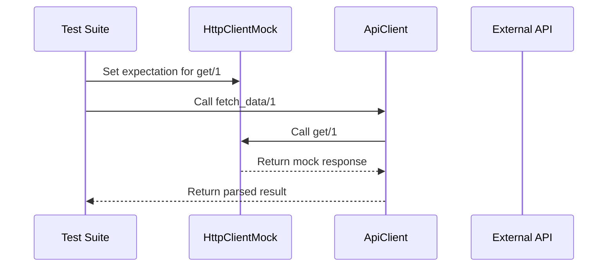

## 21.4. Mocks and Stubs with Mox

In the realm of software testing, particularly in Elixir, mocks and stubs play a crucial role in ensuring that components are tested in isolation. This section delves into the use of Mox, a powerful library in Elixir, to create mocks and stubs effectively. We'll explore how to replace dependencies, define behavior contracts, and implement best practices to maintain robust and maintainable tests.

### Isolation in Testing

Testing in isolation is a fundamental principle that allows developers to verify the behavior of a component without interference from its dependencies. This is particularly important in complex systems where components interact with external services or other modules that may introduce variability or side effects.

#### Replacing Dependencies with Mocks or Stubs

Mocks and stubs are two types of test doubles used to replace real dependencies in tests:

- **Mocks**: These are objects that simulate the behavior of real objects. They are used to set expectations and verify interactions between components.
- **Stubs**: These are simpler than mocks and are used to provide predefined responses to method calls without verifying interactions.

By using mocks and stubs, we can focus on testing the logic of the component under test, ensuring that it behaves correctly under various conditions.

### Using Mox for Mocking

Mox is a library specifically designed for creating mocks in Elixir. It leverages Elixir's powerful metaprogramming capabilities to provide a flexible and expressive way to define and use mocks.

#### Defining Behavior Contracts with Behaviours

In Elixir, behaviors are a way to define a set of functions that a module must implement. Mox uses behaviors to define the contract that a mock must adhere to. This ensures that the mock behaves consistently with the real implementation.

```elixir
defmodule MyApp.HttpClient do
  @callback get(String.t()) :: {:ok, String.t()} | {:error, String.t()}
end
```

In this example, we define a behavior `HttpClient` with a single function `get/1`. Any module that implements this behavior must provide an implementation for `get/1`.

#### Creating and Setting Expectations for Mocks

Once we have defined a behavior, we can use Mox to create a mock that adheres to this behavior. Mox allows us to set expectations on the mock, specifying how it should behave during the test.

```elixir
defmodule MyApp.HttpClientMock do
  use Mox

  # Define the mock based on the behavior
  Mox.defmock(MyApp.HttpClientMock, for: MyApp.HttpClient)
end

defmodule MyApp.SomeModuleTest do
  use ExUnit.Case, async: true
  import Mox

  setup :verify_on_exit!

  test "fetches data successfully" do
    # Set expectation on the mock
    MyApp.HttpClientMock
    |> expect(:get, fn _url -> {:ok, "response data"} end)

    # Call the function under test
    assert MyApp.SomeModule.fetch_data("http://example.com") == {:ok, "response data"}
  end
end
```

In this example, we define a mock `MyApp.HttpClientMock` based on the `HttpClient` behavior. We then set an expectation that when `get/1` is called, it should return `{:ok, "response data"}`. This allows us to test `MyApp.SomeModule.fetch_data/1` in isolation.

### Best Practices

While mocks and stubs are powerful tools, they should be used judiciously to avoid creating brittle tests that are difficult to maintain.

#### Avoiding Overuse of Mocks

Overusing mocks can lead to tests that are tightly coupled to the implementation details of the code under test. This can make tests fragile and prone to breaking when the implementation changes. Instead, focus on mocking only those dependencies that are necessary for isolating the component under test.

#### Mocking External Services or Side-Effect-Heavy Modules

Mocks are particularly useful for replacing external services or modules that have side effects, such as network calls or database operations. By mocking these dependencies, we can ensure that tests run quickly and deterministically.

### Examples

Let's explore a practical example of testing a module that interacts with an HTTP API using Mox.

#### Testing a Module that Interacts with an HTTP API

Consider a module `MyApp.ApiClient` that fetches data from an external API. We want to test this module without making actual network requests.

```elixir
defmodule MyApp.ApiClient do
  @behaviour MyApp.HttpClient

  def fetch_data(url) do
    case MyApp.HttpClient.get(url) do
      {:ok, response} -> {:ok, parse_response(response)}
      {:error, reason} -> {:error, reason}
    end
  end

  defp parse_response(response) do
    # Parse the response data
  end
end
```

To test `MyApp.ApiClient`, we can use Mox to mock the `HttpClient` behavior.

```elixir
defmodule MyApp.ApiClientTest do
  use ExUnit.Case, async: true
  import Mox

  setup :verify_on_exit!

  test "fetches data successfully" do
    MyApp.HttpClientMock
    |> expect(:get, fn _url -> {:ok, "{\"key\": \"value\"}"} end)

    assert MyApp.ApiClient.fetch_data("http://example.com") == {:ok, %{"key" => "value"}}
  end

  test "handles error response" do
    MyApp.HttpClientMock
    |> expect(:get, fn _url -> {:error, "not found"} end)

    assert MyApp.ApiClient.fetch_data("http://example.com") == {:error, "not found"}
  end
end
```

In these tests, we use Mox to set expectations on the `HttpClientMock`, allowing us to simulate both successful and error responses from the API.

### Visualizing the Testing Process

To better understand the flow of testing with Mox, let's visualize the process using a sequence diagram.



This diagram illustrates how the test suite sets expectations on the mock, which then intercepts calls from the module under test, returning predefined responses.

### References and Links

- [Mox Documentation](https://hexdocs.pm/mox/Mox.html)
- [Elixir Behaviours](https://elixir-lang.org/getting-started/typespecs-and-behaviours.html)
- [ExUnit Documentation](https://hexdocs.pm/ex_unit/ExUnit.html)

### Knowledge Check

- What are the differences between mocks and stubs?
- How does Mox leverage Elixir's behaviors to define mock contracts?
- Why is it important to avoid overusing mocks in tests?

### Embrace the Journey

Remember, mastering the use of mocks and stubs with Mox is just one step in your journey to becoming an expert in Elixir testing. Keep experimenting, stay curious, and enjoy the process of building robust and maintainable tests.

### Quiz: Mocks and Stubs with Mox



### What is the primary purpose of using mocks in testing?

- [x] To simulate the behavior of real objects and verify interactions
- [ ] To replace real objects with simpler versions
- [ ] To test the performance of a system
- [ ] To generate random data for testing

> **Explanation:** Mocks are used to simulate the behavior of real objects and verify interactions between components.

### How does Mox define the contract that a mock must adhere to?

- [x] By using Elixir's behaviors
- [ ] By using Elixir's protocols
- [ ] By using Elixir's structs
- [ ] By using Elixir's macros

> **Explanation:** Mox uses Elixir's behaviors to define the contract that a mock must adhere to, ensuring consistency with the real implementation.

### What is a key benefit of using mocks for external services?

- [x] Ensures tests run quickly and deterministically
- [ ] Increases the complexity of tests
- [ ] Requires more setup time
- [ ] Makes tests dependent on external factors

> **Explanation:** Mocks ensure that tests run quickly and deterministically by replacing external services with predefined responses.

### What is the risk of overusing mocks in tests?

- [x] Tests become tightly coupled to implementation details
- [ ] Tests become easier to maintain
- [ ] Tests become more reliable
- [ ] Tests become faster

> **Explanation:** Overusing mocks can lead to tests that are tightly coupled to implementation details, making them fragile and difficult to maintain.

### What is the role of the `setup :verify_on_exit!` in ExUnit tests with Mox?

- [x] Ensures that all expectations set on mocks are verified after each test
- [ ] Automatically generates mock responses
- [ ] Cleans up test data after each test
- [ ] Sets up the test environment

> **Explanation:** The `setup :verify_on_exit!` ensures that all expectations set on mocks are verified after each test, helping to maintain test integrity.

### True or False: Mox can be used to mock any Elixir module without defining a behavior.

- [ ] True
- [x] False

> **Explanation:** Mox requires a behavior to be defined in order to create a mock, ensuring that the mock adheres to a specific contract.

### What is the advantage of using Mox in asynchronous tests?

- [x] Mox supports concurrent tests by isolating mock expectations
- [ ] Mox automatically synchronizes test execution
- [ ] Mox reduces the need for test setup
- [ ] Mox simplifies test teardown

> **Explanation:** Mox supports concurrent tests by isolating mock expectations, allowing tests to run asynchronously without interference.

### How can Mox help in testing error handling in a module?

- [x] By allowing predefined error responses to be returned by mocks
- [ ] By automatically generating error scenarios
- [ ] By simplifying the error handling code
- [ ] By removing the need for error handling

> **Explanation:** Mox allows predefined error responses to be returned by mocks, enabling the testing of error handling in a module.

### What is a common use case for stubs in testing?

- [x] Providing predefined responses without verifying interactions
- [ ] Simulating complex interactions between components
- [ ] Testing the performance of a system
- [ ] Generating random data for testing

> **Explanation:** Stubs are used to provide predefined responses without verifying interactions, making them suitable for simpler test scenarios.

### True or False: Mox can be used to verify the number of times a function is called.

- [x] True
- [ ] False

> **Explanation:** Mox can be used to set expectations on the number of times a function is called, allowing for verification of interactions.



By mastering the use of Mox for mocks and stubs, you can create tests that are both robust and maintainable, ensuring that your Elixir applications are reliable and performant. Keep experimenting with different scenarios and remember to apply best practices to avoid common pitfalls.
