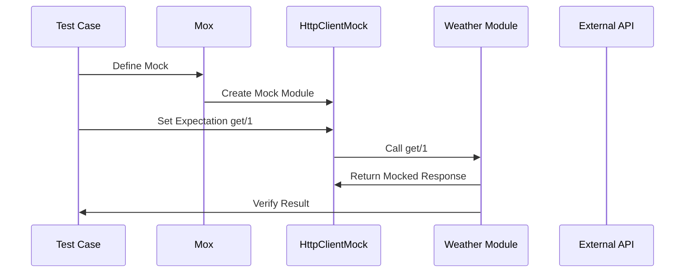

## 21.4. Mocks and Stubs with Mox

In the realm of software testing, achieving isolation is crucial for ensuring that individual components work as expected without interference from external dependencies. In Elixir, the Mox library provides a powerful mechanism for creating mocks and stubs, allowing developers to isolate components effectively. This section delves into the concepts of mocks and stubs, the use of Mox for mocking in Elixir, and best practices to ensure robust and maintainable tests.

### Isolation in Testing

Isolation in testing refers to the practice of testing a component independently of its dependencies. This is achieved by replacing real dependencies with mocks or stubs, which simulate the behavior of the dependencies. This approach has several benefits:

- **Focus on the Unit Under Test:** By isolating a component, you can focus solely on its behavior, making it easier to identify issues.
- **Faster Tests:** Mocks and stubs are generally faster than real dependencies, leading to quicker test execution.
- **Controlled Environment:** You can simulate various scenarios and edge cases that might be difficult to reproduce with real dependencies.

#### Replacing Dependencies with Mocks or Stubs

Mocks and stubs are both used to replace dependencies, but they serve slightly different purposes:

- **Mocks:** These are objects pre-programmed with expectations, which verify that they are used as expected. Mocks are typically used to test interactions between objects.
- **Stubs:** These provide canned responses to calls made during the test, without any assertion on how they are used. Stubs are often used to simulate data or behavior.

### Using Mox for Mocking

Mox is a popular library in Elixir for creating mocks based on behavior contracts. It leverages Elixir's powerful metaprogramming capabilities to provide a flexible and easy-to-use mocking framework. Let's explore how to use Mox effectively.

#### Defining Behavior Contracts with Behaviours

In Elixir, behaviors are a way to define a set of functions that a module must implement. They serve as contracts that ensure modules adhere to a specific API. Mox uses these behaviors to define the interface that the mock will implement.

```elixir
defmodule MyApp.HttpClient do
  @callback get(String.t()) :: {:ok, map()} | {:error, term()}
end
```

In this example, `MyApp.HttpClient` defines a behavior with a single function `get/1`. Any module that implements this behavior must provide a `get/1` function with the specified signature.

#### Creating and Setting Expectations for Mocks

Once a behavior is defined, you can create a mock for it using Mox. Here's how you can set up and use a mock:

1. **Add Mox to Your Project**

   Add Mox to your `mix.exs` dependencies:

   ```elixir
   defp deps do
     [
       {:mox, "~> 1.0", only: :test}
     ]
   end
   ```

2. **Define the Mock**

   Define a mock module using `Mox.defmock/2`:

   ```elixir
   defmodule MyApp.HttpClientMock do
     use Mox
   end

   Mox.defmock(MyApp.HttpClientMock, for: MyApp.HttpClient)
   ```

3. **Set Expectations**

   Use `Mox.expect/4` to set expectations on the mock:

   ```elixir
   test "fetches data from API" do
     Mox.expect(MyApp.HttpClientMock, :get, fn _url -> {:ok, %{data: "test"}} end)

     assert {:ok, %{data: "test"}} = MyApp.SomeModule.fetch_data("http://example.com")
   end
   ```

   In this test, we expect the `get/1` function to be called with any URL, and it will return `{:ok, %{data: "test"}}`.

#### Best Practices

While mocks are powerful, they should be used judiciously to avoid brittle tests. Here are some best practices:

- **Avoid Overuse of Mocks:** Over-reliance on mocks can lead to tests that are tightly coupled to implementation details, making them fragile and difficult to maintain.
- **Mock External Services:** Use mocks to simulate external services or modules with side effects, such as HTTP requests or database calls.
- **Focus on Behavior, Not Implementation:** Set expectations based on the behavior you want to test, rather than the specific implementation.

### Examples

Let's walk through an example of testing a module that interacts with an HTTP API using Mox.

#### Module Under Test

Consider a module `MyApp.Weather` that fetches weather data from an external API:

```elixir
defmodule MyApp.Weather do
  @http_client Application.compile_env(:my_app, :http_client, MyApp.HttpClient)

  def fetch_weather(city) do
    case @http_client.get("http://api.weather.com/#{city}") do
      {:ok, %{"temperature" => temp}} -> {:ok, temp}
      {:error, reason} -> {:error, reason}
    end
  end
end
```

#### Test with Mox

Here's how you can test `MyApp.Weather` using Mox:

```elixir
defmodule MyApp.WeatherTest do
  use ExUnit.Case, async: true
  import Mox

  setup :verify_on_exit!

  test "fetches weather data successfully" do
    Mox.expect(MyApp.HttpClientMock, :get, fn _url -> {:ok, %{"temperature" => 25}} end)

    assert {:ok, 25} = MyApp.Weather.fetch_weather("london")
  end

  test "handles API error" do
    Mox.expect(MyApp.HttpClientMock, :get, fn _url -> {:error, :timeout} end)

    assert {:error, :timeout} = MyApp.Weather.fetch_weather("london")
  end
end
```

In these tests, we use `Mox.expect/4` to define the expected behavior of the `get/1` function. The `setup :verify_on_exit!` ensures that all expectations are verified at the end of each test.

### Visualizing the Mocking Process

To better understand the process of using Mox for mocking, let's visualize the workflow with a sequence diagram.


```mermaid
sequenceDiagram
    participant Test as Test Case
    participant Mox as Mox
    participant Mock as HttpClientMock
    participant Module as Weather Module
    participant API as External API

    Test->>Mox: Define Mock
    Mox->>Mock: Create Mock Module
    Test->>Mock: Set Expectation get/1
    Mock->>Module: Call get/1
    Module->>Mock: Return Mocked Response
    Module->>Test: Verify Result
```

This diagram illustrates how the test case interacts with Mox to define a mock, set expectations, and verify the results of the module under test.

### Try It Yourself

To deepen your understanding, try modifying the code examples:

- **Change the Mocked Response:** Modify the mocked response in `Mox.expect/4` to simulate different scenarios, such as network errors or unexpected data formats.
- **Add More Tests:** Write additional tests to cover edge cases, such as invalid city names or empty responses.
- **Refactor the Module:** Experiment with refactoring the `MyApp.Weather` module to see how changes affect the tests.

### References and Links

- [Mox Documentation](https://hexdocs.pm/mox/Mox.html)
- [ExUnit Documentation](https://hexdocs.pm/ex_unit/ExUnit.html)
- [Elixir Behaviours](https://elixir-lang.org/getting-started/typespecs-and-behaviours.html#behaviours)

### Knowledge Check

Before we wrap up, let's reinforce what we've learned with a few questions:

- What is the primary purpose of using mocks in testing?
- How does Mox leverage Elixir's behaviors to create mocks?
- Why is it important to avoid overuse of mocks in tests?

### Embrace the Journey

Remember, mastering mocks and stubs is just one step in your journey to becoming an expert in Elixir testing. Keep experimenting, stay curious, and enjoy the process of building robust and maintainable software.

## Quiz Time!



### What is the primary purpose of using mocks in testing?

- [x] To isolate components by replacing real dependencies
- [ ] To enhance performance of the application
- [ ] To increase the complexity of tests
- [ ] To eliminate the need for unit tests

> **Explanation:** Mocks are used to isolate components by replacing real dependencies, allowing you to test the component in isolation.

### How does Mox leverage Elixir's behaviors to create mocks?

- [x] By defining behavior contracts that mocks must adhere to
- [ ] By automatically generating mock implementations
- [ ] By replacing all modules with mock versions
- [ ] By using macros to simulate behavior

> **Explanation:** Mox uses Elixir's behaviors to define contracts that mocks must implement, ensuring consistency and correctness.

### Why is it important to avoid overuse of mocks in tests?

- [x] To prevent brittle tests that are tightly coupled to implementation details
- [ ] To reduce the number of tests needed
- [ ] To simplify the test setup
- [ ] To ensure all code paths are tested

> **Explanation:** Overuse of mocks can lead to brittle tests that are closely tied to implementation details, making them difficult to maintain.

### In the Mox example, what does `Mox.expect/4` do?

- [x] Sets expectations for how a mock should be used
- [ ] Creates a new mock instance
- [ ] Verifies the test results
- [ ] Replaces the original module with a mock

> **Explanation:** `Mox.expect/4` is used to set expectations on how the mock should be used during the test.

### What is a key benefit of using mocks for external services?

- [x] They allow simulation of various scenarios and edge cases
- [ ] They eliminate the need for integration tests
- [ ] They automatically handle all errors
- [ ] They improve the performance of the service

> **Explanation:** Mocks allow you to simulate different scenarios and edge cases that may be difficult to reproduce with real external services.

### What is the role of `setup :verify_on_exit!` in the test?

- [x] Ensures all expectations are verified at the end of each test
- [ ] Initializes the mock environment
- [ ] Cleans up resources after each test
- [ ] Automatically generates test reports

> **Explanation:** `setup :verify_on_exit!` ensures that all expectations set on mocks are verified at the end of each test, helping to catch any unmet expectations.

### What is a stub primarily used for in testing?

- [x] Providing canned responses without assertions
- [ ] Verifying interactions between objects
- [ ] Generating random test data
- [ ] Automatically fixing test failures

> **Explanation:** Stubs provide predefined responses to calls made during the test, without asserting on how they are used.

### What is a common pitfall when using mocks?

- [x] Creating tests that are too tightly coupled to implementation details
- [ ] Reducing test execution speed
- [ ] Increasing the complexity of the codebase
- [ ] Making tests too generic

> **Explanation:** A common pitfall is creating tests that are too closely tied to implementation details, which can lead to brittle and hard-to-maintain tests.

### How can you modify the `MyApp.Weather` module for better testability?

- [x] By injecting dependencies rather than hardcoding them
- [ ] By removing all external API calls
- [ ] By adding more complex logic
- [ ] By using global variables

> **Explanation:** Injecting dependencies rather than hardcoding them allows for greater flexibility and easier testing.

### True or False: Mox can only be used for mocking HTTP clients.

- [ ] True
- [x] False

> **Explanation:** False. Mox can be used for mocking any module that implements a behavior, not just HTTP clients.



By mastering the use of Mox for mocks and stubs, you enhance your ability to write isolated, fast, and reliable tests in Elixir. Keep exploring and applying these concepts to build robust applications.
