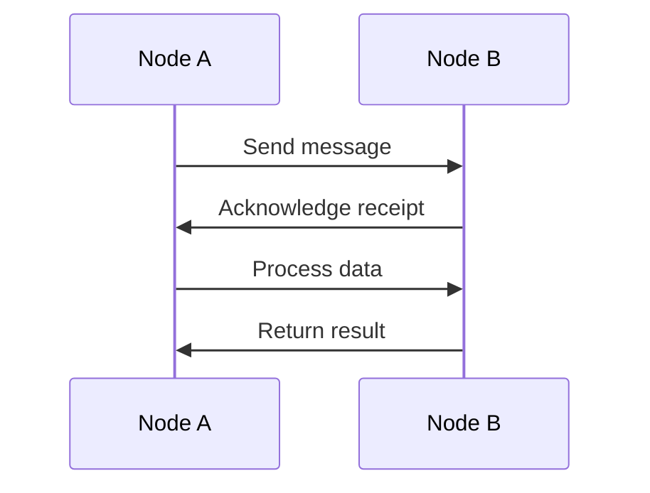

## 21.5. Testing Concurrent and Distributed Systems

Testing concurrent and distributed systems presents unique challenges due to the inherent complexity of asynchronous operations and the need for coordination across multiple nodes. In Elixir, with its robust concurrency model and distributed capabilities, mastering these testing techniques is crucial for building reliable, fault-tolerant applications. In this section, we will explore the challenges, strategies, and tools necessary for effectively testing concurrent and distributed systems in Elixir.

### Challenges in Testing Concurrent and Distributed Systems

#### Dealing with Asynchronous Behavior and Timing Issues

Concurrency introduces non-determinism, where the order of operations can vary between executions. This makes it difficult to predict and reproduce specific states or outcomes, leading to flaky tests that pass or fail unpredictably.

#### Ensuring Tests Are Reliable and Repeatable

Tests must be deterministic to be reliable. However, in concurrent systems, race conditions and timing issues can cause tests to behave inconsistently, making it challenging to ensure repeatability.

### Strategies for Testing Concurrency

#### Controlling Process Timing with Synchronous Calls

One effective strategy is to control the timing of processes by using synchronous calls. This can be achieved by leveraging Elixir's message-passing capabilities to coordinate actions between processes.

```elixir
defmodule MyConcurrentModule do
  use GenServer

  def start_link(_) do
    GenServer.start_link(__MODULE__, %{}, name: __MODULE__)
  end

  def init(state) do
    {:ok, state}
  end

  def handle_call(:do_work, _from, state) do
    # Simulate work
    Process.sleep(1000)
    {:reply, :done, state}
  end
end

defmodule MyConcurrentModuleTest do
  use ExUnit.Case

  test "synchronous call to ensure timing" do
    {:ok, pid} = MyConcurrentModule.start_link(nil)
    assert GenServer.call(pid, :do_work) == :done
  end
end
```

In this example, we use `GenServer.call/2` to perform a synchronous operation, ensuring that the test waits for the process to complete its work before asserting the result.

#### Using `ExUnit.CaptureLog` to Test Logged Messages

Testing log output can be crucial for verifying that the system behaves as expected under certain conditions. `ExUnit.CaptureLog` allows us to capture and assert log messages.

```elixir
defmodule MyLoggerModule do
  require Logger

  def log_message do
    Logger.info("This is a log message")
  end
end

defmodule MyLoggerModuleTest do
  use ExUnit.Case
  import ExUnit.CaptureLog

  test "captures log messages" do
    log = capture_log(fn ->
      MyLoggerModule.log_message()
    end)

    assert log =~ "This is a log message"
  end
end
```

By capturing the log output, we can assert that the expected messages are logged, ensuring that logging behavior is correct.

### Testing Distributed Nodes

#### Setting Up Test Environments with Multiple Nodes

Testing distributed systems requires simulating multiple nodes. Elixir's built-in support for distributed computing makes it possible to set up such environments.

```elixir
defmodule MyDistributedTest do
  use ExUnit.Case

  setup do
    Node.start(:"node1@localhost")
    Node.start(:"node2@localhost")
    :ok
  end

  test "communication between nodes" do
    Node.connect(:"node2@localhost")
    assert Node.list() == [:"node2@localhost"]
  end
end
```

In this setup, we start multiple nodes and establish connections between them, allowing us to test inter-node communication.

#### Simulating Network Failures and Recovery

Simulating network failures is essential for testing the resilience of distributed systems. We can achieve this by temporarily disconnecting nodes and observing how the system recovers.

```elixir
defmodule NetworkFailureTest do
  use ExUnit.Case

  setup do
    Node.start(:"node1@localhost")
    Node.start(:"node2@localhost")
    Node.connect(:"node2@localhost")
    :ok
  end

  test "simulate network failure" do
    Node.disconnect(:"node2@localhost")
    assert Node.list() == []

    # Simulate recovery
    Node.connect(:"node2@localhost")
    assert Node.list() == [:"node2@localhost"]
  end
end
```

By disconnecting and reconnecting nodes, we can test how the system handles network partitions and recovers from them.

### Tools and Techniques

#### Using `:meck` for Mocking Erlang Modules

In some cases, you may need to mock Erlang modules to isolate parts of the system for testing. The `:meck` library provides powerful mocking capabilities for Erlang modules.

```elixir
:meck.new(:erlang, [:passthrough])
:meck.expect(:erlang, :now, fn -> {123, 456, 789} end)

assert :erlang.now() == {123, 456, 789}

:meck.unload(:erlang)
```

With `:meck`, we can define expectations for Erlang functions, allowing us to control their behavior during tests.

### Visualizing Concurrent and Distributed Systems

To better understand the flow of concurrent and distributed systems, visualizations can be extremely helpful. Below is a sequence diagram illustrating the interaction between processes in a distributed system.



This diagram shows a simple interaction where Node A sends a message to Node B, which processes the data and returns the result. Visualizing these interactions can help identify potential issues and improve understanding.

### Knowledge Check

- **Question:** What is the primary challenge when testing concurrent systems?
  - **Answer:** Dealing with asynchronous behavior and timing issues.

- **Question:** How can we ensure tests are reliable and repeatable in concurrent systems?
  - **Answer:** By controlling process timing with synchronous calls.

- **Question:** What tool can be used to capture and assert log messages in Elixir?
  - **Answer:** `ExUnit.CaptureLog`.

- **Question:** How can we simulate network failures in distributed systems?
  - **Answer:** By temporarily disconnecting nodes.

- **Question:** What library provides mocking capabilities for Erlang modules?
  - **Answer:** `:meck`.

### Try It Yourself

Experiment with the provided code examples by modifying the message content, changing the timing of operations, or adding additional nodes to the distributed test setup. Observe how these changes affect the behavior and outcomes of the tests.

### Summary

Testing concurrent and distributed systems in Elixir requires a deep understanding of concurrency models, distributed computing, and the tools available for testing. By controlling process timing, capturing log messages, simulating network failures, and using powerful mocking libraries, we can ensure that our tests are reliable, repeatable, and effective. Remember, mastering these techniques is a journey, and with practice, you'll become proficient in testing even the most complex systems.

## Quiz: Testing Concurrent and Distributed Systems



### What is the primary challenge when testing concurrent systems?

- [x] Dealing with asynchronous behavior and timing issues.
- [ ] Ensuring code readability.
- [ ] Managing large codebases.
- [ ] Handling user input validation.

> **Explanation:** The primary challenge in testing concurrent systems is dealing with asynchronous behavior and timing issues, which can lead to non-deterministic outcomes.

### How can we ensure tests are reliable and repeatable in concurrent systems?

- [x] By controlling process timing with synchronous calls.
- [ ] By increasing test coverage.
- [ ] By using more assertions.
- [ ] By writing more detailed documentation.

> **Explanation:** Controlling process timing with synchronous calls helps ensure that tests are reliable and repeatable by reducing non-determinism.

### What tool can be used to capture and assert log messages in Elixir?

- [x] `ExUnit.CaptureLog`
- [ ] `Logger`
- [ ] `GenServer`
- [ ] `Task`

> **Explanation:** `ExUnit.CaptureLog` is used to capture and assert log messages in Elixir tests.

### How can we simulate network failures in distributed systems?

- [x] By temporarily disconnecting nodes.
- [ ] By increasing network latency.
- [ ] By reducing server capacity.
- [ ] By using more powerful hardware.

> **Explanation:** Temporarily disconnecting nodes simulates network failures, allowing us to test the system's resilience and recovery mechanisms.

### What library provides mocking capabilities for Erlang modules?

- [x] `:meck`
- [ ] `ExUnit`
- [ ] `Mox`
- [ ] `Ecto`

> **Explanation:** `:meck` provides powerful mocking capabilities for Erlang modules, allowing us to control their behavior during tests.

### What is a common issue with tests in concurrent systems?

- [x] Flaky tests due to race conditions.
- [ ] Excessive memory usage.
- [ ] Slow execution times.
- [ ] Lack of documentation.

> **Explanation:** Flaky tests due to race conditions are a common issue in concurrent systems, as the order of operations can vary between executions.

### Which Elixir feature helps in coordinating actions between processes?

- [x] Message passing
- [ ] Pattern matching
- [ ] List comprehensions
- [ ] Protocols

> **Explanation:** Message passing in Elixir helps coordinate actions between processes, making it easier to control timing and synchronization.

### What is the purpose of using `GenServer.call/2` in tests?

- [x] To perform synchronous operations.
- [ ] To log messages.
- [ ] To handle errors.
- [ ] To start new processes.

> **Explanation:** `GenServer.call/2` is used to perform synchronous operations, ensuring that the test waits for the process to complete its work before asserting the result.

### How can visualizations help in testing distributed systems?

- [x] By illustrating process interactions and identifying potential issues.
- [ ] By reducing the need for documentation.
- [ ] By increasing code coverage.
- [ ] By simplifying code logic.

> **Explanation:** Visualizations help illustrate process interactions and identify potential issues, improving understanding and aiding in the testing of distributed systems.

### True or False: `ExUnit` is used for mocking Erlang modules.

- [ ] True
- [x] False

> **Explanation:** `ExUnit` is a testing framework in Elixir, but it does not provide mocking capabilities for Erlang modules. `:meck` is used for that purpose.



Remember, this is just the beginning. As you progress, you'll build more complex and interactive systems. Keep experimenting, stay curious, and enjoy the journey!
